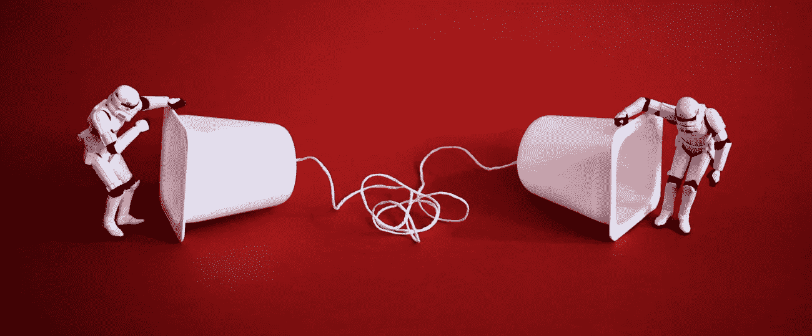

# 营销工具:电子邮件与信使机器人

> 原文：<https://medium.com/swlh/marketing-tools-email-vs-messenger-bots-fdcd4aa928c7>

我们都签署了某种形式的电子邮件营销。如果你是一个精明的电子邮件用户，你甚至可能有一个指定的电子邮件地址，只用于注册。如果你像我们一样(有点悟性)，那么你将会被电子邮件轰炸，把手举到空中，然后开始另一个“新”帐户来管理时事通讯的注册。这就像电子邮件的土拨鼠日——听起来很糟糕。

电子邮件和电子邮件营销和互联网一样早就存在了。大多数企业，无论大小，都知道收集电子邮件地址很容易做到，并且仍然被认为是最有效的营销形式之一。

但是 Facebook Messenger 怎么样呢？我们听到你在思考(是的，我们会读心术)，更快，更直接，就在你面前，“新”的孩子。2016 年，脸书通过添加“机器人”扩展了信使营销。企业迅速加入进来，但结果喜忧参半——对一些人来说效果非常好，对另一些人来说就不那么好了。那么你应该使用哪一个作为你营销策略的一部分，它们能和谐共存吗？

# 什么是信使机器人？

简单地说，机器人是 Facebook Messenger 上的自动响应服务。机器人是用来描述自动执行任务的软件的术语。Facebook 信使机器人非常聪明。它们是使用脸书的 wit.ai 机器人引擎创建的。这个“引擎”能够将自然语言转化为结构化数据。该机器人自动解释收到的消息的意图，并给出适当的答复，使它感觉像一次真正的对话，尽管没有灵魂的空虚。任何有 messenger 的人都可以使用机器人来自动对话。然而，Facebook Messenger 建议他们应该总是链接到你的脸书商业页面，这样当客户使用它时就不会混淆。Start Digital 建议赋予你的机器人一些个性，以免与没有灵魂的空虚混淆。

脸书正在让公司及其客户使用信使机器人变得越来越简单，例如，你可以在你的网站页面上嵌入一个信使按钮，以鼓励快速、简单的对话和参与。

# 如何设置信使机器人

如果你对构建自己的机器人感兴趣，请查看 [Messenger 平台页面](https://developers.facebook.com/docs/messenger-platform)。这里将指导您如何设置自己的 messenger bot。快速免责声明，你可能想得到舒适，因为它可以是一个复杂而漫长的过程来制定。如果你没有时间，那么有很多公司会为你做这件事，比如[snash bot](https://snatchbot.me/)或 Start Digital 可以帮忙——当然，如果你坚持的话。如果你想要更多的信息和当地的支持，甚至有一个[珀斯聊天机器人聚会](https://www.meetup.com/Perth-Chatbots/)

当考虑是否使用信使机器人时，最好考虑一下你希望潜在客户对你的品牌有什么样的体验。想想使用机器人的目标和使用它的人的体验。决定你希望你的潜在客户在与你的机器人交流后采取什么行动。他们完成你的信使序列后会发生什么，你将如何保持联系。

当设计出你的机器人时，你必须建立一个潜在的提示和响应库。这就是个性发挥作用的地方。您还需要考虑具有相同结果的不同响应，因为在与机器人交互时有可能陷入循环(插入另一个土拨鼠日类比)。保持你的目标集中的最简单的方法之一是创建按钮，让用户在序列中选择。

# 什么是电子邮件营销？

大多数企业都熟悉电子邮件营销的概念，但许多人没有充分利用它的潜力。如果你熟悉电子邮件营销，你可能已经在使用像 [MailChimp](https://mailchimp.com/) 这样的电子邮件提供商了。电子邮件提供商允许你设置一个自动的电子邮件序列，如果他们很好，他们会给你提供一套漂亮的模板来确保你的电子邮件弹出。

电子邮件序列是定时的电子邮件，有策略地撰写，以保持受众对您公司的关注或进行销售。例如，有人注册了你的名单，在 24 小时内他们会收到一封欢迎邮件。然后他们每天都会收到另一封邮件，持续五天，然后每周都收到，持续五周，如此类推。这可能是你在要求购买之前设计了一个由三封电子邮件组成的营销序列。这些通常被称为滴灌运动。我们最近注册了一些来自[飞轮](https://getflywheel.com/)的时事通讯——这些家伙已经在网上营销了！

电子邮件可以在一封电子邮件中提出许多不同的行动呼吁，并且通常是按顺序设计的，以便在要求购买之前获得信任。像机器人一样，准确计划你的电子邮件的目的和你希望你的读者拥有的体验是很重要的。

电子邮件可以让你非常有针对性地确定你的名单中谁会收到你的电子邮件。这可以通过分割你的列表或者创建几个不同的列表来实现。

# 类似

*   电子邮件和信使是极具针对性的营销形式。他们都将信息传递给预先定义的目标受众。
*   这两者都是有意识的计划和格式化的。
*   他们都需要你用你的声音。语言和回应应该是你的品牌所熟悉的。
*   它们需要根据用户体验进行调整。
*   两者都可以使用各种多媒体链接到视频、pdf 或 MP3。

# 差异

*   电子邮件营销可能有特定的事件目标结构，并且每封电子邮件都可能很长，因此需要对信使机器人进行编程，以立即响应广泛的问题和输入。简而言之，电子邮件可以扩展和广泛，信使机器人需要简短和中肯。
*   Messenger 是一种双向互动，至少在客户端是“实时”的。机器人给出的回答取决于用户提出的问题。电子邮件营销在很大程度上是单行道，更侧重于“营销”。
*   观众人口统计。新技术通常吸引年轻观众。年纪大的观众更有可能坚持他们所知道的。这是一件令人欣慰的事情。🙂

# 摘要

电子邮件和信使机器人营销都需要你在你的方法中非常深思熟虑。计划你的信息和你的目标。此外，考虑如何让读者长期参与进来。

现在对机器人来说还处于早期阶段，我们认为它们没有理由不发展壮大。他们有潜力成为“永远在线”的员工，帮助你 24/7 推销你的业务。为了获得最佳结果，要准备好监控互动，以便可以调整响应，以适应不断增长的问题和互动。

2018 年的营销策略需要动态和灵活(就像让·克洛德·云顿——第一个弹出来的类比，抱歉)。在 Start Digital，我们将在电子邮件营销和信使机器人上投入一些时间和精力。可以这么说，把我们的钱用在我们的嘴上。

简而言之，我们相信机器人和电子邮件可以牵手。这两个平台应该在未来几年的数字营销中发挥重要作用，观察企业如何应对客户参与度不断变化的预期将是一件有趣的事情。

如果你想聊聊所有的事情，为什么不让我们请你喝杯咖啡呢？我们喜欢有趣的科技谈话。

*本文原创，写给* [*起点数码*](https://startdigital.com.au)*2017 年 11 月 14 日*

## 这个故事发表在 [The Startup](https://medium.com/swlh) 上，259，700+人聚集在一起阅读 Medium 关于创业的主要故事。

## 订阅接收[我们的头条](http://growthsupply.com/the-startup-newsletter/)。

