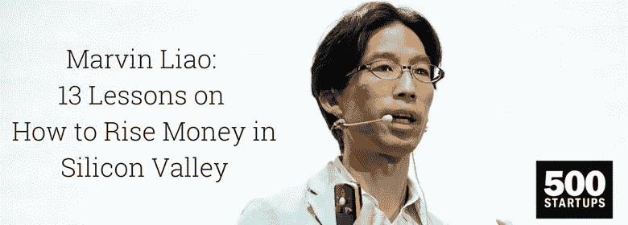

# 马文·廖:如何在硅谷赚钱的 13 课

> 原文：<https://medium.com/swlh/marvin-liao-13-lessons-on-how-to-rise-money-in-silicon-valley-21ceaadf53b1>

马文·廖(Marvin Liao):“祝贺某人筹集资金，就像祝贺一位厨师将配料收集在一起开始烹饪一样。”

842 亿美元是 2017 年风险投资的金额。这是过去五年来最高的！因此，每个初创公司都希望获得投资，所以我们分享马文在今年春天基辅 iForum 2018 期间揭示的 13 条原则，帮助你的初创公司获得资金！

# 1.投资回报率

如果你在一个不到 10 亿美元的市场上工作，没有风投会有兴趣投资你的初创公司，因为我们只关注非常大的市场。

# 2.了解竞争

旧金山是竞争最激烈的市场。当我与创业公司交谈时，我非常关心的一件最重要的事情是:“谁是你的竞争对手？我想了解谁是你的竞争对手”。让我告诉你，如果你说**你没有竞争**，这是一个糟糕的答案，原因有二:

*   每个公司都有某种形式的竞争。即使这是真的，你没有竞争对手，这意味着市场真的很小，因此没有意思。
*   有竞争，你是一个白痴，没有做你的功课！每个行业都有竞争，这是你应该有一个好答案的事情之一。

# 3.区别

现在每个行业，无论你看什么，都有很多竞争。作为投资者，我的一个大问题是“为什么你的业务比其他任何人都好？”。你是如何与众不同并显著提高的？我说的更好，并不是说谷歌是主要竞争对手，你比它好 5%。很烂的回答。我不在乎。我在寻找一个比谷歌 100%更好的产品。

# 4.产品适应市场

一家公司通常需要两到四年的时间才能开始赚钱。这才是真正适合市场的产品。

真正了解你的衡量标准，以及你的产品与市场的契合度有多近，在此基础上，说服风投和融资就更容易了。

# 5.增长和牵引力

是数字。是度量。你的业务做得如何，你有多少客户，或者如果是软件或移动应用程序，你有多少用户。你需要比投资者更了解这些指标。

我可能不喜欢你，或者我可能不喜欢你的产品，但我不能说增长有牵引力。这对于如今的初创公司来说至关重要。基本上，牵引力的增长是一个显示企业正在运转的指标。

# 6.神奇的数字

根据我的经验，这也是我告诉每一个来参加我项目的外国创业公司的话(现在大约有 350 家公司):

**“如果你有 40%的客户群在美国，那么你就可以筹资了。如果你在美国没有客户，那么你就无法筹资。”**

这是我自己算出的神奇数字，至少 40%的客户在美国。如果你没有，就不要尝试了！

# 7.团队

投资者非常关心平衡的团队。在乌克兰，我从不担心团队中的黑客。在这里，技术人才是惊人的。坦率地说，那里的设计人才越来越好。我在其他创业公司看到的是，做一个单一的创始人真的很难。最好是有一个强大的技术人员，销售人员，和一个 UI/UX 专家。

这让你的业务发展得更快。

# 8.你是谁

你是传教士还是雇佣兵？作为一个投资人，我一直在寻找雇佣兵，筹集资金的人。任何 VC 都在乎。

说到底， ***总想投资传教士*** 。当然，我想赚钱，很多很多的钱。我是说上亿美元。

如果你的目标是开公司，然后卖给谷歌，那就不要和 VC 谈。有两个原因:

*   你不诚实。
*   你更擅长创业。这总是保持你投资的钱的好方法。

作为一名风投，我总是问一个棘手的问题:“**你的退出策略是什么？”。这里没有好的答案。**

作为传教士，你不应该有退出策略！

# 9.讲故事

你需要知道你的数字，但是说到底，讲故事是一种超能力。就像演讲技巧一样。人类天生就喜欢以这种方式获取信息，这也是讲故事能够奏效的主要原因。你如何展示和推销是非常重要的。

比如为什么大家都爱皮克斯电影？这只是因为他们有伟大的故事。

皮克斯只花 20%的时间在绘图上。同时，他们花 80%的时间在人物身上，在情节线上，在故事线上。所以他们才这么牛逼。

阅读大量的小说，参加表演班，尽可能地发展你讲故事的技巧。

想再学四课？在这里进一步阅读:[https://www . zfort . com/blog/Marvin-Liao-rising-money-in-silicon-valley/](https://www.zfort.com/blog/marvin-liao-rising-money-in-silicon-valley/)

点击这里阅读对马文·廖的采访:[https://www.zfort.com/blog/marvin-liao-interview/](https://www.zfort.com/blog/marvin-liao-interview/)

最初发表于[zfort.com](https://www.zfort.com/blog/marvin-liao-rising-money-in-silicon-valley/)

## 这个故事发表在 [The Startup](https://medium.com/swlh) 上，这是 Medium 最大的创业刊物，拥有 332，253+人关注。

## 在这里订阅接收[我们的头条新闻](http://growthsupply.com/the-startup-newsletter/)。

