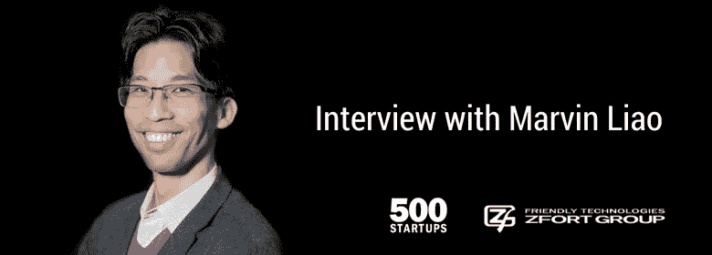

# 马文廖:“我主要投资团队”。Zfort Group 采访 500 家创业公司 VC

> 原文：<https://medium.com/swlh/marvin-liao-i-mostly-invest-in-teams-zfort-group-interview-with-500-startups-vc-22e6646bd7e6>

马文·廖是总部位于旧金山的全球种子风险投资公司和创业加速器 500 Startups 的合伙人。马文有兴趣投资的业务领域包括金融科技、数字营销、数字健康、物联网、市场、企业销售和 SaaS。

他在硅谷工作了 17 年，是东欧大型 IT 活动 iForum 2018 的主题演讲人之一。

Zfort Group 有一个很有见地的演讲，我们今天与你分享，以帮助你将你的筹款技巧提高到一个新的水平。

## 创业公司吸引第一批客户的最佳方式是什么？

我认为在最开始的时候，就是要获得第一批、第二批、第三批、第四批客户，并为他们提供过度服务。很多。然后他们驱动推荐。基于推荐而不是过度服务的另一件事是进行案例研究，然后进行大量的在线营销。一步一步的策略，这就是我要做的。

## 你认为当今硅谷的创业公司面临的最大挑战是什么？

只是很多噪音。我认为这是一场人才争夺战，试图尽可能地得到最好的人才，这真的很难。

## 就技术背景而言，你相信东欧市场吗？

是啊。这里有很多优秀的技术人才，你知道，乌克兰面临的最大挑战是国内经济。我的意思是，很多公司都在尝试走出去。我想去年二月我在这里待过一段时间。在那之前，我已经有五年没来过了。而且你知道，说英语的水平是巨大的！对我来说，这意味着人们为全球合作做好了准备。是好事！

## 你能给一个将要主宰世界市场的初创公司创始人一些建议吗？

所以，第一:不要追求完美。并尽快发布以获得反馈。你在开始时得到的反馈越多，你花在与终端客户交谈上的时间就越多，通过电话和调查，你就能更多地了解和改进你的产品。

你不知道人们喜欢什么，他们会喜欢什么，直到你推出它才会知道。

## 尽快失败，对吗？

是啊，是啊，超级重要。

## 你能说出最值得投资的行业吗？

我认为部门是看待它的错误方式。事实上，我主要投资团队，行业并不重要。可以这么看:板块超级炒作，但是团队不怎么样。所以给他们钱之前最好三思。

## 你能预测创业是否会成功吗？你有这样的 VC 第六感吗？

如果我有五到六周的时间和他们在一起，我可能会有一个很好的想法，但我总是感到惊讶！

## 你对硅谷未来几年有什么预测？

好吧。住在那里确实越来越贵，但人们的素质和理解能力都很棒！

哇，我在那里遇到的人真的是精英中的精英。花钱去那里是值得的。它提升了你的收获，你的思维，它提升了竞争。它帮助你变得强大。

## 如何看待乌克兰创业生态系统？

很早，真的很早。但是很有前途。既然你有如此多的技术人才，这真的很有前途！

## 最后一个问题。你每天早上起床的灵感是什么？

你知道，我无时无刻不在学习，我认为我非常幸运能和我们基金中了不起的人、了不起的创业公司创始人和投资者一起工作。我经常看到这样的情况:“哦，我的上帝，这是最酷的技术，在接下来的五年或十年里没有人会看到！哇，太神奇了！我只是觉得非常非常幸运。

阅读马文·廖**关于如何在硅谷赚钱的 13 课**这里:[https://www . zfort . com/blog/Marvin-Liao-rising-MONEY-IN-SILICON-VALLEY/](https://www.zfort.com/blog/marvin-liao-rising-money-in-silicon-valley/)

## 这篇文章发表在 [The Startup](https://medium.com/swlh) 上，这是 Medium 最大的创业刊物，有 327，829+人关注。

## 订阅接收[我们的头条新闻](http://growthsupply.com/the-startup-newsletter/)。

