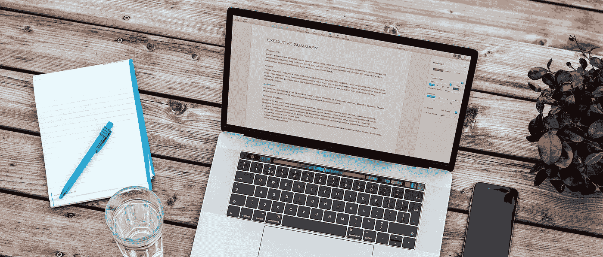

# 掌握排版，让您的文档更吸引人

> 原文：<https://medium.com/swlh/master-typography-for-more-engaging-documents-3f29aecdc0eb>

A little extra care when creating your documents can make your message much more engaging.

## 更好的沟通在于细节

从简历到名片，从宣传册到网站，每一份文件都得益于良好的排版。易读性的提高意味着他们能更好地交流，因为他们令人愉悦，所以在第一个单词被读出来之前就能给人留下良好的第一印象。

## 不要相信你的…