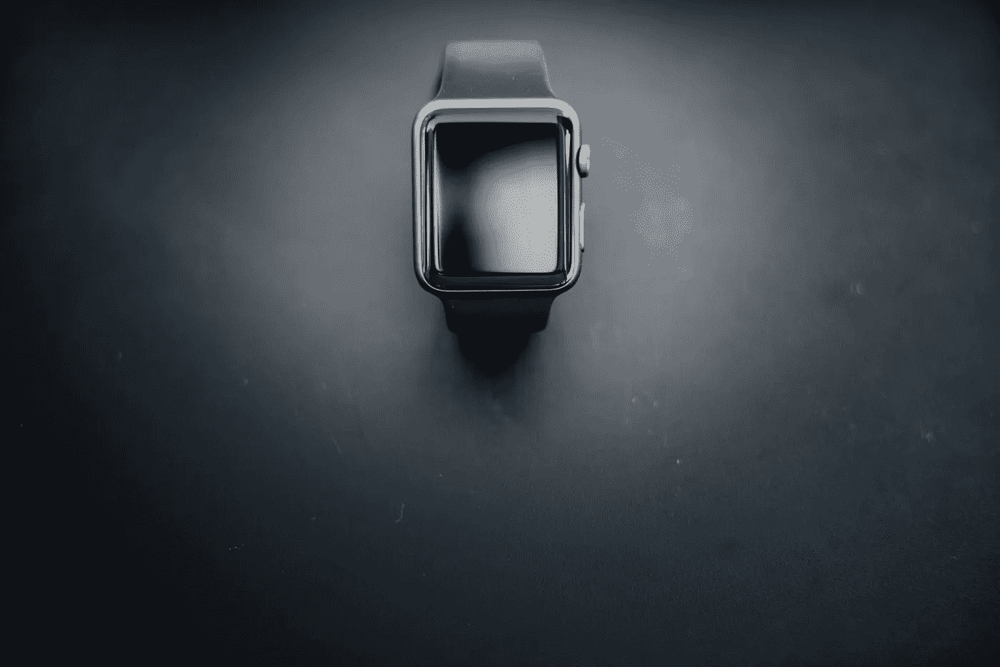

# 掌握你的 MVP。来自一位获奖产品创始人的耐心课程。

> 原文：<https://medium.com/swlh/master-your-mvp-lessons-in-patience-from-an-award-winning-product-founder-e344a3f568c4>

***By Alex Prate, Founder of*** [***Realifex***](http://www.realifex.com/)

改变我生活的那一天就像其他日子一样开始了。那是 2014 年 3 月 11 日。

我在日出前醒来，拖着身体走出了房子。当我环视咖啡店时，我的眼睛仍然半闭着。

很多人看起来和我一样:疲惫、无聊，很可能是累死了。

我们就像一支僵尸军队，在一天工作开始前排队等候修理。

咖啡师叫了我的名字，我从昏迷中清醒过来。该去办公室了。

我从事客户关系管理(CRM)已经十多年了。要求很高，但我的报酬很高，而且从各方面来看，我都相当成功。

一旦我开办了自己的 CRM 公司，压力就变得更大了。我每天工作 15 个小时，通勤时间很长，几乎见不到家人。

因此，2012 年，我卖掉了公司，我和妻子带着三个孩子从巴黎搬到了悉尼。我加入了另一家 CRM 公司，很快发现自己又回到了起点。

同样的仓鼠，不同的轮子。

也许是咖啡因或者是越来越强烈的不安感，但是那天晚上晚些时候，我睡不着。

我在想我自己和我的咖啡店同事。

我们追逐金钱、社会认可，走着一条老路，但我们注定要过无脑的生活吗？

我本能地知道，一切皆有可能——这一切都始于意识。

我下了床，开始画素描。我痴迷于走出生活的快速流动的河流，以评估特定的时刻和经历——比如测量你一整天的情绪温度。

我画了一个粗略的“感知矩阵”，其中第一个轴绘制了你此刻的心情(从积极到消极)，第二个轴测量了对你生活的影响(从低到高)。

随着你每天、每周、每月捕捉这些时刻，模式开始浮现。主观证据和转瞬即逝的感知变成了持久的、事实性的见解。你看清了自己，可以采取行动改变自己的生活。

就是这个。我的大主意。

第二天早上，我找到了天才设计师乔治·哈吉瓦斯利斯，我们在当地的一家咖啡馆见了面。他很快就明白了这个想法，并愿意和我一起想办法。

日复一日，我们花了数小时绘制草图，将矩阵转化为可行的应用程序。我们排除了障碍，去想象能真正帮助人们的东西。

我与一家总部位于新西兰的小公司合作，我们开发了第一个版本的 [Realifex](http://www.realifex.com) ，它于 2015 年 4 月登陆 App store。

# 保持倾斜并缓慢移动

我应该在这里停下来说一下，在我构建 Realifex 的时候，我并没有放弃我的日常工作。我坚持工作，并自掏腰包支付每一步的费用。其实我还是 CRM 行业的自由职业者。我这样做有两个原因:

*   我的生活已经够忙够累了。我不需要额外的压力来满足投资者，偿还贷款，或满足别人的时间表。我决心按照自己的方式，按照自己的时间表去做。
*   CRM 是 Realifex 的完美翻版。这一切都是为了记录信息、检查模式，并通过将主观经验转化为可用数据来绘制更明智的战略路径。我的日常工作给了我额外的火种(和人脉)来点燃这种创业之火。

我在开发一个应用程序，但我知道我也在建立一个企业。

对幸福的关注很好地转化为咨询服务，我开始推出这种服务，以帮助加强公司和客户之间的关系。

随着时间的推移，我们还培养了一个教练和导师网络，并开发了一个新的应用程序来帮助这些专业人士更有效地与他们的客户合作。

你会注意到我突然用了“我们”这个词虽然我仍然是唯一的正式“员工”，但我已经在任何需要支持的地方合作和签约。

乔治和我一起工作了两年，拉里·戈麦斯在第一次写生两个月后加入了我们，拉里今天仍然是 Realifex 不可或缺的一部分。

# 运气、耐心和倾听

2015 年 4 月发布的 iPhone 和 Apple Watch 是我们的 MVP，非常幸运的是，苹果在 App Store 主页上展示了它。

我们开始获得用户和日志下载，但我知道真正的工作才刚刚开始——我的重点从建立转向了倾听。

我们不断收集反馈，并询问有关特性和功能的问题。

我们最早的用户提供了即时的产品验证。我们马上就知道，这个想法可以帮助人们，改变他们的生活。

到了 2015 年 7 月，我也意识到是时候打造成熟的产品了。

我联系了[app ster](http://www.appsterhq.com/?utm_source=CP&utm_medium=Medium)的开发人员，认为他们有技能和方法来完善仪表盘，并执行一些复杂的、高度技术性的功能。

例如，应用程序需要提供更多的上下文。特定时刻的影响和情绪会受到你的睡眠、步数、热量摄入、天气、一天中的时间、心跳等等的显著影响。

慢慢地，我在那次狂热的头脑风暴会议中想象的现实变得真实，我们在 2016 年 7 月推出了该应用的下一个版本。

# 真正重要的时刻

Realifex 继续增长，我们已经达到了一些激动人心的里程碑。

4 月，我们在威比奖上赢得了最佳视觉设计功能类[的人民之声奖。我们还获得了视觉艺术学院颁发的许多设计奖项。](http://www.webbyawards.com/winners/2017/mobile-sites-apps/features-categories/best-visual-design-function/reallifechange/)

最重要的是，Realifex 目前被 App Store 用户评为 4.7 满分 5 颗星。

这是最重要的 KPI，因为它直接来自我们的客户。

这就是我们服务的对象。在这次创业之旅中，我仍然学到了很多东西，但有**六个核心原则继续指导着我**:

*   **要有耐心。很容易被卷入建设新事物的旋风中，但没有什么比坚持自己的愿景更重要。Realifex 的使命是提高幸福感，所以我所有的决定都要经过这个镜头。我知道，如果我优先考虑自己的幸福和公司的健康，而不是追逐金钱、认可或屈服于社会压力，我会做出正确的选择。这种使命感让我能够保持耐心，打持久战。**
*   伟大的工作需要时间。耐心为什么如此重要？因为你不能加速质量。如果你想建立一个独特的东西，你需要给它时间和空间去进化。我不相信一周或隔夜的应用程序。我们从我们的 MVP 开始，然后继续改变和修改产品以服务我们的用户——我们在数字焦点小组、在线评论、社交媒体活动以及他们谈论产品或分享观点的任何地方听取他们的意见。要知道作为创始人，你也是需要时间成长的。你会改变的。你会进化并变得成熟，这是你无法预料的。不要着急。
*   关注你想法的本质。当我回头看那些 2014 年的草图时，我惊讶地发现它们与我们现在开发的应用如此相似——这并不是因为我固执己见。它们看起来很熟悉，因为我非常清楚核心概念:帮助人们捕捉情绪和时刻，以便充分利用他们的生活。例如，有时人们建议用户应该分享和比较他们的心情笔记，但我知道他们需要隐私；这是坚持告诉自己真相的唯一方法。
*   **设计造就差异。**我有一个简单的想法，但要实现它却非常困难。有太多的技术复杂性。如果你在类似的船上，继续前进。不要让几行代码(或几千行代码)阻止你追求理想的场景，因为 A+解决方案会更好地服务于你的用户。我们花了数年时间来完善设计，以确保它的像素完美且易于使用。
*   延长你的创业时间表。也许这听起来很老套，但我致力于可持续增长。这至少是一个 10 年的旅程。我想创建一家有持久力的杰出公司。我们刚刚开始在销售、营销和其他增长领域雇佣我们的第一批全职团队成员。有点吓人，但我知道是时候了。
*   **明白一切皆有可能。**如果我在 Realifex 上描绘我自己的生活，很少有时刻(除了我孩子的出生、我的婚礼和其他一些个人事件)能超越 2014 年的那个清晰时刻。它在情绪量表上排名很高，对生活的影响也很大。它让我脱离了僵尸模式，并给了我帮助别人做同样事情的工具。这也是我对你的期望。

找到你那些超乎想象的时刻，并与它们一起奔跑——即使你向终点线的移动非常非常缓慢。

> 最初发表于 http://www.appsterhq.com/

