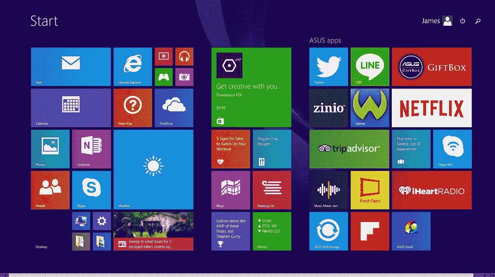
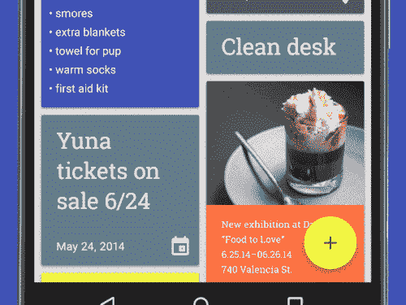

# 材料设计:深度观察

> 原文：<https://medium.com/swlh/material-design-an-in-depth-look-d4f4055a5ecf>

通常，当我们想到科技公司和设计趋势时，苹果远远超过其他公司，成为数字美学的关键。苹果当然不会放弃自己的立场——通过 Apple Watch，它可以像重塑 mp3 播放器、智能手机和平板电脑一样，重塑我们对智能手表的看法，所有这些都为移动设备的用户界面设计设定了标准。

然而，在过去几年里，苹果不得不为其他一些玩家腾出空间。首先，微软凭借其几何图形、色彩明亮的 Metro 用户界面帮助开创了扁平化设计的时代。然后，谷歌进入了，带来了基于卡片的材料设计美学。

但是，到底什么是材料设计，它在 Android 之外有生命力吗？它将如何从这里成长和进化？虽然只有时间能保证答案，但有一点是肯定的:材料设计正在加速发展，无论它是否会对移动应用公司处理移动界面设计的方式产生持久影响，它的原则都值得设计师和开发人员仔细研究。

# 平面设计和 Skeuomorphism

在哲学层面上深入研究什么是材料设计之前，先了解一下引发它的美学斗争，以及它试图解决的冲突，会有所帮助。看一些材料设计的例子，你会发现它将几何元素与某种物理学相结合。

与平面设计不同，这里有阴影，以及元素在空间中相互作用的感觉，而不是居住在同一平面上。与 skeuomorphism 不同，这些元素不像自然界中发现的纹理和图案，也不会过于光滑。

从本质上说，材料设计是平面设计与造型辩论的自然答案。大约在 2010 年，由微软等公司倡导的团队平面设计(Team flat design)认为，主导 skeuomorphic 用户界面设计的数字合成纹理华而不实、虚假过时。想想你在 2000 年代中期的网页设计中看到的人造木质纹理，或者集成到第一代 iOS 的[中。是什么让这些与我们现在联想到的 20 世纪 70 年代的人造木板家具有所不同呢？](http://www.theverge.com/2011/12/13/2612736/ios-history-iphone-ipad)

# 视觉语言进化了

虽然在 2000 年代中期到后期，高光泽的公司徽标、大量使用投影和高亮的移动界面设计以及看起来像涂了一层丰富而闪亮的油漆的网站并不少见。扁平化设计革命很快占据了上风。

对于网民来说，最明显的证据可能是 2011 年谷歌 Chrome 标志的更新。旧标志看起来像一个浸在厚厚的车蜡涂层中的三维孔，有大量的高光和阴影。新 logo 几乎完全变平了，没有光泽，有一些微妙的渐变显示谷歌并没有完全放弃第三维度。

大约在那个时候，网络和移动界面设计开始展开，扁平化和复杂化，以迎合潮流。与此同时，博客和评论员们对 2010 年 Windows Phone 的发布屏住了呼吸。他们说，当然，它可能没有 iOS 或 Android 的生态系统，但 Metro UI 基于磁贴的设计——充满了色彩鲜艳的扁平矩形——无疑是设计界未来事物的先驱。

正如过去几年数以百万计的网站和应用程序所证明的那样，他们是对的，尽管 Windows Phone 尚未将大批 Android 和 iOS 用户纳入微软的阵营。甚至苹果，可以说是 skeuomorphic 设计的大师和最大的吉祥物，也随着 [2013 年 iOS 7](http://www.cultofmac.com/246312/jony-ive-explains-why-he-decided-to-gut-skeuomorphism-out-of-ios/) 的发布而变得平淡无奇。

但是平面设计也不是没有批评者，或者说它的可用性缺陷。虽然 Metro 在手机或 Xbox 360 上是一个出色的用户界面设计，但当微软将其引入 Windows 8 时，企业用户和消费者都发出了强烈的呼声。这有几个原因，但其中之一就是形式妨碍了功能。

事实证明，在平面设计爱好者看来，让 skeuomorphic 设计看起来俗气或乏味的阴影和高光也让用户感觉更轻松。如果你有两个上下叠放的窗户，一个细微的阴影可以帮助你区分它们。一个简单的突出显示使得辨别哪个标签是打开的变得更加容易。

在移动世界中，所有这些都不是大问题，因为移动用户界面设计往往要简单得多，你不用处理那么多层叠的元素。但是手机也不存在于它自己的小泡泡里，与桌面网页设计分离开来。从平面设计的品牌和移动体验转向 skeuomorphic 的网络体验可能会在视觉上不和谐，并且不会在你的品牌中推广一致的视觉语言。

简而言之，skeuomorphic 设计看起来庸俗过时，过于字面地触及现实世界的隐喻。扁平化设计虽然流行，视觉上吸引人，但功能性不足以解决用户界面设计问题，尤其是跨不同平台的问题。至少，谷歌的设计者们觉得一定有别的方法。

虽然 skeuomorphic design 试图将物理世界的纹理带入数字环境，而平面设计在某种程度上违背了数字世界必须反映“肉空间”的想法，但材料设计将用户界面设计向前推进了一步，问道:“生活在这种设备中的元素应该如何表现？”

材料设计的第一个例子是在 2012 年，Android 的个人助理应用 Google Now 和 iOS 的 Siri。Google Now 的用户界面设计借鉴了几年前 Pinterest 非常流行的基于卡片的布局美学，但有自己的特色。字体设计(谷歌的 Roboto 字体)简单而不显眼，卡片以一种动画的方式让它们感觉就像在物理设备中移动和填充一样。当一张卡向上滑动时，另一张卡会以一定的惯性滑出，就好像它有一定的重量一样。

甚至你打开 Google Now 界面的方式——在你的安卓手机或平板电脑上向右滑动，而不是点击图标——也体现了一种想象设备内部数字元素行为的新方式。

如果不探究谷歌在材料设计背后的视觉哲学，一个不经意的旁观者可能会这样总结:这是一种基于卡片的用户界面设计语言，使用了材料隐喻。现在，这些隐喻不像你在 skeuomorphism 中看到的那样字面上的意思。你不会看到过于光滑的表面或类似木头或纸张的元素，而是会看到阴影、三维动画响应(按下一个按钮，按钮就会看起来从手机背面移动到表面)和其他你认为具有物理性质的物体的品质。

与平面设计不同，在材料设计中，有深度。与 skeuomorphism 不同，没有不必要的闪光。材料设计中的元素并不模仿自然——它们有自己的*本性。*

# 材料设计的基本原则

> *"* 也许这是谷歌填补纹理丰富的异形设计消亡后留下的空白的方式？无论如何，我们只能希望它能给数字设计增加一点温暖和人性，把我们从每个应用程序看起来和行为都一样的世界中拯救出来。*—[萨夏·格雷夫](http://sachagreif.com/)，设计师，[关于材料设计](http://venturebeat.com/2014/06/27/top-designers-react-to-googles-new-material-design-language/)*

*谷歌为其[材料设计哲学](http://www.google.com/design/spec/material-design/introduction.html#introduction-principles)列出了三个基本的用户界面设计原则:*

*   *物质是隐喻*
*   *运动提供了意义*
*   *大胆、生动、有意*

*这些共同构成了用户界面设计的整体哲学方法，谷歌设计副总裁马蒂亚斯·杜阿尔特(Matias Duarte)希望以此形成持久的视觉遗产:*

> *“我不希望看到四年后、十年后的情况，然后说，‘好吧，材料设计——所有那些想法、那些框架——都结束了。’我认为，它们背后的原则应该是永恒的。也许我们现在还没有，但我相信我们会成功的。"*

*那么，材料设计不仅仅是由世界上最大的品牌之一的创意头脑炮制的一种特定的美学，实际上是一种颠覆性的方式来看待用户与他们的设备互动的方式吗？让我们看看每一个原则，看看谷歌是什么意思。*

# *“物质是隐喻。”*

*这是材料设计背后的基本信条:它试图构想数字世界(特别是数字设备内部)中的实际材料的外观和行为。这有点令人兴奋和玄学，所以想象一下:你的手机有深度，对不对？也许是几毫米厚的实际物理材料。玻璃、铝、塑料。屏幕和设备背面之间有一定的距离。*

*material design 不再将屏幕视为一个完全二维的平面，而是将其视为设备中的一面镜子，现在它包含数字对象来代替其物理材料。这意味着现在有空间让这些物体四处移动——不仅仅是横向移动，还可以从设备背面移动到表面。*

# *“运动提供了意义。”*

> **“*对动作和钉钉微交互的强调是一个非常令人耳目一新的组成部分。*[Grace LaRosa](http://g-ography.com/)[R/GA](http://www.rga.com/)高级体验设计师，关于[材料设计](http://venturebeat.com/2014/06/27/top-designers-react-to-googles-new-material-design-language/)**

**但是现在，我们必须考虑这些数字对象的物理属性。它们必须有某种重量和惯性，当它们相互碰撞或相互移动时，必须有某种物理性质。这就是它变得棘手的地方，因为虽然物理学应该对那些在物理世界中生活和移动的用户有意义(偶尔会撞到东西)，但你不能在数字世界中复制真实世界的物理学。**

**这就是 skeuomorphism 误入歧途的地方:它忽略了数字世界的固有可能性，在这个世界中，重力不是 9.8 米/秒/秒，永动机也不是发明家的白日梦。谷歌说:“物质世界的灵活性创造了新的启示，取代了物理世界的启示，而没有打破物理规则。”用户至少应该对这些数字物理有一些熟悉感——光线投射阴影，近距离的物体看起来比远处的大，等等。—但是设计师不应该忽视当你不处理真实的物理材料时可能出现的“新启示”。**

****

**Source: [John Schlemmer](https://dribbble.com/shots/2090619-Material-Design-The-FAB?list=searches&tag=material&offset=0)**

**这些“新启示”到底是什么？为了更好地理解它们，你可以看看材料设计最初的工作名称:“量子纸。”忠实于构成谷歌文化基础的极客精神，设计师们从量子物理学的奇怪、有时古怪的领域中寻找灵感，设计出用户界面的设计原则。**

**根据马蒂亚斯·杜阿尔特的说法，如果不进入像海德格尔测不准原理或光是粒子还是波这样的东西，量子纸基本上只是一种纸一样的数字材料，可以“[智能地扩展和改造](http://www.engadget.com/2014/06/25/googles-new-design-language-is-called-material-design/)。"材料有物理表面和边缘."想象一张纸有许多不同的内容部分——有了量子纸，你可以将这张纸分成不同的部分，重新组织它们，将一些带到表面，隐藏一些，扩展一些。**

**用户是如何知道这一切的？杜阿尔特说，你需要用“接缝和阴影”让它变得直观。如果你的用户界面设计一切顺利，你的用户应该对数字世界有一个自然的了解，知道什么可以被触摸、移动或改变。**

# **“大胆、生动、有意图。”**

**但是谷歌的设计哲学不仅仅是物理学。材料设计继承了许多我们与平面设计相关的东西:简单但大胆的配色方案，清晰易读的排版和大量的“有意留白”在色彩和布局艺术方面，你希望用户界面设计不引人注目，这样“强调用户行为”仍然是最高的视觉和动态优先级。不要分散用户的注意力，而是引导他们以一种自然且视觉愉悦的方式与设备中的数字对象进行交互。**

**如果你正在设计一个基于材料设计原则的用户界面，让你的摄影和其他图像在屏幕上伸展，而不是把它圈在一个盒子或一个角落里(当然，这是材料设计之外的一个流行的视觉趋势)。选择易于在多种设备上阅读的字体，以及小而简单的颜色调色板，这些颜色看起来很醒目，但相互映衬起来很愉快。(谷歌在其材料设计[风格指南](http://www.google.com/design/spec/style/color.html)中提供了样本调色板)。**

# **基于卡片的设计:关注用户行为**

**相信材料设计可能会在明年左右获得一些重要动力的原因之一是[已经流行的基于卡片的设计](https://blog.intercom.io/why-cards-are-the-future-of-the-web/)，这已经严重影响了谷歌当前的设计理念。通过弱化传统的菜单和按钮，用带有相关信息和插图的“索引卡”来改进用户界面设计，基于卡片的设计为用户提供了更精确的网络和移动体验，减少了用户导航到他们需要的内容的负担，而是根据用户以前的行为、喜欢、搜索等来提供内容。**

****

**Source: [Ramotion](https://dribbble.com/shots/1928659-Delivery-Card?list=searches&tag=material_design&offset=17)**

**鉴于基于卡片的设计的策划性质，首先由 Pinterest 闻名，随后由脸书、Twitter 和 Google+等社交网络紧随其后，难怪谷歌会利用这一点。毕竟，用户行为算法是它最擅长的。**

**这一切将如何演变？谷歌设计的专家将如何进一步开发和完善材料设计？只有时间会告诉我们，但就目前而言，材料设计的原理足够有趣，结果足够漂亮和可用，我们认为这绝对是设计师应该研究的东西，如果他们还没有这样做的话。即使你主要是为 iOS 设计，材料隐喻和物体物理学的概念仍然可以在你的用户界面设计中发挥作用。**

# **在你的数字原型中使用材料设计**

**利用材料设计的一个快速方法是利用材料设计原理快速制作一个应用程序的原型。我们建议你通读一下[谷歌的材料设计指南](http://www.google.com/design/spec/material-design/introduction.html#introduction-principles)，以了解你可能有的任何具体布局或动画问题，然后[去 Proto.io](https://proto.io/) 创建一个完全交互式的用户界面设计原型。**

**二维线框无法给你材料设计的全部体验——为此，你需要运动。使用 [*Proto.io 的交互式材料设计 UI 库*](https://proto.io/en/new-features/material-design-ui-library/) *，您可以在几分钟内创建一个活生生的、有呼吸的材料设计灵感原型，完成动画和用户交互。***

***还没有 Proto.io，急于开始实施材料设计？没问题。你* [*今天就可以报名免费试用 Proto.io 的*](https://proto.io/) *。***

**你觉得材料设计怎么样？这是一时的狂热，还是看待用户界面设计的持久方式？告诉我们，发微博给我们 [@Protoio](https://twitter.com/protoio) 。**

***原载于 2015 年 7 月 15 日*[*blog . proto . io*](http://blog.proto.io/a-complete-guide-to-material-design/)*。***

****

**发表于*[**【SWLH】**](https://medium.com/swlh)***(****创业、流浪、生活黑客* ***)******

******************

***-***