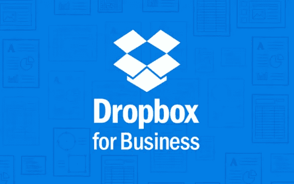
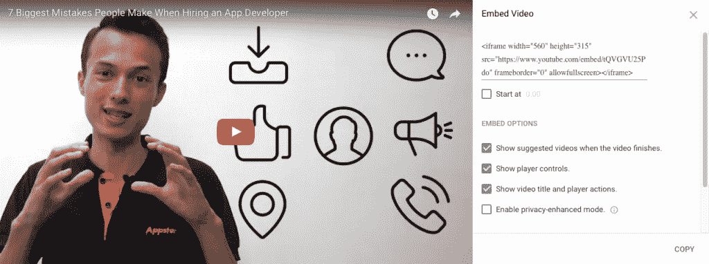
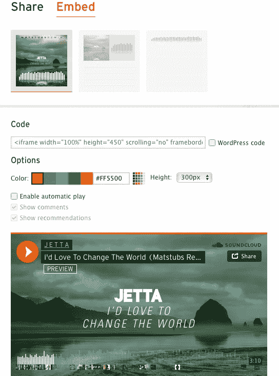
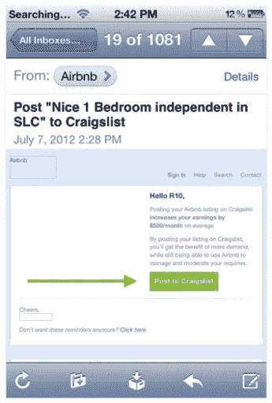

# 最大限度地拓展业务，促进创业

> 原文：<https://medium.com/swlh/maximize-business-development-to-grow-your-startup-b9d76027468e>

Originally published at [http://www.appsterhq.com](http://www.appsterhq.com/?utm_source=CP&utm_medium=Medium)

业务发展是启动和扩大创业公司的一个关键但经常被误解的方面。

因为这是最有效的吸引渠道之一，所以创业者掌握商业发展的含义并明智地运用商业发展的技巧是至关重要的。

在这篇文章中，我将从概念和实践的角度来解释业务开发，提供各种策略来充分利用这种方法。

# 什么是“业务开发”(BD)？

我们在 Appster 不断提醒我们的初创公司的一个关键事实是，在缺乏有效的[客户获取成本](https://blog.kissmetrics.com/customer-acquisition-cost/) (CACs)的情况下，初创公司无法实现快速增长。

换句话说，如果你花了太多的钱试图获得新的付费客户，扩大公司规模是不可能的。

正如我[最近解释的](http://www.appsterhq.com/blog/3-crucial-features-high-growth-startups):

> “对于初创公司来说，高 CAC 往往是致命的。
> 
> *一般的在线公司，如电子商务商店，可能需要支付 200 美元甚至 300 美元以上，才能通过传统营销和广告获得一个新客户。*
> 
> *从这个角度来看，试着想象一下 Dropbox 和 Instagram 各自支付 400 亿至 600 亿美元，以积累 2 亿用户群。*
> 
> *现实情况是，许多发展最快的技术、网络和移动创业公司在旨在获得新客户的直接营销和广告工作上花费很少。”*

事实上，Airbnb、脸书、谷歌、Instagram、Linkedin、Twitter 和优步都在传统广告上花了很少的钱(如果有的话),但它们仍然成功地成为了极其庞大和繁荣的公司。

相反，这些业务通过利用低成本和高度可扩展的牵引渠道实现了大规模增长，包括[病毒循环](http://www.appsterhq.com/blog/startup-growth-viral-loops)、[公共关系(PR)活动](http://www.appsterhq.com/blog/public-relations-for-bootstrapped-startups)、有效的[用户保留策略](http://www.appsterhq.com/blog/how-to-boost-app-user-retention-rates)和[新时代营销策略](http://www.appsterhq.com/blog/3-crucial-features-high-growth-startups)。

这些方法和其他各种各样的方法可以被视为属于“商业发展”(BD)的总称。

BD 没有一个统一的、通用的定义；对不同的人来说，它通常意味着不同的东西。

记住这一点， [Investopedia](http://www.investopedia.com/articles/personal-finance/090815/basics-business-development.asp) 提供了一个值得引用的有用描述:

> *“业务发展可以概括为旨在使业务变得更好的想法、倡议和活动。这包括增加收入、业务扩张方面的增长、通过建立战略合作伙伴关系提高盈利能力，以及制定战略业务决策。*
> 
> *业务发展活动延伸到不同的部门，包括销售、营销、项目管理、产品管理和供应商管理。*
> 
> 还包括网络、谈判、伙伴关系和节约成本的努力。”

显然，业务拓展是一个包罗万象的过程，涵盖了广泛的市场营销、销售和其他与增长相关的活动。

只要我们牢记 BD 的本质，即**通过最大化收益创造长期价值，包括客户、市场和与其他企业的关系**，那么我们就可以有效地讨论和应用这种方法来建立创业公司。

# 传统业务发展

传统的企业发展主要涉及与其他公司建立战略伙伴关系，以便以互利安排的形式获得优势。

“战略合作伙伴”可以定义为:

*   “为实现既定的共同目标而达成物质和/或智力资源共享的长期协议的一方”([来源](http://www.businessdictionary.com/definition/strategic-partner.html))；或者，更简单地说
*   “你与之达成协议的另一家企业，旨在帮助你们双方取得更大的成功”( [source](https://www.forbes.com/sites/davelavinsky/2013/04/02/does-your-business-have-strategic-partners-why-not/#f59aa362731f) )。

为什么企业寻求与其他企业的战略伙伴关系？

因为这种联盟可能会给[带来新客户](http://www.infonote.com/7-benefits-strategic-partnerships/)和[共享资源](https://www.forbes.com/sites/davelavinsky/2013/04/02/does-your-business-have-strategic-partners-why-not/2/#1877e8e33203)，[增加曝光率和品牌认知度](https://www.americanexpress.com/us/small-business/openforum/articles/how-strategic-partnerships-benefit-small-businesses/)，以及[扩大地理范围](http://www.infonote.com/7-benefits-strategic-partnerships/)。

例如，早期的谷歌与网景公司(即世界上第一个广泛使用的网络浏览器之一)签署了一项协议，让后者在其导航栏中包含谷歌的搜索功能。

因此，谷歌能够利用网景的用户群，而网景改善了用户的在线体验，从而获得了相对于微软 ie 浏览器的竞争优势。

以下是战略伙伴关系可以采取的几种不同形式:

# 1.合资企业:

*   **定义:**由两个或两个以上公司承担的有时间限制和以项目为重点的商业企业，目的是分担特定商业活动的费用和利润([来源](https://www.inc.com/encyclopedia/joint-ventures.html))。
*   **目标:**创造全新的产品和/或合作进入(或拓展)新市场。
*   **举例:**[2014 年，脸书 Oculus Rift 与三星](http://www.samsung.com/hk_en/news/product/gear-vr/)达成协议，开发三星设备。脸书同意负责软件方面的事情，而三星则负责硬件。这使得三星进入了一个新的市场(即虚拟现实)，而 Oculus 则获得了一个新的分销渠道的独家使用权。

# **2。分销合作伙伴关系**:

*   **定义:** a 公司向 B 公司提供产品或服务以换取 B 公司客户/用户群的一种商业安排。
*   价值:如果你发现自己正试图实现增长，但你已经用尽了你的市场触角，这一点尤其有用。一个合适的分销合作伙伴可以帮助你开发新的客户群。
*   **举例:**早在 2014 年， [Spotify 与优步](http://www.businessinsider.com/uber-partners-with-spotify-to-personalize-music-in-rides-2014-11)达成协议，将两个应用程序连接起来，这样优步的骑手就可以在优步的车上收听定制的 Spotify 播放列表。

# 3.许可机会:

*   **定义:**“一份书面合同，根据该合同，版权、专有技术、专利、服务标记、商标或其他知识产权的所有人，允许指定的一方使用、制作或销售原件的副本”([来源](http://www.businessdictionary.com/definition/licensing-agreement.html))。
*   **应该什么时候用？**当你的公司拥有 a)可以垂直整合到其他创业公司销售的产品中的技术和/或 b)一个声誉好、有吸引力的品牌，如果另一家公司使用(即购买)你的品牌，它可能会从中受益。
*   [2014 年，谷歌与制药公司 Novaritis 签署了一份许可协议](http://www.reuters.com/article/us-novartis-google-ceo-idUSKBN0FK0U320140715):两家公司同意让诺华使用谷歌的“智能镜片”技术，尝试开发新类别的眼部护理产品。

# 4.标准伙伴关系:

*   **定义:**“一份书面协议，它定义了企业中合伙人之间的关系，并概述了合伙人的利润和亏损份额”([来源](http://smallbusiness.chron.com/standard-business-partnership-agreement-62926.html))。
*   **目标:**结合两家或两家以上公司现有产品的独特能力，以实现互利的结果(例如，更多的客户、更高的利润、更大的曝光率和公关等)。).
*   **举例:**2014 年，Twitter 开始与支付处理应用 Stripe 合作开发[电子商务“立即购买”功能](https://www.recode.net/2014/8/22/11630152/twitter-is-working-with-payments-startup-stripe-on-its-commerce)。

# 业务发展 2.0

传统的商业开发是一个“高度接触”的过程，因为它需要大量的个人实时互动才能取得成功。

例如，完成一项合作交易通常需要多次电话、会议、推荐和艰苦的谈判才能达成最终协议。

然而，正如我最近指出的那样，21 世纪的创业公司正变得越来越依赖“低接触”的商业开发:

> *“由于许多早期创业公司缺乏与大公司达成大规模交易的人脉、信誉和资源，越来越多的创业公司正在利用新的业务开发技术，例如利用应用编程接口(*[*API*](https://medium.freecodecamp.org/what-is-an-api-in-english-please-b880a3214a82)*)、提要、爬行技术、嵌入代码，甚至逆向工程等工具来达到新的分销渠道。”*

让我们更详细地考虑这些 BD 2.0 方法，以便更好地理解它们对当代创业公司的价值。

# 1.蜜蜂

过去，成功地与其他公司整合需要大量的时间、金钱和谈判。

然而，今天，它只需要一个 API 密匙——也就是一段独特的代码，允许一个应用程序与另一个(或与开发人员)通信([source](http://kb.mailchimp.com/integrations/api-integrations/about-api-keys))——和一点创造力。

[Dropbox 的 API](https://www.dropbox.com/developers) 允许公司将 Dropbox for Business 集成到他们的 IT 流程中。

随着 [200，000 家公司使用 Dropbox for Business](https://www.dropbox.com/about) 以及(至少)300，000 个联网应用，Dropbox 的 API 帮助该公司达到了一个全新的水平，使其能够在此过程中颠覆各种企业市场。

# 2.把...嵌入

让您的用户有机会轻松地在个人网站、社交媒体页面等上分享自己和/或他人的内容。让他们很容易成为你创业的使者，因为他们有机地与朋友、家人和同事分享你的平台内容。

YouTube 和 Soundcloud 是两个著名的企业例子，它们通过允许网站上的内容轻松嵌入互联网的其他地方，从根本上扩大了用户群。

事实上，这是 YouTube 早期增长背后的主要因素之一。

嵌入的功能有助于传播关于 YouTube 的信息，同时分享视频会产生重要的网站反向链接

YouTube 和 Soundcloud 嵌入链接的截图:

# 3.逆向工程

[Techopedia](https://www.techopedia.com/definition/3868/reverse-engineering) 将“逆向工程”定义为:

> *“一种用于分析软件的计算机编程技术，目的是识别和理解组成软件的部件。对一个软件进行逆向工程的通常原因是重新创建程序，构建类似的东西，利用它的弱点或加强它的防御。”*

最著名的逆向工程案例之一是 Airbnb 对 Craigslist 的“黑客攻击”。

在 Airbnb 的早期，Airbnb 用户不仅可以在 Airbnb 上发布他们的公寓房源，还可以在 Craigslist 上发布。

为什么这是一个问题？因为 Craigslist 不允许任何这样的整合。

因此，Airbnb 对 Craigslist 的程序进行了逆向工程，以使自己的网站与 Craiglist 的发布论坛兼容——而且它是在无法访问 Craigslist 的主要代码库的情况下做到这一点的。

Craigslist 最终禁止 Airbnb 这样做，但此举发生在 Airbnb 通过利用 Craiglist 的用户群成功实现大规模增长之后很久。

从[合法性](https://www.eff.org/issues/coders/reverse-engineering-faq)和[伦理性](https://ethics.csc.ncsu.edu/intellectual/reverse/study.php)的角度来看，逆向工程是一件非常复杂的事情，所以在试图复制 Airbnb 的行为之前，一定要进行尽职调查。

Airbnb 现已停办的 Craigslist 帖子截图:

//

## 感谢阅读！

# 如果你喜欢这篇文章，请随意点击下面的按钮👏去帮助别人找到它！

> 最初发表于[http://www.appsterhq.com](http://www.appsterhq.com/?utm_source=CP&utm_medium=Medium)

