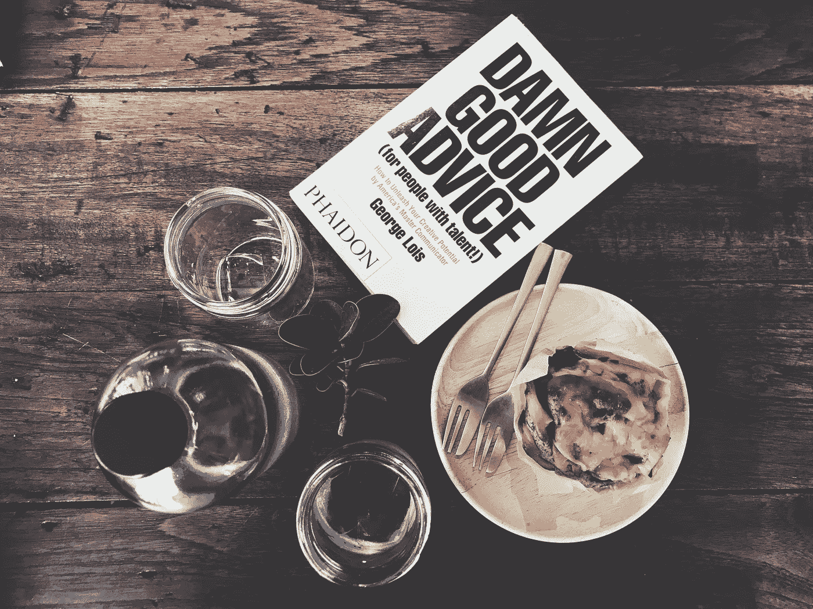

# 也许你在错误的地方寻找建议。

> 原文：<https://medium.com/swlh/maybe-youre-looking-for-advice-in-the-wrong-places-99a30d59fcdb>

Photo by [Frame Harirak](https://unsplash.com/photos/Ei_lQ6kTwiI?utm_source=unsplash&utm_medium=referral&utm_content=creditCopyText) on [Unsplash](https://unsplash.com/search/photos/advice?utm_source=unsplash&utm_medium=referral&utm_content=creditCopyText)

今天这个时代似乎产生了太多让我们感兴趣的自助文章、日志和其他形式的博客，因为它们保证了我们时间投资的回报。

这种思路的问题与我们无法识别何时不需要“建议”直接相关。

我们去另一个来源寻找积极、安慰，或者甚至更高层次的学习。

我们做这些事情的时候甚至都不加思考。我们认为我们要去某个地方获得一些关于我们自己生活的启示。但是，就是这样。

这些“忠告”的文章是从什么时候开始阻碍我们自己的忍耐和成长能力的？

我知道，这听起来有点奇怪，但让我们以这个平台为例。

人们来媒体是为了阅读、写作，或者两者兼而有之。在写作时，我们分享故事、经历、建议、鼓励、新的技术想法等。

阅读时，我们会消耗所有这些东西。

这个概念与我习惯表达的有点不同，因为我是如此支持的倡导者，以及我们不能独自做任何事情的事实，但请容忍我。

也许我们只是跟随少数给出我们觉得“需要”听到的建议的人，从而限制了我们自己的成长。

我们没有使用任何解决问题的技巧，而是跑到一个平台上去听别人对某个主题的看法，甚至没有形成自己的观点或想法。

现在，正如我一直提倡支持一样，我也大力提倡知道你为什么相信你所相信的(或支持你所支持的)的重要性。

这当然包括各种各样的事情——宗教、政治、运动类型、饮食等等。

我认为在你屈服于你最喜欢的知识来源之前，形成你自己对一个重要事件或主题的感觉、想法或观点是非常重要的。

原因很简单—

依靠自己的理由比重复别人的理由要好得多。

当这些回流受到挑战时，你可能会发现自己张口结舌，因为你最终不知道这些想法来自哪里。

相反，当你的*自己的*基本理由受到挑战时，你会有你自己的想法，关于那个理由从何而来。

你不会让别人的想法影响你的思维，影响你的声音。

当然，当你向别人寻求鼓励时，那就是另一回事了。有时我们*需要*他人的视角来改变我们对自己或当前环境的基本想法。

这是焦点的重新调整。

但是，举例来说，当我开始阅读别人对一个政治问题的立场时，我必须认识到这个立场不是我自己的，而是我被说服去认同别人的立场。

所以，我认为当我们讨论任何可能出现的问题时，记住这一点是明智的。如果你的位置不是原创的，那么无论如何，你不能为那个位置声称荣耀。

不过，在美国文化中，我们喜欢这样做。有人有一个伟大的想法，我们决定发展它，然后声称已经取得了突破。

不，突破已经完成了。你只是简单的利用了原著的影响来扩展你的思想。

爱迪生发明了电灯泡——这是一个突破。

接下来几个进化出电的概念的人是最初的扩展。

现在，我并不是说没有人值得偶尔被表扬一下。但是，我指的是这样一个事实，我不认为我们中的任何人真的可以得到全部的荣誉，对吗？

我们都有影响者——我们从他们身上学到了如何发展我们对特定想法的思考过程。我们的影响者可能有*他们自己的*影响者。

如此循环往复。

我最初的观点是，当涉及到我们所依恋的想法和议程时，我认为我们需要踩刹车。你可以在脸书经常看到这种情况。人们会在周围分享一段视频，并发表类似“这是我的感受”的评论。

该死，我以前做过。

理解与你“争论”的人有着不同的背景和不同的影响是非常重要的。在某种程度上，你试图从你的影响者那里获得想法，他们也在做同样的事情。

那么，我们是不是应该永远不要从我们最喜欢的影响中提取任何素材？不，我不是这个意思。

我想说的是，我们必须小心我们与我们最喜欢的作家、政治人物、牧师等接触的频率。

当我们完全依赖他们的声音，而不是我们自己的声音时，这些影响就会成为问题的一部分。

下次你上网去找你最喜欢的作家寻求鼓励时，记住，受你自己的基本价值观影响也没关系。

## 在这里找到更多我的故事。也可以关注我的[推特](https://twitter.com/Eturn102)。谢谢你让我开心！

## 如果你喜欢这个故事，请点击👏按钮并分享，帮助其他人找到它！欢迎在下方留言评论。

## 这篇文章发表在 [The Startup](https://medium.com/swlh) 上，这是 Medium 最大的创业刊物，有 332，253+人关注。

## 在这里订阅接收[我们的头条新闻](http://growthsupply.com/the-startup-newsletter/)。

