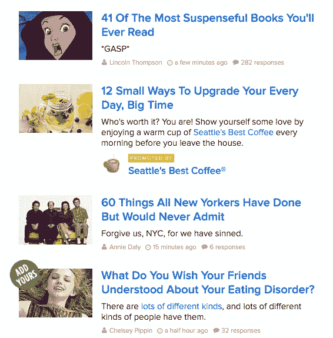

# “我也是”的内容策略导致失败

> 原文：<https://medium.com/swlh/me-too-content-marketing-strategy-leads-to-failure-727bc0e96ecc>

Back in the days producing content was difficult…

我们生活在一个交流过度的社会。

现在每个人都在写作(包括我自己)。我们不再像 3-5 年前那样对内容做出回应，当时内容营销概念刚刚兴起，只有精英营销团队才能负担得起。

总的来说，有太多的内容、太多的博客、太多的白皮书、太多的研究、太多的“实现目标的 5 步战略”以及太多的营销噪音。

我们都成了信息迷。接触更多的信息会给我们一种积极的感觉，让我们获得更多的知识，取得进步，或者确认我们的信念或策略。

*我们不再阅读……我们滚动我们的订阅源，我们浏览要点，我们教我们营销部门的作家保持内容简短和甜蜜。我们为我们的帖子制作吸引人的标题来吸引点击。*

**一些出版物已经成为“跟风”或垃圾内容的工厂。**

甚至主要的出版物也变成了制作短片、25 岁以下首席执行官名单和成功人士进会议室前要做的事情的工厂。以 Business Insider 为例，这是一份一度受人尊敬的出版物，现在却成了垃圾内容的生产线(我不得不承认，我是偶尔会被诱人的文章标题吸引的人之一)。

正如 Ev Williams 强调的那样，就像快餐一样，这种“跟风”内容很有效率，但不是很有营养。

 [## Medium 和 Twitter 创始人:“我们把垃圾食品放在他们面前，他们就吃了。”

### Ev Williams 并不喜欢他目前所看到的日益同质化的媒体，这种媒体的重点是满足…

www.theguardian.com](http://www.theguardian.com/media/2016/apr/10/twitter-ev-williams-medium-content-fast-food) 

另一个容易攻击的目标是 Techcrunch，我建议你停止阅读。如果你是一名企业家，这只会让你感到自卑，因为我们似乎生活在一个只有超级成功的一夜创业公司的世界。相信我，避免阅读 Techcrunch 不会让你错过任何东西。作为一个瘾君子，在没有得到你的创业新闻的前几周，你会有一定的紧张感。但是这段时间过后，你就自由了。

令人欣慰的是，有些人对新闻和报道采取了不同的方式。[信息](https://www.theinformation.com/)产生伟大的内容和分析，由质量驱动，而不是由点击或广告商驱动。他们确实收取额外费用，但在我看来，这笔费用是值得的。如果我花时间读一些东西，我想保证一定的内容质量。我愿意为发现或专业策展付费。

**数码排毒流行起来。**

有些人用数字排毒策略来对抗过度沟通。Tim Ferriss 在他的书《每周 4 小时工作制》中推荐了一个完整的数字排毒法。许多创始人和创业者会去[内观冥想](https://www.dhamma.org/en-US/index)静修处，在那里你有 10 多天的机会彻底清理和重置你的思维。(我已经完成了一个 10 天的课程，今年打算再做一个。推荐你也试试)。

**模仿内容策略成为一种默认的营销方式。这种仅仅为了产生普遍兴趣而创作内容，但没有实际价值或参与度的倾向也可以在营销部门看到。我也一样的内容策略扼杀了公司的营销预算和投资回报率，而他们甚至没有意识到这一点。**

在开始创作内容之前，你还会研究热门关键词吗？
营销人员仍然使用旧策略[研究流行关键词，然后围绕它们设计内容](/@myxys/where-not-to-look-for-content-ideas-914b4578776d#.kkrw35l6y)。我们仍然会为那些对你的目标受众来说太过宽泛而没有意义或者被竞争对手覆盖的主题创建列表和要点。

**你还会外包你的博客文章吗？我们都知道你可以用 50 美元购买文章来开始你的博客。当没有人在社交媒体上分享我们的内容时，我们为什么会感到惊讶？你认为读者、潜在客户和客户没有意识到你向他们灌输的内容的质量吗？**

我对使用这两种策略感到内疚。我见过他们失败。

> ***这种内容营销上的跟风策略导致了成功的模仿。营销人员看到点击和搜索引擎流量等虚荣指标的增长，但在用户激活数或线索等更有意义的指标上，指针丝毫没有移动。***

当然，如果你的公司从上到下都是一个内容生产工厂，就像 [HubSpot](https://medium.com/u/8732e73183e5?source=post_page-----727bc0e96ecc--------------------------------) 一样，你可以偶尔模仿一下。鉴于他们制作的大量内容，他们无法避免模仿内容。没有足够的话题来涵盖。

创业初期可能是产生跟风内容的好借口。老实说，我在这个阶段咨询了一些公司，至少从“我也是”内容开始。在你开发了产品定位、信息和可能的行业专业知识之后，你可以很容易地转向更高质量的内容。

为什么这么多公司制作模仿内容？

我认为这是多种因素的结合。制作伟大而独特的内容非常困难。“我也一样”的内容给人一种公司顺应内容营销趋势的错觉。

我们到了这样一个点，公司生产没有真正问题或痛苦描述的案例研究。主要归结为——公司 A 需要 X，我们提供了 X。公司 A 说我们超级棒。*谁在乎你被认为有多牛逼？*

我还没有发现一家公司发布了客户不满意的案例研究。案例研究的目的是将我(潜在客户)与问题联系起来。我们明白——这个特定的客户认为你很棒，但是问题和你的团队如何解决问题才是最重要的。潜在客户希望了解细节、数字和流程。

> ***内容营销中的跟风问题本质上是一个定位问题。***

如果你对你的产品没有一个清晰的定位，你对你的内容策略没有一个清晰的认识。

再来看外包公司面临的定位问题。有如此多的外包公司，难怪在需要的时候选择一家变得更加困难。

他们都承诺质量和有竞争力的价格。在某种程度上，这正慢慢变成一种商品交易。但是你有客户认可的明确的专业知识吗？你能把自己定位为 UI/UX 设计的专家吗？或者你们是可伸缩性方面的专家团队？你是专门研究信息应用还是酒店管理网络界面的？找到一些东西…

最好的开始方式是采访你现有的客户，注意你是否已经为他们中的大部分解决了类似的问题。例如，如果您发现 40%的客户来自游戏行业，对游戏内的机制有明确的需求，那么这是探索在这个非常具体的主题上创建内容的完美候选。

现在，当你将外包公司定位为游戏内机制的领导者时，你可以创建一个内容策略来支持你的市场地位。随着时间的推移，如果定位做得正确，你会更深入地挖掘游戏内机制的主题，你会产生相当数量的案例研究来证明你的专业知识。

***模仿营销内容是产品定位不清或通用价值信息的直接结果。人云亦云的营销内容会导致失败，因为它只会增加总体营销噪音，而不会为成熟的消费者提供额外的价值。***

# 如果你喜欢这篇文章，请推荐和分享。

***跟我上*** [***推特***](https://twitter.com/myxys) ***，*** [***中***](/@myxys) ***，***[***Quora***](https://www.quora.com/profile/Myk-Pono)***，连接上***[***Linkedin***](https://www.linkedin.com/in/mykolaponomarenko)*[订阅我的简讯](https://www.getrevue.co/profile/myxys)。*

* [## 如何设计营销活动:市场细分的重要性

### 这篇文章分享了设计成功营销活动的过程。目标是概述实际的…

medium.com](/swlh/how-to-design-marketing-campaigns-the-importance-of-market-segmentation-71b11e1819c2)  [## 战略沟通:如何开发战略信息和定位

### 这篇文章涵盖了战略沟通的要点。

medium.com](/startup-grind/strategic-communication-how-to-develop-strategic-messaging-and-positioning-3cc59689ca28)  [## 如何设计销售线索培育、销售线索评分和点滴电子邮件活动

### 查看关于战略信息的新的深入文章。

medium.com](/@myxys/how-to-design-lead-nurturing-lead-scoring-and-drip-email-campaigns-9961024f6605)  [## 如何跟踪客户收购:

### 客户生命周期、销售漏斗和内容战略

medium.com](/swlh/how-to-track-customer-acquisition-9d04b903535)*