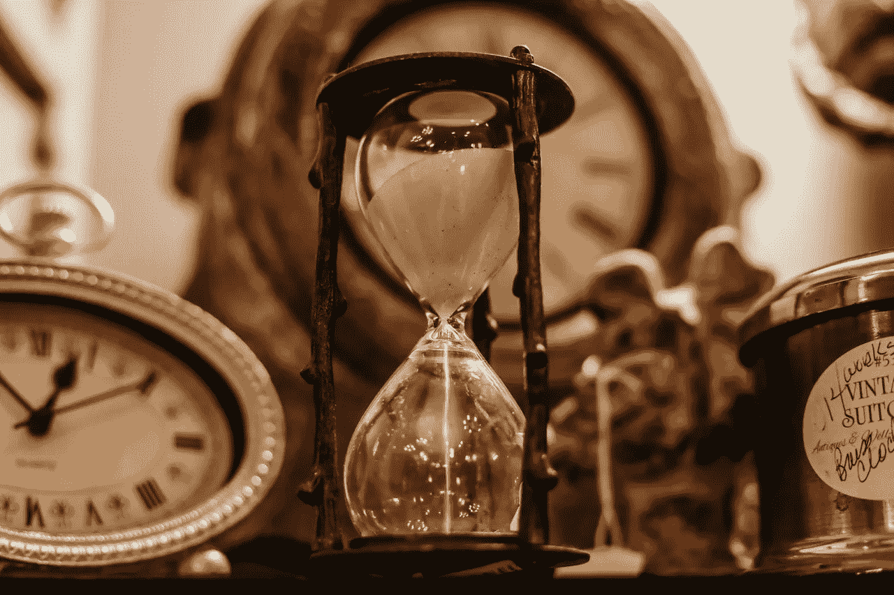

# 衡量进步——如果你能再次拥有这一年…

> 原文：<https://medium.com/swlh/measuring-progress-if-you-could-have-this-year-again-3c2bb8e8ba33>

## 你会重新开始吗？这就是为什么我不会。

If I could turn back time… (Credit: Jordan Benton)

随着又一年接近尾声，反思和评估进展似乎是很自然的。*进展顺利吗？什么没有？我学到了什么？我比以前更好了吗？我会有什么不同的做法？*