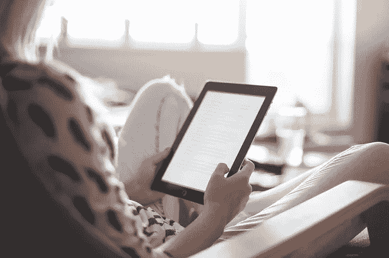

# Medium 对博客作者、读者和人类来说都很好，但仍有改进的空间

> 原文：<https://medium.com/swlh/medium-is-great-for-bloggers-readers-and-humanity-but-there-is-some-room-for-improvement-fbff756b868f>

[Pexels/pixabay](https://pixabay.com/en/adult-blur-chair-education-1867751/)

媒介对人类来说是伟大的，因为它就像我们智能手机中的特洛伊木马。智能手机正在摧毁我们的注意力。

短片、一连串的广告和图片正在取代书籍。在这种环境下，媒体提供了所有数字糖果的替代品。

中型文章不能代替一本书。我们大多数人写文章时都考虑到网络读者的注意力持续时间短。

无论是哪种情况，中型帖子都比你口袋里的大多数数字糖果好得多。它要求你在几分钟内专注于一个内容。

**Medium 对读者来说很棒**，因为它为读者提供了源源不断的精彩帖子，以及与作者和其他读者互动的机会。

**媒体对博客写手来说很棒**，因为它为他们提供了大量的读者。个人博客很难吸引受众。一直都是这样。

随着智能手机和应用程序的引入，博客读者的数量正在进一步减少。这个时代，媒介就像是博主的绿洲。

中等统计教你功课

一旦你发布了足够多的帖子，你就有了一套不错的统计数据。你可以利用这些数据来学习你在博客 上的 [**课程，并**](https://ideavisionaction.com/blogging/i-analyzed-seven-factors-that-affect-my-medium-stats-this-is-what-i-found/) **[**提高你的技能**](https://ideavisionaction.com/personal-development/how-to-succeed-in-your-craft-in-the-age-of-technology/) 。**

**与读者互动**

与读者互动的机会对作者来说是非常好的。我很幸运，我的帖子得到了源源不断的回复，对此我很感激。这种反馈对于任何内容提供商来说都是至关重要的。

*   评论表明你的内容引起了人们的共鸣。
*   你的读者通过告诉你他们喜欢你的帖子的什么来给你一个方向。
*   你的读者给了你新的写作思路。

这个讨论对读者来说也是有价值的。他们能够通过反馈影响作者。他们可以提出问题并得到答案。结果，大家都赢了。

**媒介是我唯一的流量来源**

博客依赖单一的流量来源是有风险的。当我考虑到上述所有好处时，我愿意冒这个险。作为一个博客作者，我对 [**使用媒体作为我的网站**](https://ideavisionaction.com/blogging/why-i-focus-on-a-single-source-of-traffic-for-my-blog/) 的单一流量来源没有意见。

**媒体非常适合讨论**

如果你读了我的名为 [**的文章，评论媒体是增加你的博客受众的可靠策略吗？**](https://ideavisionaction.com/blogging/is-commenting-on-medium-a-reliable-strategy-to-grow-the-audience-of-your-blog/) ，你可能以为我改变主意了。我没有。

评论对与其他作者互动很有帮助。这并不是增加你的观众的有效方法。实际上，我可能已经发现为什么不是了。

**介质的一个改进点**

注释可能不起作用，因为 Medium 正在禁止某些注释。他们可能试图通过这种方式来减少垃圾评论，而且这种方式很有效。垃圾邮件在介质上几乎不存在。

我知道 Medium 隐藏了一些评论，但是 Medium 处理评论的方式还有改进的空间。

**中等通知低于最佳**

作为一名作家，我希望收到一封关于我收到的每条评论的电子邮件。目前情况并非如此。偶然发现旧评论后发现的。

我收到了一些新成员写的不错的评论。我没有收到关于他们的邮件。我无法为他们鼓掌或回应他们。因此，这些评论仍然被隐藏。

**新成员的回复不会通知给作者**

如果你注册只是为了评论一个帖子，花时间写一个像样的评论，然后，你的评论保持隐藏，你没有收到作者的回应，你会对 Medium 有什么感觉？

你会继续用中号吗？相信这种做法伤害了 Medium 的新用户获取数。

**向作者显示通知的更好方式**

你可能会说，检查我的通知并找到所有这些评论是我的责任。不幸的是，在我每天收到的几十个通知中，Medium 的通知对我毫无用处。

为了让它们对我有用，它们必须满足以下要求。

*   他们需要像脸书一样在自己的单独页面上访问。
*   我应该能够将它们标记为已读。现在，一旦它们显示在屏幕上，它们就被标记为已读。

**中型 iOS 应用具有最佳通知设置**

幸运的是，我找到了解决这个问题的方法。在 iOS 应用中，有三个选项用于推送响应通知。

*   离开
*   为你量身定制
*   人人

默认是“为你量身定制”，我选择了“所有人”我会看看这是怎么回事。我真的很想看到电子邮件通知的“每个人”选项。

我希望收到每封回复邮件。这将使处理回复的任务变得容易得多。同时，如果我错过了你的评论，我道歉。

**结论**

媒体以不同的方式让博客作者、读者和人类受益。作为一个作家，我非常欣赏它，以至于把它作为我流量的独家来源。

不过，我想在媒体上看到一个更新。也就是说，我的帖子收到回复时，都会收到一封电子邮件。

我还建议 Medium 小心处理新用户评论。否则，他们可能会永远失去一些用户。

**轮到你了**

如果你知道一个工具，可以处理中型通知并创建待办事项列表，请在评论中告诉我。

***如果你觉得这篇文章很有价值，注册*** [***每周简讯***](https://ideavisionaction.com/email-newsletter/) ***就能收到我关于创业、企业家精神、领导力和自我提升的文章综述。***

## 这个故事发表在 [The Startup](https://medium.com/swlh) 上，这是 Medium 最大的创业刊物，拥有 319，583+人关注。

## 在这里订阅接收[我们的头条新闻](http://growthsupply.com/the-startup-newsletter/)。

