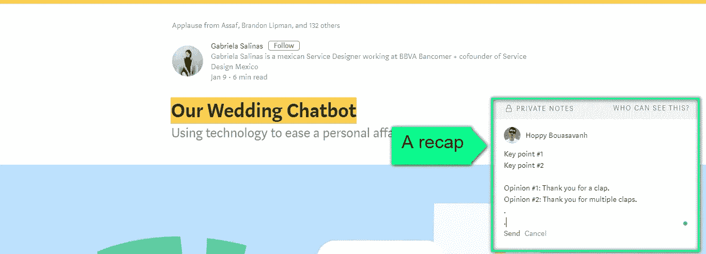

# 媒体的新功能:“文章摘要”

> 原文：<https://medium.com/swlh/medium-new-feature-article-summary-becc39b5b5>

Photo by [Glenn Carstens-Peters](https://unsplash.com/photos/RLw-UC03Gwc?utm_source=unsplash&utm_medium=referral&utm_content=creditCopyText) on [Unsplash](https://unsplash.com/search/photos/note?utm_source=unsplash&utm_medium=referral&utm_content=creditCopyText)

我很难记住我读过的东西。早晨的文章在下午变得暗淡，到了就寝时间就消失了。

我应用了一种叫做“重述”的技术来解决这个问题。摘要是对一篇文章的关键点和我的观点的总结。它能提高阅读兴趣，巩固记忆，简化复习。

我在 Evernote 上存储了 recaps。每个摘要都有相应的文章链接，以供将来参考。这是不方便的，因为文章和摘要是分开的。

最近，媒介成了我文章的主流。我在 Medium 上发现了一个黑客工具，可以用一个*私人笔记*把一篇文章和它的摘要放在一起。

> 私人笔记是一篇文章的选定文本的简短说明。

我选择一篇文章的标题，并插入一个摘要作为私人注释。

Screenshot was stolen from this [Article](https://chatbotsmagazine.com/our-wedding-chatbot-c32d317cc7cb)

Screenshot was stolen from this [Article](https://chatbotsmagazine.com/our-wedding-chatbot-c32d317cc7cb)

万岁。我很想写“结尾”在这里继续我的生活。然而，这一绝妙的技巧带来了三个问题。

首先，私人笔记是不可编辑的。编辑它的唯一方法是用新便笺替换现有便笺。

其次，私信是半私信。文章的作者和编辑也可以看到注释。它抑制了我的 recaps 的创造力，它经常是相当黑暗和肮脏的。

第三，一篇文章的作者可以关闭私人笔记，这让我别无选择，只能回到我的老朋友 Evernote。

> 媒体应该有一个**“文章摘要”**，用户可以将他们的个人摘要附加到一篇文章。

不过有一个问题。如果文章被删除，文章摘要也会被删除，但是我会把这个问题留给有能力的 Medium 团队。

我发表这篇文章是为了在提交给 Medium 之前收集意见并完善我的请求。此外，由于媒体是博客的社交媒体，这是特性请求的媒体方式。

**出发前:**

*   你总结一篇文章的诀窍是什么？
*   你认为“文章摘要”功能怎么样？

如果你喜欢我的笔迹，这里还有一些:

 [## 1 分钟让你更快乐

### 掌握你的故事，掌握你的快乐。

medium.com](/@bouasavanhhop/1-minute-to-a-happier-you-fdacb0d0b5b3)  [## 如何用有声读物治愈失眠

### 有声书助你睡个好觉，醒得更聪明

medium.com](/the-post-grad-survival-guide/how-audiobooks-cure-my-insomnia-bfd583bf85e1)  [## 我的第一次申请和它是如何失败的

### “习惯触发器”——一个重复的警报，提醒用户在一周的选定日期，在首选时间或在…

medium.com](/swlh/my-first-idea-execution-ecd1a1642e99) 

## 这篇文章发表在 [The Startup](https://medium.com/swlh) 上，这是 Medium 最大的创业刊物，拥有 285，454+读者。

## 在这里订阅接收[我们的头条新闻](http://growthsupply.com/the-startup-newsletter/)。

