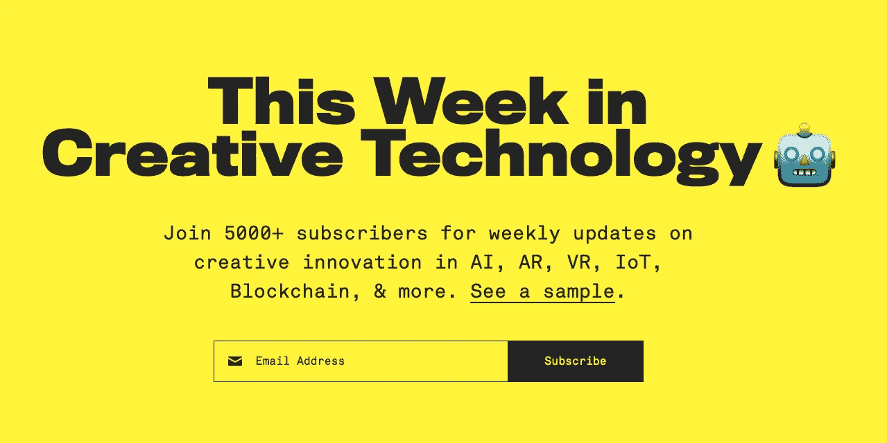

# 2016 年 Medium 最佳设计作品

> 原文：<https://medium.com/swlh/mediums-best-design-writing-of-2016-68de5ed2b7d9>

有创意、有见解、有帮助、可操作；我们已经对去年 Medium 的 75 篇最佳设计文章进行了策划和分类。尽情享受吧！

参见[Medium 2015 年度最佳设计作品](/the-mission/the-best-design-writing-of-2015-7776699d4796#.jogbc6qzw)。

# 创造过程的方法

正如以下文章所揭示的，通往创造性成功的道路既不是一成不变的，也不是单一的。

[如何运用设计思维，HCD，UX，或者任何从零开始的创作过程](/digital-experience-design/how-to-apply-a-design-thinking-hcd-ux-or-any-creative-process-from-scratch-b8786efbf812#.5fc8qvrth)作者[朱莉·卓](https://medium.com/u/409333d18adc#.z12ji9mqe)[杰克·纳普](https://medium.com/u/b8a4e5ae7490#.abyjuokjt)[设计和产品开发中的破窗理论](https://medium.com/u/f230699aec44#.adgboexpu)解释了为什么小问题是重要问题；托拜厄斯·范·施耐德。

[设计过程](https://thedesignteam.io/the-design-process-67df3e8ec68f#.xt1zh0yh4)描述了 UX 目前的状态——尴尬的青春期之一——并表明，如果要认真对待设计，一些严肃的自我反思是必要的；由[用心设计的艺术](https://medium.com/u/7f968435c6b9#.746zxv1ev)提醒我们，我们的软件是为了帮助人们而存在的，如果我们把他们放在心上，他们就会注意到；乔纳斯·唐尼。

[为同质设计辩护](/@yarcom/in-defense-of-homogeneous-design-b27f79f4bb87#.4ioboznyk)建议在我们的产品实验中，我们也应该认识到什么时候我们的‘独特’设计会妨碍我们的用户体验；由[数码产品设计原则](https://medium.com/u/b9ffef1138d9#.kk6ua7giy)给你 12 个考虑因素，帮你做设计决策；作者:Wouter de Bres。

# 创作过程的幕后

这些深入的文章探讨了一些科技行业最成功的产品。在这里，我们借鉴了 Spotify、脸书和 Instagram 的流程。

[设计 Instagram 的新外观，灵感来自于社区](/@ianspalter/designing-a-new-look-for-instagram-inspired-by-the-community-84530eb355e3#.4eex4o1pt)的 Ian 。

[设计不成比例](/@hellostanley/design-doesnt-scale-4d81e12cbc3e#.b0mwnnkul)揭示了为什么 Spotify 的产品分散反映在其团队的分散，以及当你投资于调整和协调设计师时，设计*如何成比例；斯坦利·伍德。*

[重新设计 Spotify 图标套件](/@andrealimjoco/redesigning-the-spotify-icon-suite-63f16853ba00#.3jyx7nmto)探索了四个月过程中面临的视觉、功能和上下文挑战；由[窥视脸书的评论](https://medium.com/u/3abbfcb15f95#.turgwbhqb)让你一窥脸书如何利用他们的产品帮助他人使世界更加开放和互联；坦纳·克里斯滕森。

[设计复杂的产品](https://blog.truthlabs.com/designing-complex-products-8f9289ab26c9#.ygdn8gqwl)分享了关于交互的发展前景以及如何在你的设计项目中减少人和产品的复杂性的见解；作者:埃里克·K。

[重新设计 Chrome Desktop](/google-design/redesigning-chrome-desktop-769aeb5ab987#.tbpvvrn3q) 详细讲述了 Chrome Desktop 的重新设计，更加面向未来的设计流程的重要性以及一个像素的价值；塞巴斯蒂安·加布里埃尔。

# UX

用户体验是一个广泛的话题，也是任何伟大产品的焦点。谢天谢地，这些 UX 的文章涵盖了大量的内容，从基本的建议到最前沿的建议。

[减少肤色:手机设计的新趋势](/swarm-nyc/complexion-reduction-a-new-trend-in-mobile-design-cef033a0b978#.pv3rfj9aq)探索手机设计中“干净和简约”的下一个层次，以及减少肤色的最终指南；由[设计更好的表单](https://medium.com/u/b0dc62008bd7#.dig8wvwjh)概述了设计师常犯的错误以及如何改正；由[设计智能通知](https://medium.com/u/7012bf7f682b#.j6v2t6eqm)呼吁提供价值和真正有用的更智能的通知；通过[微交互:伟大的应用程序设计的秘密](https://medium.com/u/7ca8972daf76#.kp7cpgti0)解释了什么是微交互，它们为什么工作，如何识别机会，以及以人为中心的设计方法的必要性；尼克·巴比奇。

多字体设计的价值提供了一个反驳的论点来为折衷的字体系统辩护，以及在你的项目中有效地结合多种字体的方法；由 [UX 手机设计:底部导航](https://medium.com/u/f76eccb4be7e#.t555cs8sc)重申导航是一种对话，并为良好的底部导航设计提供了 3 条规则；尼克·巴比奇。

发展你的设计眼光展示了一个简单的策略，它将帮助你发展和提高你的品味和识别设计优势和劣势的能力；乔纳森·z·怀特。

UX 设计中的功能性动画:怎样做好过渡？作者[按钮 UX 设计:最佳实践、类型和状态](https://medium.com/u/bcab753a4d4e#.ba2s2ffs4)作者[使用基于卡片的设计来增强 UX](https://medium.com/u/bcab753a4d4e#.ambdcen39) 详细介绍了为什么 web 和移动应用正从页面转向卡片和完全个性化的体验；尼克·巴比奇。

[移动导航的汉堡菜单选择](/@kollinz/hamburger-menu-alternatives-for-mobile-navigation-a3a3beb555b8#.tyvlha6p5)探索其他菜单类型，以及为什么没有一个单一的一次性移动导航解决方案；作者:Zoltan·科林。

《偷窃的艺术:如何成为一名优秀的设计师》讲述了一些设计师如何抄袭设计作品并在此基础上有效创新的例子；由[设计完美的文本域:清晰、易访问和用户努力](https://medium.com/u/7c430ec86a4f#.rg0pre7zb)作者[聊天机器人的终极指南:它们为什么扰乱 UX，以及构建聊天机器人的最佳实践](https://medium.com/u/bcab753a4d4e#.6bh2iy6mf)；乔·托斯卡诺。

# 用户界面

UI 是一个健壮、迷人的话题，尤其是在 2016 年。以下几篇文章重构了长期以来关于文字设计、电视、最佳按钮实践和当前趋势的假设。

[Marek Minor](/sketch-app-sources/how-to-be-more-organized-while-designing-ui-90d2d69cfb4f#.sj1fl3ou7)如何在设计 UI 时更有条理。

[如何设计文字](/@jsaito/how-to-design-words-63d6965051e9#.wwokoy29m)声称那些与文字打交道的人应该尽可能让阅读变得简单，并给了我们 7 个设计文字的技巧；约翰·斋藤。

[动作设计是 UI](https://blog.prototypr.io/motion-design-is-the-future-of-ui-fc83ce55c02f#.7gl0cznfz) 的未来。

莫莉·拉弗蒂的三集连续剧《T21》的电视设计。

[为你的用户界面有效写作:要避免的事情](https://uxplanet.org/effective-writing-for-your-ui-things-to-avoid-f6084e94e009#.1wnykjd2g)提供了 16 个技巧，用更加清晰、准确和简洁的文字建立信任[少想。设计得更好。](https://medium.com/u/bcab753a4d4e#.f3chpehr1)通过减少决策和思考过程，促进更好的 UI 设计工作流程；[我在迪士尼为虚拟现实设计 ui 时学到的 4 件事](https://medium.com/u/3e7264cdecaf#.of0ikg6pk)James Hsu。

[UI 设计中的按钮:风格的演变和最佳实践](https://uxplanet.org/buttons-in-ui-design-the-evolution-of-style-and-best-practices-56536dc5386e#.kbfaei16n)作者[设计面向未来的用户界面](https://medium.com/u/bcab753a4d4e#.ws8tltxo7)探讨了为什么用户界面的寿命有限，以及我们可以做些什么来确保设计的寿命；克里斯蒂安·米勒。

# 动画/gif

动画是数字设计不可或缺的一部分，在过去的一年中，它的实现引发了一些有趣的争论和讨论。

[UI 动画:赏心悦目、解决问题](https://uxplanet.org/ui-animation-eye-pleasing-problem-solving-a8b27013f55c#.6x0j13dom)承认有些人认为动画是让 UI 过载的不必要的功能，但坚持认为它是最接近真实交互本质的东西，应该支持用户；由 [UI 动画:宏结果的微交互](https://medium.com/u/67729b873272#.7c05dycvw)探讨了微交互的本质，以及这些累积的微交互如何成长为伟大的可用性、效率和受欢迎程度；由[如何利用动画改进 UX](https://medium.com/u/67729b873272#.8z2oldwdd) 作者[平滑网页动画的 10 个原则](https://medium.com/u/bcab753a4d4e#.u0b6va51d)包含了一个完整的使用 CSS 获得 60fps 动画的指南；作者:阿南德·夏尔马。

# 颜色

颜色，一个经常被认为是理所当然的设计元素，将在下面的完整指南中介绍。

[如何找到你的完美色彩搭配——色彩简介](/@vanschneider/how-to-find-your-perfect-color-parings-introducing-colorclaim-d00254c65ebc#.48f2zl6sb)是一篇简短的文章，讲述了一位设计师的色彩工作流程，作者是[色彩设计](https://medium.com/u/7ee29b787e9#.shngjbeix)为你的调色盘流程提供指导，因为它很重要，有时也很吓人，以至于 90%的人做出的快速决定都是基于色彩；乔纳森·z·怀特。

[为你的品牌挑选一种颜色](/swlh/picking-a-color-for-your-brand-7a589c40d950#.yamlemtim)概述了颜色对品牌形象的重要性，并提供了一些思路来指导你回答这个问题— *什么颜色适合这个品牌？*；比尔·S·肯尼。

# 趋势

从基于卡片的设计到学习商务，2016 年的设计趋势将在下面详细介绍。

未来近在眼前:2017 年的 13 个设计预测，作者[为什么设计师不应该编码，而应该研究商业](https://medium.com/u/2e58d328d719#.tnut0murd)作者[2016 年的 5 个实际网页设计趋势](https://medium.com/u/c6ea80c66737#.gzb0bqrz8)作者[设计与自我](https://medium.com/u/744480a89f2b#.jhkwvmgr9)回顾了我们可以理解设计的各个层面，并呼吁世界上的好设计，因为好的设计有助于我们成为最好的自己；由[UX 3 大手机设计趋势](https://medium.com/u/6d23645ba40b#.f2bsr1e1n)以及对个性、导航和内容的重视；乔安娜·倪。

[50 个#FAFAFA](/@jon.moore/fifty-shades-of-fafafa-eaa903e36b9c#.gb0skx7my) 的阴影是设计师做和不做的傻事的清单，但不要太当真；由 [9x9 Pixels，世界上最小的网站](https://medium.com/u/8cebe625c432#.nb6j06tku)挑战你，让你在下次构建数字产品或设计网站时考虑 9x9 规则，以及为什么卓越在于简单。

[设计的未来是感性的](/swlh/the-future-of-design-is-emotional-5789ccde17aa#.7x7zzg2wg)探索设计中的形式、功能和感觉，以及我们与无生命物体的关系；丹尼尔·埃克勒。

[理想的设计工作流程](https://blog.prototypr.io/the-ideal-design-workflow-2c200b8e337d#.h4ck6lba5)提供了 27 个步骤，你可以遵循这些步骤来完善自己的设计流程，但不要太认真；基顿·赫泽。

[如何假装自己是一名伟大的设计师](https://thedesignteam.io/how-to-pretend-youre-a-great-designer-3625de90d79f#.5i8kjpzgs)列出了一些实用的技巧和原则，让人们误以为你是行业思想领袖；由巴勃罗·斯坦利[来自](https://medium.com/u/7f968435c6b9#.9vw7yr6t9)[UX 设计/产品设计/不管他们本周怎么称呼它的神话](https://medium.com/u/95722cf79d3#.pt55vakzc)Christina wod tke。

无法忍受的设计同质化提出了许多问题，促使我们反思当前设计中似乎存在的自满情绪；摩根·桑托斯。

[以人为中心的设计&塞萨尔·贝哈拉诺](/against-design/human-centered-design-the-6-fundamental-principles-of-interaction-between-products-and-users-7343734b38a1#.kvqnl7qwp)[标志的目的是什么？](https://medium.com/u/6fe7bcc6e602#.hetdkqav3)为什么目的比设计更重要；布莱恩·索利斯。

[如何在大约 5 分钟内免费制作一个标志](https://journal.designinc.com/how-to-make-a-logo-for-free-in-about-5-minutes-a4f409176a8e#.59qooui6d)带你了解字体、排版、图标、颜色和布局；马克·赫米恩。

成长中的设计团队面临的 7 个问题。

[产品设计&屁眼权变](/apegroup-texts/product-design-the-asshole-contingency-296ed8a50e21#.iq6v2fuap)解释了为什么你不会和你所有的用户成为朋友；由[如果撒旦是网页设计师](https://medium.com/u/f93541baa4c6#.1a0zwgsyx)，这可能是你输入电话号码的方式。很搞笑也很恐怖；由[对 iOS 10 锁屏体验的批判性分析](https://medium.com/u/b1ffa6b32cbf#.iz5nqnoi0)探讨了苹果的 iOS 在增加新功能时如何以及为什么没有很好地扩展；由[成为最佳设计师的初学者指南](https://medium.com/u/bb5826a92ca4#.tzndkqeuj)探索了我们在某方面成为最佳的不同方法，同时强调了实践、承诺和有效学习策略的重要性；迈克尔·阿贝塞拉。

[2017 年*仍在*阅读的设计师的好书](https://blog.pttrns.com/great-books-for-designers-to-read-in-2016-d2ebea3763f4#.su9ht7ynp)(如果你今年没读到的话)作者[1 倍设计——事实上](https://medium.com/u/c495b8a42098#.ur0o6ol3g)提出了 1 倍像素密度设计的理由，并给出了我们也应该开始的 8 个理由；由[最佳设计师工具集](https://medium.com/u/10aa689720ee#.xcmnd9yaw)由[设计，用三张图表展示](https://medium.com/u/c6fbb86f1069#.9zwe8iurk)由一些涂鸦组成，展示了一个设计师试图找出设计到底是什么的思维过程；由[让我们来谈谈设计作品集](https://medium.com/u/b8a4e5ae7490#.dd4s122pa)是在评估和雇佣设计师的过程中，印象和经验的汇编；丹尼尔·福斯科。

[UX 设计方法&可交付成果](https://uxdesign.cc/ux-design-methods-deliverables-657f54ce3c7d#.vrdbpqvpb)包含一些 UX 设计师最常用的方法和可交付成果，每个都有一个附加链接列表和一些业内可用的最佳实践；by [一个标志性的新外观和更多内容](https://medium.com/u/8863cbbfbca7#.xlx0t5q6v)展示了 Sketch 的全新图标以及其他应用程序的改进和增加，这将使设计师兴奋不已；通过[草图](https://medium.com/u/d39f69b23aa2?source=post_page-----68de5ed2b7d9--------------------------------)。

# 谢谢！

我们知道这是一个很长的列表，但仅此而已——过去 12 个月中我们最喜欢的设计作品。感谢阅读(或略读)。如果我们错过了 2016 年的一篇优秀设计，请告诉我们！

> 如果你喜欢读这篇文章，请点击页脚的♥按钮，这样更多的人可以欣赏伟大的设计！

嗨，我是[丹尼尔](http://www.danieleckler.com)。我创办了一些公司，包括 Piccsy (acq。2014)和 EveryGuyed (acq。2011).我目前对新的职业和咨询机会持开放态度。通过[电子邮件](mailto:hi@danieleckler.com)联系。

本文由[乔丹·尼斯贝特](https://twitter.com/mrjordanmiles)合著。

# 你可能也会喜欢:人性化设计

我写的一篇互动文章，探索了拟人化设计的过去、现在和未来。此外[还可用作会议、活动等的演讲](http://designforhumanity.danieleckler.com/)。

 [## 人性化设计

### 1950 年，美国心理学家哈里·哈洛进行了一项实验，将幼猴从它们的…

medium.com](/swlh/the-future-of-design-is-emotional-5789ccde17aa)