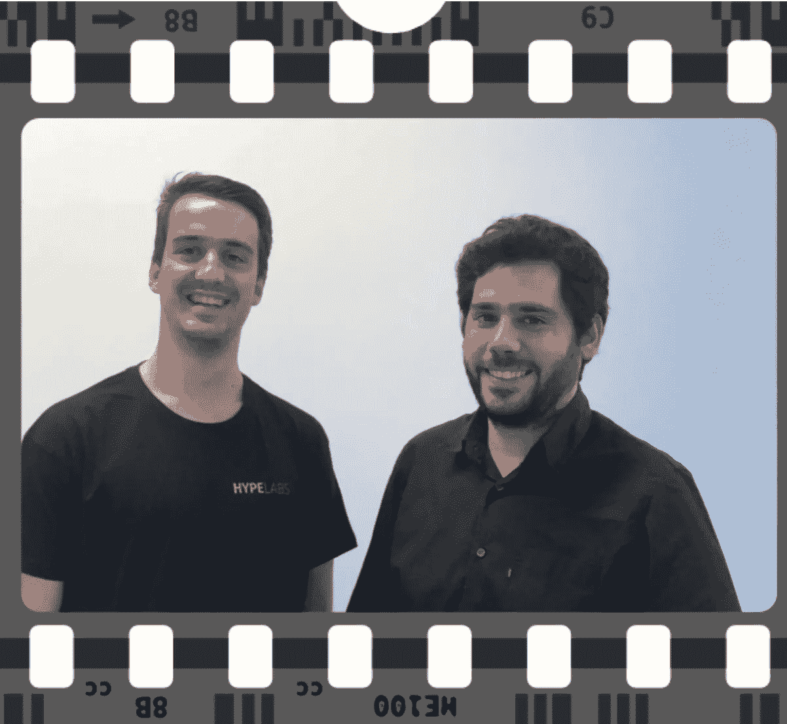
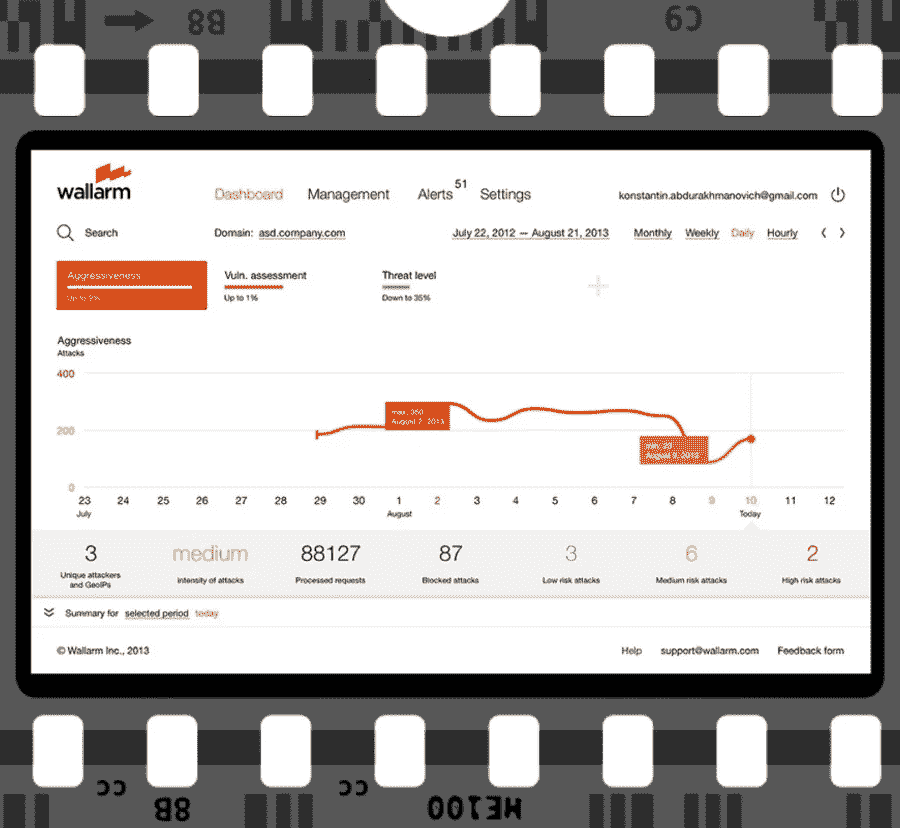

# 认识 10 位正在反思行业的千禧一代企业家

> 原文：<https://medium.com/swlh/meet-10-millennial-entrepreneurs-who-are-rethinking-industries-5f064cd37343>

过去几个月，我第二次环游了世界，这一次“几乎”是为了寻找 30 岁以下创业者创立的最具颠覆性的种子期初创公司。沉迷于天赋，我踏上了穿越 77 个国家的鼓舞人心的旅程。从俄罗斯到加纳到巴西——世界各地无畏、雄心勃勃、富有创业精神的年轻人正在重新思考行业。他们正在利用技术来构建颠覆性解决方案，以应对一些世界上最紧迫的挑战。以下是一些值得一看的风险投资的摄影之旅:

1.  **伊曼纽尔·诺亚**，[联合创始人，笨笨](http://benben.com.gh)(23 岁，加纳)

> “您是否知道，由于无法访问可信和安全的土地记录，全球约有 9.3 万亿美元的被困资本？”伊曼纽尔·诺亚

在纽约参加[联合国解决方案峰会](http://www.solutions-summit.org)时，我主持了一场关于[笨笨](http://benben.com.gh)的区块链动力土地服务的头脑风暴会议。当 Emmanuel 解释他们的创业公司正在解决的需求时，他给我们看了一张加纳一所房子的照片，上面喷着一个巨大的标志“**非卖品**”——他向我们保证这并不奇怪。Emmanuel 在加纳长大，他认识到政府不安全的纸质注册所带来的负面影响，这导致了土地经济中缺乏贷款和信任。

> 在加纳，据估计，由于缺乏可靠的土地记录，被套牢的资本高达 200 亿美元。

Emmanuel 和他的联合创始人 Daniel Bloch 认识到，土地管理流程的变革时机已经成熟，并决定通过引入区块链技术来彻底改革土地注册和交易流程。通过比尔和梅林达盖茨基金会，他获得了一笔研究基金，允许他花 18 个月的时间研究市场，之后他加入了 T2 科技之星的巴克莱加速器。2017 年 3 月，[奔奔](http://benben.com.gh)完成了与[巴克莱](https://www.home.barclays/news/2017/01/gamechangers_benben.html)加纳银行的首次试点，并与另外两家银行签署了试点协议。如今，他们正在与另外三家银行敲定协议。作为 [BenBen](http://benben.com.gh) 的联合创始人，他利用区块链技术为政府、金融机构、房地产经纪人和普通大众提供即时获取房地产信息的途径。Emmanuel 设法通过了官僚程序，目前正在与加纳土地委员会合作，实施一个国家土地登记和财产交易平台。

[笨笨](http://benben.com.gh)的团队才能在[凯罗斯社会全球峰会](http://www.businessinsider.com/kairos-meeting-2017-2017-4?IR=T)上没有得到认可，在那次峰会上[福布斯杂志认定为 30 Under 30 fellow](https://medium.com/u/abf8978b3dc3#5ffb371d4f78) ，2017 年 4 月，该团队被[福布斯 30 under 30 fellow](https://medium.com/u/9eebf8a47f8a#34fcc9d45019) ，AEF 评选的年度法国博士企业家，以及全球创新挑战的获奖者。

9.**卡洛斯·雷·桑托斯，** **安德烈·弗朗西斯科**，Hype Labs 联合创始人(25 岁，葡萄牙)

> “您知道目前有 50 亿台(断开)连接的设备吗？”卡洛斯·雷·桑托斯

Founders HypeLabs; Carlos Lei Santos & Andre Francisco

卡洛斯和安德烈童年的大部分时间都在玩科技。Andre 对计算机科学非常着迷，并在 11 岁时成为了一名自学成才的开发人员。卡洛斯 14 岁开始从事技术工作，16 岁开始管理一个为 IBM 工作的团队。从那以后，他们获得了在该国一些顶级研究实验室工作的经验。

在巴西留学一个学期期间，卡洛斯和安德烈发现由于缺乏 wifi，很难在校园内联系到任何人，所以他们决定开发一款聊天应用程序，允许人们发送短信和“一键通”消息，即使在离线时使用点对点网状网络。他们没想到这款应用会在校园里如此受欢迎。直到他们参加了一个技术会议，在那里互联网中断了，他们才明白其他应用程序需要使用这种技术——这就是 HypeLabs 诞生的时候。

HypeLabs 是一个 SDK 平台，允许任何设备甚至在没有互联网的情况下进行通信。今天，有超过 300 家公司在一个封闭的测试项目中使用 Hypelabs。他们的客户组合中有十多家财富 500 强企业在使用他们的服务。

从消息应用到车辆，文件共享工具到无人机，他们的技术已经被用于各种各样的用例中。创始人的愿景是在未来连接一切:安全，可互操作，甚至离线。

Carlos 和 Andre 是 [AngelPad](https://medium.com/u/68ff4b30847b?source=post_page-----5f064cd37343--------------------------------) 加速器的成员，并被《营销周刊》提名为 2016 年 100 家最具颠覆性的公司之一。迄今为止，他们已经筹集了 150 万美元，并在葡萄牙的波尔图和旧金山都设有办事处。

10.**伊万·诺维科夫**，创始人[沃勒姆](https://wallarm.com/)，(28 岁，美国)

> “您知道吗，互联网上的每一个站点都一直受到机器人的攻击，这些机器人会扫描整个互联网，寻找易受攻击的机器。任何人都可以被黑。”
> 
> 伊万·诺维科夫

您知道吗，76%的企业正在转向敏捷开发技术以提高运行速度——但是安全性几乎总是成为速度的牺牲。每年都有成千上万的公司成为黑客的牺牲品。许多人会记得 2016 年发生的雅虎或 LinkedIn 黑客事件。仅 LinkedIn 就泄露了 1.17 亿个电子邮件账户和密码。

Ivan Novikov 和他的团队对这个问题很熟悉——在启动 Wallarm 之前，他们已经为顶级互联网公司进行了超过 250 次安全审计。

Wallarm 不仅可以阻止攻击，还可以使用集成的漏洞扫描器持续监控应用程序的严重缺陷。对于检测到的每个问题，它都提供了漏洞的描述以及如何修复漏洞的说明，这对于任何开发人员来说都很容易理解。

[Wallarm](https://wallarm.com/) 是一家由 [Y Combinator](https://medium.com/u/cb8adc841a29?source=post_page-----5f064cd37343--------------------------------) 支持的下一代网络安全初创公司。今天，他们有 100 多家支付企业和 SaaS 公司。他们的客户组合令人印象深刻，包括一家在纳斯达克上市的支付系统、一家拥有 1.4 亿玩家的游戏公司，以及一家搜索引擎公司。他们被评为前 25 名 Y-combinator 创业公司是有原因的。2016 年夏天，他们在 Y- Combinator 成功实现了 100%的收入增长，随后筹集了 230 万美元。

> 当某件事足够重要时，即使机会对你不利，你也要去做
> 
> —埃隆·马斯克

成功取决于许多因素，但你在创业之旅中遇到的不可思议的导师会极大地放大成功。如果你真的相信你能帮助这些创业公司，[请联系](https://www.linkedin.com/in/karolinastawinska/)。如果他们对这个机会感兴趣，我会很乐意介绍给他们。