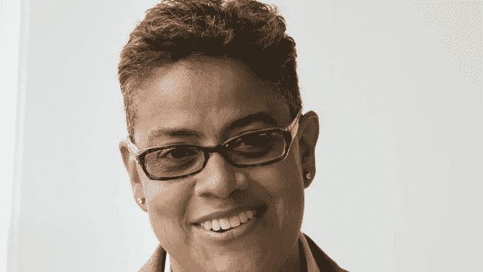

# 梅丽莎·布拉德利——颠覆风险资本主义文化

> 原文：<https://medium.com/swlh/melissa-bradley-disrupting-the-culture-of-venture-capitalism-a37e6702b20c>

Melissa Bradley, Managing Director, 1863 Ventures

在与梅丽莎·布拉德利相处了几分钟后，很明显，她亲自动手管理 [**1863 风险投资**](https://1863ventures.net/) 的学术方法不费吹灰之力。不到三年前，她在华盛顿特区启动了 Project500，目的是帮助 500 名代表性不足的创始人扩大他们的业务。她很快超越了自己的目标，重塑并扩大了公司形象，使其不那么像一家传统的风险投资公司，而更像一所大学。

毫无疑问，像任何其他投资者一样，布拉德利关注的是底线——表现良好、高质量、具有高增长潜力的企业。毕竟，这就是风险资本主义的意义所在。然而，她与典型投资者的不同之处在于，她真心希望对未被充分代表的企业的发展轨迹产生影响，而且她有能力超越个人利益，帮助扩大不在自己投资组合内的企业。

作为一名兼职大学教授，布拉德利对教学和指导的热情在向 1863 届学生提供的课程中显而易见。基于学术的研究促使她决定每年投资近 50 万美元，为她项目中的企业家提供法律、税务和会计服务。理解初创企业股权的差异仅仅是重写 color 创始人故事的开始。布拉德利将她的主张推进了一步，她建议风险投资界，有色人种企业家比白人创业者需要多 25 万美元来创业，并通过 1863 年的培训、指导、辅导和资金来填补财政缺口。

Left to right: **Kitiya King**, Founder, [Mischo Beauty](http://www.mischobeauty.com); **Shani Blount**, Founder, [CurlMatch](http://www.curlmatch.com); **Melissa Bradley**, Founder & Managing Director, [1863 Ventures](https://1863ventures.net/); **Sheena Franklin**, Founder, [Well-kept Beauty](http://www.wellkeptbeauty.com)

布拉德利不仅教授和指导新兴创始人，她还把自己打造成教授，面向其他投资者，这些投资者有兴趣将风险资本主义的文化从主要迎合白人男性转变为更加多样化和包容、真正反映创业世界的文化。作为 1 亿美元新声音基金董事会的顾问和未来莫西银行董事长，布拉德利的社会影响风险投资组合和她的金融投资组合一样强大。她专注于以尽可能多的方式帮助尽可能多的创业者。

一位这样的创始人是艾普丽尔·约翰逊，他是*的首席执行官。她将自己发展和扩大业务的能力归功于“市场营销、销售战略、财务建模和整体业务发展领域的巨大资源和支持(自 1863 年以来)”其他人吹捧布拉德利持续的个人参与创业社区和她的包容性承诺，尽管她的公司在增长，地位持续上升。在风险投资界以保密性和排他性为荣的地方，布拉德利仍然是透明度和包容性的标准。*

*最大限度地减少风险资本的束缚和障碍并不容易，但事实是，大多数创始人更需要客户，而不是风险资本。作为一名投资者和教授，布拉德利正在将风险投资的话题从关注金钱转移到**知识、**，并帮助代表性不足的创始人认识到信息、资源和支持的价值。*

## *“我想做代理人。不是榜样。”~梅丽莎·布拉德利*

*加入我们的**2018**[***+Tech*创客工作室**](https://www.andtech.co/events/tech-makers-studio) ，与 [202Creates](http://www.202creates.com) 合作[全球创业周](https://innovate2018c.sched.com/)。2018 年 11 月 15 日星期四|下午 4 点至 8 点| DC 华盛顿州 I 街东南 200 号，邮编 20003*

***Ayanna Smith** 是[**WC Media**](http://www.andtech.co)的联合创始人，这是一家新成立的数字媒体公司，关注新兴的女性创始人和创客。我们的使命是利用数字内容、节目和活动的力量，为女性领导的企业带来急需的曝光率。*

*她还是“AskMe Tees”的创始人，这是一个 t 恤品牌，旨在鼓励就有意义的话题进行面对面的交谈。最近，#AskMe Tees 被选为 Stanley Black&Decker 2018 多元化和包容性大会的官方“对话启动者”。*

**

## *这篇文章发表在 [The Startup](https://medium.com/swlh) 上，这是 Medium 最大的创业刊物，拥有+ 379，938 名读者。*

## *在这里订阅接收[我们的头条新闻](http://growthsupply.com/the-startup-newsletter/)。*

**