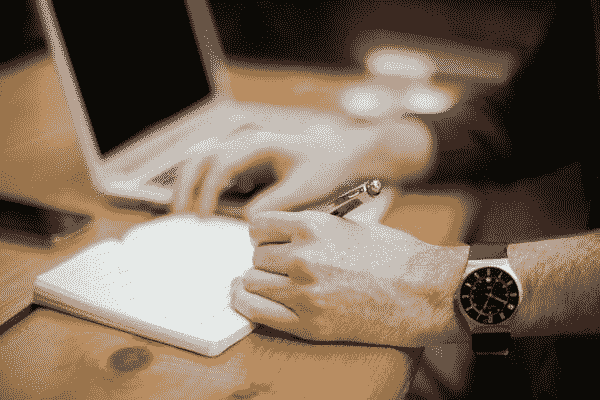
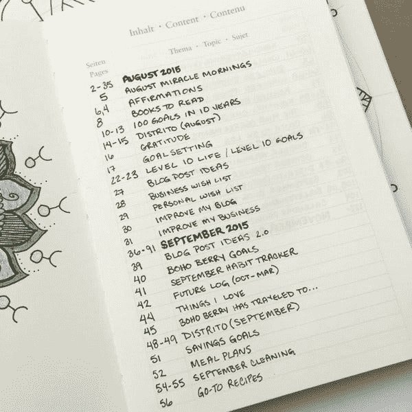
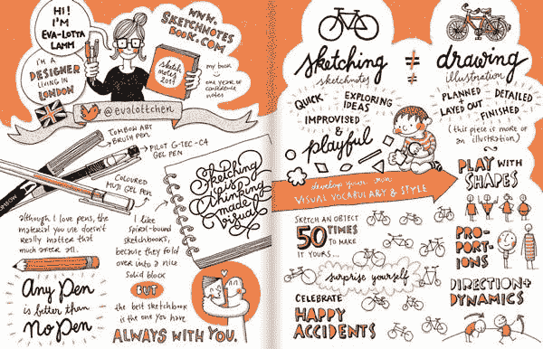

# 为忙碌的人准备的记忆技巧(就像你一样！)

> 原文：<https://medium.com/swlh/memory-hacks-for-busy-people-just-like-you-c7b10ba81688>

## 因为谁还有时间去记东西呢？

Look at all those numbers and graphs! You must be busy.

你是个大忙人。

**喘息！你怎么知道的？**

你隐藏得很好。但是你看，我也是一个。

事实上，我敢打赌，如果你现在正在读这篇文章，你很可能是在忙碌俱乐部(或者是一个邪教[？](http://scottberkun.com/2010/the-cult-of-busy/))。

现在，我不是在这里谈论太忙的问题(如压力，倦怠，工作生活平衡差，甚至身体疾病)。不。今天，我是来帮忙的，不是来评判的。

所有的事情都向你走来，当你在一天结束的时候回头看，并想出任何有意义的事情时，你会感到不知所措。你忙是因为你聪明。但不幸的是，太多人同时依赖你和你的大脑。我们的记忆变得不堪重负，一度如此自然流动的想法变得枯竭。

所以今天，我想谈谈一个你可能忽略的简单的记忆技巧，它可以在你忙碌的生活中帮助你。

[有效的笔记。](http://blog.rescuetime.com/notes/)

# 为什么你不记得你做的笔记

你曾经强调过书或者你自己的笔记吗？你强调重点了吗？你有时会重读笔记来恢复记忆吗？

坏消息是:这些技术都是无用的。

事实上，强调是一种非常糟糕的学习技巧，它甚至会损害你的回忆能力，因为它会强调特定的笔记，并使它们脱离原始的上下文，这使你更难在头脑中形成联系，从而更难记住材料。

研究发现[最有效的笔记技术](http://theconversation.com/whats-the-best-most-effective-way-to-take-notes-41961)是*主动*，而重读、突出显示和下划线是*被动*技术。

如果我们想要记住，我们需要与我们的笔记和我们试图学习的材料进行大量的互动。

# 那么，到底是什么在起作用呢？

充分利用您的会议、研究或规划会议。你可以做几件事。

# 第一步:扔掉笔记本电脑，手写笔记

首先，永远不要用笔记本电脑记笔记。

一系列研究将笔记本笔记者和手写笔记的学生进行对比，发现笔记本方法在信息回忆方面最差。

在第一项研究中，学生们观看了一个讲座或 TED 演讲的视频，然后完成了 30 分钟的艰难认知任务，然后对视频中的材料进行了测验。

在回忆信息以通过测验方面，手写笔记的学生比笔记本笔记的学生表现更好。当研究人员检查学生的笔记时，他们找到了原因的线索:

> 在笔记本电脑上做笔记的人包括大量逐字记录，而那些手写笔记的人跟不上，必须积极参与材料并提取最相关的部分。

在第二项研究中，研究人员特别要求笔记本电脑记录员*而不是*逐字记录笔记。

在这个实验中，不仅手写笔记的人仍然在测验中表现最好，笔记本笔记的人*仍然*逐字记录视频。**明确警告不要这么做根本没用。**

换句话说，工具很重要。在笔记本电脑上使用被动笔记技术太容易了，即使你知道这会扼杀你以后的回忆能力。

如果手写笔记看起来太慢，学习速记可以加快速度。虽然旧的速记技术是基于数小时学习对应于各种声音和单词的曲线，但最近的速记方法更接近于现有的英语字母表，但仍然使写下来更快。

# 第二步:用项目日志来组织你的笔记

如果你以后找不到笔记，记笔记没有多大意义(这是我们手写方法的主要缺点)。

因此，为了保持您的手写笔记有条理，请使用符号键按页码和主题对它们进行索引，以便对想法、笔记、任务和其他信息进行分类，从而快速清晰地访问。

幸运的是，没有必要自己解决这个问题。

[Bullet Journal](http://bulletjournal.com/) 系统设计用于任何笔记本，并为您提供一种将所有笔记组织在一个地方的方法。

查看 [Bullet Journal 网站](http://bulletjournal.com/)了解更多细节，但基本的组织部分是这样工作的:

1.  在你的笔记本前面留出几页作为你的索引，并在其后的每一页标上号码(或者买一个标有页码的笔记本)。
2.  翻到下一页，加上与你所写内容相匹配的标题。它可以是会议名称和日期，你要会见的人的名字，或者你要记笔记的书。
3.  回到你的索引，记下你笔记的标题和页码，这样你以后就可以再次找到它们。

Bullet Journal 系统使用一组符号来标记笔记、事件和任务。如果需要，您也可以添加您自己的来涵盖不同的类别。例如，您可以添加一个图标来表示您需要与同事一起跟进的想法或事情。

该系统还包括一些简单的设置来跟踪一个月内的约会或重大事件，以及每天的待办事项列表。如果你喜欢把所有的东西都放在一个笔记本里，子弹日记系统及其方便的索引可以帮助你记录笔记，并在以后方便地找到它们，即使它们在任务和日程计划之间。

# 第三步:画出你的笔记(如果你更喜欢视觉思考)

这个听起来可能有点傻，但是研究表明如果你画了什么东西，你以后更有可能记住它。

一系列研究测试了画画和写字以及其他记忆单词的方法，发现画画是最好的。

在第一项研究中，参与者被给予一系列容易画出的单词(例如，“苹果”)，并被要求画出或写下这个单词。为了确保参与者花同样多的时间写作或绘画，他们每个单词有 40 秒的时间，并被要求填满整个时间段。所以他们可以一遍又一遍地写或画这个项目，或者只做一次，其余的时间用来添加华丽的装饰和细节。

当参与者后来被测试他们记住了多少单词时，**绘画帮助他们记住了两倍于书写的。**

画笔记并不是什么新鲜事。其实它有个名字:sketchnotes。

设计师 [Mike Rohde 用他的书*sketch note 手册*和*sketch note 工作簿*普及了“sketch notes”](http://rohdesign.com/sketchnotes/)。罗德使用 sketchnotes 这个术语来描述他在笔记中绘制形状和图片的方式，以帮助他更好地理解会议演讲的主要观点，而不是试图记下每个小点。

罗德提倡使用符号和形状，如盒子和箭头，不同大小的文字和涂鸦来说明笔记。他说，使用 sketchnotes 并不需要成为一名出色的艺术家。你只需要练习使用简单的形状和图像来阐述你的观点。

所以你有它。忙碌的日子里最简单的记忆方法。

说真的，为什么要花这么多时间开会和思考复杂的问题，而忽略了你为之奋斗的洞察力呢？做笔记似乎是一件愚蠢的事情，我们天生都知道如何去做，但是通过一些小的调整，你可以确保你从这些思考会议中获得最大的收益。

这篇文章的灵感来自我的朋友 Belle Beth Cooper 写的一篇关于 [*的文章。查看更多关于如何保护你的时间、更有效率和建立平衡生活的建议。*](http://blog.rescuetime.com/notes/)

## 这篇文章发表在《创业》杂志上，有 258，400 多人聚集在一起阅读 Medium 关于创业的主要报道。

## 点击这里订阅接收我们的头条新闻[。](http://growthsupply.com/the-startup-newsletter/)

