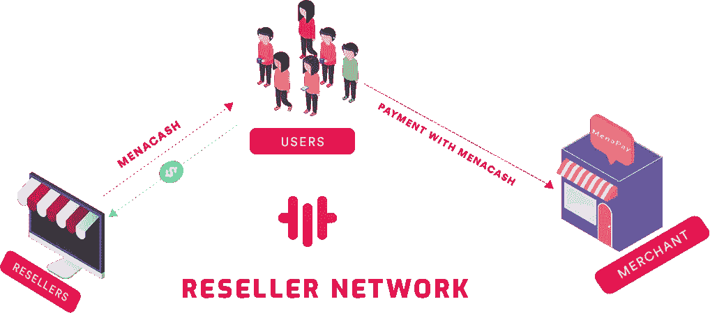

# MenaPay 为中东带来新的商业模式

> 原文：<https://medium.com/swlh/menapay-brings-new-model-to-middle-east-3e0a11aff91f>

MenaPay 开发了一种新的商业模式，适用于所有当地商店和企业，这将为其运营业务提供额外收入。商家将能够使用 MenaPay 应用程序来接收客户的付款，并可以申请成为我们经销商网络的一部分。经销商网络允许这些商店向当地社区销售 MENA cash(MENA pay 的数字货币，完全由美元支持)。

换句话说，该应用可用于任何需要货币交易的地方，如餐馆、商场、电子商务、加油站、日常使用 MenaPay 平台的自动售货机。经销商还可以选择通过使用客户的信用卡或电汇来决定他们销售的佣金率。通过使用 MenaPay 仪表板，他们能够跟踪他们的销售记录，创建报告来分析购买行为，并更新客户群的价格。这是专为梅纳卡什销售。

New Business Model For MENA Region

根据 MenaPay 对于用户来说，在这个数字时代，像普通的现金交易或购物一样轻松地接触 MenaCash 是至关重要的。网吧、交易台、珠宝店、市场也可以使用经销商应用程序。此外，被接受的企业将能够增加高达 30%的收入，作为其现有业务模式的收入渠道，并扩大其客户组合。特别是在中东，研究人员已经证明，超过 80%的人口没有使用数字支付方式，或者换句话说；传统的银行系统。最大的原因是传统的银行系统不符合伊斯兰金融，而 MenaPay 为这些人提供了一种符合伊斯兰金融的透明支付方式，即 T2 支付方式。该应用程序由区块链技术支持，为 MenaChain 创造了更高的安全性和透明度，并且还可以在没有任何第三方的情况下进行对等交易；如银行或信用卡。此外，该平台本身是分散的，这意味着 MenaPay 治理只处理 MenaCash 到法定货币的转换。

MenaPay 通过解决全球*的金融问题，为中东和北非地区带来了一种全新的革命性商业模式。*这将是经销商现有业务之上的线下商店的全新收入渠道*。*对于用户来说，通过普通现金尽可能容易地将钱转移到数字媒体并在这个主要使用现金的地区开始数字化转型也至关重要。

总之，MenaPay 将为中东和北非地区带来革命性的商业模式，并在中期内影响用于最小化的现金，以及为线下和在线商店创造新的收入方法。

## 这篇文章发表在 [The Startup](https://medium.com/swlh) 上，这是 Medium 最大的创业刊物，有+400，914 人关注。

## 订阅接收[我们的头条](http://growthsupply.com/the-startup-newsletter/)。

