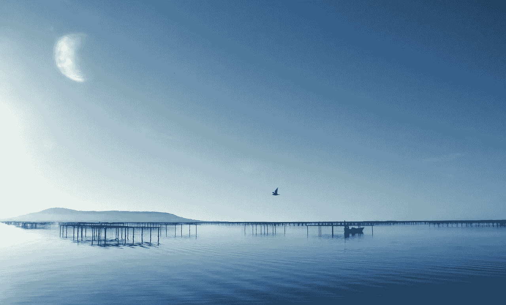

# 精神清晰度实验

> 原文：<https://medium.com/swlh/mental-clarity-experiment-a168bfb8f810>

[jean-louis84/pixabay](https://pixabay.com/en/body-of-water-sky-nature-outdoor-3190623/)

在咖啡因和强烈情绪的刺激下连续工作了几周之后，昨天我决定休息一下。我的连续工作不仅包括我的日常工作、[博客](https://ideavisionaction.com/)和 [Steemit 账户](https://steemit.com/@bbilgin)，还包括一周六天的有氧运动或举重训练。

昨天，我所要做的就是不喝任何咖啡，让我的大脑和身体停止运转。下午我不得不睡了很长时间。当我醒来的时候，我的思维非常清晰。我花时间在外面的好天气里闲逛。

我很放松。我知道我必须解决生活中的一些问题，但我并没有为此感到压力。任何人的一生都有一些问题需要解决。我可以在外面玩得很开心。当我回来时，我可以毫无压力地工作。

> ***任何人生都有一些问题需要解决。***

我昨天的经历激励我在生活中更多地培养同样的精神状态。这种精神状态可以被最好地描述为精神清晰，或者没有任何强烈的情绪或恼人的想法。

**思维清晰的好处**

当我头脑清晰时，我能看到我生活的全貌。我能够全面地思考问题，而不会沉迷于特定的问题。我感觉很好。这种良好的感觉不会影响我的表现。我内心平静，我感到快乐。

我感激我的生活。我明白我是多么幸运，我一直都是。当我压力大的时候，那些让我头脑忙碌的事情不会太困扰我，当我头脑清晰的时候。这并不意味着我对他们什么都不做。我只是客观地看待它们。

这种精神状态在戴尔·卡耐基的《如何停止担忧，开始生活》一书中解释得很好。我强烈推荐。

**强烈情绪的影响**

在某种程度上，忧虑、恐惧和压力刺激我的思维在更高的水平上表现。如果这些情绪的强度或持续时间超过最佳阈值，这些情绪就会停止产生效果。

此外，由担忧、恐惧、压力和咖啡因引发的工作对身心都有损害。过了一会儿，我的思想和身体都耗尽了。

最重要的是，担忧、恐惧、压力和咖啡因会造成一种强迫性的精神状态。我变得专注于眼前的事物。这是一个积极的影响。它的负面影响是我错过了大局。

> ***大局与眼前的任务或问题一样重要，甚至更重要。***

**30 天心智清晰度实验**

在我昨天的经历之后，我决定做一个 30 天的头脑清晰实验。我不会用担心、恐惧、愤怒、压力和咖啡因来刺激我的工作，我会有意识地努力激励自己专注于工作。

此外，我会放下生活中更多的杂念。幸运的是，我刚刚完成了一个为期 30 天的关于[放下分心](https://ideavisionaction.com/personal-development/my-30-days-reduced-internet-usage-experiment/)的实验。精神清晰实验将在此基础上很好地建立起来。

这里有几本书我想提一下和这个实验有关。如果你想做一个类似的实验并深入主题，我建议你阅读它们。

*   戴尔·卡内基的《如何停止担忧，开始生活》
*   迈克尔·a·辛格《不受束缚的心灵》
*   迈克尔·a·辛格的投降实验
*   放手:大卫·r·霍金斯的投降之路

《投降实验》尤其有趣，因为它记录了作者是如何从一名瑜伽学者起步，最终成为一名成功商人的。

正如我在减少互联网使用实验中所做的那样，我将在开始前起草一份计划，并在 30 天后报告我的结果。

**睡眠**

通常，我的目标是每天睡八个小时，但我几乎从来没有做到过。接下来的 30 天，我会以 7 个小时为目标，但是要更加注意。

我会通过减少白天咖啡因的摄入量来改善睡眠。如果我觉得有必要，我会在空闲的时候小睡一会儿。

**咖啡因**

我不嗑药。我也不经常喝酒。但是咖啡因是我唯一的毒品。我计划在工作日只喝一杯淡咖啡，因为我非常喜欢。如果这似乎干扰了这个实验，我可能也会放弃。

**强烈的情绪**

恐惧、愤怒和担忧的情绪会干扰思维的清晰。当他们出现时，我选择不在他们身上投入任何精神能量。我也选择不转移注意力来避开他们。我选择和他们在一起，直到他们平息。以我的经验，他们来来去去，如果我不注意他们的话。

《放手》这本书是处理强烈情绪的绝佳资源。归结起来就是既不压制它们，也不用分心去逃避它们，更不用对它们采取行动。陪着他们，直到他们平息。

**分心**

这是我最喜欢的逃生机制。我不看电视。我也不会在工作或开车时一直开着收音机。不过，我会听一些流行音乐，在 YouTube 上看一些喜剧片段。

我很高兴我已经把我的分心减少到目前的水平，但是现在，是时候进一步减少它了。所以，我决定放弃喜剧片段和流行音乐。我会坚持古典音乐。我会享受寂静或者听一本好的有声读物，而不是看喜剧片段。

我没有很多人让我分心，所以，这对我来说不是问题。如果你有这个问题，你可能也想解决它。

**空间**

我说的空间是指给自己一些自由时间。我喜欢从一项活动跳到另一项活动，中间没有休息时间。我一个人吃饭的话，一般会查手机看点东西或者看个片段。当我在健身房训练时，我会在间隙听有声读物或播客。

这种类型的忙碌肯定会干扰思维的清晰。在接下来的 30 天里，我要给自己更多的空间。我要享受一些食物，不要用其他任何事情来分散自己的注意力。在空闲的日子里，我会在活动间隙休息，在那段时间里什么也不做。

**多余的卡路里**

我意识到摄入过多的卡路里也会影响思维的清晰。几天前，出于饮食原因，我决定减少热量摄入。这个决定对我的思维清晰也有一些好处。

我称每天早上吃的燕麦片。我会从早餐中减去 50 克，这样每天大约有 186 卡路里。这听起来不多，但对我来说是一个可持续的量。我计划长期保持这个卡路里水平，而不仅仅是几周的速成节食。

**杂乱**

正如我在一篇关于[增强思维能力](https://ideavisionaction.com/personal-development/how-to-boost-your-mind-power/)的帖子中提到的，不必要的东西也会干扰思维的清晰。我注意定期清理家里不必要的东西。所以，我的情况不会有太大变化。我只是想为你提一下，万一这对你来说是个问题。

我应该更加注意的一件事是保持物品整洁。

**意识中的杂乱**

就像普通人的头脑一样，我的头脑也充满了不必要的、不相关的、无用的想法。我选择放过他们，不去理会他们。我不会在这一刻养成冥想的习惯，但我会留意头脑中的混乱。

**好有个计划**

事实上，我很高兴我写了这个计划。这个计划让我觉得这个实验会比我想象的要容易得多。我唯一需要额外注意的问题是咖啡因和分心。

我还必须承认，做第一个减少互联网使用的实验让这个实验变得容易多了。

如果你过度使用互联网，我建议你先在一个 30 天的实验中解决这个问题，然后继续一个头脑清晰的实验。这里有三个帖子可能会帮到你。

**结论**

在昨天的帖子中，我讨论了高绩效的[情绪状态。精神清明就是其中的一种状态。经过昨天一天的恢复，我受到启发，提高了我的思维清晰度。我觉得这样不仅能提高我的表现，还能提高我的整体生活质量。](https://ideavisionaction.com/personal-development/optimal-emotional-state-for-maximum-performance/)

如果你觉得你可以从一些清晰的思维中受益，加入我的实验，让我知道它对你有什么效果。30 天后我一定会在我的报告里让你知道。

*阅读下一篇:* [放手需要多久？](https://ideavisionaction.com/personal-development/how-long-does-it-take-to-let-go/)或者报名参加[每周简讯](https://ideavisionaction.com/email-newsletter/)。

## 这篇文章发表在 [The Startup](https://medium.com/swlh) 上，这是 Medium 最大的创业刊物，有 303，461+人关注。

## 在此订阅接收[我们的头条新闻](http://growthsupply.com/the-startup-newsletter/)。

