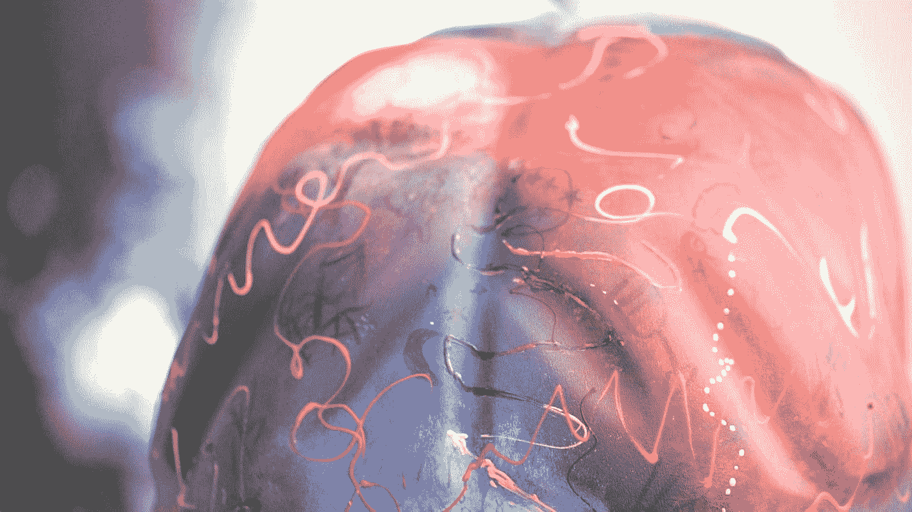
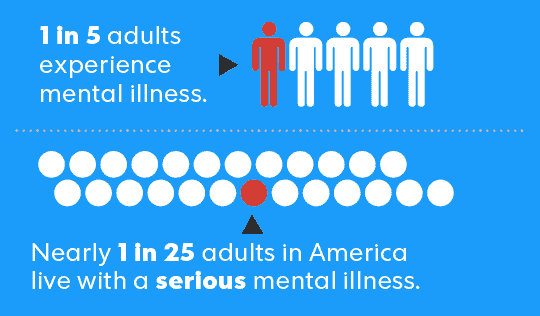
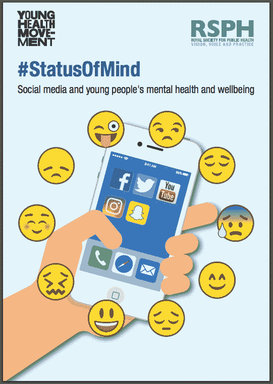
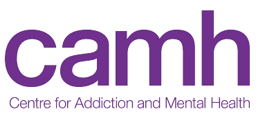

# 心理健康是有时刻的，是时候关注了

> 原文：<https://medium.com/swlh/mental-health-is-having-a-moment-and-its-time-to-pay-attention-7ca929ece891>

Source: Kanika Gupta

我相信我们会把历史上的这一时期视为我们改变与心理健康关系的时刻。一切都在变化，我们即将跨越的临界点将把精神健康问题从一种我们视而不见的模糊疾病变成日常生活的一部分，影响我们社会的每一个成员。

去年，我加入了 CAMH 成瘾和心理健康中心的基金会董事会，我想和你们分享更多关于为什么我被激励投入更多的时间和精力在我坚信将是我们在未来几十年面临的最大问题上。

[点击这里阅读一个勇敢的夜晚](https://www.linkedin.com/pulse/one-brave-night-kunal-gupta/)，我正在参加一个提高心理健康意识的活动。

# 为什么是现在

在过去的 30-40 年里，我们的社会在研究、科学和医学方面的进步减少了过早死亡，提高了身体疾病患者的生活质量，并增加了我们对什么对我们的身体有益(或有害)的普遍认识和理解。大多数身体健康问题的诊断、预防和治疗方面的进展，已经显著地展示了我们人类解决问题的智慧和热情。

在未来 20 年，我们的人口将面临的最大健康问题将不是身体上的，而是精神上的。如果你有孩子或计划要孩子，这将是他们一生中面临的最大健康问题。如果你有像我一样的婴儿潮一代的父母，他们的心理健康和身体健康问题将会彼此相当。

我们都直接或间接地受到心理健康问题的影响。无论是亲身经历、家庭成员、朋友还是同事，你认识的人现在正在处理心理健康问题(无论他们是否意识到)。这是心理健康的责任从研究人员和临床医生转移到所有社会成员的时刻。

# 这个问题是真实的

我们所说的心理健康是指什么？一些例子包括抑郁症、焦虑症、精神分裂症和药物滥用。问题从轻微到严重各不相同。与蛀牙、骨折甚至癌细胞不同，诊断精神健康问题还不那么容易。虽然基于现有的定义和数据，我们开始得到一个图片。

在任何一年，每五个加拿大人中就有一个经历过心理健康或成瘾问题。想想你关心的 5 个人。他们中的一个可能正在处理心理健康问题。

Source: National Institute of Mental Health

每年有近 4000 名加拿大人死于自杀——平均每天有近 11 人自杀。在事故之后，自杀是 15 至 34 岁人群的第二大死因。根据这一趋势，自杀可能很快成为年轻人的首要死因。

根据全国药物使用和健康调查，仅在 2015 年，就有 980 万 18 岁或以上的成年人在过去 12 个月中认真考虑过试图自杀，其中包括 270 万人制定了自杀计划，140 万人进行了非致命的自杀尝试。这些数字代表了 2015 年有严重自杀想法的成年人的 4.0%，制定自杀计划的 1.1%，以及去年试图自杀的 0.6%。

耻辱感仍然阻碍着我们。39%的安大略省员工表示，如果他们有心理健康问题，他们不会告诉他们的经理。加拿大精神疾病的经济负担估计为每年 510 亿美元。

这些数据点大部分来自 CAMH，尽管许多是加拿大特有的，但我们可以假设大多数发达国家也是如此。

# 几种力量相互碰撞

对于我们这些不直接在医疗系统中的人来说，心理健康问题的增加似乎是无处不在的。我认为有几种力量相互碰撞，导致心理健康现在有了一个时刻。

首先，耻辱感正在慢慢消失，我们开始意识到这一点。这要归功于公共和私营部门领导的运动，倡导分享他们的个人生活经验，雇主开始认识到他们的作用，技术帮助我们更容易地分享。

其次，随着财富和收入的增加，我们会买更大的房子、更贵的车和更好的衣服。对经济增长(增长率高于人口增长率)的痴迷意味着我们都在购买更多的东西(平均而言)，通常是用我们并不拥有的钱。有了更多的东西，我们会变得依恋它或者害怕失去它。

此外，我们这些失业者正感受到从房租到食品杂货等各种价格上涨的压力。我们这些未充分就业的人对不满意的职业和未满足的欲望感到压力。我们这些还没有工作的人不确定是否会有工作。

除了个人经济因素之外，我们对生活的期望和欲望似乎已经失去了根基。我们对自己和周围的人有更高的期望。这些期望会导致更大的失望，而我们可能没有能力处理。

# 技术:朋友还是敌人

作为一名过去十年的技术企业家，我第一次质疑我们在社会中采用技术的方式是否会导致我们面临的精神健康问题的加速增长。

如果使用得当，技术可以促进更好地获取信息，更好地与社区联系，并成为表达情感和创造力的平台。如果被滥用，技术很快成为主人，而我们成为奴隶，不知道谁在控制。

过去十年中社交媒体采用的增加与心理健康问题的增长模式一致，尤其是在年轻人中，这不是巧合。事实上，英国[皇家公共健康学会](https://www.rsph.org.uk/about-us/news/instagram-ranked-worst-for-young-people-s-mental-health.html)去年发布的一项[研究发现，Instagram，其次是 Snapchat 和脸书，是青少年心理健康最差的社交平台，受访者称在使用这些平台时，抑郁、焦虑、孤立、孤独、FOMO 和不足的感觉会增加。](https://www.rsph.org.uk/uploads/assets/uploaded/62be270a-a55f-4719-ad668c2ec7a74c2a.pdf)

吸烟在 70 年代非常酷，在广告、电视节目和流行文化中占据重要位置，然后在 90 年代，一旦我们意识到吸烟与健康之间的联系，一切都变了。正如吸烟对于我们的身体健康一样，我相信社交媒体对于我们的精神健康也同样重要。一旦我们意识到这一点，我们可能会选择夺回控制权。

# 介绍 CAMH

[CAMH](http://www.camh.ca) (成瘾和心理健康中心)是加拿大最大的心理健康组织，自从过去几个月参与进来，我认为该组织有三个相互支持的不同使命。

在当地，在大多伦多地区和安大略省西南部地区，CAMH 是一所专门为精神健康患者服务的医院(有 500 张床位)。专注对任何事情都是至关重要的，通过拥有大量有类似问题的患者，医院可以吸引优秀的人才。

在全国范围内，CAMH 是一个倡导伙伴，为从业人员提供教育和培训，并向政府提供政策建议。例如，在加拿大政府当前的大麻合法化进程中，CAMH 一直是积极的声音。

从全球来看，CAMH 是一个研究机构。它拥有一支由 300 多人组成的专注于精神健康的研究团队，是世界上最大的团队之一。将研究实验室的理论与医院的现实联系起来的愿景加速了一切。

我在 CAMH 的起点是作为基金会董事会的成员，我所遇到的每个人对该组织改变生活的愿景的热情、承诺和奉献继续给我留下深刻印象。

# 下一步

这个时刻正在我们面前发生，我们与心理健康的关系正在变得更好。我们取得的进展令人印象深刻，但主要局限于研究实验室、医院病床和医生办公室。我的愿景是精神健康在教室、餐桌和工作场所受到尊重。要做到这一点，我们中的许多人都有责任帮助建立一个由领导者、变革者和企业家组成的生态系统，他们不仅关注这一领域，而且以支持、协作和有效的方式密切合作。

— -

Kunal Gupta 是 [Polar](http://www.polar.me) 的创始人& CEO，Polar 是一家技术平台提供商，其使命是实现优质内容的商业模式。Polar 的合作伙伴包括全球主要出版商，业务总部位于多伦多，在纽约、伦敦和悉尼设有办事处。

Kunal 热衷于在现代寻找平静和专注。库纳尔是加拿大领先的精神健康医院和研究机构 [CAMH](http://www.camh.ca) 的基金会董事会成员。他定期在他的博客 findfocus.today 上写关于领导力、正念和技术文化的话题。

你可以在 [LinkedIn](https://ca.linkedin.com/in/kunalfrompolar) 上和他联系。

## 这篇文章发表在 [The Startup](https://medium.com/swlh) 上，这是 Medium 最大的创业刊物，有 309，392+人关注。

## 在此订阅接收[我们的头条新闻](http://growthsupply.com/the-startup-newsletter/)。

