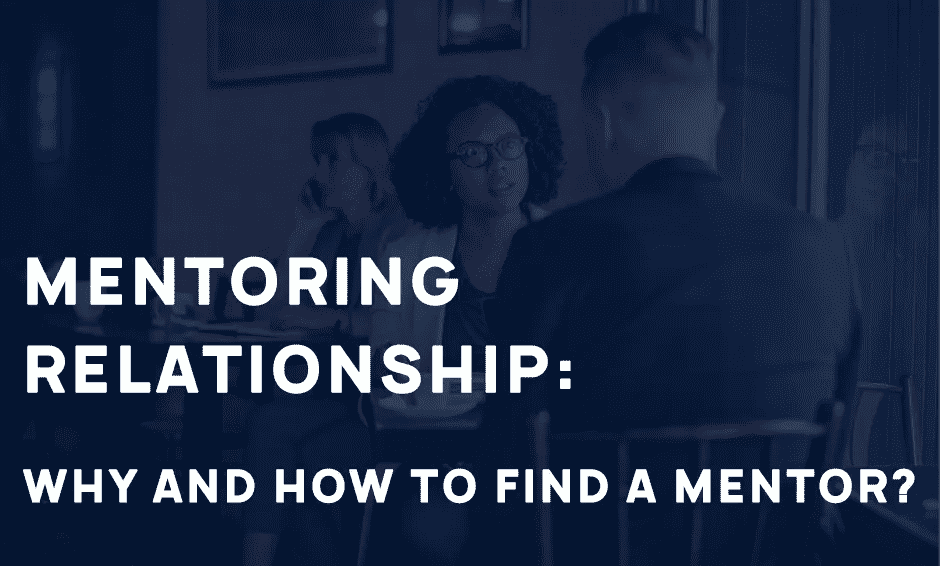
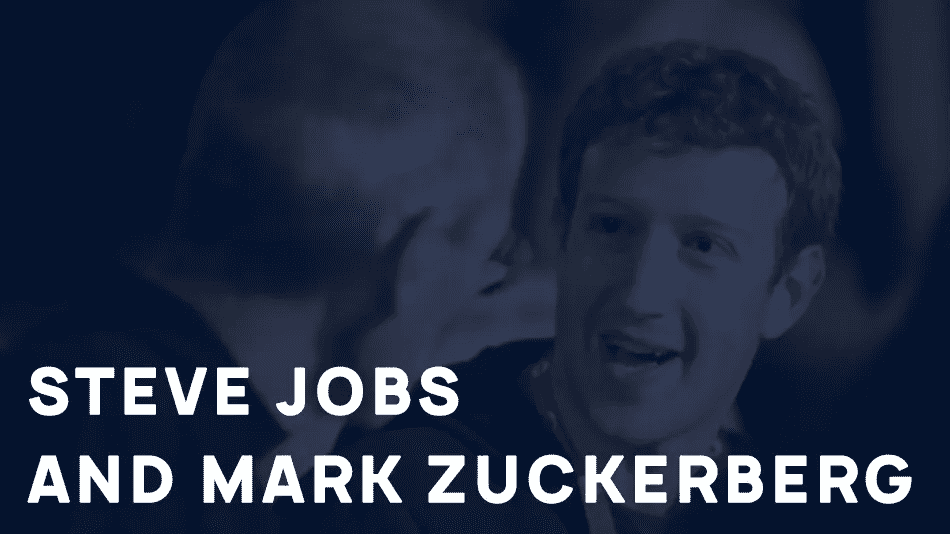
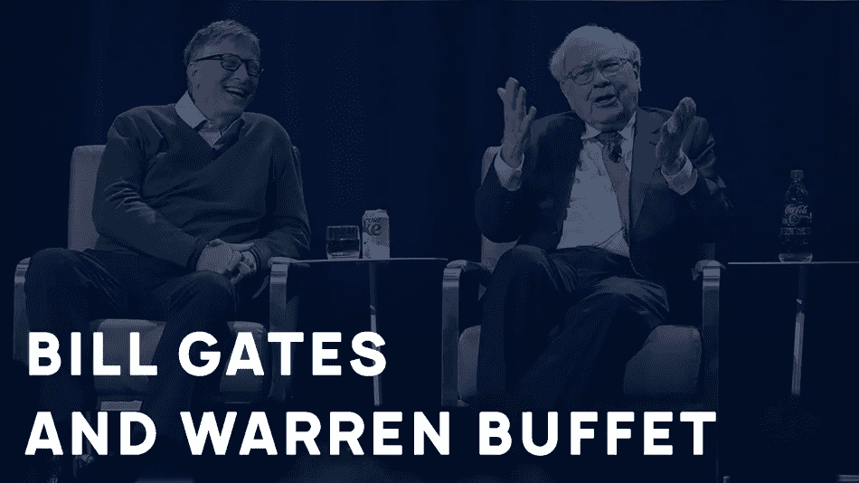

# 指导关系(第一部分):为什么以及如何找到导师？

> 原文：<https://medium.com/swlh/mentoring-relationship-part-1-why-and-how-to-find-a-mentor-46018100aad9>

> 如果我能回到过去，告诉 20 岁的我一件事，那就是“找一个导师”。
> 
> ~乔恩·阿科夫

从比尔·盖茨、沃伦·巴菲特、史蒂夫·乔布斯、埃里克·施米特、塞特亚·纳德拉和杰夫·贝索斯到马克·扎克伯格等等成功人士都把他们的成功很大一部分归功于他们各自的导师。

比尔找到了沃伦，沃伦找到了格拉汉姆，史蒂夫找到了比尔，马克找到了史蒂夫，萨提亚找到了比尔，我找到了[贾格里蒂](/@JagritiPande)、T2 和[马尼桑克尔·夏尔马](https://blog.usejournal.com/@manitesharma)由于某种原因，我们都面临着一些问题。他们需要解决以摆脱困境的问题。

你可能想知道:

# 为什么我需要一个导师？

答案很简单:

如果你不确定如何在职业生涯中前进？你想知道你是否真的有能力晋级吗？或者你想知道你的目标应该是什么？

你愿意向别人学习吗？那也许你该找个导师了。

**我记得** [**马克·扎克伯格的一个故事**](https://www.inc.com/ilan-mochari/visit-india-creativity.html) **:**

我们从零开始创建脸书，在几个月的时间里，我们在哈佛受到了打击。[我们将 facebook 从我们久负盛名的哈佛推向了其他地方](https://tribune.com.pk/story/1185704/story-facebook-harvard-dorm-world-domination/)。

事情按照我们的方式发展，人们加入了我们。

但是过了一段时间就停了。

我们在增长方面达到了一个平台期，感觉这是一个死胡同。人们开始告诉我不能再往前走了。对我们来说，那是一段艰难的时期，人们建议卖掉脸书。但是我坚信我们可以成功。

我联系了我的导师史蒂夫·乔布斯。

由于我们之前的谈话，他很清楚我的情况。我告诉他有人建议卖掉公司。他问你相信你能让这个公司变得更大吗？我说，是的，我愿意。

我正在等待一些商业解决方案，但令我惊讶的是，他建议我去参观印度的一座寺庙。

但这很有帮助，我参观了那里，人们如何联系的神秘为我打开了大门。我拒绝了销售的邀请，并朝着我的目标努力。

剩下的就是历史了。

我们都知道今天脸书在哪里。这只是其中的一个故事，有很多这样的故事，只需要一点点的指导，人们就可以实现看起来不可能实现的目标。对他们来说，找到一个导师对取得成功至关重要。

所以，现在我们已经看到了导师在塑造人生决策中的重要性。意识到我们自己也需要帮助。

现在，我们想知道:

# 怎么找导师？

我们都让它看起来很复杂。

其实不是，我们都被[我们潜在的导师](/thrive-global/3-things-everyone-should-do-when-searching-for-their-next-mentor-57fc15604293)包围着。我们只是看不到它们。你永远不知道一个好的导师可能来自哪里。可能是朋友、前辈、老板、老师、教授、邻居、主管、你钦佩的人、你在网上看到的鼓舞人心的人，或者熟人。

成功人士通过一些社交圈、网上活动、阅读关于他们的文章或阅读他们的书籍来认识他们的导师。所以，你如何再次遇到你的人，最终会找到你想要的价值观。一旦你找到了这些价值观，你就可以去实现它们。

> 当你有问题要解决时，
> 
> 谈论它是很好的第一步。

## 比尔·盖茨是如何找到有史以来最伟大的两位导师的？

**艾德·罗伯特**，最早的个人电脑的发明者之一。

比尔·盖茨和保罗·艾伦读了一篇关于罗伯茨发明的文章，MITS Altair 8800 启发了盖茨和他的朋友保罗·艾伦在 1975 年创办了微软。

他们向罗伯茨提出了这个想法，并请求他的指导。

罗伯茨同意指导这两个年轻人。

罗伯茨帮助这两个年轻人建立了公司并编写了软件。这种指导关系伴随了他们一生。2010 年，罗伯茨病危时，比尔去了佐治亚州陪伴他的导师最后一程。罗伯茨去世后，比尔和保罗发表了这份[缅怀罗伯茨](https://www.gatesnotes.com/About-Bill-Gates/Remembering-Ed-Roberts)的声明:

> “Ed 愿意给我们一个机会——两个年轻人在计算机普及之前就对它感兴趣——我们一直很感激他。我们第一个未经测试的软件在他的 Altair 上运行的那一天是许多伟大事情的开始。我们将永远拥有许多与艾德共事的美好回忆。”

> 我们可以互相支持，互相学习
> 
> ~艾德·罗伯茨

亿万富翁投资者沃伦巴菲特。

比尔在沃伦母亲召集的一次晚宴上认识了沃伦。比尔认为他和沃伦毫无共同之处，因为他认为沃伦是“选股的家伙”

沃伦帮助比尔以不同的方式看待事物。

比尔在 Linkedin 上的一篇文章中写道，沃伦不仅挑选股票，还分析公司，找到让他们比竞争对手更有优势的东西。

沃伦是让他投身慈善事业的人。沃伦将自己的大部分收入捐给了慈善机构，他也是比尔在建立比尔和梅林达盖茨基金会时求助的人。

因此，导师帮助成功人士开始并做出人生的重大决定。

在找导师之前，你需要知道你在导师身上寻找的关键品质是什么。它可能与你的职业、沟通技巧、领导技巧有关，也可能是其他的东西。

这并不总是容易的，但是找到一个与你的价值观和性格类型相匹配的人是很重要的。

在寻找导师的时候，我们经常会寻找那些有魅力的人。但是他们符合你寻找的关键品质吗？

当我开始学习设计时，我很快学会了一些硬技能，但经常被一些问题包围，比如:

## 接下来呢，在现实世界中我能在哪里使用这个东西？

我很幸运能找到良师益友来帮助我。我的大部分个人和职业转变都是在与导师讨论了我的问题和愿景之后发生的。他们帮助我看到了更大的图景。

人们一直认为他们的潜在导师很忙，有工作要做。

## 为什么会有人费心来指导我？

我有幸找到了一些优秀的导师和学员。

现在，当我看到我的指导关系时，我意识到我从导师和学员那里学到了很多东西。每当他们提出问题，并在里面找到他们的想法，我只是一面镜子。令人震惊。

我了解到，人们愿意分享他们的知识，并指导我们，只是我们不敢问。

你需要勇敢去问你潜在的导师。最坏的情况是这个人说不，不管怎样，你以前没有导师！

**鼓起勇气，今天就问。**

所有这些知识都来自我的个人经历和一分钟的指导。

# 关键要点:

如果你正面临着如何在职业生涯中前进的问题？你想知道你是否真的有能力晋级吗？或者你想知道你的目标应该是什么？**你需要一个导师。**

一个好的导师可以帮助你度过困难时期。

当你有问题要解决时，谈论它是很好的第一步。

人们非常乐意帮助你/指导你。

拥有导师的第一步是**问**。

在本系列的下一篇文章中，我将分享一些我接触潜在导师的技巧，打破僵局，以及第一次见面的规则。

**感谢阅读！:)**

## 你的指导经历如何？请分享。

指导来自各行各业的人对我来说是一次愉快的学习经历。我很想知道你的故事。请分享！

## 找导师？

我可以给你介绍一些我网络中的优秀导师。[取得联系](mailto:tdesignsguy@gmail.com)

## 这篇文章发表在[《创业](https://medium.com/swlh)》上，这是 Medium 最大的创业刊物，有+ 371，663 人关注。

## 订阅接收[我们的头条新闻](http://growthsupply.com/the-startup-newsletter/)。

