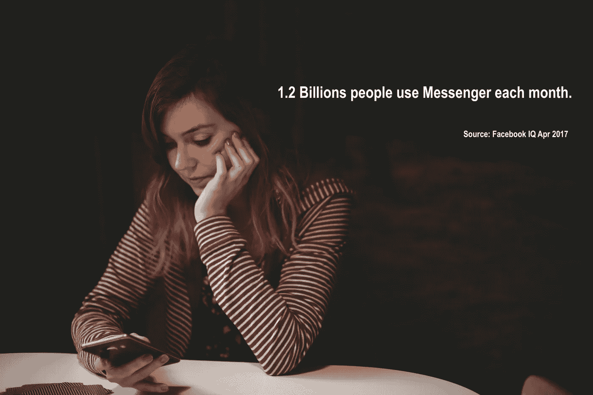
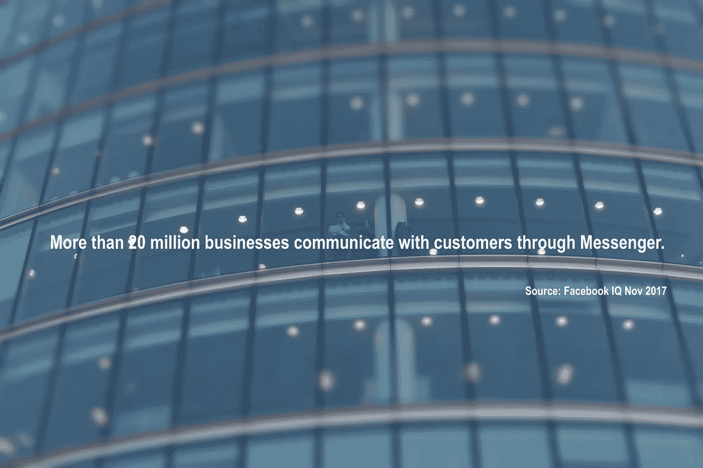
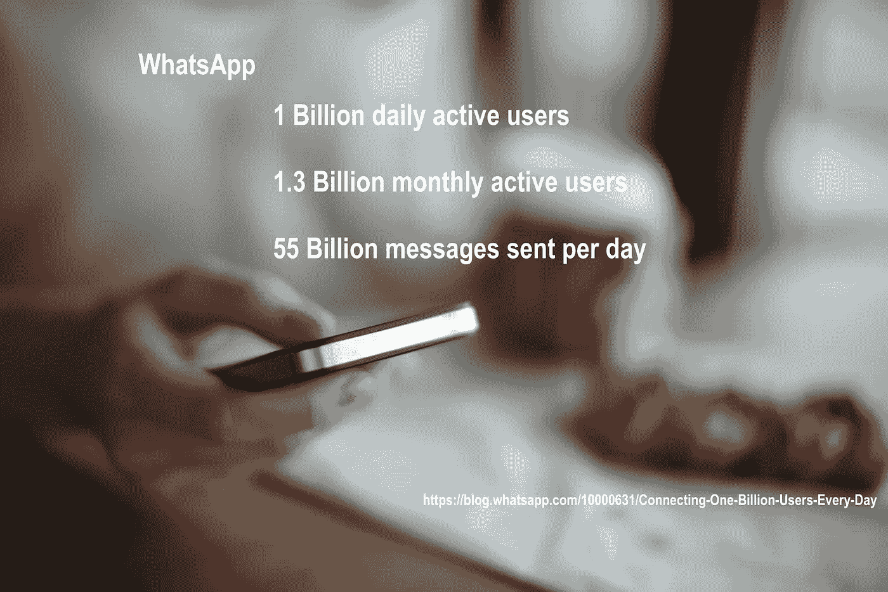

# 信使营销——尝试还是不尝试

> 原文：<https://medium.com/swlh/messenger-marketing-to-try-or-not-to-try-22dfe7553c44>

Photo by [Tim Bennett](https://unsplash.com/photos/OwvRB-M3GwE?utm_source=unsplash&utm_medium=referral&utm_content=creditCopyText) on [Unsplash](https://unsplash.com/search/photos/messenger?utm_source=unsplash&utm_medium=referral&utm_content=creditCopyText)

信使营销是营销领域的一个新生事物。类似于任何新的营销渠道，有很多不确定性。作为一家初创公司，你可能想探索这个机会，尤其是如果你的竞争对手在这个新兴的营销渠道中无处可寻的话。但是，你应该在试水之前问自己这些问题:把我的营销预算拨给信使营销值得吗？为什么这个渠道越来越受欢迎？我如何开始？缺点是什么(因为没有什么是完美的)？

# **什么是信使营销？**

在我们深入研究信使营销的细节和利弊之前，让我们先简单解释一下信使营销——以防你还没有听说过它。

基本上，信使营销类似于电子邮件营销，但不是使用电子邮件来传递营销信息，而是使用信使应用程序。市场上有许多 messenger 应用程序，例如 Facebook Messenger 和 WhatsApp。你可以使用聊天机器人来帮助你，或者如果你想提供更个性化的体验，你可以选择通过 messenger 应用程序直接与你的潜在客户或现有客户互动。例如，WhatsApp 提供服务于此目的的 [WhatsApp 商业应用](https://www.whatsapp.com/business/)。

# **信使营销与电子邮件营销**

电子邮件营销总能在每个营销计划中找到自己的位置——它经济实惠、个性化且易于实施。然而，也有一些挑战。许多电子邮件服务器都有垃圾邮件过滤器，你的促销邮件可能在到达收件人之前就被过滤掉了。即使你很幸运，你的邮件通过了垃圾邮件过滤器，如果你的邮件内容不相关或不吸引人，收件人会毫不犹豫地点击退订按钮。

根据电子邮件营销平台 Constant Contact 最近进行的一项[研究](https://knowledgebase.constantcontact.com/articles/KnowledgeBase/5409-average-industry-rates?lang=en_US#compare)，电子邮件的平均打开率为 17.62%，平均点击率为 7.97%。此时，你可能会对信使营销的身影感到好奇。

在我公布 Messenger 营销数据之前，我想分享一些来自脸书数据和 WhatsApp 的发现:

Photo by [Kev Costello](https://unsplash.com/photos/w3jVXGkYZCw?utm_source=unsplash&utm_medium=referral&utm_content=creditCopyText) on [Unsplash](https://unsplash.com/search/photos/messenger?utm_source=unsplash&utm_medium=referral&utm_content=creditCopyText)

Photo by [Chris Davis](https://unsplash.com/photos/eIXu5GIA5DY?utm_source=unsplash&utm_medium=referral&utm_content=creditCopyText) on [Unsplash](https://unsplash.com/search/photos/business?utm_source=unsplash&utm_medium=referral&utm_content=creditCopyText)

Photo by [Andrej Lišakov](https://unsplash.com/photos/XL-hPDNeZvs?utm_source=unsplash&utm_medium=referral&utm_content=creditCopyText) on [Unsplash](https://unsplash.com/search/photos/messenger-app?utm_source=unsplash&utm_medium=referral&utm_content=creditCopyText)

印象深刻吧。

“哇”不止于此。

以下是来自 Kissmetrics 的一些[数据](https://blog.kissmetrics.com/messenger-marketing-chatbots-how-to-10x-sales-leads-before-your-competitors/):

**80%的广播消息打开率
30–40%的点击率(4–10 倍的电子邮件营销平均值)
5 倍的内容下载量和活动注册量**

到目前为止，一切看起来都很有希望。

# 我可以用 messenger 应用程序进行哪些营销活动？

你可以尝试很多事情。例如，分发你的内容，季节性销售提醒，新产品发布，要求评论，提供折扣——天空是无限的。

# **我们来谈谈钱**

现在你可能会有一个问题，如果我想造一个聊天机器人，Messenger 营销要花多少钱？下面的公司都提供免费的计划，构建聊天机器人不需要编码知识。

*(声明:我不在以下任何一家公司工作，也没有从其中任何一家公司获得报酬)*

ManyChat :吸引多达 2.5 万名用户——每月 145 美元。

他们的付费计划从每月 42 美元开始。

Chatfuel :他们的 Pro 计划起价是每个机器人每页 30 美元。

以上信息只是供你参考，花费多少取决于各种因素——你拥有的联系人数量，你是否需要任何额外的功能等等。

# **信使营销就这么天衣无缝吗？**

现在你可能想马上开始，但是不要着急！如你所知，没有什么是完美的。

你可能要考虑的第一件事是，如果你使用 messenger 作为与潜在和现有客户沟通的主要渠道，你使用的 messenger 拥有沟通的手段。我的意思是，与电话和电子邮件等传统渠道不同，你必须使用特定的信使服务。如果你不喜欢你的电子邮件服务提供商，你可以自由地切换到一个更好的，但这不是信使服务的情况。

另一个缺点是，你的潜在客户可能不想通过脸书这样的即时通讯应用来联系你，因为脸书的个人资料包含太多的个人信息，如出生日期、爱好、最喜欢的电影等。这类信息可以帮助您描述或细分您的销售线索，但您需要考虑一个隐私问题。

在您开始使用 messenger 进行营销之前，您还需要确保您有足够的人力来处理增加的工作量。聊天机器人无疑可以回答你的潜在客户可能有的一些基本问题，但对于更复杂的情况，你肯定需要一个人来接管。否则，你的聊天机器人可能会成为你销售漏斗的一个障碍。

# **结论**

不可否认的是，在 Messenger 营销或任何营销渠道中做一个早期的适应者会让你比你的竞争对手更有优势。但是，和其他渠道一样，有利也有弊。作为一家初创公司，在这种相对较新的营销趋势下，在分配预算之前进行彻底的考虑尤为重要。如果您在营销中使用 messenger 应用程序，我希望听到您的经验和建议！

## 这篇文章发表在《创业公司》杂志上，这是 Medium 最大的创业刊物，拥有 318，120 多名读者。

## 订阅接收[我们的头条](http://growthsupply.com/the-startup-newsletter/)。

