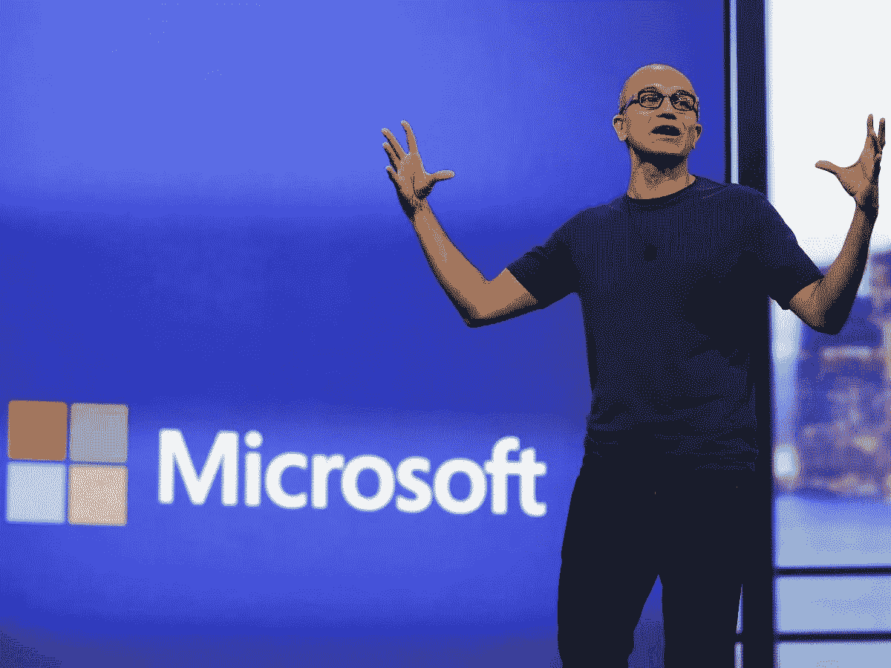
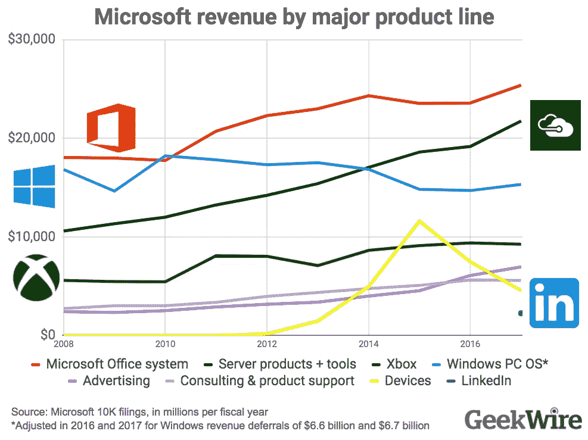

# 微软最脆弱的垄断

> 原文：<https://medium.com/swlh/microsofts-most-vulnerable-monopoly-55eaefd8ba34>

## 利用历史上最赚钱的垄断企业之一微软 Office 的衰落的前所未有的机会。

在萨提亚的领导下，微软的战略已经从“Windows 无处不在”转变为“微软无处不在”的基础设施和软件游戏。最重要的是，这种转变表明，压榨旧垄断企业的日子已经一去不复返了，苹果必须超越 Windows 和 Office，重新构建产品框架，并再次创新。微软的主导地位遭到如此严重破坏的原因可以用两个简单的词来概括:移动和互联网。这种颠覆的动力已经被很好地记录下来，我可以详细地写下来，但这篇文章的重点是将注意力集中到围绕 Office 产品和服务的非常具体的机会上。

Microsoft CEO Satya Nadella, [Business Insider](https://www.businessinsider.com.au/what-its-like-to-be-satya-nadellas-boss-2015-2)

在萨提亚的战略转变之前，微软内部几乎所有的产品和服务都只有一个目标:巩固 Windows 的垄断地位。Office，Windows Phone，Internet Explorer，Visual Studio。他们都发挥了作用。如果一个伟大的产品不符合这个目标，或者以任何方式威胁到它，它就会被杀死(见: [Courier](https://gizmodo.com/5855260/the-true-story-of-the-microsoft-couriers-tragic-death) )。在我在公司的最后几年，“Windows 优先”的策略变得越来越尴尬，因为 Office 的收入开始大大超过 Windows。

Microsoft 10K filing summarised by [GeekWire](https://www.geekwire.com/2017/new-numbers-show-microsofts-biggest-businesses-really-cloud-era/)

我在微软工作了八年，从开发部门的技术职位开始，到后来成为公司最大部门 Office 总裁的办公室主任。我记得在 2011 年的 Office 产品规划会议上，我们与 Windows 团队进行了争论，因为我们打算建立的无数 Office 功能不符合 Windows 8 的设计和计算目标。这两个部门之间的紧张关系表明，权力的平衡已经从窗口转移。最终 Windows 8 推出，并在市场上彻底失败。产品有缺陷，但这不是它失败的原因。Windows 一直都有缺陷，尽管这个版本特别糟糕，但我认为它失败了，因为消费者在 2012 年推出时有可行的替代选择。微软失去了对桌面操作系统的垄断。他们从未在手机和不断增长的平板电脑市场上获得过它，现在它正在桌面上消失。

值得称赞的是，微软转向云计算的速度之快令人难以置信，我相信在那里会有一个漫长而利润丰厚的未来。在客户端，苹果和谷歌开始从 Windows 手中夺取市场份额。但是，还有一个更大的奖品:办公室。这可能看起来不太直观，因为 Office 365 的收入比以往任何时候都多，但我相信这是因为他们的价值主张与 CIO 产生了强烈的共鸣。公司现在可以不用担心他们的企业基础设施，让微软来处理。在这个等式中，每个人都是赢家，除了最重要的人:信息工作者。这些是数百万被迫使用从他们的 IT 部门传下来的软件的员工。这些员工被困在为一个完全不同的时代设计的笨重的客户端软件中。

对于少数幸运的组织来说，他们的首席信息官已经撕掉了创可贴，转而使用谷歌的 G 套件。但是，什么是 G 组曲呢？这是云中 Office 的更快版本。就是这样。但就凭这一简单的区别，谷歌在不到十年的时间里，将这项业务从 0 美元发展到 30 亿美元。令人印象深刻的是，他们几乎没有触及大企业的表面。这恰恰说明了在生产力市场上有多少潜在的需求和机会。

Jean Jullien via [Dribble](https://dribbble.com/shots/3007680-fist-bump-gif)

别误会，Word、Excel、PowerPoint、Outlook 都是好产品。但是，它们对于员工生产力的意义就像最先进的铜线模拟电话对于电话一样:对于这个世界上的一小部分人来说，这是一个有用的工具。如果你坚持我的类比一分钟，想象一下“生产力手机”，你就会感觉到机会。随着市场的急剧扩张，传统的生产力软件将会发生重大的转变。

我的一个好朋友从微软的 Office 团队转到了谷歌，帮助他们建立生产力业务(有趣的是，他现在正在脸书做同样的事情)。他将谷歌早期的战略总结为专注于 80%的用户实际需要的 20%的功能，而不是 Office 中很少使用的数千个功能。对于那些想要挑战微软(和谷歌)的人来说，这是一个重要的教训。为企业构建软件时，传统的建议是创建一个比现有解决方案好 10 倍的新解决方案。如果你追求的是办公室，那是不可能的。产品和技术壁垒很高，但最大的壁垒是微软的单一企业供应商模式。这也许是 Office 继续蓬勃发展的唯一原因。有可能的是，随着时间的推移，显著改善现有解决方案服务不足的一批信息工作者的生活，并将这一优势作为进入更大产品的一个楔子。我相信随着时间的推移，单一企业供应商模式会逐渐消失，因此我不建议任何挑战者(无论大小)尝试复制这种模式。对于大量的信息工作者来说，把一两件事做得特别好，就能形成大赢家。

我们将看到越来越多的创新定制解决方案涌现出来，重新思考生产力堆栈的各个层面。虽然此列表在增长方面各不相同，但相对于机会而言，它们都很小。

## 试算表

*   [气动工作台](http://airtable.com)
*   [智能表](http://smartsheet.com)
*   [仪表板](http://dashdash.com)

## 介绍会；展示会

*   [按五十三粘贴](https://www.fiftythree.com/paste)
*   [漂亮。艾](http://beautiful.ai)
*   [slidebean。](https://slidebean.com)

## 文档和创作

*   [妙语](http://quip.com)
*   [结尾](http://coda.io)
*   [狭缝](http://slite.com)
*   [输入](https://input.com/)
*   [观念](https://www.notion.so/)

## 商业智能和数据

*   [看客](http://looker.com)
*   [痘痘](http://alooma.com)
*   [雪花](http://snowflake.com)

我总是听到新的解决方案，如果有一个伟大的创业公司还没有被包括在内，我很乐意加入这个列表。

*感谢 Dev Bala、Prateek Srivastava

## 这篇文章发表在《创业公司》杂志上，这是 Medium 最大的创业刊物，有 325，962 人关注。

## 订阅接收[我们的头条](http://growthsupply.com/the-startup-newsletter/)。

