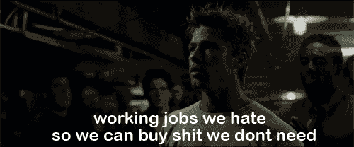
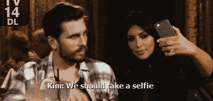
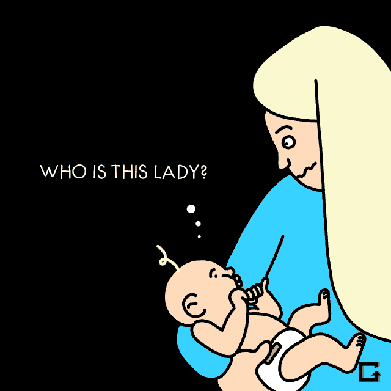

# 千禧一代受到了社交媒体的不公平对待

> 原文：<https://medium.com/swlh/millennials-got-a-raw-deal-with-social-media-a63f85b52ac6>

## Essena O'Neill 退出社交媒体引起了轰动。为什么不会呢？它说明了我们天生就知道是真的。社交媒体是中介。这是一场闹剧。

我在 2013 年写过一篇大意如此的帖子。这实际上是在贾丝汀·萨科去非洲之后。希望我不会得艾滋病。开玩笑的。我是白人！”推特-风暴。

 [## 我快疯了。社交媒体:我们是幻觉

### 大约两周前，互联网上出现了贾丝汀·萨科的种族主义推文。(免责声明-我不在…

blog.digidave.org](http://blog.digidave.org/2013/12/im-mad-as-hell-social-media-were-the-illusion) 

> 在 1976 年的讽刺电影《网络》中，有一个场景是主角大声抱怨电视是一个哑谜。一种投射在柏拉图洞穴墙壁上的阴影。花 4 分钟时间(如果你真的没有时间，可以跳到 2 分钟)。这是一个伟大的咆哮。然后照照镜子，承认你对电视有过这些想法。

# **网络社交之于真实的社交活动，正如真人秀之于真实的现实。**

> “未来，每个人都要世界闻名 15 分钟。”——[安迪·沃霍尔](http://en.wikipedia.org/wiki/15_minutes_of_fame)
> 
> 安迪·沃霍尔对此再正确不过了。他没有包括的是，每个人都会认为自己出名的时间远远超过 15 分钟。当一个“真实的人”出现在真人秀中时，我们看不到真相。我们正在看一场演出。虽然网上没有“选角”,但我们看到的很多都是闹剧。是导演。它是中介和产生的。对于那些职业(数字专家、社交媒体编辑等)来说更是如此。等等)与网络世界有着内在的联系。

让我们在这个对话中加入另一个元素。

# 世代

*(Clint*[*的一次演讲告诉了我们几代人对成功的看法！龙格*](https://www.linkedin.com/in/clintrunge) *)*

X 一代在拥有东西方面获得了成功。

这就是搏击俱乐部引起如此强烈共鸣的原因。

千禧一代将成功定义为拥有社会关系。

让那件事过去一会儿……

> 成功就是拥有社会关系。

在与我的朋友安德鲁·哈格的一次谈话中，我们得出了这样的结论:千禧一代出生在一个他们必须承受社交媒体焦虑压力的时代。

## 他们是第一个通过社交镜头看世界的人，在这个镜头中，每时每刻都被用来分享。他们必须经常参加社交活动。我读过所有的脸书邮报吗？我看了所有的 Instagram 照片了吗？我让我的社交网络失望了吗？

大规模生产的出现导致了富足。但最终留给我们的是心理和环境外部性。千禧一代经历了社会资本大规模生产的时代。我们经历了富足和商品化。我们也不确定这到底意味着什么。千年搏击俱乐部是什么样子的？有哪些外部性？

为什么我会在把千禧一代作为一个人谈论和有时作为一个观察者谈论之间转换？阅读下面的“几代人”一节。我从来没有觉得自己是真正的千禧一代或 x 世代。

 [## 沙漠中的几代人——来自阿斯彭的思考

### 就像 FooCamp 一样，阿斯彭的 Knight Focus 活动非常令人振奋。FooCamp 有一个关于博客的“朋友”政策…

blog.digidave.org](http://blog.digidave.org/2010/08/generations-in-the-desert-thoughts-from-aspen) 

我应该注意到标题“千禧一代受到了不公平的待遇”,这并不意味着社交媒体本身就是不好的。这对社会有好处。就像大规模生产一样。富足是我们不想放弃的东西。随着时间的推移，也许可以达成平衡。

# 那 Z 一代呢

下一代不需要回答“我是谁”这个问题，他们的身份早就被父母在网上创造出来了。他们的照片已经上传了。他们的笑话已经传达了。

下一代的成功在于拥有经验。

# 世代理论

每个人都想知道如何接触“孩子们”那是钱应该在的地方。要记住的最重要的事情之一。每一代人都在反叛。每一个。单身。一个。

但是如果他们反抗他们的 X 一代父母，他们的反抗形式可能看起来像是社会责任和成熟。哪一代人养育了你，对你的成长有很大影响——对你的叛逆有很大影响。

每一代人都会经历人生阶段。x 世代的人年轻时都是无缘无故的反叛者。现在他们正处于赚钱的黄金时期。当他们被认为是社会的工作者和管理者时。与此同时，婴儿潮一代正步入人生的晚年，他们对社会的价值在于成为睿智的智者。

这一切只是为了指出我思考代与代之间游戏的框架。这很受[施特劳斯-豪的代际理论](https://en.wikipedia.org/wiki/Strauss%E2%80%93Howe_generational_theory)的启发。

想要以怀疑的眼光看待这个世界——看看我下面的时事通讯。

 [## 本周在 WTF

### 够了。足够的政治正确。接受的叙述够多了。我想叫扯淡。

this-week-in-wtf.ongoodbits.com](https://this-week-in-wtf.ongoodbits.com/) 

*在你回答之前，请记住“并非所有”适用于谈论一代人。并非所有的千禧一代或 x 世代都有某些特征。

发表于*[**# SWLH**](https://medium.com/swlh)**(***《创业》、《流浪癖》、《生活黑客》)**

******