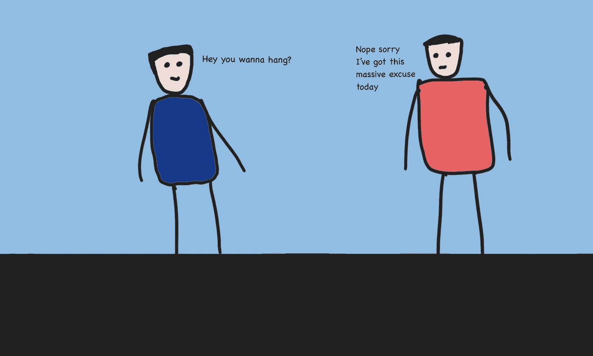
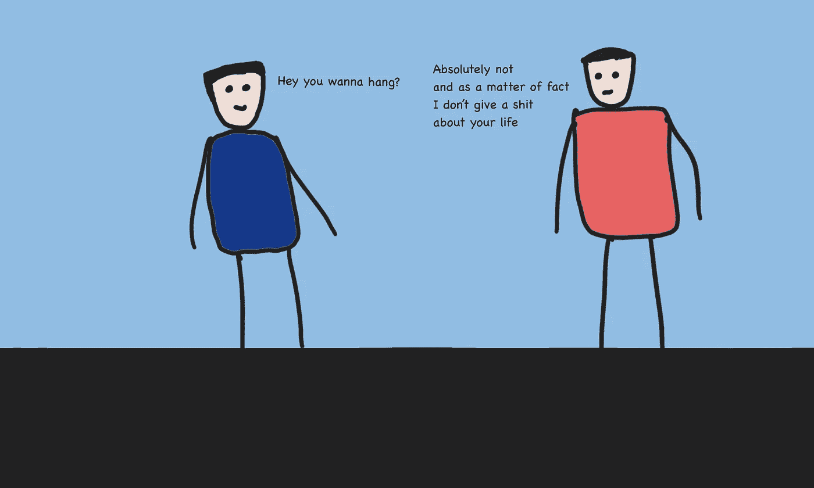

# 介意我不跟着你吗？

> 原文：<https://medium.com/swlh/mind-if-i-unfollow-you-8086e3058c96>

## 为什么我们讨厌不被关注，如果我们不应该这么讨厌

衡量个人障碍普遍性的一个很好的方法是关于如何最好地处理这个问题的友好文章的数量[确认偏差](https://en.wikipedia.org/wiki/Confirmation_bias)。我漫不经心地研究了文章是如何利用我们对强化自己想法的渴望的，虽然我预计会有关于处理抑郁或分手的文章，但我惊讶地发现“如何处理社交媒体上不关注你的人”也在同一列表中。

现在，我对这件事本身并不感到惊讶——我完全理解人们不一定喜欢在社交媒体上不被关注。我也不知道。真正让我吃惊的是因为同样的事情而引起的痛苦。

举个例子，这是对一篇关于如何应对不跟随者的文章的评论:(很长，所以如果你想知道的话，可以向下滚动)

> “……我意识到她没有关注我的个人资料。我对此感到难过和侮辱，因为我主要使用 IG 来分享我的时刻和保持联系，我永远不会不关注我认识和爱的人，不管他们的帖子看起来怎么样。所以我找她对质，她说她想用那个账户做生意，没有任何私人恩怨..也许我会这样想，但我在那里的内容 1 .与她正在做的事情非常相关 2 .比 FB 或任何其他社交网络都更多地反映了我的生活。我不能接受这种解释，因为我不能理解她对她认为是朋友的人的生活没有任何兴趣，特别是因为我们花了很多时间一起在 IG 上发帖，我一直在宣传她和她的作品，为她感到骄傲和支持。但是她决定把我从她的系统中删除，我真的不知道为什么..她的解释实在站不住脚。所以我们不再联系了。开始时我很难过，但现在我很好，并试图花更多的时间与那些似乎更关心我和我的生活的人在一起，尽管我们不常见面。”

我对社交媒体上未被关注所产生的强烈情绪很感兴趣，因为我最初的猜测是，在网上未被关注相当于，你知道，在现实生活中再也见不到一个人——这是我十有八九不会感到难过的事情。

还有另外两个矛盾/值得注意的地方增加了我的好奇心:

1.  如果我认为地球是平的，一个朋友在现实生活中不再和我说话，我不会在乎——但如果他/她出于同样的原因在社交媒体上不关注我，我肯定会感觉很糟糕。
2.  即使 B 不能从我的关注者列表中看到 A 没有关注我，我仍然会介意 A 没有关注我。此外，我的追随者数量会减少一个。因此，这不是直接的公开羞辱问题。

显然，我需要更好地理解为什么不被关注会给我们带来精神创伤。经过大量的思考和研究，我提出了一个粗略的“为什么会受伤”的清单。这是:

1.  **拒绝。这是一个惊喜。我发现没人关注和被你喜欢的人拒绝几乎是一样的伤害。这打破了我的假设，即不追随等同于不再和一个人在一起，因为仅仅不和一个人在一起不会*必然*让你感到被拒绝。**
2.  **自恋伤害。**很多时候，我们认为自己在很多方面都比实际情况要好。更重要，更吸引人，等等。因此，即使我们可能不够有趣而不被跟踪，我们也会感到受伤，因为这使我们如此珍视的膨胀的自我意识无效。
3.  **驱逐。**在很多情况下，没有人跟随感觉就像被从一个满是你觉得很酷或想一起出去玩的人的房间里驱逐出去——自从我们过去用长矛打猎和[在洞穴里画鸡巴](https://io9.gizmodo.com/5887633/one-of-humanitys-earliest-drawings-was-depicted-with-an-enormous-phallus)以来，人类就害怕被驱逐。

列表上的第四项是**不跟随的故意性质。**这就是在我看来，不追随真的很伤人的最大原因，所以值得拥有属于自己的一段。出于其他三个原因，我甚至称之为促成因素。

是这样的。当有人不想在现实生活中和你在一起时，他们可能会找到一种方法把它变成现实，同时确保最小的伤害。回复短信会花更长的时间，当他们回复时，通常每次都会更温和。你的约会邀请将会落空。这两个和更多的将继续下去，直到你“接受暗示”

然而，如果有人决定在社交媒体上取消对你的关注，这是对你的当头一棒。假设说，这就像某人没有礼貌地拒绝你的邀请，而是直截了当地说他/她不想和你一起出去，甚至不知道你的生活中发生了什么。不追随的人有意识地故意不追随你，很清楚你几乎不可避免地会知道这个行为。

不追随行为的这种故意的本质，才是真正增加了给不追随的人带来痛苦的其他因素的有效性。以第一个因素为例，即被拒绝。想象一下，如果你的暗恋对象故意让你知道他/她对你和你的生活不感兴趣，而不是忽视或避免谈话。被拒绝的感觉显然会更强烈。

既然我们已经大致了解了为什么在社交媒体上没有人关注会造成如此大的伤害，那么问题是——应该这样吗？

在 a [之前的文章](https://byrslf.co/why-do-you-want-all-these-followers-c658708bc9e9)中，我谈到了我们的生活是如何变得越来越数字化的。虽然，在某个时候，*可能会*要求社交媒体与现实生活的平等，但我们甚至还没有接近达到那一点。因此，此时此刻，明智的做法是将我们的“真实”生活和社交媒体生活视为两种不同的元素。

我们的社交媒体档案是我们在数字世界中的数字身份，不像我们在“真实”世界中的“真实”身体。这两者之间的一个很大的区别是，我们可以对我们的数字身份进行建模，而我们的“真实”身份或多或少是不变的——因为我们通过我们的“真实”身份对自己的描述更类似于我们作为一个人的真实身份——在这种情况下，这是不变的。

另一方面，我们对我们的数字身份有更大的控制，不可避免地导致我们的“数字”和真实自我之间更大的鸿沟。因此，当人们在社交媒体上不关注我们时，他们真的只是不关注我们的数字身份，而不一定是我们的真实身份。

这就是为什么我觉得我们高估了整件事情的一个简单原因。另一个原因更深层，源于我对社交媒体真正是什么的理解。

这是我对社交媒体的理论，以及为什么它暗示我们对人们不必要的关注变得更加不安:

我认为社交媒体是一屋子的人向他们的追随者讲述故事。每一张 Instagram 图片，每一条 Tweet，每一条 Tumblr 帖子都是一个故事——而你的粉丝就是听这个故事的人。

现在，如果你每天都不在我的房间里听我讲故事，那就一定意味着你不关心我吗？我对你来说不重要？绝对不是——至少在我看来是这样。同样，我可能爱你，深深地关心你，但仍然不能听你讲你的故事，我不知道，你的午餐或其他事情。

只要我知道你会支持我，我不介意每天在我的房间里看到你——这就是为什么如果你在 Instagram 上取消关注我，我不会伤心。

*(如果你是粉丝，我只是开玩笑，请不要)*

## 这篇文章发表在《创业公司》杂志上，这是 Medium 最大的创业刊物，有 326，962 人关注。

## 订阅接收[我们的头条新闻](http://growthsupply.com/the-startup-newsletter/)。

