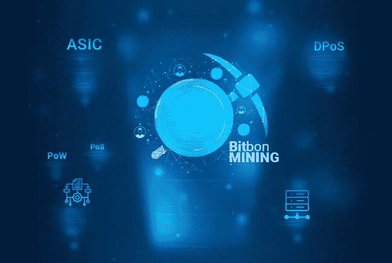

# 矿工——这是未来的工作吗？

> 原文：<https://medium.com/swlh/miner-is-it-a-job-of-the-future-a515ece18f2d>

程序员、网页设计师、版权人、开发人员和系统管理员是互联网和网络空间赋予我们的职业。随着这一领域的发展，工作清单也在不断扩大。

十多年前，当比特币首次推出时，社会发现了一些更有前途的收入来源。例如，那些足够勇敢，在正确的时间投资比特币的人，现在已经把他们的资本翻了几百倍。那些没有及时这样做的人开始以不同的方式从区块链中获得利润——他们开始采矿。让我们搞清楚什么是挖矿，谁出钱，为什么挖矿是一个不需要任何资质的很有前途的工作。

# **什么是采矿？**

术语“挖掘”本质上是指加密货币的发行。这是获得它们的唯一方法，它基于解决复杂数学问题的算法。换句话说，为了“挖掘”一个单位的数字货币，你必须从数百万个选项中找到一个正确的数字组合(哈希)。计算过程使用功能强大的计算机进行，在矿工产生正确的散列后，他/她将收到报酬(其大小取决于采矿所用的平台)到他/她的电子钱包中。

# **采矿品种**

在过去，为了获得加密货币，你不需要像现在这样多的资金和设备。一两台强大的计算机和几个图形处理器就足够了。现在用 CPU 和 GPU 挖矿简直效率不高。为此，有一些特殊的设备——专用集成电路。

密码产业越发达，就越难挖掘。更强的竞争出现了，几个矿工试图找到相同的散列，但报酬属于在别人之前成功计算出代码的人。而那些未能收到大额电费账单的人。因此，个体采矿变得越来越不可行，随着时间的推移，旨在更有效采矿的采矿农场开始形成。一个场是连接到同一个池(区块链网络)的多个服务器。群组挖掘的优势在于多台计算机提供高计算能力，因此提高散列率(挖掘速度)的可能性增加，从而影响报酬金额。但由于联营是相互的，利润也在所有“农民”之间分配。

观察了两种采矿方法后，我们不能自信地说单独采矿是完全低效的，或者农场保证可观的利润。在这两种情况下，采矿都可以被描述为“俄罗斯轮盘赌”，因为一个单独的矿工可以很幸运，他/她的报酬将大于“农民”。

但在区块链发展的现阶段，有替代的方式来获得数字货币。Bitbon 系统 crypto 项目向社区引入了一种全新的采矿方式。在该系统中，通过建立共识来计算散列。简单来说，这个平台中的挖掘分为两个过程，解决了获取现有加密货币的问题:

基础设施建设挖掘:在他/她自己的 Bitbon 系统的分布式分类账中，每个用户可以“借出”他/她的计算能力或农场以换取报酬，报酬的大小取决于所提供资源的数量和质量；共识构建挖掘是一种改进的 DPoS(委托利益证明),解决了共识问题，确保了在 PoS(利益证明)的情况下对代表进行更公平的投票。

让我们仔细看看第二种类型。
PoS(股权证明)是一种替代 power 保护方法。这种机制的使用不仅仅取决于设备容量。它允许通过代表的平衡在区块链网络中形成区块。例如，用户拥有某一加密货币总量的 3%,根据算法解决方案，平均而言，他/她将生成成比例的块数，即 3%。
但我们应该提到的是，加密仪器在不断改进，采矿方法也变得更加可持续。Bitbon 系统就是这样创建的，这是一个通用的区块链平台，它与现有挖掘方法的主要区别是更公平、更正确的代表投票方式，而共识不需要矿工具有令人难以置信的计算能力，也不存在强烈的竞争。你可以说，在 Bitbon 系统中挖掘是该领域的一个替代方向，对于那些想在密码行业找到工作的人来说是一项有前途的活动。

挖掘并没有失去它的重要性，它正随着密码产业的发展而被修改。最重要的是跟踪趋势，及时了解相关新闻，了解新的加密产品。这将让你在密码行业找到一份有利可图的工作。

【dailybitcoinnews.com】最初发表于**。**

**

## *这篇文章发表在 [The Startup](https://medium.com/swlh) 上，这是 Medium 最大的创业刊物，拥有+396，714 名读者。*

## *在此订阅接收[我们的头条新闻](http://growthsupply.com/the-startup-newsletter/)。*

**