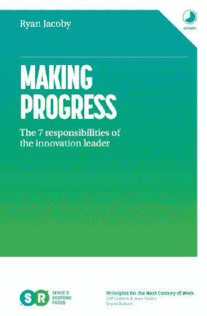
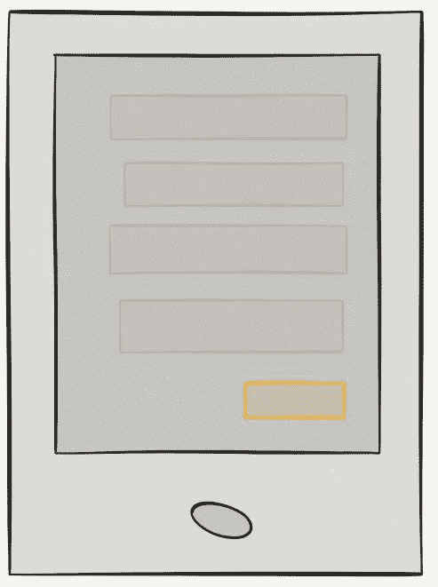
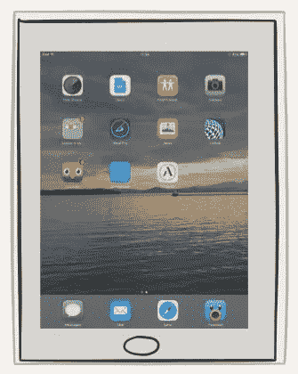

# 最小可行对话

> 原文：<https://medium.com/swlh/minimum-viable-conversation-e9117927a59f>

[*Sense & Respond Press*](https://www.senseandrespondpress.com/) *is thrilled to announce the launch of our second book,* [*Making Progress: The 7 Responsibilities of the Innovation Leader*](https://www.amazon.com/Making-Progress-Responsibilities-Innovation-Leader/dp/0999476920/)*by* ***Ryan Jacoby.***
This concise, beautiful, actionable book breaks down the first 7 things you need to do when handed the role of innovation leader. Where to start, how build a team, what to incentivize — Ryan covers all this and a bunch more. [Click through and grab a copy](https://www.amazon.com/Making-Progress-Responsibilities-Innovation-Leader/dp/0999476920/) in paper, kindle or audio.

这篇文章最初是发布给我的时事通讯订阅者的(现在有 13，000 人)。如果你想在你的收件箱里收到这些 [*在这里注册*](http://eepurl.com/bGYODD)

嘿伙计们-

新年快乐！这个 3 月就 7 年了(疯狂！)自从我发表了第一篇关于精益 UX 的文章。它叫做[精益 UX:摆脱可交付业务](https://www.smashingmagazine.com/2011/03/lean-ux-getting-out-of-the-deliverables-business/)，由《粉碎》杂志的好心人出版。那篇文章指出了当时在 web 和用户体验设计领域创建基于纸张的可交付成果的强烈关注。这是一个战斗口号，号召人们远离冗长的前期文档创建，并通过增加团队范围的对话来实现更大的跨职能协作。从那以后，关于如何制造和设计更好的产品的讨论越来越多，但几年后，这个想法的很大一部分被遗忘了。事实上，许多团队消除了文档本质上是坏的并且应该被避免的想法。这不是我的本意。

取而代之的是重新思考如何与你的同事进行最有效率和最有效的对话——如何在尽可能少浪费的情况下快速推进对话。7 年前，当许多团队因为创造可交付成果而受到激励时，这是一个更艰难的销售。今天，感觉是时候让这成为现实了。

进入**最小可行对话**。

在每一个需要沟通的机会，团队、领导者和个人贡献者都需要问自己三个问题:

**1。我们想要传达什么？**换句话说，我们现在需要传达的要点是什么，这将帮助我们向前迈进一步、学到一些东西、摆脱困境或者只是帮助我们感觉自己正在取得进步？

*它可以是任何东西，从提议的现有产品的新外形到为您的服务提供的全新交互模型。*

**2。我们要和谁沟通？**你信息的目标受众——无论是内部的还是外部的——都需要不同程度的细节和忠实度来理解你的观点。他们有你有的背景吗？如果是这样，你可以不那么忠诚地离开。如果没有，你可能需要更高的保真度。主要的一点是了解你的目标受众需要从这次谈话中得到什么。

*与团队中的开发人员相比，高管可能需要更高的忠诚度。同样，你的客户可能会理解你的观点，而你的投资者可能不会。*

**3。我们需要做的最少的工作是什么？**这是最小可行对话中最难的部分。我们只想做一些能推进对话的工作。就是这样。仅此而已。我们应该创造什么来快速表达我们的观点？

*在某些情况下，一个线框或草图可能就足够了。在其他情况下，你可能需要为你的想法创建一个高保真版本，以确保你的观点被理解。*

最少可行对话的目标不是消除文档。这是为了确保我们的努力花在最有效的方式来推动我们的产品前进。文件永远是必要的。我们的目标是在需要的时候，以当时要求的保真度，只创建我们需要的内容。这些不是档案。它们是短暂的工件，服务于暂时的目的，然后在下一个最小可行的对话中被丢弃。试试吧，让我知道它对你有什么用。

www.senseandrespondpress.com
[jeff@gothelf.co](mailto:jeff@gothelf.co)

**微聘我快速讨论咨询**
2018 年与我共事！你现在可以[雇用我](https://calendly.com/gothelf/office-hours-30-minute-slot)进行简短的远程咨询。每个咨询时段为 30 分钟，您可以根据需要预约。[从选择一个对你合适的时间开始](https://calendly.com/gothelf/office-hours-30-minute-slot)。

**即将举办的活动**
和我一起参加 2018 年的这些精彩活动:

[**免费—1 月 17 日 Ryan Jacoby 的网络研讨会**:创新不是数字化转型。](https://zoom.us/webinar/register/WN_QdfnMi0pQiK5CzHumQUaSg?utm_content=buffer5efd2&utm_medium=social&utm_source=linkedin.com&utm_campaign=buffer)加入《前进》作者、前 IDEO 高管 Ryan Jacoby 和我的讨论，了解创新实践和数字化转型实践之间的差异。

**杰夫·巴顿在** [日内瓦](https://www.eventbrite.com/e/smart-scrum-product-ownership-geneva-february-2018-tickets-38689699934) **和** [伦敦](https://www.eventbrite.com/e/smart-scrum-product-ownership-london-february-2018-tickets-38689572553)参加的认证产品所有权课程——伦敦的门票已经售罄，但我们在日内瓦还有大约 10 个名额。在即将于 2018 年 2 月在[日内瓦](https://www.eventbrite.com/e/smart-scrum-product-ownership-geneva-february-2018-tickets-38689699934)举行的这两个日期中，为您的团队争取一个席位。

[**阿姆斯特丹—2018 年 3 月 20 日至 21 日** —欧洲精益创业大会](http://emea.leanstartup.co/?utm_source=LS+MAIN+LIST&utm_campaign=46be12a645-EMAIL_CAMPAIGN_2017_12_14&utm_medium=email&utm_term=0_566bb43271-46be12a645-126414361) —欧洲首个为期两天的精益创业活动，由 Alex Osterwalder、Janet Bumpas、Tendayi Viki 和我等人进行演讲和研讨会。

[**爱尔兰都柏林——2018 年 4 月 25 日——Sense&回应:**如何在高增长公司建立&领导成功的精益实践——为期一天的研讨会，作为敏捷精益爱尔兰的一部分。](https://www.eventbrite.com/e/agile-lean-ireland-sense-respond-how-to-build-lead-successful-lean-practices-in-high-growth-tickets-38886051226)

[此处显示城市、日期和详情](https://www.leadingbusinessagility.com/our-workshops/)。

*一如既往，如果您希望我直接与贵公司合作，就组织敏捷性、数字化转型、产品发现和敏捷领导力等主题开展培训、辅导或研讨会，* [*请随时联系*](mailto:jeff@gothelf.co?Training%20inquiry) *。*

## 这个故事发表在 [The Startup](https://medium.com/swlh) 上，这是 Medium 最大的企业家出版物，拥有 295，232+人。

## 在这里订阅接收[我们的头条新闻](http://growthsupply.com/the-startup-newsletter/)。

