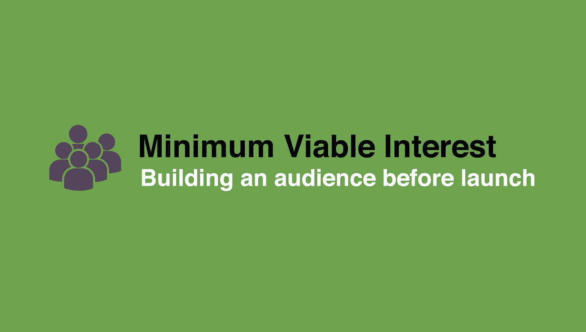
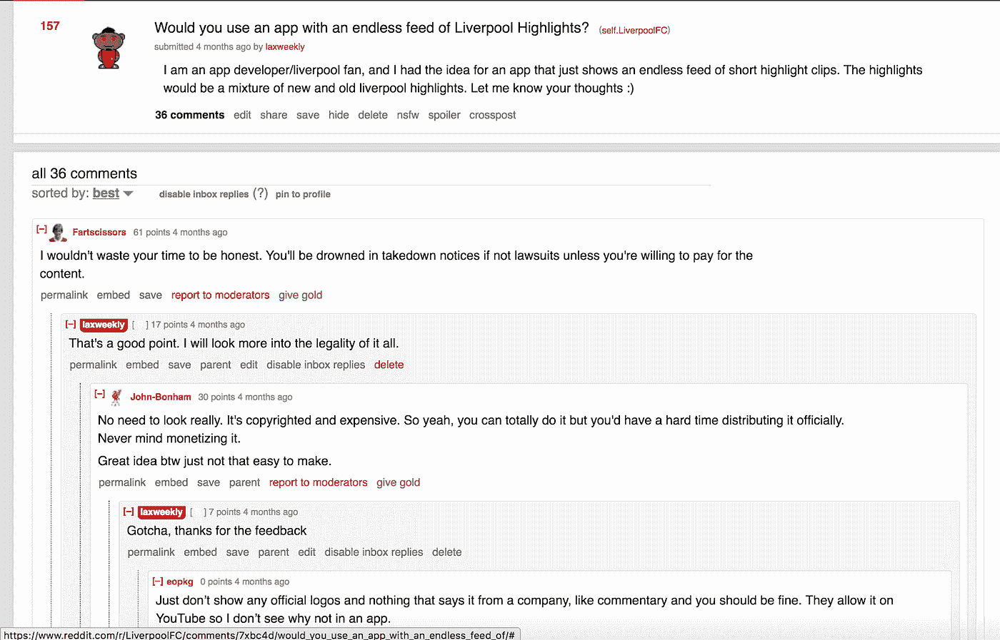
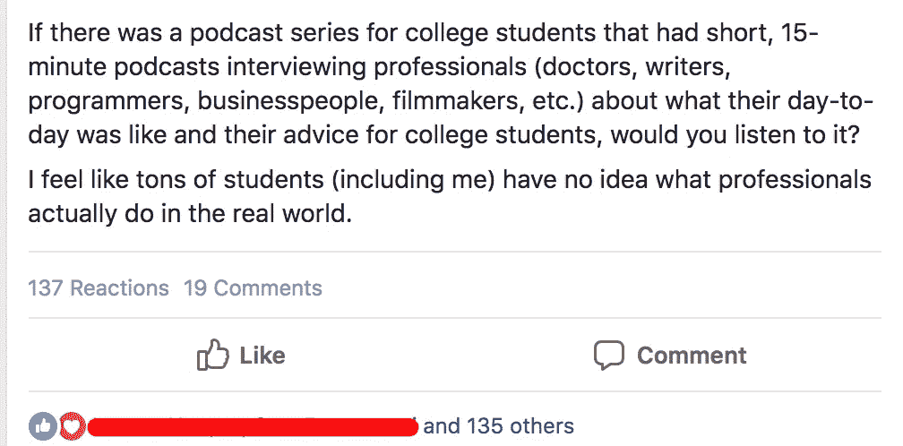

# 最低可行利息

> 原文：<https://medium.com/swlh/minimum-viable-interest-e942f5b0b23>

## 在你开始编码任何东西之前构建它

> 最低可行兴趣(MVI): 产生大量准备使用你的产品第一版的观众所需的最少时间和金钱。

当你有一个商业想法时，很容易开始思考如何将这个想法变成一个有形的产品。你需要多少程序员？你的营销计划是什么？你需要筹集多少资金？

这些都是很好的问题，但是在你开始建造任何东西之前，你应该已经有了**最小可行利益。**

这意味着，在你发布产品的任何功能版本之前，你应该已经有一群人知道你的想法，并乐于测试。这听起来很棒，但是**在发布任何东西之前，你如何真正开始建立一个观众群呢？**从问这五个问题开始:

1.  谁是我的观众？
2.  我在网络上/现实生活中的受众在哪里？
3.  **如何让自己沉浸在受众群体中？**
4.  如何以“非销售”的方式推销我的想法？
5.  **发布后，我如何通知感兴趣的客户？**

让我们深入每个问题，以便更好地了解 MVI。

**1)谁是我的观众？**

如果你不能确定你的目标人群或定位，成功的机会微乎其微。这并不是什么新信息，但几乎所有新创公司的创始人都忽略了这一点。成功的产品始于利基市场，然后慢慢向外发展。

简单的例子:脸书。它是为大学生制作的，并扩展到其他人群。如果你想建立下一个社交网络，从小众开始。如果你想创建一个成功的 SaaS 公司，从利基市场开始。我怎么强调这一点都不为过。

我在网络上/现实生活中的受众在哪里？

一旦你弄清楚你在找谁，是时候去寻找他们了。你的任务是找出你的观众在网上“闲逛”的地方。他们在访问什么网站？他们使用最多的社交媒体类型是什么？他们在论坛上发帖吗？找到这些地方可能很难，但幸运的是有一个网站可以让这个搜索过程变得非常容易: **Reddit。**

Reddit 绝对是寻找观众和激发兴趣的金矿。通过一些快速搜索，你可以找到几十个与你的目标人群相关的子主题。最有可能的是，subreddit 中的人会提到他们使用的其他流行网站。这太棒了！跟着他们去其他网站，直到你找到几个你的观众常去的地方。

如果你正在努力寻找 subreddits，谷歌是你的朋友。通过一些快速搜索，如“针对(插入目标受众)的网站”或“插入目标受众”论坛，您应该很快就会有一个受众在互联网上居住的位置列表。

**3)【可选】如何让自己沉浸在观众的社区中？**

*这一步不是 100%必要的，但它使*更容易产生兴趣。*

一旦你找到了你的观众常去的地方，是时候让自己沉浸在他们的社区中了。这意味着发帖、评论、关注并为你的受众提供价值。在这一步，你不是要推销任何东西，你只是要树立一个真正对你的观众感兴趣的人的信誉。在这个过程中，你也会对你的观众的行为/品味有新的认识。记笔记。

**我怎样才能以一种“非销售性”的方式推销我的想法？**

好的。现在你有了自己的想法，也找到了自己的听众。是时候开始投球了！

人们非常善于发现被推销的对象，因此不要让自己听起来像个烦人的推销员，这一点很重要。最终，你的产品应该帮助其他人解决问题。如果是这种情况，你的推销应该以一种让你的听众觉得他们得到了帮助的方式进行。

看例子的时候我学的最好，我给你看一个个人的例子。以下是我几个月前在 reddit 上发的一个帖子的截图:

我的想法是做一个有无穷无尽的体育集锦的应用程序。作为一个狂热的体育爱好者，没有什么比观看精彩的集锦更让我喜欢的了。我决定在这个受欢迎的利物浦(英国足球队)subreddit 上发帖。这篇帖子最终获得了 157 张赞成票和近 40 条评论。我能够想出我的想法可能是不可行的，因为侵犯了版权。

请注意，我的推销是非正式的，并没有给人留下强行推销的印象。我只是问了一个简单的问题:你会用这个应用吗？然后我简单描述了一下这个想法，让人们有更多的洞察力，就这样。如果我发布了“检查我的新应用程序想法”或类似的东西，没有人会给我反馈。

从这篇文章中，我获得了大量有价值的见解，并为自己节省了大量时间。我没有写一行代码，也没有花一美元，但是我能够验证我的想法。这就是生成 **MVI 的妙处。**

发布后，我如何通知感兴趣的客户？

现在你已经找到了对你的想法感兴趣的人，你会想要收集一些联系信息，这样一旦你发布了你的产品，你就可以更新他们。有两种很好的方法可以做到这一点:

**询问每个感兴趣的人的联系方式**

再来看一个个人的例子。以下是我几周前为一个播客创意写的一篇博客帖子:

这个帖子得到了 137 个赞，这证实了人们对这个想法的兴趣。我决定把每个喜欢 FB 上帖子的人都加为好友，并亲自给他们发消息，询问他们的电子邮件地址，这样我就可以让他们知道播客何时推出。他们愉快地答应了。我实际上推进了这个想法，现在我正在制作一个名为[我的职业秀的播客！](http://www.mycareershow.com/)这个方法管用。

**b .创建一个登录页面，人们可以在其中输入联系信息**

另一个选择是引导人们去一个单页的网站，在那里人们可以了解更多关于你的想法，并留下他们的联系方式。这比单独联系每个人花费的时间要少，但也没有信息那么私人。

有成百上千的登录页面构建器，或者你可以学习如何用 Bootstrap 之类的简单框架自己制作它们。不管怎样，这应该是一个相当快的过程。

**结论**

如果你实施了这些步骤，并发现一群人对你的想法感兴趣，那么是时候开始构建了。在发布前拥有这样的受众将会激励你找到一种方法来构建一个产品，即使是在资源有限的情况下。如果你有 500 个人等着你发射，你会更有动力去努力。在寻找联合创始人或筹集资金时，大 MVI 也可以发挥杠杆作用。如果你能向其他人展示有人愿意使用你的产品，他们更有可能加入你的团队或投资你的公司。

总的来说，有数不清的理由说明在开发产品之前产生兴趣是一个好主意。确保有人准备好使用你的产品，发布日就会变得容易。

## 这篇文章发表在 [The Startup](https://medium.com/swlh) 上，这是 Medium 最大的创业刊物，拥有 336，210 多名读者。

## 订阅接收[我们的头条新闻](http://growthsupply.com/the-startup-newsletter/)。

