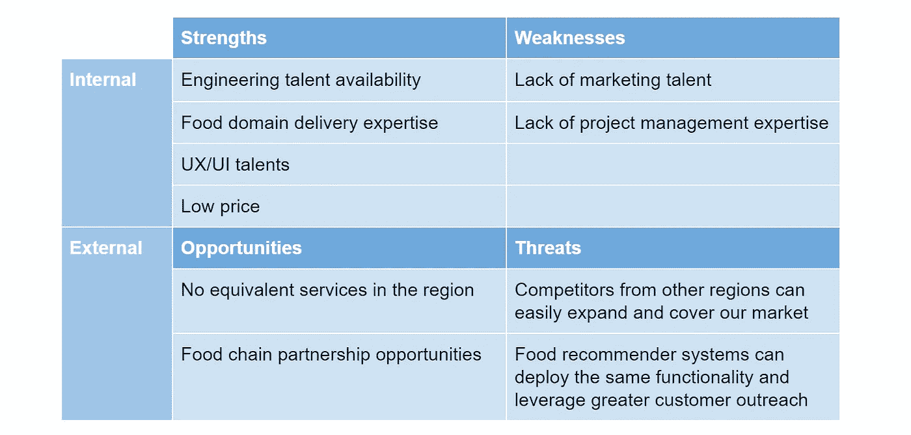
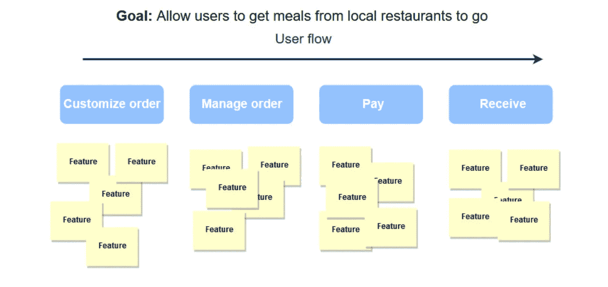
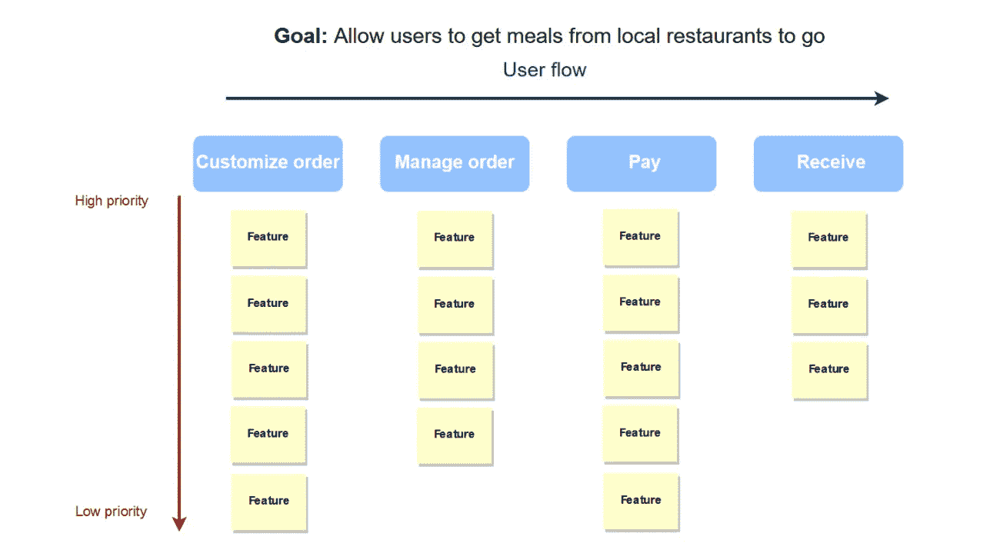
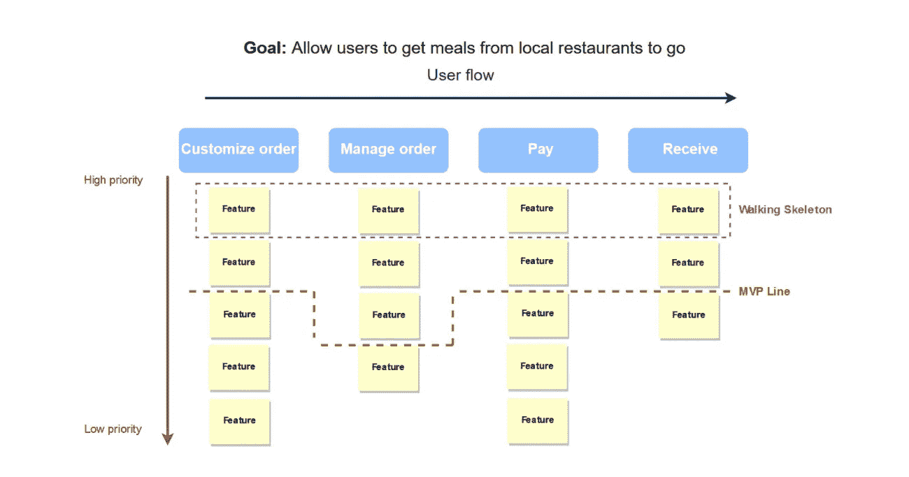

# 最小可行产品:定义最适合的类型、方法，并遵循简单的构建阶段

> 原文：<https://medium.com/swlh/minimum-viable-product-define-the-best-fit-type-method-and-follow-simple-building-stages-3bd0b0d66607>

如果有一本关于最史诗般的创业失败的书，它至少有一千页。每个人都会犯战略错误，即使是亚马逊这样的巨头。2014 年，在 Fire Phone 失败后，它宣布亏损 1.7 亿美元。原因很简单:除了亚马逊，没有人需要这款手机。这个小工具旨在将用户直接连接到他们的购物平台。客户一直使用 iPhones 和 Android 智能手机连接亚马逊。缺乏客户研究对亚马逊来说是一个卑鄙而昂贵的把戏。

如果你想成功，你必须确定你要提供的产品正是顾客所需要的。应该是什么样的？开发一个最小可行产品(MVP)可以给你答案。

# 什么是 MVP？

一个 MVP，或者说一个最小可行产品，是一个产品的最早版本，它只具有所需的特性，足以交付核心价值并向早期客户验证它。基本上，部署 MVP 是为了收集反馈，看看用户是否需要该产品。早期采用者也可以分享他们对功能的看法，这样对客户需求和偏好的洞察将允许开发人员相应地调整产品并计划进一步的更新。

因此，MVP 策略可以降低开发成本以及将不受欢迎的产品推向市场所带来的财务失败风险。

[企业家和《精益创业](http://www.startuplessonslearned.com/2009/08/minimum-viable-product-guide.html)[的作者 Eric Ries](http://theleanstartup.com/book) ，给出了 MVP 的简明定义，强调了 MVP 提供的学习视角。根据他的说法，MVP 是“一个新产品的版本，它允许一个团队以最少的努力收集关于客户的最大量的有效知识。”

重要的是要明白，MVP 战略不是为了满足短期目标而构建一个小产品。这项技术建议开发第一个、最简化的产品版本，供公众使用。对此版本的改进总是基于反馈。构建 MVP 的目标是找出产品应该向目标用户群提供什么样的特性和体验。

# 概念证明(PoC)和 MVP 之间的区别

MVP 不应与概念证明混淆。后者根据行业不同可以有不同的解读。

首先，概念验证不是产品的早期版本。软件开发中的 PoC 描述了旨在发现软件概念在技术上是否可行的过程。团队也可以选择这种方法来确定所需的工作范围和开发的最佳技术，识别可能的技术问题，并找到它们的解决方案。

Dropbox 的创始人德鲁·休斯顿制作并解说了一个关于 Dropbox 如何工作的解说视频。第一天晚上就有将近 75，000 人订阅了它。类似的技术可以通过博客来实现，在博客中，你可以与观众分享你想开发的产品的想法。虽然有些人认为这是 MVP 本身，但我们倾向于将这个解释者归类为 PoC。

MVP 和 PoC 这两个术语是相互关联的，但不能互换。以最佳方式实现的概念验证成为最低限度的可行产品。

# MVP 的类型

构建 MVP 有许多方法。我们来讨论一下主要类型。

**绿野仙踪**(也有人称之为**燧石族 MVP** )。这种最小可行产品的两个名称代表其工作原理。就像燧石族想要创造一个他们有一辆真正的汽车的幻觉，而绿野仙踪使用诡计来假装一个巨大的绿头，一个仙女，一个火球，或者一个怪物，这种类型的 MVP 看起来完全是功能性的。实际上，startupper 手动完成整个工作，而不是使用软件系统，或者在需要时雇佣一个团队。根本没有底层软件，只有一个需要验证的产品概念。

Zappos 的创始人 Nick Swinmurn 已经证明了这一策略的有效性。一开始，他买鞋和租仓库的钱都是零。他在网站上发布了鞋子的照片。一旦顾客开始订购鞋子，他就去商店，买下需要的鞋子，然后发货。在意识到这个项目是可行的之后，他给网站增加了一些功能。

**礼宾 MVP。**选择礼宾 MVP 的创业者也提供了手把手的服务。但在这种情况下，客户知道一个真实的人站在提供的服务后面。[理财规划投资服务 Wealthfront](https://www.wealthfront.com/) 从一个礼宾 MVP 起步。财富前线的员工直接与需要财富管理帮助的客户沟通。与《绿野仙踪》的另一个重要区别是，礼宾类型的目的是产生关于未来产品的想法，提供服务，与客户沟通等。，而不是验证它们。

**零碎 MVP。**渐进的理念是使用现有工具交付价值，而不是构建定制的解决方案。尽管产品原型看起来像一个复杂的产品。你可以使用简单的软件，把它放在一起，并在得到反馈后添加必要的功能。 [Groupon](https://www.groupon.com/) 是零碎 MVP 的一个很好的例子。其创始人安德鲁·梅森(Andrew Mason)推出了一个 WordPress 网站，每天手动发布餐饮交易的图片。他用 AppleScript 生成 PDF 格式的报价，并通过苹果邮件发送给他们。他就是这样验证 Groupon 假说的。

**单一功能产品。**最后，一个 MVP 可以是真正的软件，只有最少的功能，只是验证所需的核心功能。在它的帮助下，你将能够缩小目标群体，接收和分析反馈，并专注于测试。

但是无论您选择哪种类型，创建 MVP 都需要遵循几个主要步骤。

# 构建 MVP 的步骤

一个产品总是从一个想法开始。一个成功的产品和一个不受欢迎的产品的区别在于，一个受欢迎的产品是一个可行的想法通过一个彻底的开发计划转化的结果。

我们提供如何验证您的想法并将其转化为产品的分步指南。您将准备好通过七个步骤开始构建 MVP。《零步》是对主要原理和技术的介绍。第八步和第九步是关于你可以使用的项目管理方法以及你如何测试一个产品。

# 步骤 0。了解基本的 MVP 原则和技术

在任何实际工作之前，值得花一些时间来概述基本的 MVP 原则和技术，然后确保您的团队在整个过程中遵守它们。以下几点对于您的 MVP 计划的所有阶段都至关重要。

试着花尽可能少的钱和精力。MVP 的整个想法是减少验证你的商业想法所需的时间和资源。确定最简单的 MVP 类型，它足以产生反馈并坚持下去。

**注重培养意识。**利用尽可能多的媒体渠道，确保你有足够数量的早期用户。这可以在您的 PoC 活动中完成。

**尝试预售产品。**你可以使用 Kickstarter、其他众筹平台，或者直接销售你的产品，以达到两个主要目标。第一个也是最重要的一个是获得反馈，第二个是将这笔钱投入到进一步的开发中。你可以首先看到人们是否喜欢这个产品的概念。

每时每刻都在采访客户。无论您处于哪个阶段，都要花时间与您的潜在客户面谈，以便在第一个线框图时就开始调整，并保持积极的面谈，直到您从 MVP 阶段过渡到 1.0 版本。之后，您仍然应该遵循这一实践，但是用 A/B 测试和其他高级验证方法来增强它。您可以使用在线调查表或与客户面对面交谈。阐明正确的问题不仅有助于你了解困扰用户的问题，还能确定这些问题是否值得解决。询问当他们面对问题时，什么最让他们不安，为什么，他们最后一次经历是什么时候。让他们告诉你他们是如何试图解决问题的，以及他们对所用解决方案的不满之处。

**建立一个反馈回路。**您通过访谈或其他渠道获得的反馈应该是系统的，并对您的产品产生真实的短期影响。跟踪所有的反馈，进行归纳，并将您收到的想法转化为团队的具体任务。

除了原则之外，要建立一个反馈环，你应该考虑让你的用户尝试产品的主要渠道，并提供分享他们的想法和关注的方法。

**创建一个登陆页面。**该页面应包含产品及其功能的描述，以及免费和付费解决方案的注册表单。通过登录页面，您可以为您的产品定义最佳定价。

使用社交媒体。鉴于你已经获得了足够的关注，脸书、Reddit 和 YouTube 等平台将是最直接的见解来源。我们也建议使用博客工具，无论是自有的还是公共的，比如 Medium。

开始一场广告战。你可以使用诸如谷歌、脸书和推特这样的平台来看看 MVP 是否到达了它的目标受众。这些广告平台有非常灵活和详细的细分能力，所以你可以通过瞄准多个狭窄的用户群来测试你的人物角色假设。

# 第一步。定义一个你想解决的问题

你应该做的第一件事是阐明产品的目的。尝试简单地回答这个问题“我需要这个产品做什么？”一旦你用几个词清楚地表达了产品带来的价值，你就可以进入下一步了。例如，如果您想要开通一个送餐服务，您想要解决的问题可能听起来像这样:“允许用户从本地餐馆获得外卖。”

# 第二步。定义目标受众并缩小范围

试图满足最广泛的人群是一个错误。增加你的机会，选择你想提供产品的特定受众。创建一个完整的描述，描述一个不仅会喜欢你的产品，而且会毫不犹豫地购买它的人。你应该知道这个人的年龄和受教育程度，他或她以什么为生，以及这份工作给他或她带来的收入水平。习惯和爱好将完成对潜在客户的描述。要了解更多关于创建买家角色的信息，请查看我们关于[在 SaaS 创业](https://www.altexsoft.com/blog/business/starting-a-saas-business-9-steps-towards-success/#utm_source=MediumCom&utm_medium=referral)的故事。

对顾客生活方式的了解使你能够发现你未来的产品是否与他或她所面临的问题一致。

# 第三步。评估你的竞争对手

不要高估你的产品的排他性，尤其是当你知道在你的行业中还有其他公司的时候。评估你的竞争对手。找出他们的优点和缺点来定义你未来产品的功能。你也可以根据他们争夺市场份额的方式对他们进行分组。

**定义你的竞争对手以及他们提供的附加值。**分析你的三大竞争对手是谁，他们进入市场多久了，他们提供什么产品或服务。确定他们是否有竞争优势，并评估你提供更好东西的能力。

**找到自己的市场份额。**你应该研究他们过去和现在的战略、销量、收入、财务和营销目标。这些数据将有助于你了解他们的盈利能力和成功程度。

利用第一手和第二手信息来源。各公司分享的信息是最可靠的主要分析来源。访问他们的网站，阅读演示文稿、白皮书、年度报告、博客、广告材料和其他出版物。第二来源的信息，如杂志和报纸文章，视频，调查报告和书籍，代表了公众对球员的看法。尽管这些来源可能不如原始来源可靠，但它们可以让你对这个行业有一个更全面的了解。

**深入挖掘。不要犹豫，去参加竞争对手参加的商业活动，联系他们的前雇主，当然，使用他们的产品并分析反馈。**

使用分析软件。各种在线竞争分析工具将让您的生活更加轻松。像[相似网](https://www.similarweb.com/)、 [Ahrefs](https://ahrefs.com/) 、 [Quantcast](https://www.quantcast.com/) 、 [App Annie](https://www.appannie.com/en/) 或 [AppFollow](https://appfollow.io/) 这样的服务收集网站和应用的数据。有了它们，你可以找到竞争对手的应用或网站的排名，它的月流量，受众兴趣，客户的地理位置，并看到相关的产品。

一些现有的工具免费提供基本功能。其他的，像 [Moz](https://moz.com/) 和 [SensorTower](https://sensortower.com/) ，都是基于订阅的。

当你知道关键市场参与者的弱点和优势时，你就能知道是什么让你的产品独一无二，或者是它缺少什么。

# 第四步。做 SWOT 分析

SWOT 代表优势、劣势、机会和威胁。虽然该框架通常应用于成熟公司的战略规划中，但它足够简单，可以用来验证 MVP 的想法。为了进行 SWOT 分析，你需要客观地回答一系列与上述类别相关的问题。让我们看看上面提到的送餐例子的 SWOT 分析是什么样的。

*SWOT 分析的最佳实践是保持描述简短，便于所有团队成员理解*

SWOT 分析的目标是将精力集中在优势上，定义和最小化劣势，避免威胁，以及利用现有的机会进一步发展。优势和劣势通常与内部因素有关。反过来，机遇和威胁是外在的。

它还帮助公司分析竞争对手和选择市场定位。

# 第五步。定义用户流

用户流是用户在使用产品时实现其主要目标的途径。而这条路必须是逻辑清晰的。

用户流是网站或应用程序的内容和设计要求的指南。你应该了解客户在使用你的产品建立良好的用户流时期望得到什么。如果用户需要的话，一定要给他们提供一些额外的信息，并找出可能会阻止他们进入下一步的不情愿因素。

例如，让我们列出用户必须完成的任务，以实现我们在步骤 1 中陈述的主要目标，从当地餐馆获得外卖。用户流将是:*定制订单，管理订单，支付餐费，接收订单*。确定步骤后，就该为每个步骤定义特性了。

# 第六步。创建一个功能列表，并根据它们的优先级排列它们

您需要列出未来产品所需的所有功能。故事映射(或者用户故事映射)技术将在这个计划阶段帮助你。顺便说一下，这在上面的用户流例子中有所体现。

故事映射是管理用户故事的二维方法。它允许专注于部分功能，同时不丢失产品的大画面。

这项技术是为了帮助开发者主要从用户的角度选择有用和有价值的特性。它的作者和实践者， [Jeff Patton](http://jpattonassociates.com/wp-content/uploads/2015/01/how_you_slice_it.pdf) 建议，一个特性描述应该包含一个人完成的动作，而不是实现它的方法。

我们列出了用户在我们产品的帮助下解决问题的四个步骤:*定制订单、管理订单、支付餐费、接收订单。*

现在我们必须描述每一步的特点，并把它们写在卡片上。

例如，要定制订单，用户可能需要:

*   选择她或他居住的地方
*   选择一种菜肴
*   选择一家餐馆
*   选择一道菜
*   选择一种饮料
*   阅读所选项目的描述
*   将订单添加到购物车

完成描述后，画一条横线显示用户流程，在地图上放置主要步骤及其特征。

*这些功能在这个阶段还没有被优先考虑*

现在让我们区分特性的优先级。你应该弄清楚这个功能有多重要，有多有价值，这个功能用的频率有多高，有多少用户会用，风险有多大。

一旦你按照优先级排列了功能，画一条垂直线，把它们放在它们应该在的地方。最重要和最常用的应该在列表的顶部，最不重要的应该在底部。

*确定优先级有助于定义 MVP 的范围*

# 第七步。定义 MVP 的范围

确定了特性的优先级后，您就可以定义 MVP 的范围了。地图上的第一个水平行被称为行走的骨骼。行走骨架是缺少实体(即功能)的产品的最小可用版本。我们应该先造一个行走的骨架。

在某些情况下，MVP 与行走骨架一致；有时候 MVP 有一些功能。为了理解最小可行产品 walking skeleton 和它的进一步概念之间的区别，您应该将特性分类在必须拥有、最好拥有和不会拥有的标题下。

现在画一条线来区分核心特征和不重要的特征。你给最高等级的特征代表 MVP。其余的可以在 MVP 部署和反馈分析之后添加。

*随着功能的优先化，您可以开始工程设计了*

# 第八步。选择最适合的管理方法并设计 MVP

有了确定的工作范围，您最终可以开始开发最小可行的产品。现在让我们来看看哪些项目管理方法适用于构建 MVP。

**枭雄。**精益是[敏捷软件开发方法](https://www.altexsoft.com/whitepapers/agile-project-management-best-practices-and-methodologies/#utm_source=MediumCom&utm_medium=referral)中的一种，它基于几个核心原则:消除浪费、尽可能快地交付、强化学习、在项目中建立完整性。实际上，精益通过构建-测量-学习模式应用迭代开发。有了精益，开发人员可以推迟大部分的设计决策，建立一个快速的反馈循环，并确保他们构建一个需要的产品。

**Scrum。Scrum 是软件开发的另一种迭代方法。它依赖于工作范围的有效划分，这有助于团队更快地交付。你可以在 sprints(大约两到四周的短周期)中管理 MVP 的特性开发，并雇佣一个 scrum 大师来监督整个 Scrum 过程的运行。MVP 可能在第一次 sprint 之后发布，开发团队可以在后续所有 sprint 中根据用户的反馈更新产品。虽然 Scrum 比精益更耗时，但它可能对工程师来说压力较小，适合长期的增量开发。**

**看板。**看板专注于在制品模型，与精益和 Scrum 不同，看板没有循环进展。相反，看板建议在任务出现时关注它们。这使得工作范围与团队能力相一致。基本上，当工程师从用户那里得到反馈时，他们可以不断地向管道添加任务。看板可以在 MVP 的第一个版本发布后应用。如果反馈是持续的，这将是一个强有力的方法。

**极限编程。** XP 是一套工程实践，如代码重构、小版本、简单设计、编码标准，允许在尽可能短的时间内改进代码并升级。XP 的开发周期不超过一周，因此您可以快速交付第一个版本，然后进行扩展。XP 将非常适合严重依赖代码质量的 MVP。

选择一种迭代开发方法是至关重要的，因为它允许您构建一致的反馈循环。

# 第九步。应用 Alpha 和 Beta 测试

Alpha 是一个所谓的内部测试:一个有限的人群，主要是朋友和家人，评估一个产品。如果一个产品通过了这个测试，你可以进行测试，让真正的用户试用一个产品一到两个星期。分析反馈并决定你需要添加或替换什么功能来使产品更好更复杂。

在你收集了足够的反馈后，你可以开始升级产品，测试它，并再次收集反馈。构建-测试-学习周期的数量和时间框架取决于产品。在你完成多个周期后，你可以回到第 0 步，或者继续迭代改进你的产品。

# 最后的建议

MVP 扮演了一个安全气囊的角色，并为预测产品的商业和技术潜力及其实现提供了机会。它让你有机会根据事实而不是假设做出业务和技术决策。因此，在市场上测试概念或产品是建立 MVP 的关键目标。

***最初发表于 AltexSoft 的博客:*** [***最小可行产品:定义最适合的类型、方法，并遵循简单的构建阶段***](https://www.altexsoft.com/blog/business/minimum-viable-product-types-methods-and-building-stages/#utm_source=MediumCom&utm_medium=referral)

**

## *这个故事发表在 [The Startup](https://medium.com/swlh) 上，这是 Medium 最大的创业刊物，拥有 292，582+人关注。*

## *在这里订阅接收[我们的头条新闻](http://growthsupply.com/the-startup-newsletter/)。*

**