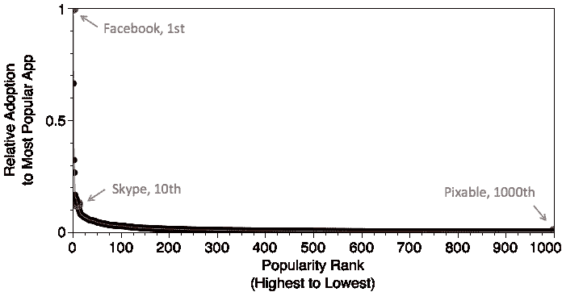

# 移动应用开发者正在遭受痛苦

> 原文：<https://medium.com/swlh/mobile-app-developers-are-suffering-a5636c57d576>

> “只是太饱和了。采用和货币化的障碍太高了。在网络上更容易。”

我的朋友在描述他的公司为何停止开发原生应用时说道。在网上做生意更容易。这怎么可能？基于浏览器的网络应用生态系统已经存在了 20 多年，而应用生态系统只存在了 6 年。有一点可以肯定，不是因为网站比应用少。

然后，我的脑海里浮现出这个“饱和”的概念。如果有人记得高中化学，饱和是一种溶液不再能够吸收新的化合物的状态。例如，你可以继续将盐搅拌入水中，直到溶液饱和，此时无论你怎么搅拌，任何新加入的盐都会立即沉入底部。在某种程度上，水已经有了足够的盐分。

为什么移动应用程序媒介已经被应用程序饱和，而移动网络仍然能够吸收更多的网站？在这一点上我们能做什么吗？

# 手机 App 生态有多差？

在 Branch，我们为应用程序开发人员创建了深度链接标准，帮助公司推动业务增长和重新参与。每天有 5 亿人通过分支网络上的数千个应用程序访问应用程序。我们可以直接看到这个问题。

我看了一下 iOS 应用商店前 1000 名非游戏的相对流量(以相对总排名衡量)的细分，结果令人震惊。请看这张图表:

*The punishing app adoption power law*

正如你所看到的，当你接近第十大最受欢迎的应用程序(Skype)时，它的流量只是排名第一的应用程序(脸书)的一小部分。当你接近第 1000 个应用程序(Pixable)时，你只占第一个应用程序总采用率的 **0.2%** 。

现在，后退一步。在过去的四周里，仅向 iOS 应用商店提交的新应用就有 4.5 万个。他们中的任何一个进入前 1000 名的机会实际上是 0%，即使他们做到了，他们仍然没有看到任何数量的流量来建立一个成功的业务。

货币化是一个更糟糕的故事，因为这是大多数应用程序计划支付租金和保持运行的方式。根据 Activate 进行的[研究，前 20 名应用发行商，占所有应用的不到 0.005%，赚取了所有应用商店收入的 60%。哎哟。](http://www.slideshare.net/ActivateInc/activate-tech-and-media-outlook-2016)

这些类型的数学关系被称为*幂律*，通常用于解释 80/20 法则背后的现象(80%的值集中在 20%的分布中)。更一般地说，幂律将解释为什么价值集中于生态系统的一小部分。

应用生态系统有一个极其苛刻的权力法则，应用的采用和货币化严重向前几个应用倾斜。离 80/20 还差得远呢。事实上，看起来更像是 99%的价值都集中到了最顶端的 0.01%。姑且称之为 app store 99/0.01 法则。

这表明应用商店在 2008 年达到 1000 个应用时就已经饱和了。

# 根本原因:采用壁垒太高

幂律对 app 生态圈到底为什么这么苛刻？收养怎么会这么集中？让我们来看看移动消费者采用应用的典型决策周期。

## 发现有利于被发现者

首先，用户必须发现潜在的新应用。这是迄今为止开发人员面临的最具挑战性的问题。今天有两个发现的入口:1 .脸书主导的付费推广。应用商店本身。最大的问题是，这两种推广形式只对已经被发现的应用有效。

鉴于过去几个月主动安装的[成本增加到 4.14 美元](http://venturebeat.com/2015/10/29/user-acquisition-costs-climb-and-download-volumes-drop-in-september/)，付费推广对大多数应用来说是完全不可持续的。我可以数出应用生态系统中的商业模式数量，这些模式可以支持获取客户的成本。这意味着应用广告只能被生态系统中很小一部分盈利良好的人使用。对大多数人来说，这是一个令人望而却步的渠道。

discovery 有利于被发现者的第二种方式是应用商店的结构和布局。搜索功能是不可用的，除非你知道你要找的应用程序的名称，只剩下两条其他途径:1。主页功能和 2。排名靠前的名单。主页功能是为少数与苹果或谷歌或足够好的品牌有关系的人保留的，但对其他所有人都是禁区。

排行榜是幂律的最大驱动力，因为它们是自我强化的。一旦你在整体或你所在的类别中排名前六，你在应用生态系统中的地位就永远巩固了。排行榜继续吸引新用户，因为它们是用户寻找新应用的主要渠道，让你进一步领先。但是你也看到了，前六名里面有四个已经是家喻户晓了，另外两个是游戏。这不是一个容易打破的清单。

对于最精明的移动营销人员(大多在游戏领域)，这已经引发了所谓的“制图”。你可以在很短的时间内在海外购买成千上万的假安装，试图把你的应用推到分类表的上方。一旦在折叠线以上，你就可以去掉虚假的安装，因为你的应用程序现在将永久地成为前几个精选的应用程序之一。这是一种令人作呕的做法，但它只是向你展示了当今应用程序发现机制是如何工作的。

## 许多拒绝的理由

一旦一个应用被发现，就会有其他力量阻止它被采用。这些主要围绕安装和配置应用程序所需的流程。

app store 页面在显示方面极其有限，只能大幅降低应用程序的转换率。靠近页面顶部的中央是用户评级。如果没有大量的投资和培养，唯一有精力审查和评价大多数应用程序的人是那些体验很差的人。这意味着，除非你积极管理你的评论，否则你的平均评价应该是 2-3 星。没有什么比低评分更让人对你的应用失去兴趣了。

第二，假设你已经努力获得了 4 星评级，你现在必须使用标题、截图和描述来说服别人下载。因为它不是动态的，你不得不尽可能地为所有观众设计最有吸引力的页面。这导致人们使用所有的大写字母、ascii 高亮和其他垃圾来吸引用户的注意力。

*Examples of descriptions attempting to grab attention.*

## 空间太贵了

是否采用一个应用程序的最后一个决定因素是用户是否愿意把他们宝贵的磁盘空间给这个应用程序。大家的手机总是磁盘空间不够用。无论是照片还是占用磁盘空间的应用程序，没有人会满足。

更糟糕的是，手机制造商决定对手机磁盘空间收取额外费用。虽然固态硬盘的大小已经爆炸式增长，在计算市场上已经达到了万亿字节，但 iPhone 的基本型号已经有 16g 了。然后，苹果通过对增加的磁盘空间收费，获得了令人难以置信的利润。举例来说，要将你的 iPhone 空间升级到 64g，你需要支付每 GB 2 美元，而目前固态硬盘的市场价格是每 GB 0.40 美元。

在空间如此有限的情况下，用户正在将他们的个人照片收藏与他们手机上采用的新应用进行比较。

# 破解应用程序采用权力法

随着生态系统处于这种状态，我们将会看到大量的开发者离开应用程序世界去寻找更好的地方。这怎么解决？

## 通过衰变更好的发现

首先要解决的问题是发现。

我建议 app store top charts 采用类似于 Hacker News 或 Reddit 的算法，根据年龄对帖子进行排名衰减。一个应用程序一旦更新，它的年龄就会被刷新。采用活动的数量将决定其排名。随着时间的推移，当应用程序的采用活动放缓，应用程序变得陈旧时，应用程序就会从图表中消失。

这将允许相对采用率较低的应用程序取代下载量较高的应用程序在排行榜上的位置，将它暴露给新一批可以决定是否采用的用户。然后，我们会有新的应用程序不断涌入排行榜，导致应用程序的爆炸式采用，否则可能永远不会有机会。

## 应用缓存和缓存弹出

第二个要解决的问题是通路。

随着应用数量的爆炸式增长，应用体验已经商品化。对用户来说，更重要的是应用程序的实际内容，而不是交付它的外壳。用户可能只使用一个应用程序看一次视频，然后再继续。我们需要一种新的原生应用访问方法，促进应用之间的平稳过渡，打破应用采用障碍。

让我们回到对网络的类比。很久以前，网络上的内容已经商品化，但是访问这些内容的方法是完全无缝的。一个用户每天可能会访问 30-40 个不同的网页，每个网页只需点击几分之一秒的链接即可访问。采用新的网络应用程序很简单，该系统是为临时访问和探索而设计的。

如果 Android 和 iOS 采用与浏览器相似的机制来访问原生应用程序会怎样？一旦用户表达了访问应用的“意图”，它就会立即下载并打开，完全绕过应用商店页面。如果应用程序超过几天没有使用，操作系统可以清理任何与该应用程序相关的已下载文件，以便为新应用程序腾出空间。

“意图”这个词需要下很多定义。例如，如果用户点击 Twitter 上链接到纯应用业务的链接，当前的现状是该链接将重定向到正确的应用商店页面。如果技术上可行，链接点击是一种意图的表达，应用程序应该开始自动下载，在最初点击几秒钟后显示原生应用程序体验中的内容。

应用程序下载可以从浏览器的授权域初始化。这可能是部署新应用程序时审批流程的一部分，以确保质量并防止骗子。当用户点击授权域上的链接时，将显示全屏容器，显示下载进度，直到本地应用程序加载并显示内容。它的功能与网络早期基于 flash 的应用程序非常相似。

# 必须做点什么

最终，命运掌握在[平台](https://blog.branch.io/deep-linking-and-mobile-search-standards)自己的手中，因为它们独自控制这些发现协议的实施。作为对这些商店做出贡献的开发者，我们必须尽自己的一份力量来表达我们的担忧并推动变革。让我们继续努力，希望看到我们需要的改变。如果现状持续下去，预计整体应用质量将停滞不前，开发者将转向其他权力法则不那么扭曲的平台。

*本文原载于* [*科度量博客*](https://blog.branch.io/mobile-app-developers-are-suffering) *。*

发表于*[**【SWLH】**](https://medium.com/swlh)**(***创业、流浪、生活黑客)**

******