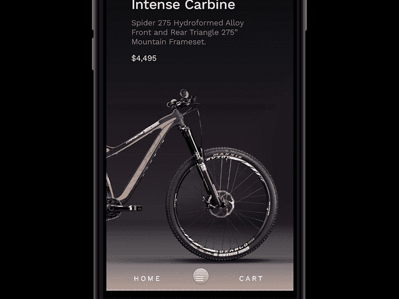
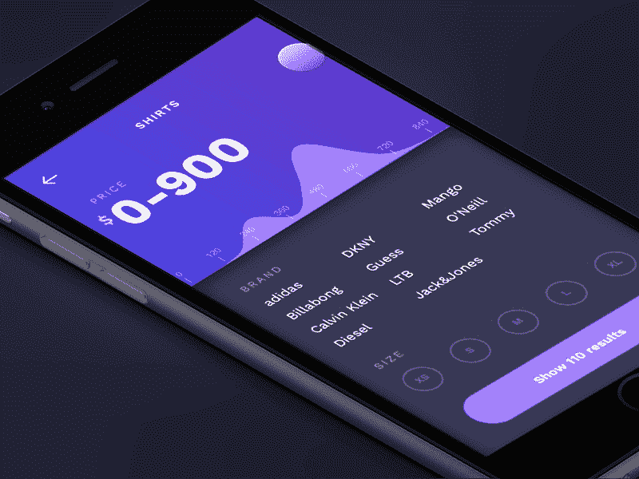

# 移动应用用户:他们今天需要什么？

> 原文：<https://medium.com/swlh/mobile-apps-users-what-they-need-today-70a695fabf6>

在应用程序出现的初期，人们把它们视为技术的奇迹，而现在用户认为应用程序是理所当然的，并对它们提出了更高的新要求。我们都与充满应用程序的智能手机密切相关，以至于一个新的职业[向导](https://www.youtube.com/watch?v=v6Wpc9s35ZY)即将出现。事实上，移动用户的行为已经发生了变化。让我们看看怎么做。

# 他们期待现场互动元素

用户不喜欢厌倦静态屏幕。为了吸引用户的注意力和兴趣，元素应该移动。现代应用程序的按钮、字段、图标旋转、闪烁、突然冒出来以提供某些信息。通常，这些信息属于以下类型之一:

*   解释用户所做的运动，
*   提示在下面的步骤中，
*   指定动作是否完成。

因此，设计师通过应用程序引导用户，帮助根据需要的场景创建交互。

# 他们期待个性化

最伟大的销售人员非常了解与客户有效沟通的心理技巧，这些技巧有助于激发信任和同情，尤其是使用一个人的名字的力量。这是[科学证明的事实](https://www.ncbi.nlm.nih.gov/pmc/articles/PMC1647299/)当听到自己的名字时，大脑有独特的功能激活。

今天的个性化对用户来说很正常。此外，他们希望与他们互动的应用程序会以这种或那种方式使用提供的个人信息，以使生活更轻松。例如，亚马逊根据用户的购物历史向用户推荐应用主屏幕上的商品。

# 他们希望简化认证和注册

许多网络服务和应用程序需要注册才能充分利用它们。填写长表格，等待电子邮件，键入伪装成最佳传统的代码——这个过程严重考验客户的耐心，尤其是考虑到移动可用性。

奇怪的是:一方面，用户希望访问网络服务或应用程序，并输入他们的个人信息，希望这些信息不会落入坏人之手，另一方面，所有安全预防措施的注册被视为一个不幸的障碍。

开发者如何从中走出来？一些应用程序通过社交媒体帐户提供注册，一些应用程序使用带验证码的一次性密码，一些应用程序期待面部和语音识别技术。

# 他们想要保护他们的数据

世界已经变了。大多数人在脸书、推特、Instagram 上都有账户。企业有网站和本地网络。甚至奶奶也可以谷歌她喜欢的刺绣方案。这种进步使我们依赖于信息，同时也容易受到黑客攻击和信息泄露。

万维网是全球生活不可或缺的一部分，对个人或商业数据安全构成了威胁，用户意识到了这一点，并希望在使用您的应用程序时得到保护。

# 他们想要数据同步

用户重视他们的时间和舒适度。假设一个用户在办公室有一台电脑，在家里有一台电脑，一台笔记本电脑和一部智能手机。他想继续工作，无论他在哪里，从他离开的地方没有复制。谷歌和苹果已经做了很多工作，尽可能让客户与他们的设备进行舒适的交互——一个帐户可以访问服务或云存储，允许用户在所有设备上立即获得电子邮件、消息和通知。

然而，仍然没有已安装应用程序的列表，没有同步设置可言，因为每个设备本身都可以访问一个数据云。明年可能会带来新的解决方案，比如 web 和移动应用程序开发中的数据同步。

# 他们希望通过应用程序来预测需求

几年前，谷歌 9.19 版本的移动设备地图应用已经学会了使用位置历史和网络搜索来[计算假设的目的地](http://time.com/4178860/google-maps-new-feature/)。今天，移动键盘可以分析输入的文本，并随后对下一个单词提出建议。Apple Watch 会持续监控和分析你在各种情况下和身体活动中的动作和心跳，并可以精确预测你早上醒来的时间，何时播放你最喜欢的歌曲或何时提醒你锻炼。没有巫术，只有技术进步。

多亏了[机器学习](https://anadea.info/blog/artificial-intelligence-pandoras-box-or-the-holy-grail)，移动应用程序将会逐年改进以适应用户。然而，由于移动设备的处理能力不足，移动软件还不能自我学习。尽管如此，移动应用程序中的机器学习在不久的将来会出现，专家认为这种创新技术将很快主导 IT 市场。

# 他们想要点击、滑动、拖动和挤压

与第一部手机互动的唯一方式是按键。但那是 10 年前的事了。点击按钮变成了敲击，然后演变成手势。手势控制感觉起来自然而直观，因为它符合我们与真实物体互动的方式。例如，当我们想把某样东西藏起来时，我们就去偷。

此外，通过手势控制和更少的按钮，移动应用程序开发人员可以获得更多空间来显示有价值的内容和提高移动应用程序的可用性。根据 Dan Mauney 进行的手势研究，人们试图使用相似的手势在智能手机屏幕上执行特定的动作，无论他们生活在哪个国家，拥有什么文化，使用什么移动设备。

# 他们喜欢语音控制

在最初几十年的电话服务中，要打电话，你必须告诉电话接线员你想要的用户的号码，然后她就给你接通电话。然后这个过程被自动化了，语音控制以语音识别和各种语音助手的形式回到了我们身边，比如 Siri 或 Cortana。

从 2016 年开始，语音控制的流行程度正在上升，这是可以理解的——绕过界面与移动设备进行交互的可能性是最直观的，当然，除了心灵感应。 [Statista 显示](https://www.statista.com/statistics/861305/interest-in-purchasing-online-using-voice-control-netherlands-by-age/)千禧一代(18 至 35 岁之间的人)使用语音控制在线购买商品的可能性是 36 岁用户的两倍。

# 结束语

可以看出，随着技术的发展，用户的要求越来越高。他们期望更多的适应性，更多的个性化，更多的交互性，总之，更多的以用户为中心的设计。为了消除在技术上被排除的风险，选择与时俱进并考虑到客户变化的[应用开发商](https://anadea.info/services/mobile-development)。

*最初发表于*[*anadea . info*](https://anadea.info/blog/the-portrait-of-modern-users)*。*

## 这篇文章发表在 [The Startup](https://medium.com/swlh) 上，这是 Medium 最大的创业刊物，拥有+386，297 名读者。

## 在这里订阅接收[我们的头条新闻](http://growthsupply.com/the-startup-newsletter/)。

