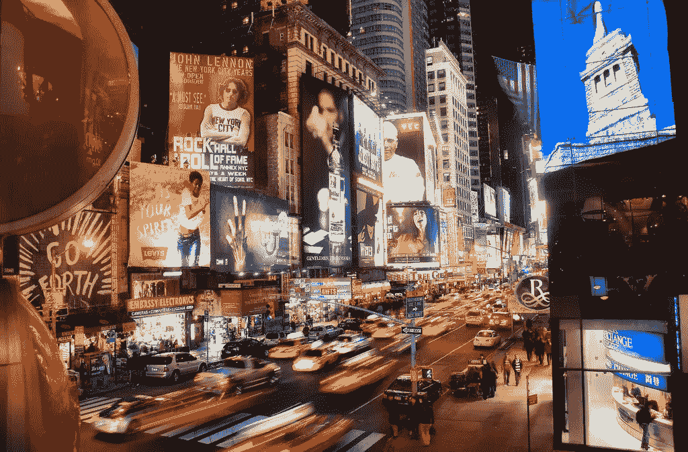
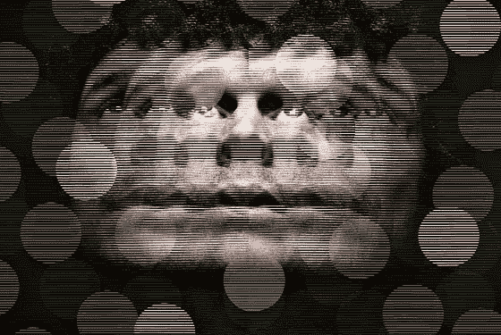

# 移动设备——无聊的加剧还是消除？

> 原文：<https://medium.com/swlh/mobile-devices-an-intensification-or-the-abolition-of-boredom-d003b6e3ed88>

Mobile Devices and Boredom

# 孤独无聊

> “当你走过校园，甚至穿过街道时，你自己的思想和你周围的世界是否会让你尖叫着被遗忘？当你习惯了持续的刺激，当你缺乏刺激时，你有点不知道该拿自己怎么办。[……]当我们不习惯有休息时间时，就会产生焦虑。天哪，我应该做点什么，”我们伸手去拿智能手机。这是我们无处不在的解脱。”——(林恩，2012 年)

我们都上瘾了。每个人都知道一条假想的链条不断将我们束缚在电子设备上的感觉。当我们经历无处不在的分心时，我们的思想几乎无意识地从最初的焦点转移到下一个焦点。媒体景观的快速发展带来了新技术的广泛应用，最终改变了我们的生活、交流方式，最重要的是，改变了我们大脑的功能。然而，对数字媒体的潜在认知困扰并不是阿瑟对人类思维的威胁，而是开启了工作、社交和信息处理的新方式。总的来说，这篇短文讨论了这种新技术，具体来说是移动设备，对人类日常生活的影响。准确地说，它探索了一个假设，即通过无处不在的分散注意力的来源，无聊的认知状态已经发生了根本的变化——如果不是加剧的话。随后，我们讨论了这种影响如何危及自主思维，以及相比之下，它如何仍然可以被视为一种积极的转变。

为了获得对主题的全面理解，我们需要对术语*厌倦*有一个初步的概念。虽然《牛津英语词典》(Oxford English Dictionary，2017)将其正式定义为“无聊的状态”(Oxford English Dictionary，2017)，但这种心理尝试可能会提供更多信息。早在 1903 年，德国心理学家西奥多·立普斯就试图对厌倦进行定义，他声称厌倦“是一种不愉快的感觉，产生于强烈的精神活动需求与缺乏刺激或无法被刺激之间的冲突”(Live Science，2012)。因此，一个人经历了对精神活动的强烈渴望，然而，一个人并不知道他明显渴望的是什么。正如立普斯用这个定义暗示的那样，意识和注意力是无聊的核心方面。当一个人感到无聊时，他们要么无法关注内心的刺激，要么意识不到可以产生令人满意的活动的外部信息。总之，每一个无聊的例子都包含着意识的失败。(Live Science，2012)我指出这一点的主要原因是纯粹的*孤独*和*无聊*之间有着明显的区别。孤独只是指“独处的荣耀”，无聊是一种感觉缺乏活动的被动状态。因此，一个人可以独处而不感到无聊，反之亦然。在阅读过程中，你会注意到这种差异的重要性。

# 我们为什么会无聊？

然而，主要的问题仍然没有解决:为什么我们这么快就厌倦了？凯瑟琳·海尔斯在*的《超深度关注*中给出了这个问题的证据。她认为，认知模式出现了一代人向过度注意力的转变，其特征是“在不同任务之间快速切换注意力，更喜欢多种信息流[和]寻求高水平的刺激”，她说。总之，人们越来越多地通过划分和转换各种活动来寻求多种高水平的刺激流，以保持这种高度。人们所认为的多重任务其实是“不同任务之间的快速交替”。

New York Times Square

然而，这种对超媒体的内在渴望的潜在原因还不清楚。此外，海尔斯认为，我们成长的环境对我们的大脑有决定性的影响。不仅仅是我们的想法，更重要的是我们的思考方式也受到了根本性的影响。她写道:“在媒体丰富的环境中长大的儿童，其大脑结构与没有在这种环境中发育成熟的人完全不同。”。考虑到进化适应，这种观察是可以直观解释的。由多方面、快速变化和高感官情境决定的当代环境，越来越需要适应性的超注意力来克服这些挑战。因此，过度注意的兴起源于人类大脑和不断变化的环境之间的共同进化似乎并不牵强。正如引言已经指出的那样，我们所寻求的持续(过度)刺激会让我们一离开“你自己心灵的赤裸空间”就感到厌倦。

# 心灵的厌倦

到目前为止，还没有人对无聊这个问题提出明确的批评。虽然每个人都知道其中有一种莫名其妙的奇怪感觉，但无聊并不是什么坏事。然而，考虑到上面提出的论点，人们可以推断，现在纯粹的孤独是令人厌烦的。当我们沉浸在自己的思想中时，我们不会觉得多渠道的信息流是首选，因此会感到缺乏或渴望刺激——或者我们所说的无聊。一个现代的标准化现象是立即转向移动设备来克服这种感觉缺失。因此，令人不安的事实是，M 一代已经失去了长时间思考亲密感觉的能力，从而变得无法为自己的心理状态创造一种感觉。这并不是说人类的思想能提供的刺激种类太少，而是我们变得不知道如何捕捉和使用可用的手段。但为什么我们宁愿一遍又一遍地玩手机游戏、漫步脸书或阅读电子邮件，而不是让我们的思想开小差呢？

雪莉·特克尔关注的是越来越多的人无法保持孤独，以及由此带来的社会后果。在她的书*reclaming Conversation*中，她指出了人们在独处时倾向于使用移动设备的另一个原因。她认为“是焦虑让他们回到了手机前”。在她的理解中，人害怕独处有两种不同的方式。首先，深度内向的思想涉及到具有自我意识的职业。这是一个人让心灵漫游的时候，与所有外部影响断开，当一个人探索隐藏的焦虑，秘密的恐惧并摆脱虚假的自我。她说，这大多是令人不快的想法，但对于建立诚实的自我反省却至关重要。其次，人们害怕与外部世界脱节。他们感受到的是孤独而不是寂寞，同样，他们也需要融入虚拟的社会世界。其结果是，在当代的理解中，独处包括与你的移动设备独处。但是，一个人没有练习社会互动和建立团结感，而是逃到虚拟构建的安全区，创造一个旋转隔离的世界。

# 对抗无聊

于是，基于上面提到的种种原因，人们逃向了手机，而不是无聊。然而，我认为把自己从无聊中解放出来并不是坏事，但显然是好事，如果方法正确的话。重要的是人们决定如何度过他们的空闲时间。在牢记孤独和厌倦之间的区别的同时，我声称厌倦是一种不必要的精神状态，它导致人们在虚拟世界中成为越来越被动的行为者。

在越来越多的娱乐主导的环境中，三分之二的美国人每天都感到无聊(Live Science，2012)。不仅在单流刺激中，比如文书工作，甚至在家里看电视或浏览我们的移动设备时，人们都会感到无聊。这正是问题的主要部分——我们的社会被过度刺激了。就像恶性循环一样，我们经常接触的刺激越多，我们就越渴望更多的刺激。我们越习惯快速移动和交替的环境，就越不能忍受低强度的刺激。即使在线活动看起来相当互动，但它变成了单调的上下滚动，造成了另一个无聊的来源。(曼恩，2016)

Overstimulation

在这一点上，与尼古拉斯·卡尔的文章*有一个明显的相似之处:谷歌正在让我们变得愚蠢吗？*可以观察到。同样，他注意到一场社会变革正在进行，通过这场变革，思维过程和集中注意力的能力已经发生了本质上的变化。与海尔斯相反，他不仅确定了内部变化，而是将认知模式的转变归咎于外部影响。他说，互联网作为一种通用媒介，通过将活动分成泰勒式的小步骤，决定性地塑造了思维过程。乍一看，工作效率的提高可能会导致截然相反的结果。越来越多地适应类似机器的思维，如谷歌或脸书，使我们的智能越来越多地向人工智能靠拢，让我们仅仅成为信息的被动接受者。信息可用性的过饱和导致大脑成为一个像“信息选择器”一样的被动行为者，没有自主思维。

显然，问题是如何解决这一困境。一方面，过度关注的强烈趋势明显上升，尤其是这些多渠道的刺激是社会所寻求的。另一方面，对机器式行为和思维的快速适应更加剧了厌倦感，从而创造了一个逐渐被动的社会。必须做的是在克服*消极无聊*(我将称之为消极无聊)和通过更多互动或响应活动打破恶性循环之间的复杂平衡。因为我们不能仅仅改变我们大脑的运作方式，我们必须找到方法来产生足够的互动刺激，以满足大脑的需求，并在背后有一个有意义的目的。我基本上想以此引发的是，为了不成为一个无聊的被动演员，一个人必须实现克服无聊的方法，而不仅仅是无意义的活动。这在许多方面对新一代的发展至关重要。由于这一现象，教育、工作实践、社会交往和日常生活的其他各种领域都将经历一场结构性变化——不管我们是否愿意。

# 克服厌倦

在现有的手段下，我认为以教育为目的的视频游戏的实现可以彻底改变现在被认为是消遣的方式。通过这种高感官活动和其背后的有意义的目的之间的相互作用，可以在克服无聊的同时获得实际的好处。在我看来，电子游戏是反应最灵敏的活动，可以保持高度的刺激和交替。在这种情况下，以积极的方式利用休息时间，把自己从无聊中释放出来是可行的。然而，挑战在于改变一个人的习惯，这样就可以避免向脸书、Instagram 等社交世界的即时逃避，并最终被视频游戏所取代。打破常规总是需要改变思维定势。为了以深远的方式实现这一点，社会规范和对视频游戏的看法的转变是必要的。

另一个需要考虑的方面是 Sherry Turkle 在她的论文中指出的恐惧。即使我不打算广泛地谈论这个问题，我认为在这一点上提到它是有意义的。在她的文章中，她提到了独处在移情、自我反思和想象力发展中的极端重要性。正如我同意她的观点，无聊不应该通过简单的在线活动来克服，我不同意我们需要“鼓励我们脱离”的平台。在我看来，人们已经习惯于使用手机，并因此越来越多地将他们的活动分开，这一事实应该被视为一个扭转局面的机会。试图断开人们与他们的移动设备的连接将会以各种方式失败。太多的压力来自硅谷的影响者，移动设备太多的融入了我们的日常生活。相反，应该采用实际的方式来培养创造力和想象力，就像游戏中有开放的边界来成为视频游戏本身的建筑师一样。甚至社会规范和实践也可以通过与虚拟世界的互动来传递。然而，人们必须注意，与社会世界的接触不会失去控制。除了手机带来的机遇，它们也带来了风险，那就是保持纯粹独处的能力最终会被完全遗忘。Sherry Turkle 的观点是正确的，孤独应该永远是人类的一部分，应该从虚拟活动中封装出来。

总之，移动设备是解放无聊还是消除无聊取决于人们的看法。在我看来，在我们的移动设备上对媒体的被动消费导致了消极无聊的急剧加剧。它不仅把我们变成无聊的人，而且把社会变成刺激的被动接受者。相反的情况是，如果可以实现思维定势的改变，用诸如教育视频游戏之类的互动享受来代替这种消费。通过这样做，无聊的恶性循环可以持续地逃脱，无聊肯定会被废除。

## 这篇文章发表在 [The Startup](https://medium.com/swlh) 上，这是 Medium 最大的创业刊物，有 277，994+人关注。

## 订阅接收[我们的头条](http://growthsupply.com/the-startup-newsletter/)。

