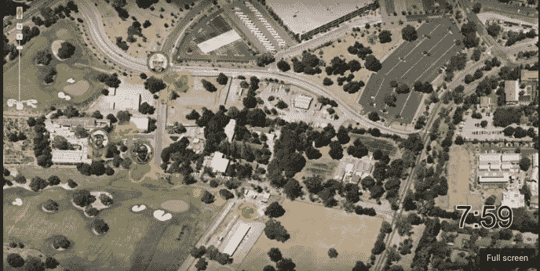
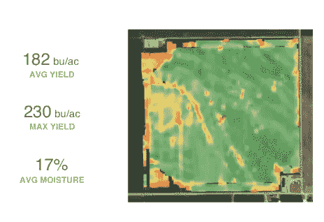

# 移动企业—移动优先和增强现实的下一波浪潮

> 原文：<https://medium.com/swlh/mobile-enterprise-in-2016-the-next-wave-of-mobile-first-540d23f14b95>

移动企业是一个[预计 1000 亿美元的市场机会](http://www.fiercemobileit.com/story/enterprise-mobile-apps-become-100b-market-opportunity-says-venture-capitali/2015-03-31)。然而，迄今为止，高速增长的“移动优先”企业公司主要是关于*屏幕，智能手机是用户处理工作数据的另一个界面，而不是真正利用智能手机提供的所有功能。*

*“移动优先”的下一个浪潮是让应用程序和企业充分利用智能手机特有的功能集— ***从*** ***将地理位置数据自动记录到智能手机摄像头，使智能手机能够增强现实，在更广泛的网络中充当传感器节点—*** 极大地扩大了企业应用程序利用移动的机会。*

## *今天移动优先*

*如今，企业中的“移动优先”主要表现为两种形式:*

***1 —“伴侣-应用”移动优先:**针对大多数专注于知识工作者的横向/生产力移动应用(例如 [Dropbox](http://www.dropbox.com) 、 [Evernote](http://www.evernote.com) 等)。)，被称为“移动优先”的东西通常是核心桌面/网络体验的“配套应用”。“移动”是另一个屏幕的复选框，应用程序必须在该屏幕上(例如，web、桌面、iOS/Android/Windows)才能成功，并且在没有其他平台的情况下具有有限的独立价值。*

***2 —“移动”移动优先:**“移动”移动优先的目标是快速增长的[130 万(美国 1 亿)无办公桌工作者](http://www.businesswire.com/news/home/20150623005073/en#.VYmhfEZB58m)。这些移动应用程序将以前集中在桌面/web 应用程序上的价值转移到智能手机界面作为主屏幕。除了让手机成为主屏幕之外，诸如 [Invoice2Go](http://www.invoice2go.com) 和 [PlanGrid](http://wwww.plangrid.com) 之类的应用还提供了强大的离线功能，使最终用户能够访问文件、运行诊断等。当现场的连通性不确定时。*

*在这种形式下，桌面是“配套应用程序”，作为发票/蓝图的集中记录系统，而应用程序的主要价值则显示在智能手机屏幕上，而不是相反。*

## *下一波:“深度”移动-第一*

*企业中“移动优先”的下一波浪潮是应用程序和企业更深入一层，利用智能手机的所有功能— **“深度”移动优先。***

*在大型行业的垂直游戏中，深度移动优先已经开始出现，以利用智能手机在每个工人口袋中不断渗透的趋势，这些行业此前一直局限于传统的桌面解决方案，甚至是纸笔。*

*例如，在 [~$8.5T 的建筑行业](http://www.prnewswire.com/news-releases/global-construction-market-worth-103-trillion-in-2020-50-largest-most-influential-markets-292235961.html)， [Rhumbix](http://www.rhumbix.com/) 利用智能手机生成的实时位置数据，在工人进出工地时自动收集地理位置数据。这不仅有助于为建筑工地经理提供见解，以帮助优化劳动表现，而且还使每个工人能够准确记录他们的工作时间，以确保他们获得适当的报酬(该系统至今仍主要在纸上和铅笔上运行)。*

**

*[Rhumbix](http://www.rhumbix.com) leveraging the smartphones in every construction workers’ pocket to develop a heatmap of the project site*

*在农业[(世界上最大的行业)](http://www.fao.org/fileadmin/templates/wsfs/docs/Issues_papers/HLEF2050_Global_Agriculture.pdf)， [Farmlogs](http://www.farmlogs.com) 利用智能手机的地理本地功能和地理围栏算法来自动检测何时在田地中进行某些工作，并在农民在他们的数千英亩土地上工作时自动记录信息，并以拖拉机为基础跟踪运动。*

*deep mobile-first 有可能影响的其他大型行业包括[价值 7000 亿美元的卡车运输/车队管理](http://www.logisticsmgmt.com/article/ata_reports_trucking_industry_revenue_tops_700_billion_in_2014)行业(这是 [KeepTruckin](http://www.keeptruckin.com) 正在解决的问题)、价值 4T 的石油和天然气行业、价值 180 亿美元的制造软件行业等等。*

## *下一步是什么？*

*这只是深度移动优先在企业中的开始。我很高兴看到一些利用智能手机各种功能的深度移动优先企业应用出现:*

***1。态势感知/活跃的“地理本地数据”与“历史数据”相结合—** 随着每个员工口袋里的智能手机不断地在后台建立地理本地数据收集的态势感知，有一个独特的机会将这种“活跃”数据与历史数据集相匹配，从卫星数据到从各地部署的越来越多的廉价传感器收集的数据(例如，石油+天然气行业拥有 [~423K 设备，具有蜂窝或卫星连接](https://www.nsslabs.com/company/news/media-resources/internet-of-things-technologies-could-transform-oil-gas-industry/))以提高生产力。*

**

*Farmlogs Field Yield Maps that combines historical and live field data*

*一个示例工作流是将实时卫星图像与从日常工作流中收集的历史图像和地理位置数据进行匹配，当田地中的特定区域表现不佳时，应用程序可以向农民发送推送通知(这是 [Farmlogs](http://www.farmlogs.com) 正在探索的事情)，这为最终用户节省了无数时间。以前，工作流程是让农民穿越他们的数百英亩土地来确定问题区域。*

***2。通过智能手机摄像头增强现实:**想象一个建筑师能够从 [PlanGrid](http://www.plangrid.com) 中提取他们的计划，然后使用他们的智能手机摄像头利用增强现实将计划叠加到施工现场或查看以前的版本(与消费者应用 StarChart 没有太大不同)。*

**

*StarChart Android App that leverages the augmented reality and geo-local GPS data to enable users to point their smartphone camera anywhere in the sky to see constellations. Imagine doing the same for [PlanGrid](http://www.plangrid.com) with construction plans.*

*通过接入智能手机摄像头，PlanGrid 等移动应用程序现在还可以帮助进行空间规划和设计可视化，从而加快迭代周期，并使建筑商能够了解他们周围的环境条件(例如，过去的地震破坏等)。)随着他们的建立。英国的 RoomScan 已经开始探索这一点，通过智能手机摄像头自动创建动态平面图。*

***3。传感器网络工具** —为了成功利用智能手机的所有功能，我们需要创建工具来简化智能手机在更广泛的网络中充当有效节点的能力，并在其上构建企业应用程序，而不必每次都从头开始。*

*在企业领域实现深度移动优先的可能性是无限的。我很高兴看到他们将如何继续发展，不仅进一步挖掘 1000 亿美元的移动企业机会，还帮助员工变得更聪明、更高效！*

**构建深度移动优先应用程序或对下一波移动企业有想法？很想听听这件事*[*@ Vicki Peng*](http://www.twitter.com/vickipeng)*。**