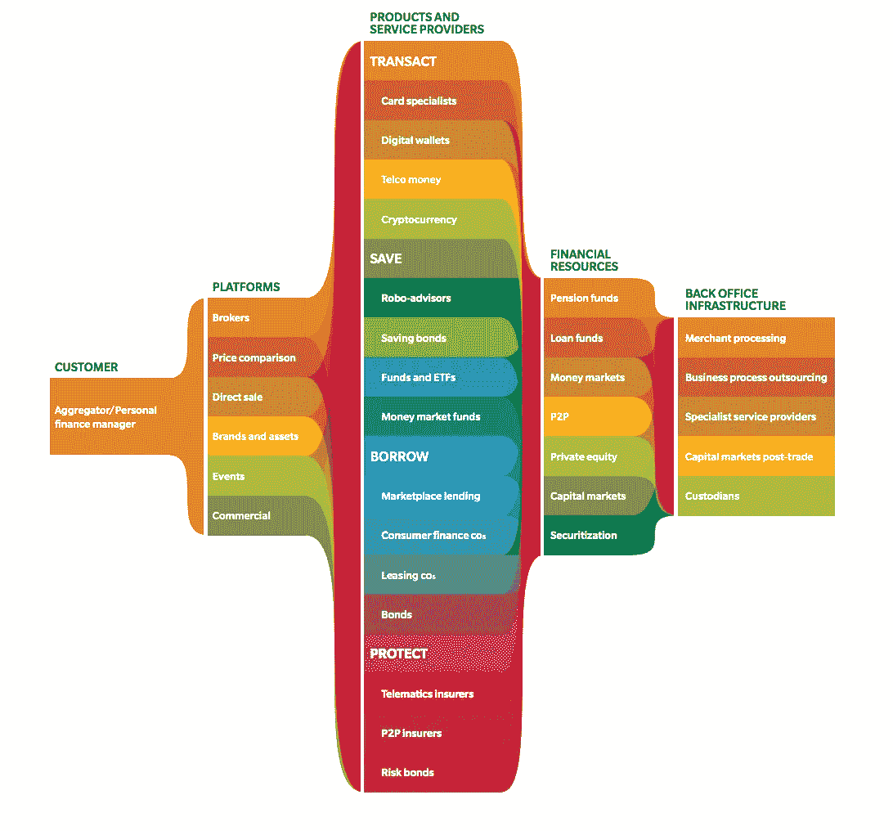

# 模块化银行改变金融科技的结构

> 原文：<https://medium.com/swlh/modular-banking-changing-the-fabric-of-fintech-9ea6084b7173>

十年后，全球金融危机的余震依然存在。其中之一是银行对小企业和临时消费者的便利萎缩。这一缺口很快被金融科技公司填补，而一些服务仍停留在现金驱动的领域。最重要的是，科技发展的突飞猛进使得 it 公司(就像你的公司一样)有可能重塑低调的财务运作。未来是模块化的，这是金融科技初创公司和与之并驾齐驱的传统银行的未来。

如果说过去十年我们在金融方面学到了什么，那就是当前的银行模式是多么脆弱和不稳定。世界金融危机无一幸免。即使你认为你一个人的生活没有受到它的影响，但你生活的环境肯定受到了影响。

> *“干净还是肮脏，海洋依然是一个”——作为一个海洋*

世界经济的动荡使银行业处于危险的境地。一方面，银行必须保持盈利、高效和可靠，另一方面，它们需要通过数字技术颠覆和新方法来应对不信任。

随着#disruption 的威力而来的是变得晦涩难懂的风险，这对于大多数金融机构来说是不可想象的。不管你对创新有什么看法，但当涉及到现金时，我们都是老古董。那么，银行业的数字化创新适合在哪里？手机银行是 UX 最常使用的媒介吗？或者，人工智能算法可以在服务中获得更好的性能？大数据处理用于预测分析和更好的“就绪性”怎么样？事实上，有了银行业最新的增长方法，你可以做到这一切。我们说的是模块化。

# 分裂

由于互联网已经触及了一切，关于这种接触的好处几乎没有争议。“我希望那东西没有联网。”——说从来没有人。像可用性、交互速度和数字化操作的绝对舒适性这样的东西给我们带来了前所未有的压力，我们不愿意交易。

我们正在应对供过于求的选择。我们在这方面很糟糕。丰富的选择使我们对深思熟虑漠不关心。这使得点击诱饵和红旗广告成为可能，最终降低了可用解决方案的多功能性。在这种现实情况下，像一家银行这样稳健、声誉卓著的企业必须找到一种创新的方式，同时保持自己的声誉和传统。

如今，银行服务更多的是用户和其他服务提供商之间的中间件。不同的银行展示不同的功能，用户不得不处理功能上的不断权衡——这是技术一直在努力消除的。首先，搜索。根据自己的搜索标准找到金融机构变得容易多了。无论是推荐、定价，甚至是设计，我们都不需要猜测和问这些问题。只需要一部智能手机。

有了这样的数据，银行变得更加专注于特定领域，只关注客户需求的一小部分是有道理的。这不仅提高了它们的运营效率，还让它们进入了一个重要的客户供应链，从而巩固了利基市场，尤其是在支付领域。

> 这个过程叫做模块化。

银行业的核心是消费者细分市场，它是受移动和智能技术大规模注入影响最大的细分市场，这些技术曾经是一种服务，后来变成了一种体验。突然之间，只用手机就能进出银行变得很正常，这让银行对向客户提供什么以及如何提供变得小心翼翼。企业银行业务的情况有点复杂，它仍然是一个制衡、互利比率、个人协议和历史的游戏。

Image credit: [Zsolt Varga | SEK](https://dribbble.com/Sekond)

目前还不清楚哪种类型的颠覆会带来必要的变化，是分布式账本、移动体验、协作解决方案等。，但它有一些东西让模块化银行脱颖而出。

> *在模块化银行业务中，唯一与传统系统相同的将是银行账户本身。*

无所不包的服务将会过时，取而代之的是一个更健康的、有竞争力的供应商网络，客户可以组装他们的供应。或许，集中式支持系统可以发挥作用，提供传统的银行级安全和服务标准。

# 反弹的机会

自科技和金融业首次联手创造以用户为中心的替代僵化和生锈的银行服务的替代方案以来，金融科技初创公司向市场提供了优质的解决方案，能够处理与传统银行相同的业务，但成本却很低。

事实上，独立的金融科技服务初创公司是银行业的模块，但没有同步以创造一致的体验。例如，您可能使用具有自身功能和逻辑的支付系统来支付租金，然后您使用替代平台(因为返现)来购买杂货，并且您使用第三种解决方案来管理贷款和保险。每个单独的产品都有其独特之处，供应链的每个模块都是根据您的特定需求定制的。

Image credit: [Dana TIleva](https://dribbble.com/ladeviant)

这个概念为银行提供了一个机会，可以索回一些由于缺乏灵活性和令人愉快的 UX 而失去的资产。从这个意义上来说，与个人客户和小企业打交道实在是太难了，所以如果银行真的意识到有机会将敏捷[数据驱动](https://uxplanet.org/ui-design-for-a-data-charged-fintech-app-712c867fb9ca)和高度定制服务的较小提供商整合到他们的生态系统中，他们可能会为未来彻底改造自己。这在中间市场贷款领域表现尤为突出。智能金融科技初创公司在另类 P2P 贷款领域起飞，无需承担传统银行服务和实体运营的费用。

> *虽然有些人可能认为金融科技初创公司夺走了传统银行服务的一大块，但实际上，它们为银行创造了一个提升游戏的机会。*

制度安全是 P2P 借贷的最薄弱环节，而采用模块化改革模式的传统银行完全可以提供这一点。未来没有迹象表明颠覆性趋势会减弱:

*   一种产品带来的顾客期望会投射到另一种产品上。
*   拥有社交追随者的生活服务将进入金融业。
*   AI 只会越来越强。
*   物联网将重新定义我们构建自己网络的方式。
*   区块链仍将是一匹黑马。
*   客户数据将不再是狂野西部的商品。
*   对透明度的要求只会增加。
*   信息技术巨头将继续占领新的市场。
*   在线市场和电子商务，尤其是移动电子商务，将继续增长。

Image credit: [Zsolt Varga | SEK](https://dribbble.com/Sekond)

*银行实施的重大变革可能会再次引发争议。关于这一点的更多内容，包括 6 个颠覆性的银行模式，即将在我们的博客上发布。所以和我们在一起吧。*

# 风景

理解模块化的思想需要把握两个实体:模块化需求和模块化供给。模块化需求就像一个多品牌商店，由消费者决定他们需要哪些产品来实现特定目标。模块化供应就像是商店的物品供应商。他们都是独立的，但在一个特定的客户满意度的逻辑下工作。到目前为止，许多企业都是这种情况，因为零售和服务提供商认识到了模块化方法的好处。

> *然而，金融行业仍然在综合模式下运行。*

据[奥纬咨询](https://twitter.com/oliverwyman)报道，模块化在金融业有四大体现:综合金融机构、模块化需求、模块化供给、完全模块化。

Image credit: [oliverwyman](http://www.oliverwyman.com/)

# 综合金融机构

这是一种“伞形”结构，意味着所有较小的金融服务都是一个主要提供商的一部分。这只适用于市场上的巨头，他们有能力在一个值得信赖的品牌下推出新产品。在这种情况下，在产品的价值被公开证明之前，这个名字就限制了产品。

一方面，这保护了用户免于冒险的努力，因为品牌的整体质量反映在它的所有资产上。另一方面，它给了这些提供商设置服务标准、定价等的最终自由。

> 在亚洲，情况尤其如此，因为声誉在这个地区非常受重视，这使得新的金融科技公司极难进入这个市场。

也就是说，环境正在发生变化，这要求初创公司具备全新水平的敏感度和技术成熟度。

# 模块化需求

这种类型的客户-供应商关系是由供过于求的选择产生的。客户不再属于提供商的循环。默认情况下，客户被视为受过教育，而不是推销冷火鸡式的产品。

> *模块化需求是未来的需求。*

它并不意味着将长期关系作为最终目标，而是关注个案互动的质量和价值。几乎每个创业公司都面临着不唯一的问题，服务不再被发明，而是被重新定义。对于刚起步的公司来说，进入市场的方法之一是成为任何行业的聚合渠道。由于不缺乏提供者，匿名性和安全性成为了人们想要的特性。

# 模块化供应

需求滋生供给。一群知道如何制作东西的好人可能并不总是对很多组织性的东西、日常维护、市场营销等等感兴趣。还可能有一些细节，比如需要某种专业知识的法律法规。这就是模块化第三方供应商发挥作用的地方。

> *模块化供给是木偶大师。但谁在乎呢，只要节目好看。*

它提供了一大堆选项，可以有效地扩大生产规模，卸下企业运营中的一些薄弱环节。

# 完全模块化

多个供应商提供彼此没有特定关系的不同产品。金融产品非常具体，由多个独立来源提供。这种环境可能会给一些高知名度的商业平台带来优势，因为它们可以进入目标市场。

> 完全模块化是达尔文式的市场，你要么赢，要么输。

对于我们来说，发明让我们成功的途径是很自然的。我们手机上的银行应用数量远不及 App Store 或 Google Play 上的数量。我们天生具有选择性，我们没有理由不在没有传统机构参与的完全模块化的金融领域蓬勃发展。我们有执行它的技术。

以下是奥纬咨询(Oliver Wyman)的清晰图表，列出了金融科技初创公司在完全模块化的行业结构中可能涉足的所有领域:

# 该插话了

模块化格式的可行性已经被所有行业的多家初创公司所证明。一般每个玩家争夺客户的行业都是有点模块化的行业。金融也不例外。成功的模块化银行公司提供不同层次的价值，包括:

*   面向客户的产品
*   金融生产的核心
*   后台办公室

它们都在模块中运行不同的进程。面向客户的产品展示界面和体验设计是市场化的，其范围是咨询、研究和所有可能的客户活动。核心部门负责执行、费用、支付处理、风险评估和决策过程。后台办公室是行政部门，负责保存记录、处理交易、与外包服务供应商合作，并且基本上运行对最终用户甚至部分员工隐藏的一切。

> *在打造满足金融服务模块化需求的平台方面，竞争日益激烈。然而，仅有功能性是不够的，体验必须是令人愉快的。*

金融科技可能会在以下几点上提供模式模块化体验:

# 关键力矩解

一些财务决策可以改变生活，但没有很多值得信赖的解决方案可以帮助你做出这些决策。购买房产通常意味着出售以前拥有的房产，这本身就是一项高风险的业务。这里有一个模块化金融科技初创公司的机会。

# 两个零售世界的解决方案

电子商务平台非常擅长处理在线支付和生成数字销售，但是，这些平台可以得到增强，以便为实体店提供额外的功能。反之亦然。在为具有销售点存在的电子市场提供吸引人的和功能性选择的技术解决方案方面存在巨大的差距。我们计划很快写更多关于这种集成的文章。

# 个人金融解决方案

在我们的一生中，我们的财务状况会发生变化。我们尚未见证终身理财规划师/助理的出现。为了让它不仅仅是一个监控和分析工具，它必须展示由人工智能和人工智能驱动的预测功能。这个过程可以在后台运行，借助你的银行账户和你使用的其他模块化金融解决方案，数据是安全的和隐私的。这种类型的金融科技创业公司处于尖端技术的交汇点，在未来可能会产生巨大的价值。

# 商业金融解决方案

即使在一个商业组织中，也有不同的资金流动，它们并不总是融合在一起。进出口、零售、人力资源、法律事务、税收等业务可以在提供特定细分服务的不同金融科技初创公司之间成功模块化。甚至可能有一个解决方案来集中所有这些提供者的输出。

Image credit: [Shakuro Design](https://dribbble.com/shakuro)

非线性金融科技初创公司有一些东西是我们[仍然无法理解的，尽管我们参与了一个巨大的金融科技平台的开发超过 5 年。这就是智能金融科技平台的灵活性和不可预测性。它们不会像传统银行那样变得僵硬，而且极其可控，对不断变化的需求保持敏感。](https://shakuro.com/)

由于金融科技平台固有的灵活性，最新的 UX 设计原则以及所有新兴技术都可以用来获得竞争优势。在构建 [MMKT](https://www.crunchbase.com/organization/mmkt-exchange#section-overview) 平台的过程中，我们做了很多改变，包括彻底的品牌重塑、创造移动体验、增加大量幕后功能。

# 为什么这一切都值得

对于希望在市场上拥有发言权的小型科技初创公司来说，模块化金融科技是一个很好的机会之窗。银行业和金融业的同业竞争如此激烈，几乎不允许任何人进入。然而，如果你选择垂直发展方向，这可能是你需要的颠覆路径。重视长期前景的人会非常欣赏对某个特定财务方面的深入了解。谁说一旦你开创了一项特定的服务，就不能扩展到其他方面呢？

在金融科技大放异彩的每一个机会中，都有一些当前银行已经可以做的事情，而无需进行自我革命。自 19 世纪初以来，银行的声誉是它们最宝贵的资产。

> *考虑将模块化金融科技初创公司带来的所有较小价值纳入一个传统机构的坚实边缘，以提供安全和信心。*

这将有助于银行专注于交易和创造资本，而不是靠别人的钱过活。与提供更好功能的独立平台竞争，而其成本只是银行成本的一小部分，将使他们一事无成。相反，成为规模较小且可靠的初创公司值得信赖的保护伞，可能是巩固它们在未来世界金融结构中地位的一种方式。

## 这个故事发表在[的创业](https://medium.com/swlh)上，这是 Medium 最大的创业刊物，有 362，117+人关注。

## 订阅接收[我们的头条新闻](http://growthsupply.com/the-startup-newsletter/)。

