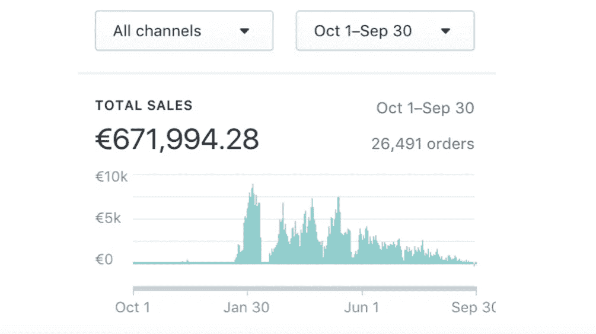
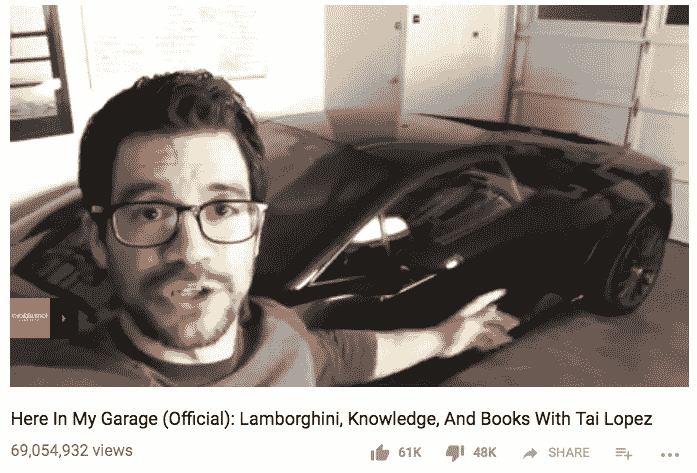
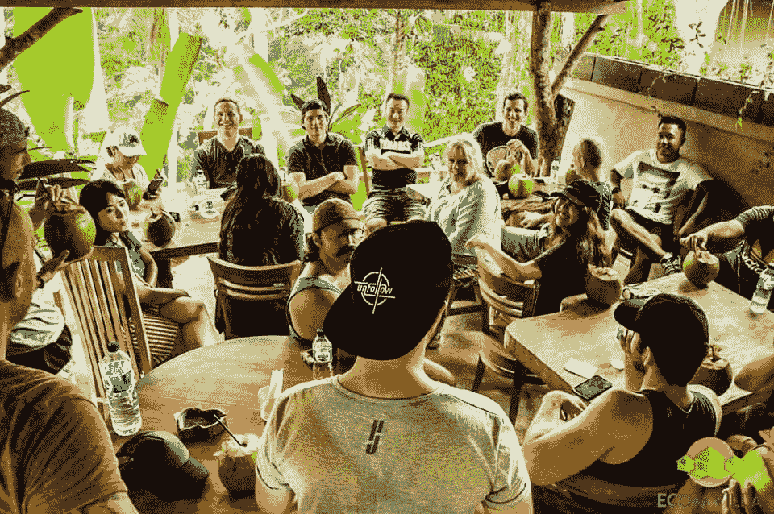
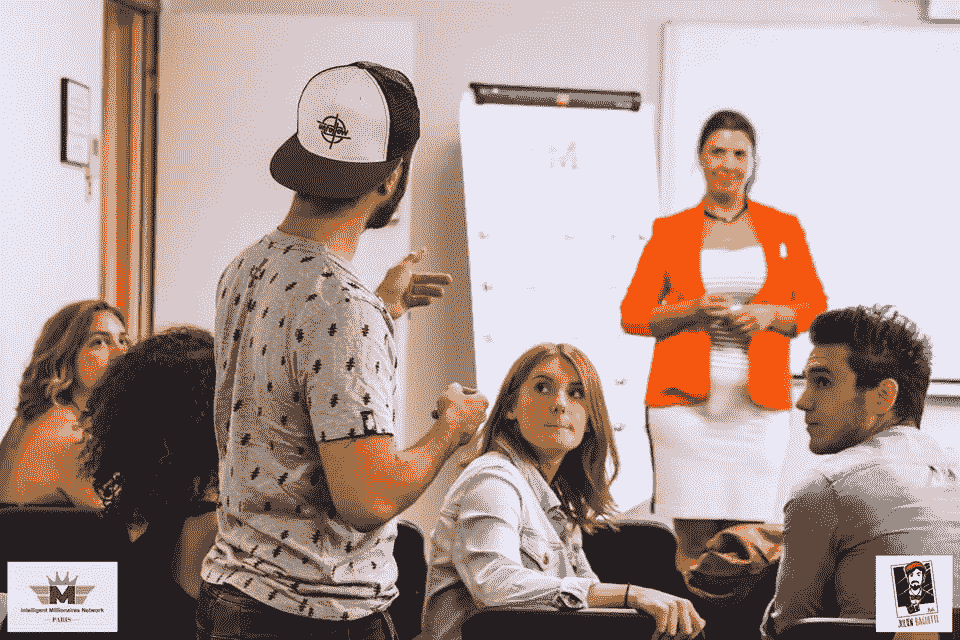
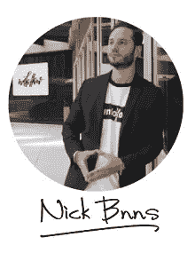

# 金钱不会帮助你变得富有

> 原文：<https://medium.com/swlh/money-wont-help-you-get-rich-c467f76e162d>

[Credit](https://unsplash.com/photos/rItGZ4vquWk)

## 但是你的网络会！

你可能读过也可能没读过我写的关于[我如何通过我的直运业务](https://theascent.pub/5-things-ive-learned-making-half-millions-euros-in-sales-4a451567f6ef)赚了超过 75 万美元的文章。

Total sales of the business in a year — $778,523

对许多人来说，这是一种自称成功的方式。

我看到许多人在社交媒体上出售如何创建有利可图的电子商务业务的课程。

最好的例子可能是[泰·洛佩兹](https://medium.com/u/f2d7a1572b4d?source=post_page-----c467f76e162d--------------------------------)，他著名的视频*就在我的车库里*，用书和兰博基尼记录着他自己。

From nobody to Youtube superstar to guru to Tai Lopez

你可能想知道如何赚钱，赚很多钱，这样你就可以做更多的事情，比如旅游。

自从我在[直运](https://www.shopify.com/guides/dropshipping/understanding-dropshipping)上发表了关于我的冒险经历的文章后，我被问了很多这个问题。

老实说，我已经尽我所能地了解了脸书团体，如 [Ecom Empires](https://www.facebook.com/groups/ecomempires/) ，阅读人们分享经验的帖子并采取行动。

今天，如果你想赚钱，你只需要找到在一个市场有效的东西，并将其应用到另一个市场。

很有可能会奏效。

我的意思是，看看优步。它是巨大的。

在巴黎，你也可以使用 Heetch，在波哥大，你可以找到 Cabify。

赚钱不容易，但也没那么难。

> 赚钱很容易。生活中困难的不是创造它，而是保持它。
> 
> —约翰·麦卡菲

# 那么为什么我说钱不会帮你变富呢？

正如我提到的，我所学的一切都是免费的。

我见过成百上千的人花费数千美元来学习你可以在网上免费找到的东西，但仍然没有从中获得任何成功。

迄今为止，如果说我是靠自己成功的，那肯定是因为我遇到了当时的商业伙伴托马斯·德斯平。

到目前为止，如果我自己成功了，那肯定是因为我在 Ecom 帝国花了难以置信的时间阅读帖子。

当托马斯和我停止直接运输，想要在巴厘岛建造第一座 Ecom 别墅时，我们再次有机会与 Nick Peroni 联系，他是 Ecom 帝国的创始人，极大地推动了我们的事业。

如果没有 Ecom 帝国，我很可能不会在直运方面取得同样的成功。
没有尼克·佩罗尼，我们很可能不会在 Ecom Villa 取得同样的成功。

没有托马斯·T4，我几乎什么都不会有。

Myself telling my story to the members of the Ecom Villa

## 为什么你认为所有的亿万富翁都聚集在一起？

因为**拥有强大的人脉会比财大气粗让你走得更远。**

有些东西你永远买不起，但认识合适的人可以帮你得到。

例如，如果你需要进入一个国家，但你的护照不允许。你可以尝试花费数百万美元，但仍然不能进入。

不过，如果你认识这个国家的总统，你很可能不花一分钱就能进去。

我的意思是，你没见过这个人因为是公司里某个重要人物的孩子而被录用吗？

我个人旅行多年，经常被朋友招待。

在美国，在阿根廷，在印度尼西亚，在澳大利亚，我总是有一个足够友好的朋友招待我。

> 如果你认识合适的人，你可能会破产，但你不可能富有，因为你不认识任何人。

**旅游不需要钱**。抱歉，我是流言终结者。

我见过人们旅行多年却不花钱，比如在游轮上找了份工作。

我甚至听说过一个厨师用食物和住宿来换取烹饪技巧的故事。

如今，有如此多的应用程序被创造出来，供我们用来联网。这不正是社交媒体的初衷吗？

今天，我们太以自我为中心了，我们甚至没有意识到别人可以如何帮助我们。

在商业中，你能负担得起的最有价值的东西就是正确的网络。

你永远买不到友谊。

但是有很多方法可以拓展你的人际网络。

1.  你可以加入一个协会。
2.  你可以加入一个脸书小组或者一个聚会小组。
3.  你可以参与活动和策划。

有一句话我特别欣赏，你应该考虑记住:

> 你遇到的每个人都知道一些你不知道的事。
> 
> —比尔·奈

你当然可以尝试自学，成为最棒的。

克里斯蒂亚诺·罗纳尔多或莱昂内尔·梅西[是最伟大的球员，这是毋庸置疑的。](https://messi.com/)

尽管你从未见过他们赢得世界杯。

Me chatting with my network group, the Intelligent Millionaire Network in Paris

> 世界上最富有的人寻找并建立关系网。其他人都在找工作。
> 
> ——罗伯特‧清崎

那你为什么如此关注你的钱包呢？

去你的网络上工作吧！这就是我正在做的…

## 三二一…开拍！

[CONTACT ME HERE](https://nickbnns.com)

 [## 我学到的东西在 5 个月内实现 50 万欧元的销售额(部分。2)

### 为什么我停止了直运？

theascent.pub](https://theascent.pub/things-ive-learned-making-half-millions-euros-in-sales-within-5-months-part-2-eba2add04f3f)  [## 我在管理我的六位数业务时学到的重要经验

### 领导和管理是成功的关键

medium.com](/swlh/delegating-is-the-most-important-part-of-a-viable-business-48e2f17baf63)  [## 为什么要成为一个成功的企业家需要冒险？

### 做一个梦想家很好，但做一个规划者和工作者更好。

theascent.pub](https://theascent.pub/why-do-you-need-to-take-risks-to-be-a-successful-entrepreneur-7b62d26bcc6e)  [## 我学到的 5 件事在 5 个月内实现 50 万欧元的销售额

### 这是一个直运的故事。

theascent.pub](https://theascent.pub/5-things-ive-learned-making-half-millions-euros-in-sales-4a451567f6ef)  [## 被疯狂解雇如何让我的生活变得最好

### 一个你可以利用的人生教训。

theascent.pub](https://theascent.pub/why-being-fired-might-be-the-best-thing-that-ever-happened-to-you-360e028d2dec) 

## 这篇文章发表在 [The Startup](https://medium.com/swlh) 上，这是 Medium 最大的创业刊物，拥有+383，380 名读者。

## 订阅接收[我们的头条新闻](http://growthsupply.com/the-startup-newsletter/)。

