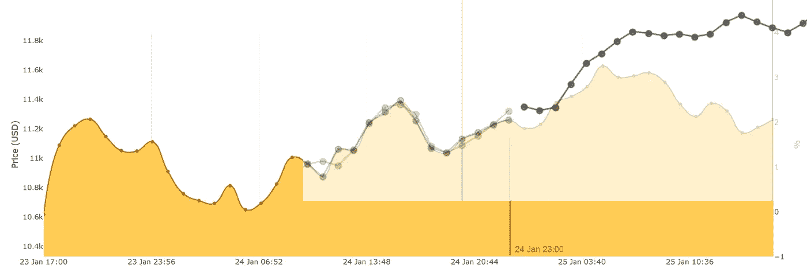
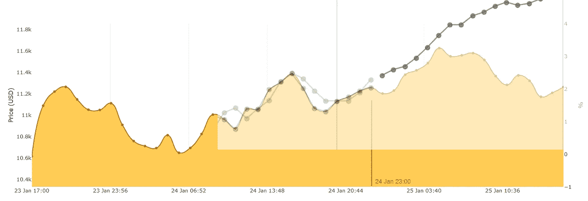

# 更多替代币和多元比特币预测

> 原文：<https://medium.com/swlh/more-altcoins-and-multivariate-bitcoin-predictions-d6da39be1ebd>

今天我在我们的平台上又增加了九个备用币。您已经可以看到几个小时的数据，但是如果您想要每日间隔的统计数据，还需要几天的时间。

然后我花时间研究了预测算法。我想了解不同特征(价格、炒作、数量、情绪)之间的区别。让我们仔细检查一下，看看有什么发现。

如果你不熟悉我的图形约定，那么下图向你展示了所使用的数据。红线表示预测开始的时间。背景上的黄色区域是实际数据(第二天拍摄的)。所以红线之前的一切都是用来训练神经网络的。红线之后是我们比较现实和预测的地方。请注意，X 轴有每小时(60 分钟)的间隔。所以 RNN 也在这些时间间隔进行训练。

做出预测需要几个参数。在下面的预测中，我使用了这些设置:

*   **序列长度:** 50
*   **神经元:** 2
*   **纪元:** 500(我可以更高，但为了节省时间和防止过度拟合，我保持相对较低)
*   **批量大小:** 20

**特点:**价格和社交提及/炒作

**特征:**价格和交易量(24 小时)

**特点:**价格、成交量、社会炒作

**特点:**价格、成交量、社交炒作、来自社交炒作的情绪分析

**特征:**价格、成交量、社会炒作、来自新闻文章的情绪分析

**特征:**价格、成交量、社会炒作、来自新闻文章和社会炒作的情绪分析

似乎这些预测中的一些并不能很好地代表实际数据。然而，大多数人确实有 8-14 小时的合理预测。所有超过 14 小时的都不再准确。

我意识到，仅仅通过查看这些图表，我们无法确定哪些功能比其他功能更有用(也许越多越好)。所以下一步就是设计一个索引/评级算法，对某个预测进行评级。然后我可以为每个特征组合生成 100 个预测，并计算指数。从这些结果中，我将能够发现哪些特征允许我们做出最准确的预测。

敬请期待更快。
干杯！
—伊利亚·内沃林

## 这个故事发表在 [The Startup](https://medium.com/swlh) 上，这是 Medium 最大的企业家出版物，拥有 289，682+人。

## 在这里订阅接收[我们的头条新闻](http://growthsupply.com/the-startup-newsletter/)。

