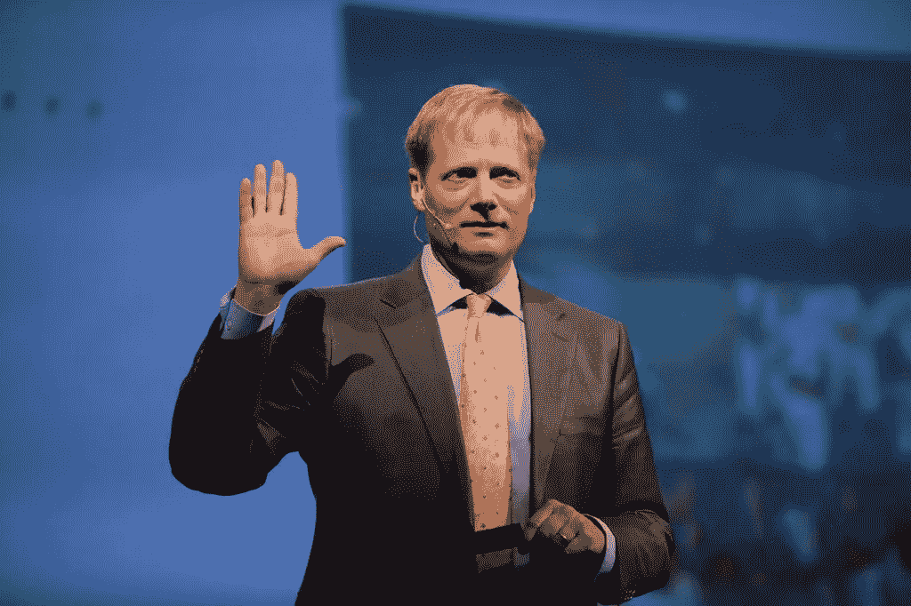

# 更多的证据表明营养研究并不总是合理的

> 原文：<https://medium.com/swlh/more-evidence-that-nutrition-studies-dont-always-add-up-ac2307956cff>

Dr. Brian Wansink at the 2013 Discovery Vitality Summit in Johannesburg.CreditCreditLefty Shivambu/Gallo Images

康奈尔大学食品科学家的垮台可能揭示了营养研究中的一个更大的问题。

不久前，布莱恩·万辛克是美国最受尊敬的食品研究者之一。

他在康奈尔大学建立了食品和品牌实验室，在那里，他因研究表明微小的行为变化会影响饮食模式而受到关注。他发现[大盘子](https://foodpsychology.cornell.edu/discoveries/large-plate-mistake)会导致人们吃更多的食物，因为它们会让食物看起来更小，而且当孩子们的蔬菜有了像“[豌豆](https://well.blogs.nytimes.com/2007/11/29/would-you-like-your-veggies-plain-or-succulent/)这样的彩色名字时，他们会吃更多的蔬菜万辛克博士写过畅销书，发表过数百项研究。一年多来，他在乔治·w·布什领导下的农业部担任最高营养政策职位，帮助制定政府有影响力的饮食指南。他的研究甚至导致政府花费近 2000 万美元重新设计学校食堂，这是一项被称为“更聪明的食堂运动”的倡议。

但是这个月，万辛克博士在康奈尔大学的职业生涯突然结束了。9 月 20 日，该大学[宣布](http://statements.cornell.edu/2018/20180920-statement-provost-michael-kotlikoff.cfm)历时一年的调查发现他“在研究和学术上存在学术不端行为，包括错误报告研究数据”，他已经提交了辞呈。就在宣布这一消息的前一天，权威医学杂志 JAMA [撤回了万辛克博士的六项研究，原因是对它们的“科学有效性”提出了质疑他的其他七篇论文之前也因类似原因被撤回。](https://media.jamanetwork.com/news-item/jama-network-retracts-6-articles-that-included-dr-brian-wansink-as-author/)

《美国医学会杂志》主编霍华德·博奇纳博士在接受采访时说，“我认为这位作者的不当行为的程度是独一无二的。”。"实际上有数百万作者，很少有人有大量论文被撤回。"

一年多来，万辛克博士一直受到指责，说他的许多研究充满了错误、数据不一致和欺诈的证据。在一份声明中，万辛克博士承认在他的论文中犯了“错别字、换位错误和一些统计错误”。但是他为自己的工作辩护说，他的错误没有“改变”任何论文的“实质性结论”。“我为所有这些论文感到非常自豪，”他说，“我相信它们会被其他团体复制。”

但随着丑闻的消息在学术界引起反响，一些专家表示，他们担心这是食品和健康研究中一个更广泛问题的症状。虽然很少有科学家被指控行为不当或误报数据，但批评者一直认为营养研究受到可信度问题的困扰。他们认为数量惊人的食品研究是误导性的，不科学的，或者被操纵得出可疑的结论。

万辛克博士的实验室以[数据挖掘](https://www.ncbi.nlm.nih.gov/pmc/articles/PMC1124898/)或 [p-hacking](https://journals.plos.org/plosbiology/article?id=10.1371/journal.pbio.1002106) 而闻名，这是对数据集进行详尽分析以梳理出原本可能不显著的微妙信号的过程。批评者说，这相当于撒下一张大网，然后创造一个假设来支持任何精选的看起来有趣的发现——这与科学方法相反。例如, [BuzzFeed News](https://www.buzzfeednews.com/article/stephaniemlee/brian-wansink-cornell-p-hacking) 获得的电子邮件显示，万辛克博士鼓励他实验室的研究人员挖掘他们的数据集，以获得将“迅速传播”的结果。

“P-hacking 是一个非常严重的问题，”Retraction Watch 的联合创始人伊万·奥兰斯基博士说，他在纽约大学教授医学新闻学。“不是过分戏剧化，但在某些方面，它质疑了我们作为科学记者和公众所阅读的内容的统计学基础。”

数据挖掘在健康研究中相当普遍，尤其是在涉及食物的研究中。这是矛盾的营养标题似乎成为常态的一个原因:前一周咖啡、奶酪和红酒被发现可以预防心脏病和癌症，而下一周一批新的研究宣布它们会导致心脏病和癌症。纽约大学营养学、食品研究和公共卫生教授马里恩·内斯特莱说，许多研究人员都面临着大量撰写论文的巨大压力。一项最近的分析发现，数千名科学家每五天发表一篇论文。

“如果没有证件，你就找不到工作，”她说。“我在我的大学看到了这一点。我们希望助理教授在获得奖学金后就能被聘用。”

2012 年，[斯坦福大学疾病预防主席约翰·约安尼迪斯博士发表了一项名为“我们所吃的一切都与癌症有关吗？”他和一位合著者从一本食谱中随机选择了 50 种食谱，发现在众多研究中，80%的成分——蘑菇、辣椒、橄榄、龙虾、芥末、柠檬——都与增加或降低癌症风险有关。在许多情况下，在 10 多项研究中，单一成分被发现是有问题的癌症声明的主题，其中绝大多数“基于薄弱的统计证据”，该论文总结道。](https://academic.oup.com/ajcn/article/97/1/127/4576988)

营养流行病学因此臭名昭著。科学家们定期搜索大量人群的数据集，寻找特定食物或饮食与慢性病和寿命等健康结果之间的联系。这些研究可以产生重要的发现和假设。但是它们也有严重的局限性。例如，他们无法证明因果关系，从人们那里收集饮食数据就像试图抓住一个移动的目标:许多人无法准确回忆起他们上个月、上周甚至过去 48 小时吃了什么。许多其他影响健康的因素也会模糊饮食的影响，如锻炼、社会经济地位、睡眠、遗传和环境。所有这些都使得最受欢迎的食品和健康研究变得有问题，而且经常相互矛盾。

在最近的一个例子中，去年发表在《柳叶刀》上的一项对数千人的观察研究成为头条新闻，其发现是高碳水化合物饮食与死亡率增加有关，吃饱和脂肪和肉类具有保护作用。然后在 8 月，另一组研究人员[在相关杂志《柳叶刀公共健康》上发表了一项对数千人的观察研究](https://www.thelancet.com/journals/lanpub/article/PIIS2468-2667(18)30135-X/fulltext)，有着相反的发现:高肉类的低碳水化合物饮食增加了死亡率。

“你可以用非常不同的方式分析观察性研究，根据你的信念——有非常强的营养信念——你可以得到一些非常戏剧性的模式，”约安尼迪斯博士说。

他和其他专家呼吁营养科学的改革。他们说，研究人员应该事先公开注册他们的研究方案，以消除数据挖掘，分享他们的原始数据以增加透明度，专注于大型随机对照试验以产生更好的结果，并避免将大型观察数据集切割成多篇论文，放大微弱的发现。

专家表示，这个问题也延伸到了科学记者身上:许多记者被鼓励发表大量点击的文章。这是研究人员和大学感到压力的另一个原因，他们不得不发布带有[夸大发现的研究和新闻稿。](https://journals.plos.org/plosone/article?id=10.1371/journal.pone.0168217)

“我要说的是，我们都在喝同一口井的水，我们都在污染水源，”肥胖专家泰德·凯尔说，他经营着一家名为[consciencehealth](https://conscienhealth.org/2018/09/what-happens-when-pr-overtakes-science/)的健康网站。“在这个过程中的每一步，都有一些人是有罪的。我怀疑我们都是同谋。”

奥兰斯基博士说，虽然万辛克博士的行为令人震惊，但这并不是营养方面的孤立现象。Wansink 博士甚至没有进入撤回论文最多的前 30 名科学家的名单。名单上的一个人，一个麻醉师，有 183 篇论文被撤回。名单上的其他人包括一名社会心理学家、癌症研究人员和一名会计学教授。奥兰斯基博士估计，每年发表的 200 万到 300 万篇科学论文中，大约有 1400 篇被撤回。他说，让这个案件引人注目的是，一个媒体宠儿处于这个案件的中心。

(我个人在我做健康记者的 15 年里，从来没有采访过万辛克医生。但这让我成为少数人——从 1993 年到 2016 年底，他在《纽约时报》的 60 多篇不同文章中被引用或引述。)

事实上，这一丑闻的独特之处在于他有多突出。奥兰斯基博士说:“我不知道有多少报道健康和营养的记者从未引用过他的话。”。

Gihan Gunasekara(世界的所有者)

## 这篇文章发表在[《创业](https://medium.com/swlh)》上，这是 Medium 最大的创业刊物，有+386，607 人关注。

## 订阅接收[我们的头条新闻](http://growthsupply.com/the-startup-newsletter/)。

