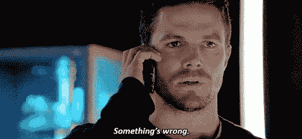
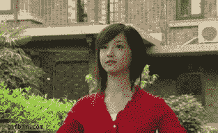
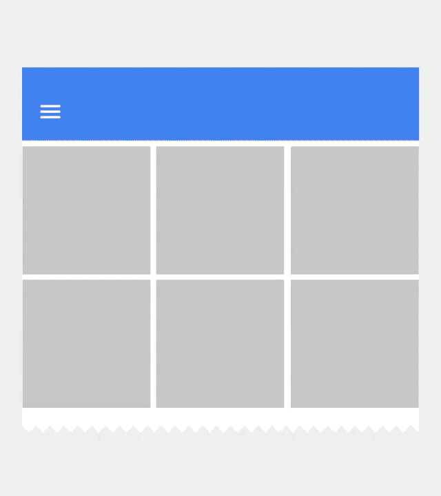
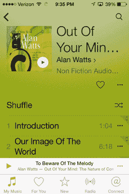
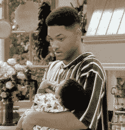

# 运动和界面设计——连续性和期望

> 原文：<https://medium.com/swlh/motion-and-interface-design-continuity-and-expectation-ae7740f507ce>

(顺便说一句，如果你想直接通过电子邮件接收我的文章和 UI 动画教程视频，[点击这里加入我的列表](http://uxinmotion.net/joinnow)

# 为生存而生

不管出于什么原因，人类更容易注意到什么时候有问题，而不是什么时候有问题。当一切平稳时，我们往往不会注意到。当我们经历不连续的事情时，它会触发我们的警报系统和一系列后续的生理和行为反应。

关于这一点的一个理论源于进化生物学。人类作为一个猎物物种进化而来。我们必须小心狮子和其他食肉动物。人类开发了预警探测系统，当我们的环境中有什么“不对劲”时，它会提醒我们，以免成为午餐。

这种生存本能也可以被认为是一种“违反期望”一旦我们的潜意识处理了我们的环境并创建了一个标准化的基线模型，与我们的模型*不连续的*事件开始凸显出来并引起注意。

[研究表明](http://www.ncbi.nlm.nih.gov/pubmed/9036851)这些潜意识探测系统在我们的意识意识意识到有问题之前就开始运作了。

似乎我们的潜意识比我们的意识更快地发现不连续性。因此，你认为事情不对劲的想法实际上是一种[虚构](https://en.wikipedia.org/wiki/Confabulation):你认为事情不对劲是因为你相信你的想法是对你看到的事情的反应。其实你潜意识里看到了前面*的东西*，引发了生理反应，进而引发了思想。你经历了生理上的*感觉*有什么不对劲，因此你的意识告诉你有什么不对劲。

Do you think it’s wrong and so it feels wrong, or does it feel wrong, so you think it’s wrong?

# 本体感觉和工具使用

[本体感觉](https://en.wikipedia.org/wiki/Proprioception)被定义为“身体相邻部位的相对位置感和运动中所用的力量。”[对猕猴使用工具的研究表明，随着时间的推移，我们在神经上开始将工具视为身体的延伸。我们的本体感受和神经系统开始将曾经是外来物的东西转变成成为我们一部分的东西。](http://europepmc.org/abstract/med/8951846)

作为设计师，我们有责任创造对象和体验，通过重复，成为用户的延伸。我们需要接受的是，设备和用户体验在重复使用时会刺激新的神经通路，因此，我们的用户不再将他们的手机或应用程序视为外部事物。

伦纳德·b·梅耶在 1961 年写了一本开创性的书，名为《音乐中的情感和意义》。我强烈推荐。他在书中写道

> “一旦经历了意想不到的事情，或者说是令人惊讶的事情，听众就会试图将其融入与作品风格相关的信仰体系中。…三件事情可能会发生:(1)头脑可能会暂停判断，也就是说，相信接下来的事情会澄清意想不到的结果的意义。(2)如果没有澄清发生，头脑可能会拒绝整个刺激，愤怒就会出现。(3)预期的后果可能被视为一个有目的的错误。

根据我的经验，这完美地抓住了用户的行为(我自己和我认识的大多数设计师都属于第二类)。

但是问题仍然存在，在界面和用户体验的背景下，我们如何确定某个东西是否是连续的？

This young woman is demonstrating Proprioception and tool use. Also, this is why you should never do drugs.

# 运动是它工作的方式

我断言动作是连接交互模型、界面元素和任务的粘合剂，并告诉我们“它是如何工作的”这是创造连续性的东西，也是作为用户，*我们应该期待和预见的东西。*这种“胶水”创造了关系，从某种意义上来说，渔网是用绳子绑在一起的孔的集合[运动通过创造连续性、关联性和因果性将所有这些联系在一起。](http://www.goodreads.com/quotes/131671-you-can-define-a-net-two-ways-depending-on-your)

在交互过程中，用户正在做*某事*，即执行一项任务。通常，完成任务需要几个到许多步骤(作为一个基于现实的例子，今天早上做鸡蛋和速溶华夫饼需要 67 个单独的步骤/动作)。每个任务*过渡到下一个任务*的连续性[将极大地影响可用性](http://www.researchgate.net/profile/Daniela_Trevisan/publication/2905216_Continuity_as_a_Usability_Property/links/0fcfd51125bf9cf76a000000.pdf)。

当事物处于运动状态时，它们可以被认为是相互关联的，也可以被认为是空间上的。[空间关系](https://en.wikipedia.org/wiki/Spatial_relation)包括拓扑、方向、距离和时间关系。运动创造关系的另一种方式是通过[因果关系](https://en.wikipedia.org/wiki/Causality)——一个事件和第二个事件之间的关系，其中第一个事件被理解为对第二个事件负责。

连续性、关系和因果关系有助于我们的心智模式，并支持期望的产生。

史蒂夫·乔布斯说

> “大多数人错误地认为设计就是它看起来的样子。人们认为这是一种装饰——设计师们拿到这个盒子，然后被告知，‘把它做得好看点！’这不是我们所认为的设计。不仅仅是看起来像什么，感觉像什么。设计就是它的工作方式。"

让我们把“设计”这个词换成“运动”

> “大多数人错误地认为*运动*就是它看起来的样子。人们认为这是一种装饰——设计师们拿到这个盒子，然后被告知，‘把它做得好看点！’我们认为*运动*不是这样。不仅仅是看起来像什么，感觉像什么。*运动*就是它的工作原理。"

简而言之，运动告诉我们“它是如何工作的”。通过这样的通知，我们的用户开发了心智模型和期望，作为设计师，我们可以选择如何最好地设计和实现。

Sorry for messing with your quote, Steve. RIP, buddy :(

# 作为视觉语言的动作

当我指导没有运动经验的设计师时，让他们从视觉语言的角度思考运动是有帮助的。

商业，在设计界通常被称为“品牌”，使用一种[视觉语言](https://en.wikipedia.org/wiki/Visual_language)，这种视觉语言与他们的核心价值观一致，并且表达了他们的核心价值观。看看任何执行良好的品牌指南。从布局、颜色、排版、摄影、该做什么和不该做什么等等，一切都考虑到了。这些品牌推荐是对品牌的一种表达，符合我们对品牌承诺的期望，使用视觉设计媒介的基本原理和符号。某些字体因其含义而被选中。并且所选字体的含义支持品牌的价值观。你可以说，在与品牌相关的设计领域，有一种体验的连续性。

(顺便说一下，所有这些作品都是因为[符号学](https://en.wikipedia.org/wiki/Semiotics)。我们从根本上没有意义的事物中创造意义，比如现实。红色意味着停止。为什么？因为我们这么说。)

同样，用户体验中的运动可以被认为是一种视觉语言本身，包含时间、速度、物理等元素，以及许多随时间变化的属性，包括但不限于透明度、比例、旋转、位置、形状、覆盖、锚点、遮罩和遮罩、材料性能等。这些元素或属性中的每一个，就像设计的基本原理一样，都有自己的含义。

随着[材料设计](https://www.google.com/design/spec/material-design/introduction.html)的推出，谷歌成为第一家公开发布运动标准指南的公司。不管是喜欢还是讨厌材料设计，谷歌花了很多心思来创建一个全面的模型，几乎没有违反预期的机会。

Material design in yo grill

# 让飞机着陆

如何支持和中断连续性的两个简单例子可以在 iOS 主屏幕中找到。

All good in the hood, jamming to Mr. Alan Watts.

当你打开一个应用程序或点击主屏幕按钮退出应用程序时，我们会看到我们正在主屏幕上放大和缩小应用程序(用图标表示)。这给了我们一种连续性、关联性和因果性的感觉。主屏幕是应用程序运行的地方，我们可以“放大它们”当我们离开应用程序时，我们会“缩小”在这种模式下，主屏幕本身不是一个应用程序，它更像是一个所有应用程序都挂在一起的地方。

然而，当你轻按 home 键两次以启用 app 切换模式时，体验就变得不连续了。

We all have issues.

虽然我们可以接受我们打开的应用程序水平呈现的整体想法，但连续性的破坏来自四个方面——静态壁纸与应用程序图标的关系，状态栏的关系，收藏夹图标的背景，以及“最近”内容的过渡。请注意，这些故障大多发生在*关系*中，由运动决定。

在静态壁纸的情况下，这个问题似乎是一个指导方针。显示空白区域似乎违反了苹果的指导方针。如果我们对壁纸的体验与应用程序图标保持一致，并在应用程序视图中缩小或缩小，那么壁纸之外还有什么？在这种情况下，这是连续性、一致性和指导方针之间的难题和冲突:我们的连续性感希望壁纸缩小，但我们不能显示内容的边缘。

将状态栏呈现为与应用程序本身相关联，而不是与操作系统相关联，这也是有问题的，并且会影响我们对状态栏本质上是什么以及它与应用程序和主屏幕的关系的预期。

收藏夹栏在正常模式下被视为完全出血，现在显示为带有边缘，这是连续性中的另一个中断

最后,“最近”同时淡出并出现在应用程序图标后面，就好像它们一直都在应用程序图标后面一样。我的观点是，使用不透明度作为过渡应该总是被仔细评估。通常，使用不透明作为过渡很大程度上是因为没有更好的想法。理想情况下，过渡会促进关系，而不透明很少会这样。这种过渡也没有考虑周全，结果是不连续的。此外，在这种转变中没有真正的关系，错过了机会。

主屏幕图标后面淡入的“玻璃”效果只是让整个过渡稍微不那么尴尬(如果没有它，那么图标就会在静态壁纸上缩小，这看起来真的很奇怪)。

突然间，头脑开始问问题。这是故意的还是偶然的？设计师们知道他们在做什么吗？还是我第二次猜测错了？是风移动了草还是狮子？是狮子还是羚羊？显然，如果我们不想成为别人的晚餐，我们需要答案。地面变得不平了。我们必须小心行事。

# 将这一切结合在一起

在用户体验方面，动作是一个关键因素。作为人类，我们天生就能注意到什么时候出了问题，我们通过使用预测性心理模型来做到这一点。我们使用连续性作为一个强有力的工具来告知我们什么是如此。当我们对连续性的感觉受到挑战，或者当体验看起来不连续时，我们就被带离体验，进入“弄清楚”的世界。

作为一个设计师，你的选择是你设计的体验是否支持连续性和期望，或者是否，通过中断，违背了用户的期望。(有些情况下，作为一名设计师，有意识地、故意地、有目的地“打破第四堵墙”是有利的，即打破预期，我将在后续文章中阐述这一点)。

A young Will Smith demonstrates how to break the fourth wall, while holding a small child.

我提出这些想法不是作为一个可怕的警告(据我所知，iOS 主屏幕的不连续没有导致任何生命损失，也没有影响销售)，而是作为机会，设计就是关于机会的。

在辅导非动画师的过程中，我很高兴看到从零到完全胜任只需要很少的时间。你不需要成为动画大师。相反，通过关注有限范围内的动作机会和基于视觉语言的策略，你可以开始设计和原型制作持续的、强大的和令人回味的交互。

(如果你觉得这很棒，[点击这里加入我的列表](http://uxinmotion.net/joinnow)，让我把我关于 UI 动画的文章和教程通过电子邮件发给你。)

# 进一步阅读

*   帕斯夸莱·德席尔瓦在[过渡接口](/@pasql/transitional-interfaces-926eb80d64e3)
*   丽贝卡·乌赛谈[UX 舞蹈编排的原则](/@becca_u/the-principles-of-ux-choreography-69c91c2cbc2a)
*   雅各布·尼尔森谈[心理模型](http://www.nngroup.com/articles/mental-models/)。
*   苏珊·温申克博士谈[设计直观 UX 的秘密:将心智模型与概念模型相匹配](https://uxmag.com/articles/the-secret-to-designing-an-intuitive-user-experience)，

如果你想学习如何设计和实现用户体验的连续性，或者对特定的 UI 动画工具和技术感兴趣，你可以访问我的网站[uxinmotion.com](https://www.uxinmotion.com/?utm_source=medium.com&utm_medium=tutorials&utm_campaign=blog&utm_term=blog&utm_content=M1)获取免费文章和教程。如果你有兴趣为你的团队或企业举办一个关于这个主题的研讨会或动手 UI 动画研讨会，或者如果你有兴趣辅导，请 PM 我。

此外，特别感谢[Alex Chang](http://www.linkedin.com/in/alexychang/)先生，他提供了大量反馈和注释。谢谢你。

*发表于* **创业、旅游癖和生活黑客**

-