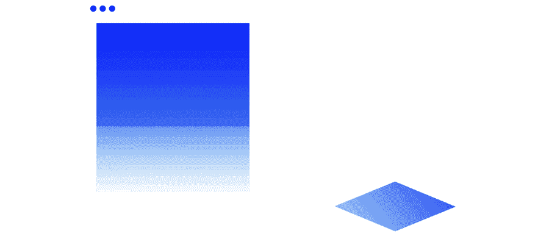
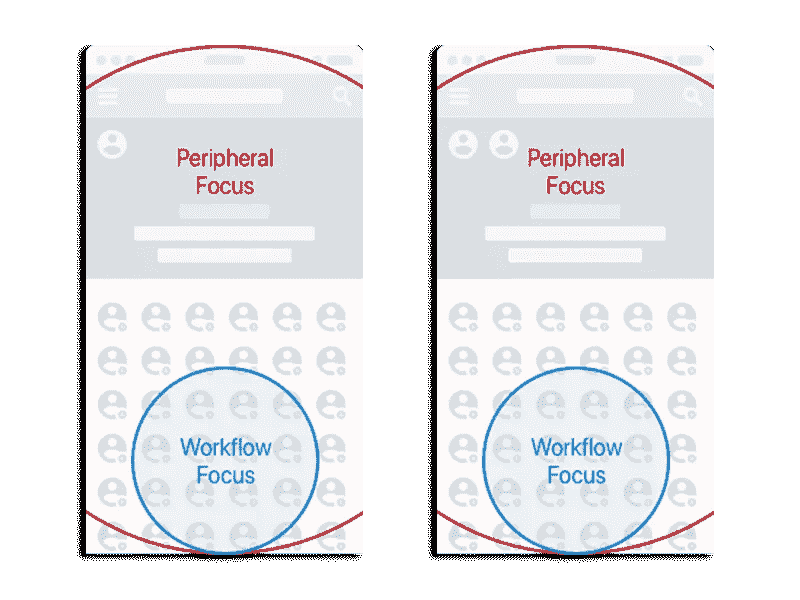
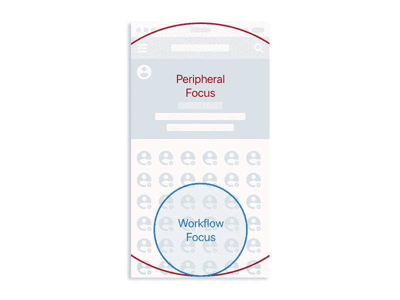
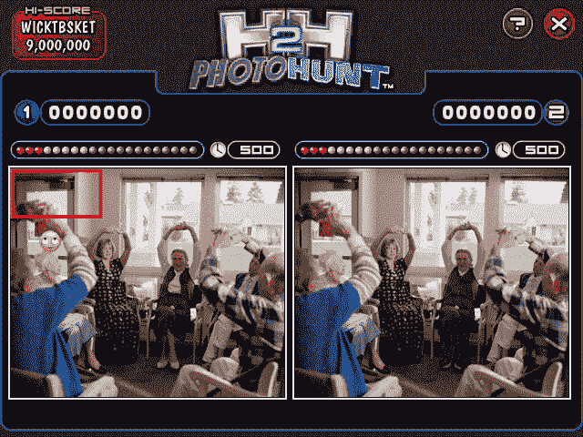
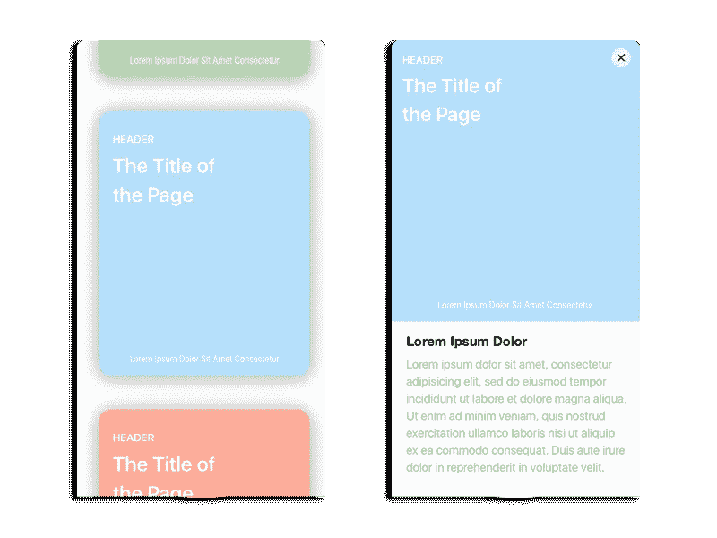
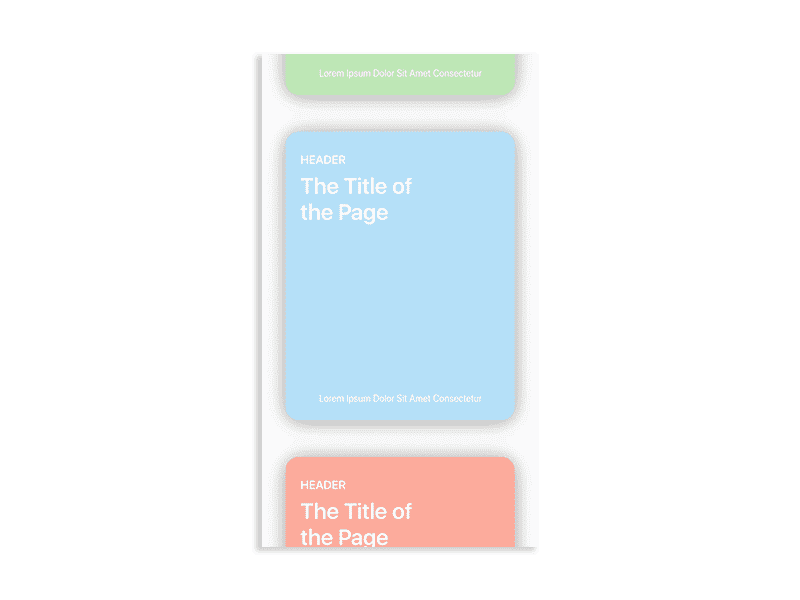
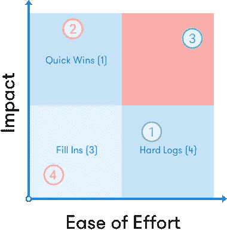
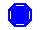
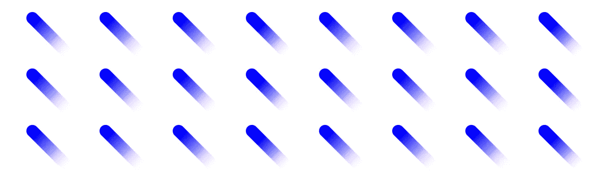

# 运动就是意义

> 原文：<https://medium.com/swlh/motion-is-meaning-1db749bf96bc>

在进入开发阶段之前，界面设计通常是基于静态表现的。一个不适合界面工作现实的模型。当我们依赖静态元素来描述变化时，我们没有考虑它们之间的转换。用户经常会精神错乱，不得不把自己从手头的任务中抽离出来，重新定位界面上发生的事情。像空间关系、用户的手势动作和时间节奏这些东西会迷失在这些影响可用性的静态环境中。

那么，在一个着迷于以人为中心的设计的设计世界里，为什么我们经常在一个人类难以感知变化的环境中验证设计决策呢？

## **人类的感知在很大程度上取决于运动**

人类有一个非常视觉化的处理系统。当然，[音](http://facebook.design/soundkit)和[触](https://developer.apple.com/ios/human-interface-guidelines/user-interaction/3d-touch/)是多模态设计的重要组成部分。但是视觉摄取处理了我们的数字设备提供的大量信息。运动为用户提供处理内容变化和空间关联的视觉提示。当专注于一项任务或工作流程时，用户会对手头任务周围的对象中非常小的细节格外敏感。当变化发生在外围背景中时，远离这些焦点任务的物体的变化通常不会被注意到。

在下面的*图 1.1* 中，我们让一个用户从一个庞大的联系人列表中创建一个自定义的群组。在选择了一个用户之后，变化发生在哪里并不明显。

Figure 1.1 — Small changes in the header aren’t apparent when user taps within their focus region.

当用户专注于添加用户的任务时，他们是否被添加到静态显示的标题中并不明显。

我们的周边视觉对运动很敏感。人类视网膜的边缘准备好检测背景运动，向我们的眼睛发送那个方向的信号冲击。因此，如果界面的视觉变化是在自然运动中完成的，而不是静态展示的连环画风格，那么看起来与手边的任务无关的界面变化总是更容易被用户在视觉上跟踪。

Figure 1.2 — Motion allows the user’s eye to be guided towards change when they take action within the focus region.

动画降低了屏幕之间的认知负荷，减轻了用户对因果解释的依赖。当显示一个屏幕的静态表示，以及移动了类似元素的下一个屏幕时，用户可以推断两个屏幕之间的因果关系。这依赖于用户不断跟踪的大量认知过程，并围绕两个屏幕之间的组件进行推测性推理。

让我们来看看大家最喜欢的酒吧游戏 Photohunt，它正是基于人类感知中的这种困难。当并排检查两个相似的屏幕时，用户很自然地向下解剖屏幕，并快速比较两个微段，问自己:“这不同吗？没有吗？好吧，这有什么不同吗？没有吗？好吧……”等等。

将关系的模糊性从一个屏幕元素转移到另一个屏幕元素可以减少认知负荷，提高关系的感知速度。如果我们能够在视觉上清晰地表达屏幕上两个项目之间的明确关系，用户就可以花更多的时间来决定他们手头的任务下一步要做什么，而不是,*等等，刚刚发生了什么？*

通过动作设计，用户可以追踪自己所处的位置和想要去的地方。它为看似不相关的项目添加了重要的上下文。具有讽刺意味的是，一个故意让用户很难理解关系的游戏恰恰是我们经常用来交流设计流程的格式。

## 运动定义变化

我们使用运动来传达存在于其他物体后面、前面或附近的位置相关物体。动作是有方向的，并且留下了关于用户如何到达特定视图的线索的精神“面包屑”。

再次，*下面的图 2.1* 是手势点击导致的两个静态呈现的例子。

Figure 2.1 — Static representation of a single gestural tap between two screens.

这些屏幕本身并不能表达期望——从这些物体是什么或它们如何表现的意义上来说。动作允许设计师叙述两个屏幕之间的关系，并设定未来行动的预期。

Figure 2.2 — single screen articulating the relation between screens above.

*图 2.2* 中动画的使用允许用户看到 UI 组件在特定动作下的特定移动。用户不仅能够更容易地描述这些屏幕之间的关系，而且他们可以根据相等和相反的反应来推断接下来会发生什么(例如:关闭图标会导致什么)。Motion 支持用户寻路，并以静态原型无法做到的方式清晰表达导航结构。

## **设计系统中的运动**

运动不仅仅是让物体移动。它是一个工具，用于将用户通过各种输入类型操作的组件生态系统捆绑在一起。

动画的使用应该丰富页面上的信息，并为用户动作的转换带来背景。一旦我们开始注意到模式，重要的是记录这些模式，围绕它们建立指南，并在我们的设计系统中，在我们的设计库中使用的所有其他设计模式中实现它们。

但是仅仅因为一部动画给屏幕带来了一些价值，并不意味着它总是值得实现。考虑它是有意义的运动还是有趣的运动。一个简单的优先级矩阵可以帮助你的团队判断是否值得将这些动画应用到你的产品或设计系统中。

**工作的难易程度** —时间、成本、风险

**影响** —价值、必要性、模式支持

1.  **立竿见影:**在你的产品或设计系统中，用很少的努力就能对很多模式或组件产生很大的影响。通常这可能包括一个简单的导航动作特性，它在整个产品中被大量使用，但它是一个相对简单的动画。
2.  主要项目:动画将触及产品的许多领域，但通常由于复杂性或技术限制，需要许多开发人员来计划和执行。
3.  **填充:**这些是宠物项目，它们很适合保留在 backlog 或停车场中，以备不时之需，但在整个系统中并不具有很大的价值。
4.  **硬日志:**既难以实施，又有点无望的原因。虽然它们的原型可能很有趣，但正如艾德·卡姆尔准确描绘的那样，它最终是一枚漂亮的硬币。

## 这个故事发表在 [The Startup](https://medium.com/swlh) 上，这是 Medium 最大的企业家出版物，拥有 284，454+人。

## 在这里订阅接收[我们的头条新闻](http://growthsupply.com/the-startup-newsletter/)。

