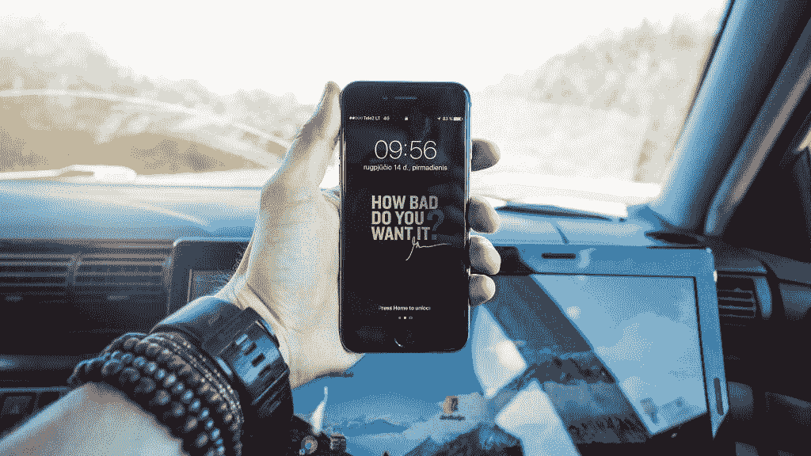
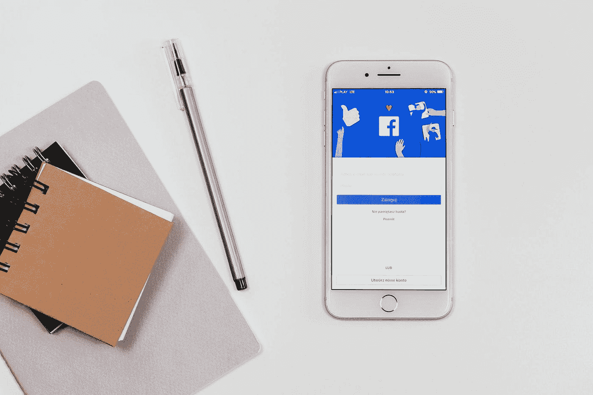

# 激励人们使用你的产品

> 原文：<https://medium.com/swlh/motivating-people-to-use-your-product-bfbb2865686a>

正如我的前任首席技术官本·法蒂所说，“历史上到处都是那些很酷的科技初创公司的尸体，它们之所以未能吸引客户，是因为它们没有考虑清楚商业模式”。这项业务的一个关键部分是，在你创造了一个世界级的产品之后，思考如何激励人们为你正在创造的产品买单。

这篇文章并没有深入探讨营销或销售的最佳实践，而是探讨了这样一个观点，即在产品真正生产出来之前，激励人们使用你的产品并为之付费。我认为它应该被整合到产品生命周期的最早阶段，影响它的核心设计和 DNA。这不是关于找到合适的产品市场的问题，[，你可以在我之前的文章](http://ambidextrouspm.com/markets-matter-most/)中读到。这更多的是更进一步，真正理解如何给产品设计添加属性，从本质上激励人们使用它并为之付费。

# 关于“自决理论”的一点注记

虽然关于这一点的大部分细节可以在[丹尼尔·平克的 TED 演讲](https://www.ted.com/talks/dan_pink_on_motivation?language=en#t-1035162)中找到，但最重要的是清楚地描述了影响一个人做某事的动机的三个重要因素——掌控力、自主性和目的性(或关联性)。

## 精通

当人们看到有机会掌握某样东西或有竞争力时，他们会感到有动力。正如过去的实验所显示的，在一定限度之后，给人们工作的金钱激励只对平凡的工作有效。如果工作很有趣，让人们觉得自己掌握了一些东西，那么过了某个时间点，更多的报酬就不会激励他们了。

## 自治

当谈到他们做那件事的动机时，出于自己的内在意志做某事的感觉是第二个真正重要的因素。这不仅仅是指一个人为自己采取的行动。也可能是一个为他们真正相信的公司或他们真正相信的事业工作的人。

## 目的/相关性

最后，人们希望感觉到他们正在做的事情对周围的人“很重要”。感觉与周围的人有关联，或者感觉自己的行为在“大局”的背景下是有意义的，这些对行动背后的动机的影响与掌控力或自主性一样大。

# 运用这一点来激励用户

这里的想法是用户不需要被激励。他们激励自己。我们如何打造一款他们会自我激励使用的产品？让我们看看现有产品和服务使用这种方法来激励用户的一些令人兴奋的方式。

# 企业软件

传统上，企业软件行业的项目经理必须让自己警惕这样一个事实，即产品的用户很可能与决定购买产品的实体或个人不是同一个人。为永远不会使用的人设计产品，自然是一件令人望而生畏的事情。但是时代在变。现在，开发人员和系统管理员有了发言权。无论是内部消息应用，虚拟化平台(或云服务)的选择，甚至是视频会议机制(go [Zoom](https://zoom.us/) ！)在公司内部使用——员工越来越成为决策者。

*   **精通** : VMware、微软、甲骨文和其他公司为他们软件的用户提供认证。这些证书可以在以后用来表示在使用各自的软件或类别的熟练程度。
*   **Autonomy** : Slack 是一个很好的应用程序例子，它是以 Autonomy 为理念构建的。它为用户提供编程“机器人”和自动化其他酷任务的界面。我的一些同事已经用 [Slack API](https://api.slack.com/) 开发了一些非常棒的智能工具，这使得他们可以做更多的事情，而不仅仅是把它作为一个消息传递媒介。
*   **目的**:培育一个欣欣向荣、充满热情的生态系统是建立这种情感的好方法。Digital Ocean 是众多拥有论坛的公司之一，人们可以在论坛上发布操作方法并谈论他们的经历。另一种针对这种情绪的方法是求助于一个更伟大的事业。企业公司可以以一种独特的方式做到这一点，因为它们“驱动”了其他几个行业的工作负载。说你是推动医疗保健行业和拯救生命的人，或者说你的系统推动了 SpaceX 的火箭——在建立一个有“目的”的产品形象方面，真的有很长的路要走。

# 社交网络

无论你的计划是走定向广告路线(脸书，Instagram)还是向你的用户出售高级会员资格(LinkedIn Premium，Tinder Gold)，“用户参与”是游戏的名字。这些公司做得好的是什么来激励他们的用户每天都回来？

*   **精通**:这个最标志性的形式就是“喜欢”按钮。脸书、LinkedIn 和其他大量的社交网站都有一个类似的按钮。该网站的用户发布图片和文章，并通过网络上“喜欢”它的其他人的数量来验证他们的帖子。这几乎创造了一种竞争的感觉，因为这些喜欢也可以用来[定量表示一个人或实体的影响力水平](https://klout.com/corp/score)。社交网站也有算法，试图首先向人们显示最受欢迎的内容，因此更多的喜欢也意味着更大的收视率机会。
*   **Autonomy:** 每个社交网站都允许用户创建个人资料，他们可以上传代表自己的照片和其他内容。这在平台范围内是可定制的，并且允许原创。因此，尽管你的个人资料仅限于那个社交网络平台，你仍然可以把它塑造成反映你的东西。
*   过去，脸书曾几次试图将自己与“更大的利益”联系在一起。无论是其平台中帮助你报告地震期间你是安全的条款，还是其及时的图像过滤器表示对某项事业的支持，[还是马克·扎克伯格最近决定花时间解决我们当今社会面临的更广泛的问题](https://www.facebook.com/zuck/posts/10104380170714571) —该公司明确表示，它打算不仅仅是一个网络平台。除此之外，它也给用户自己一个推广图片和文章的机会，将他们与其他人、社区和事业联系起来。它有一个商业推广和团体活动的平台。

# 健康改善应用

像苹果这样的大公司([我听说他们现在把健康记录直接带到 iPhone 上了！？](https://www.apple.com/newsroom/2018/01/apple-announces-effortless-solution-bringing-health-records-to-iPhone/))也在朝着这个机会前进。让我们想想那些旨在帮助你实现健康或健身目标的简单移动应用程序。

*   精通:你从根本上与自己竞争，也与他人竞争。所有的数据都可供您使用。健康应用程序向您展示了对您健康状况的时间点分析。
*   **自主:**你设定自己的目标，app 帮你达成目标。该应用程序可能会推荐一种策略来指导您完成这一过程。通过持续跟踪您的进展，它可以帮助您做出更明智的改进。
*   这些服务天生就有一种使命感。健康方面的积极进步总是被认为是一件积极/好/酷的事情。此外，由于大多数人关心健康(许多人关心健身)，你可以和追求相似目标的人交往。

# 不胜枚举

游戏行业使用排行榜和竞赛。电子商务行业创造了“一次性”打折购物的机会。信用卡公司提供忠诚度积分和现金奖励。[我妻子的信用卡上有一只熊猫！](https://www.bankofamerica.com/credit-cards/products/world-wildlife-fund-credit-card/)

这篇文章传达的信息并不局限于游戏化，也不局限于自我决定理论。它是关于设计你的产品或功能时考虑到用户的心理因素。

TL；DR——人们不需要被激励去使用你的产品，如果你能帮助他们激励自己这样做。这在产品本身的设计中找到了根源。我渴望从你那里听到今天现实世界中的其他这样的例子。如果你有兴趣了解更多，我强烈推荐你收听[本期播客](https://www.thisisproductmanagement.com/episodes/motivating-users/)。

*原载于 2018 年 2 月 21 日*[*ambidextrouspm.com*](http://ambidextrouspm.com/motivating-people-to-use-your-product/)*。*

## 这个故事发表在 [The Startup](https://medium.com/swlh) 上，这是 Medium 最大的创业刊物，拥有 316，638+人关注。

## 在这里订阅接收[我们的头条新闻](http://growthsupply.com/the-startup-newsletter/)。

