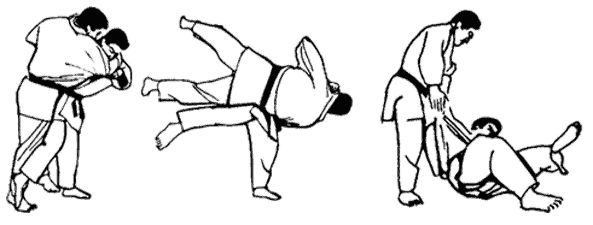

# 动机柔道

> 原文：<https://medium.com/swlh/motivational-judo-517b7391961f>

## 如何让你的大脑变得有动力

在柔道比赛中，你将对手的能量转化为自己的优势。

如果你和动力做斗争，你自己的哑脑就是你最难对付的对手。与其依靠你非常有限的意志力，不如使用动机柔道来利用你大脑的抵抗力。

柔道的创始人 Kanō Jigorō说:

> “……抵抗一个更强大的对手将导致你的失败，而适应和躲避对手的攻击将使他失去平衡，他的力量将被削弱，而你将打败他。”

你的大脑充满了偏见，这可能会阻止你自己的动力。但是，你可以利用这些偏见为自己谋利。

以下是你的大脑会让你失去动力的几种方式:

*   [你越想你要建造的堡垒，它就变得越大越宏伟，让你开始的时候更有威慑力。](/@kadavy/the-fortress-fallacy-daa1349548ce#.bh57ez9ou)
*   起步阶段:开始做一件事绝对是一件痛苦的事。这通常会导致“发光物体综合症”
*   闪亮物体综合症:这是你愚蠢的大脑对一个新项目感到兴奋的时候。为了减少由此产生的认知失调，它会合理化这个新项目确实比你放弃的那个项目更值得追求。

这里有一些激励性的柔道“投掷”不仅可以帮助你克服这些偏见，还可以利用你愚蠢的大脑的弱点为你服务:

*   **10 分钟诀窍:**选择一项任务，设置一个 10 分钟的计时器，然后不间断地完成这项任务 10 分钟。这种“扔”利用了你自己的自我保护机制:如果你不能在某件事情上工作 10 分钟，你会感觉非常糟糕，以至于你愚蠢的大脑无法合理化检查脸书或电子邮件，即使“只有一分钟”到 10 分钟的时候，你已经在项目中了，不想停下来。([此处更。](http://kadavy.net/blog/posts/the-10-minute-hack/))
*   [**鞭子**](/@kadavy/the-whip-781aa3a36447#.ht55dfjw5) **:** 鞭子裂开是因为能量从鞭子的底部传播，获得动量，直到尖端突破音速。没错，只需手腕一翻就能产生*音爆*。同样，不要线性地考虑你的项目。直接跳到最享受的部分。这创造了更多继续前进的潜在方向，并形成了势头。
*   做自己的老板:决定做事情，和做事情需要你愚笨的大脑的不同部分。这就是为什么公司有高管，你的前额叶皮层以“执行控制”而闻名。[花时间](http://kadavy.net/blog/posts/prefrontal-mondays/)提前计划和安排你要做的事情(这可能会让人不知所措，所以从每天一次会议开始——也许是 10 分钟——你最重要的工作)。生产力是关于[精神管理，而不是时间管理](http://kadavy.net/blog/posts/mind-management-intro/)，这会减轻你大脑的负担。

通过学习你自己愚蠢的大脑欺骗自己的方式，你可以发展策略来利用它的偏见为你所用。对于*永久生产力来说，这是在正确的时间采取正确的行动的关键组成部分。*

****“我是自己的老板”，并在四月的每个工作日写一篇 500 字的*** [***【免费】就是贵***](https://medium.com/u/504c7870fdb6#.pcruvnbzq) ***。跟着我，你会看到下一篇文章。****