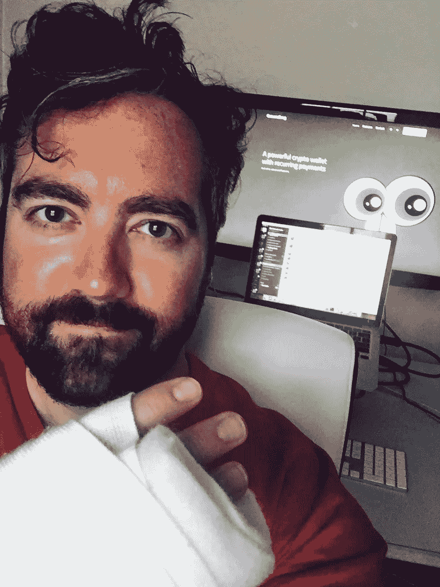
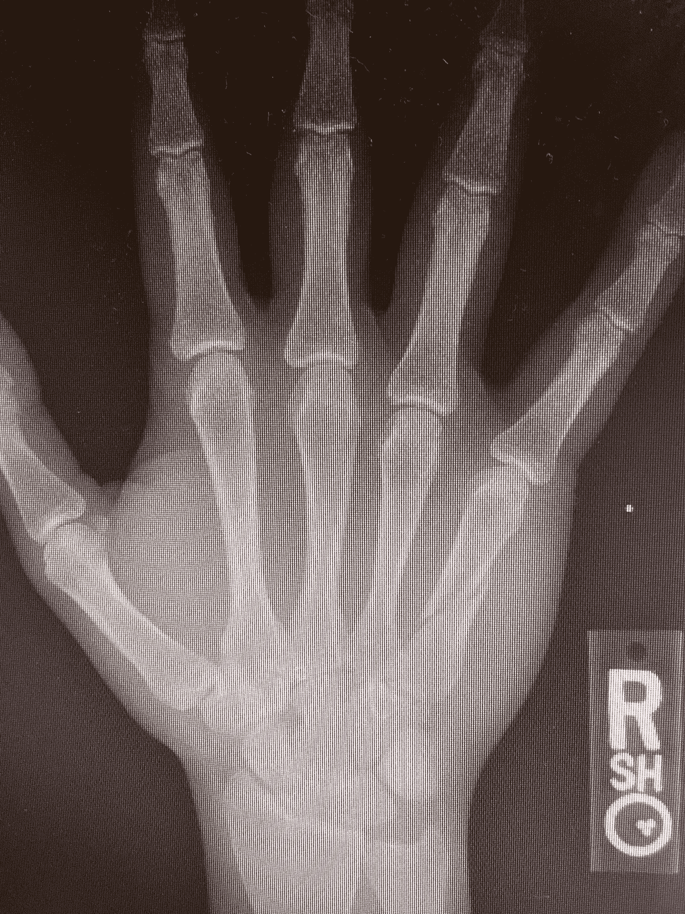

# 快速移动并打破东西… 🛴

> 原文：<https://medium.com/swlh/move-fast-and-break-things-68ae560c9e29>

所以，我周末在旧金山出了电动滑板车事故。

我撞上了一个坑，擦了出去，撞上了水泥地。下一站，圣弗朗西斯纪念医院的急诊室。

我的联合创始人安德鲁和我刚刚完成了 Techstars Anywhere 加速器，我们在这个城市进行演示日，并开始为土拨鼠筹集下一轮融资。(土拨鼠是我们的消费者加密钱包和面向商家的端到端加密支付平台。)

所以。不是。这是最好的时机。(并不是说从来就没有“好时光！”)

Spiral fracture in the 5th metacarpal.

我的右手骨折了，这可能需要手术，我可能撕裂了我的肩袖，这意味着一个单独的手术和康复轨道。当然，我是右撇子。

那么，既然我以使用电脑为生，我到底要做什么呢？以前没什么能阻止我，这次也不会。

# 游戏计划

*   **通过工具适应**
*   **依靠我的团队**
*   **通过委托建立业务**
*   **积极的心态**

# 通过工具适应

我现在用左手打字和使用鼠标。进展有点慢，但我越来越擅长了。我也在探索🎤听写和语音控制软件比如 OS X 内内置的听写系统，其实挺不错的。我已经在我的电子邮件签名中添加了一个说明，表明这封电子邮件正在被口述，因此为任何打字错误道歉。我把 iPhone 键盘切换到了单手模式。我也准备去探索一下声控产品的龙族线。有个家伙用 Dragon NaturallySpeaking 和其他一些附加软件来开发一个只用他的声音的视频游戏。为早期计算机系统(上海)[编写原始麻将纸牌游戏的人，颈部以下瘫痪](/@shortformernie/plato-mahjong-shanghai-brodie-lockard-104b2a405e79)。这篇文章本身正在通过键盘进行一些小的编辑。当然，电话、视频通话和会议仍然是免提的。

# 依靠我的团队

我很幸运拥有一个令人难以置信的团队，包括我的联合创始人安德鲁·雷登，以及超级巨星队友马修·皮卡克和安德鲁·特鲁德尔。我在今天的团队会议上陈述了情况，并告诉每个人，在接下来的几个月里，我将不得不更多地依靠他们，以及我们可能需要做些什么来适应，他们非常支持并迎接挑战。谢谢伙计们。🙌

# 通过授权建立业务

作为一名企业家，我最大的优势之一是我在很多领域都有专长。然而，这意味着我经常成为典型的企业家困境的牺牲品，拥有太多的东西。接下来的一段时间将迫使我提高运营效率，严格划分优先级，授权和构建结构和流程，这将防止我陷入细节中，而我自己可能不会选择这种方式，但最终会创建一个更强大、更有功能、更有价值的公司。📈

# 积极的心态

认识我的人都知道我是已故的伟大的拿破仑·希尔的超级粉丝。拿破仑的经典哲学之一是“**在每一个逆境中都埋藏着同等或更大利益的种子**”。在接下来的一段时间里，我的任务是度过难关，尽我所能每天保持积极的心态。我感谢我的礼物和祝福，包括我的家人、朋友、同事，以及我美丽而出色的伴侣丽贝卡。🙏

# 我还应该做什么？

我应该使用其他工具来适应工作流吗？有人有过类似的经历吗？你是怎么处理的？欢迎在评论中分享。

这篇文章部分是自我治疗，部分是使命陈述。如果你做到了这一步，感谢你的阅读，请继续阅读更多关于土拨鼠的内容！

Groundhog sez… Crypto innovation can be dangerous!

# 加入我们

土拨鼠正在向公测冲刺，我们正在招人！如果你想每天在区块链开辟新的天地，请加入我们，为未来的加密经济建造[土拨鼠](https://groundhog.network)。

如果您具备以下一项或多项技能，并且对在加密生态系统中构建转型产品充满热情，我们很乐意与您交流:

*   以打字打的文件
*   反应
*   固态
*   DevOps/DevSecOps
*   用户界面/UX/前端
*   iOS/Android

给我们发电子邮件到 [hello@groundhog.network](mailto:hello@groundhog.network) 开始吧。

## 这个故事发表在 [The Startup](https://medium.com/swlh) 上，这是 Medium 最大的创业刊物，有 320，131+人关注。

## 订阅接收[我们的头条新闻](http://growthsupply.com/the-startup-newsletter/)。

