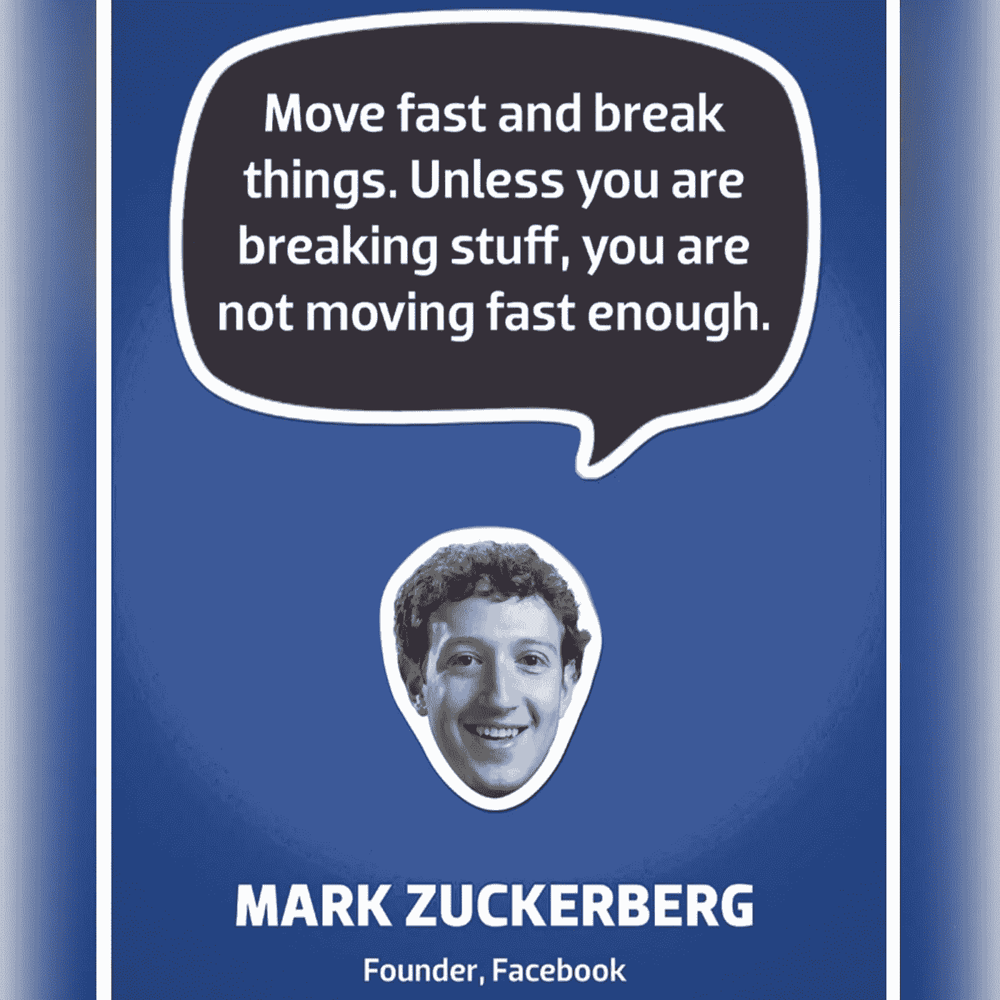

# 快速移动和打破东西不是死的

> 原文：<https://medium.com/swlh/move-fast-and-break-things-is-not-dead-8260b0718d90>

## 动作快，解决问题，学得更快

The first poster printed in the Facebook Analog Research Laboratory said “Done is Better than Perfect.” It was followed closely by “Move Fast and Break Things,” and “What Would You Do if You Weren’t Afraid?” (Image: Facebook)

> 如果努力工作是成功的关键，大多数人宁愿开锁。—克劳德·麦克唐纳

“快速行动，打破常规”是斗志昂扬的创业哲学的核心。脸书是一个值得注意的支持者，它用这样的海报装饰它的每一个办公室——作为对黑客思维的庆祝，并提醒人们大学生正在经营这场社交秀。

这种“黑客”的工作方式通常强调测试新想法，基于数据快速迭代，并瞄准更频繁的学习点。它关注速度，很少考虑质量。许多公司将“快速行动，打破常规”误解为制造混乱等同于创新。他们没有意识到，你必须快速行动，打破常规，这样才能成功。

当 OkCupid 的一名软件工程师推动一个小小的改变时，该公司的[服务器被烧毁](https://logicmag.io/05-the-servers-are-burning/)。他认为这没关系:

> 然而，对大多数企业来说，软件崩溃并不是丧钟。如果你不是在制造自动驾驶汽车，存储敏感信息，或者支持互联网的数据主干，那么如果一个错误中断了你的服务，这可能并不重要。举例来说，如果一个免费的在线约会网站宕机一个小时或半天，这没什么。事实上，对于企业来说，用前进的动力来代替烦琐可能会更好——这是脸书的老口号“快速行动，打破常规”背后的精神
> 
> 当你允许自己构建不完美的系统时，你开始以不同的方式工作——更快、更有雄心。你知道有时候你的系统会崩溃，你不得不去修复它，但是没关系。“修复事情很容易的事实意味着你最终会用这种方法，你会想，‘让我们尽可能快地得到一个坏的东西，它有点像我们想要的，然后我们就可以修复它了，’”大卫说。这不一定是件坏事，因为防止错误本来就很难。“即使你花了一大堆时间试图做出完美的东西，你也不一定会成功，”他解释道。
> 
> OkCupid 是一个复杂的网站。如果我们试图让它变得完美，它可能一开始就不存在了。

他当时的首席执行官常说，“我们不能为了技术债务而牺牲前进的动力。”也就是说，只管构建它，不要担心问题的积累。这是一个典型的遗产，也是一个在开发和编码过程中早期做出的决策会在以后反噬你的明显例子。

> 如果(数据库抛出错误){什么都不做}

软件设计和开发中“技术债务”的概念来自敏捷开发大师沃德·坎宁安。他用它来描述当你匆忙发布软件而没有应用你所学到的关于你试图解决的问题的知识时会发生什么。

每当你做的事情可能让你更接近现在的目标，但却制造了你以后必须解决的问题时，技术债务就会发生。随着你快速移动和破坏东西，你肯定会积累技术债务。

因为您尽可能快地构建代码库的增量部分，所以很少考虑任何给定的部分如何随着时间的推移保持和适应更大的画面。代码中会采用快捷方式，代码测试不会完全覆盖所有的边缘情况。没有人恶意地推出糟糕的代码，但是开发人员很容易陷入思维陷阱，因为一切都“只是测试”，所以加倍开发时间和精力来正确编写代码和彻底测试没有多大意义。

由于早期的设计选择或缺陷，债务的利息支付是您必须投入到未来开发中的额外努力。你拖欠的时间越长，支付的金额就越高。最终，它可能会让您的速度变慢，以至于您无法发布新功能或进行创新，这可能会让您的企业损失大量资金或客户，并让您的开发人员焦头烂额。

> 你必须避免债务，因为债务会让系统变得更加脆弱。你必须在一些地方增加冗余。—纳西姆·尼古拉斯·塔勒布

“debt will tear us apart” by [Ruth Enyedi](https://unsplash.com/@rruthology?utm_source=medium&utm_medium=referral) on [Unsplash](https://unsplash.com?utm_source=medium&utm_medium=referral)

像任何债务一样，技术债务必须偿还。如果没有会怎样？你不可避免地会到达这样一个点，所有累积的债务使整个系统变得如此复杂，维护起来如此昂贵，以至于它过时了，最终与你的业务步调不一致。它会让你在本该勇往直前的时候慢下来。随着时间的推移，一层又一层的绷带可能会突然脱落，露出每一个敞开的伤口。你可以等到那时再尝试解决问题，比如那些出售债务抵押债券(CDO)和信用违约互换(CDSs)的人。

> …软件是建立在其他软件之上的。您不仅使用自己的代码，还使用来自同事和第三方软件库的代码。如果这些依赖关系有问题或复杂，或者表现得不直观，错误可能会渗透到依赖它们的软件中。

仅仅测量每千行代码中的缺陷数量是不够的——您还必须考虑错误的严重性。测量技术债务可能会使它更容易管理，或者至少给你一个起点来决定哪些缺陷对实现你的产品和公司的目标最重要。然后，通过锁定目标来偿还债务就成了一个预算决策。

[xkcd](https://xkcd.com/1428/)

这种硅谷土生土长的“快速行动，打破常规”的态度不仅已经成为标准的创业建议，甚至已经演变成一场国际运动。活动、TED 演讲、节日、畅销书……应有尽有。

但随着脸书的成熟，开始每天有近 5000 亿个 API 调用访问其平台，扎克伯格将重点从速度转移到效率和可靠性——并且[将座右铭](https://www.cnet.com/news/zuckerberg-move-fast-and-break-things-isnt-how-we-operate-anymore/)改为“凭借稳定的基础设施快速前进”

> 因为当你建立了一个你不需要修正 10 次的东西，你可以在你已经建立的基础上继续前进。— [马克·扎克伯格](http://www.wired.com/?p=802341)

Image: Facebook

除了放弃早期的座右铭，脸书还宣布为其核心产品提供两年的稳定性保证——这样它在更新自己的插件时就不会再冒破坏其他公司应用的风险——同时承诺在 48 小时内修复所有大小错误。

 [## “快速移动和打破东西”被打破了

### 监管者在旧金山进行了报复。8 月 30 日，该市选择了本土创业公司 Scoot 和…

qz.com](https://qz.com/1380490/move-fast-and-break-things-is-broken) 

> 那些行动迅速、打破常规的初创公司受到了渴望回报的风险投资家及其座右铭“不惜一切代价实现增长”的鼓励。

为了成为一家超越移动平台战争的公司，[扎克伯格意识到](https://tech.newstatesman.com/guest-opinion/move-fast-break-things-mantra)你不能走得太快，有些事情不值得打破。Theranos、Zenefits 和优步付出了惨痛的代价。

 [## 快速行动，打破(别人的)东西:优步死亡事件和脸书数据泄露

### 优步自动驾驶汽车死亡事件和脸书数据泄露事件是大型科技公司狂妄自大的标志。大型技术人员不会考虑…

medium.com](/@jaime.rodriguezramos/move-fast-and-break-other-peoples-things-the-uber-fatality-and-facebook-data-breach-573c80800a79) 

T 但是，帽子并不代表“动作快，破事”就死了。这句话在抗脆弱系统中仍然很有意义。抗脆弱的一个经典例子是九头蛇，希腊神话中有许多头的生物。当一个被切掉时，两个会在原来的地方重新长出来。

“Hydra” by Sanskarans on [DeviantArt](https://www.deviantart.com/sanskarans/art/Hydra-616295199)

纳西姆·尼古拉斯·塔勒布在 [*抗脆弱:从无序中获得的东西*](https://www.amazon.com/dp/0812979680/) 中写道:

> 有些东西受益于冲击；当暴露在波动性、随机性、无序和压力下时，他们茁壮成长，热爱冒险、风险和不确定性。然而，尽管这种现象无处不在，却没有与脆弱完全相反的词。让我们称之为抗脆弱。抗碎性超出了弹性或坚固性。有弹性的抵抗冲击并保持不变；抗碎性变得更好。这种属性是一切随时间变化的事物的背后:进化、文化、思想、革命、政治制度、技术创新、文化和经济成功、企业生存、好食谱(比如鸡汤或鞑靼牛排加一滴白兰地)、城市的兴起、文化、法律体系、赤道森林、细菌耐药性……甚至我们自己作为一个物种在这个星球上的存在。抗脆性决定了有生命的和有机的(或复杂的)，比如说人体，和无生命的，比如说像你桌子上的订书机这样的物理物体之间的界限。

这样的系统不仅对你打碎的东西有弹性，而且在你打碎东西的时候实际上还会有所改善。实际上，他们“学习”例如，当你正在开发一个新产品，很多人可能想尝试，但没有人的生活依赖于它，快速行动，打破东西，因为你实际上受益于波动性和不可预测的中断。

你不必等到你的产品变得完美后再投放市场。微软在 20 世纪 90 年代踢了苹果的屁股，因为他们发布了没有完全准备好的产品，并在得到反馈后立即修复它们。史蒂夫·乔布斯则相反，他会等到一切都完美了再给任何人看。

> 至关重要的是，如果抗脆弱性是所有幸存下来的自然(和复杂)系统的属性，那么剥夺这些系统的波动性、随机性和应激源将对它们造成伤害。他们会变弱，死亡，或者爆炸。—纳西姆·尼古拉斯·塔勒布

但是，当你在构建任务关键型产品时，比如人们必须依赖才能生存的航天飞机，或者每次都必须工作的产品，否则可能会花费运营商数百万美元( [Knight Capital](https://en.wikipedia.org/wiki/Knight_Capital_Group) 是最近一个很好的例子)，或者当你的业务依赖于少数大客户时，你应该缓慢而稳定地前进，在发布之前测试每一个变化。坏掉的产品吓跑了人们，这反过来又损害了你的声誉和你的生意。

在产品开发中，下行风险往往比上行风险高得多，获得任何投资回报的可能性都相对较小。有很多风险，不同的道路可以选择，许多自由度和无数种出错的方式。将东西快速包装成一个叫做“项目”的交付工具，往往会对收益函数的不对称性产生负面影响。

Image: Black Swan Farming

创新要求我们探索新领域，打破常规，思考不可思议的事物，发现最佳解决方案。探测、感知、响应:放大正信号，减弱负信号。项目隐藏了许多这种小的增量和迭代赌注，并为管理层提供了一种错误的控制和可见性。

在产品开发的背景下，改进的机会在于从失败中产生有价值的、可操作的反馈。与直觉相反，这些信息通常是至关重要的。如果没有注意这种机制的反馈回路，学习机会就失去了。或许这句格言应该更新为

显然，它听起来不像脸书的咒语那样朗朗上口。但是不要被愚弄，以为打破东西是天生的好事。不是的。正如 XKCD 漫画所展示的那样，这显然并不适用于所有情况。

**感谢阅读！**

*如果你喜欢这篇文章，请随意给它一些掌声*👏*(你知道你想！)或与朋友分享。* [*关注我*](/@quantvc) *了解更多故事。*