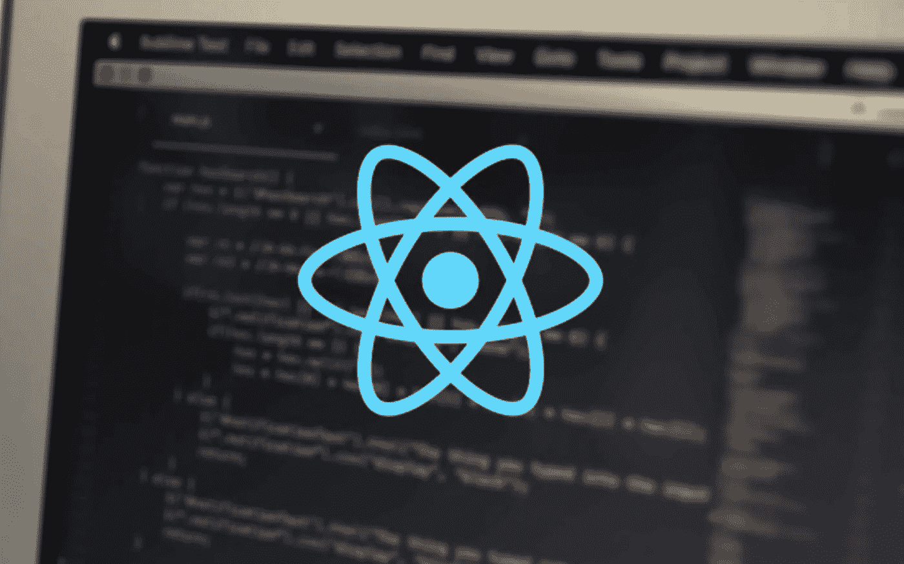

# 从 Java Spring 框架转移到 react js+API 架构

> 原文：<https://medium.com/swlh/moving-from-java-spring-framework-to-a-reactjs-apis-architecture-dd85787cc616>

我们已经看过无数次了。旧平台，由几十个开发人员在多年的过程中创建，遗留代码可以追溯到几代人之前。这个软件可以工作——但是很难。它急需一次大修。

但问题在于:企业如何在不中断业务的情况下，在任务关键型平台上开始数字化转型…