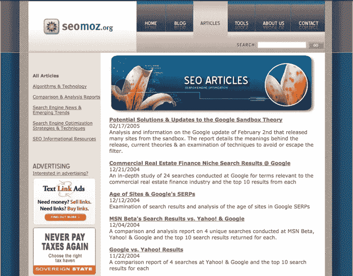
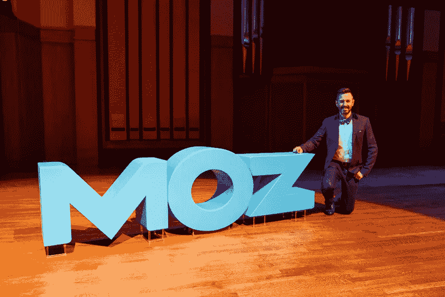

# Moz 意外达到 4000 万美元

> 原文：<https://medium.com/swlh/mozs-accidental-journey-to-40m-f3a4ebc8ee24>

## 与 Rand Fishkin 的对话:他的创业冒险和营销成功的关键。

This post was originally [published on Frontcourt](http://frontcourt.co/).

Rand Fishkin 是全球最知名、最受尊敬的在线营销人员之一。他是广受欢迎的软件公司 [Moz](https://moz.com/) 的创始人，在他的带领下，该公司从零到年收入超过 4000 万美元。

如果你在网络营销领域工作，你应该听说过兰德。您已经看过他的内容，读过他的书，甚至可能跟随他去过白板星期五。

然而，你可能不知道的是，所有这些成功都不是计划中的。据兰德自己说，整个旅程——一直到 4000 万美元——多少有点意外。我最近联系了他，想听听细节。

这是你不知道的蚊子故事。

# 偶然企业家的素质

> *“我很难描述自己。我想我在技术上是一个偶然的企业家。”—兰德·菲什金*

*更喜欢听这个采访？点击下方播放:*

经典的创业故事始于创始人有了一个伟大的想法，然后付诸实践。这一切都是非常有意和精心策划的，这使得多年后的一个伟大的故事。但是故事偶然开始会怎么样呢？当创始人着手的不是革新一个行业，而是从大学退学？

这就是 Moz 之旅的开始:回到 2001 年，Rand 离开大学时只剩下两门课要完成。为什么？与他的母亲吉莉安一起工作，经营一家她自 1981 年就开始经营的公司。[概述 West](https://www.jeffalytics.com/rand-fishkin-interview-transcript/) 在其家乡西雅图为小型企业提供营销服务和网站开发，Rand 是一家承包商，为当地牙医、银行和零售店建立 Flash 网站。正如兰德在 Moz 博客[上解释的那样，增长的机会是存在的，但并没有完全按照计划进行:](https://moz.com/rand/just-keep-going/)

从 2001 年到 2003 年，我们获得了近 15 万美元的贷款，主要来自信用卡和一些设备贷款，表面上是为了帮助“发展业务”。“相反，它让我们愚蠢地投资于低投资回报率的项目、承包商、办公场所和各种好得令人难以置信的销售人员。

到了 2004 年，我们再也无法支付账单上的最低欠款，我们的债务直线上升。由于讨厌的罚款+费用，限额为 30，000 美元的信用卡的“欠款总额”迅速膨胀到 75，000 美元。在试图让我们的咨询工作进行了 4 年之后，唯一合理的举动就是辞职。"

当然，他们没有退出。他们转向了。

母子团队发现，随着网络变得越来越繁忙和拥挤，他们的客户需要的不仅仅是一个设计良好的网站；他们需要一种方法让人们来参观。其他公司从不同的角度来处理流量，如横幅广告和类似的知名营销形式，但他们中的许多人对 SEO 的新兴趋势持否定态度。兰德回忆道，“2004 年的时候，SEO 被人讨厌！遭到了唾骂。有一种感觉是，SEO 完全是骗子。”

有些人可能已经看到了这种气候，并朝着另一个方向发展，但兰德对此很感兴趣。SEO 代表着挑战、潜力和——说实话——拯救家族企业的方法。令人好奇的是，他开始寻找和学习所有关于 SEO 的知识。也许那里有别人看不到的东西。

“我喜欢它正是因为这个原因，”*兰德告诉我。“我是一个非常矛盾的人。如果传统智慧是一种方式，我想找到这个规则的例外，并这样做。只是关于我自己的一些事。我喜欢为失败者欢呼。我喜欢去小的独立商店，而不是大的联合企业。这是一种人格特质，所以 SEO 真的很有吸引力。”

菲什金个人对 SEO 感兴趣是件好事，因为听他说，当时在这个行业中没有其他选择:

“我们再也负担不起为我们的一些网页设计客户支付搜索引擎优化顾问的费用了，所以学习这种做法并开始这样做的任务就落在了我的身上，因为我们基本上已经向客户承诺了工作和结果。”

# 边学边教

几个月之内，Rand 就积累了一个关于现有 SEO 环境的坚实基础，他决定开始写博客来记录他的学习和经历。回想起来，他的时机非常完美:2004 年，博客正处于过渡阶段，正是兰德想要做的事情。

当时，62%的在线美国人还不知道什么是博客，但博客在去年也增长了 58%。有 3200 万“早期用户”渴望优质内容。SEO Moz 就是在这样的背景下诞生的。Rand 最初设想它是一个图书馆:一个收集他收集的所有关于 SEO 的东西并在其他论坛和讨论板上分享的地方。这并不是为了创收，而是他自己效率低下的临时解决方案:

“博客最初的催化剂实际上是我在所有这些不同的 SEO 论坛上发帖，然后试图将我所做的所有评论联系起来的挫败感，”Rand 解释道。“我希望有一个共享的存储库，可以存放我正在学习的所有知识和信息，我希望在自己的地方分享和讨论 SEO。”

# 从博客写手到顾问

当 Rand 第一次开始研究 SEO 时，它是出于帮助 Outlines West 支付账单的需要。但是到了 2005 年，事情发生了变化。企业希望从 SEO Moz 博客中获得 SEO 领域的最佳实践、建议和领导力，Rand 受邀在一些会议上发言(其中一些会议他几乎无力参加)。

这种关注推动了客户需求。他们不再向网页设计客户询价，而是开始向 SEO 客户询价，这导致 SEO Moz 从博客转型为公司(SEO Moz 后来在 2013 年更名为 Moz)。

这是兰德命运的一个关键转折点。一般来说，想从事 SEO 工作的人已经有了一个网站。他们知道如何从中赚钱。重要的是，这也意味着他们有钱支付 SEO 服务，并有一些基线指标来衡量成功。他们可以看到搜索带来的流量会给他们带来投资回报，所以他们希望改善这一点。这意味着更好的质量和更准时的付费客户。

# 爷爷懂 SEO

从本质上讲，Moz 最初是一家家族公司:兰德的母亲是他的联合创始人，他的祖父西摩·菲什金(Seymour Fishkin)将他在数学和工程方面的专业知识用于研究搜索引擎的内部运作。Rand 告诉我在 SEO 的早期和他的祖父一起工作是什么感觉:

“我们会打印出所有的搜索引擎、信息检索科学论文、雅虎的 PageRank 专利和 TrustRank 专利，以及所有关于如何根据相关笔记和链接、内容评估分析和垃圾论文对内容进行排名的各种东西。”

Rand 和 Seymour 将一起仔细研究所有这些论文，并通过各种算法找出搜索引擎是如何对内容进行排名的。

“我看到这些等式里有希腊字母，我会想，爸爸，那是什么意思？”兰德说。“我的祖父真的很有耐心，他是一个伟大的老师，在早期，他确实为博客写过几次文章，解释了一些东西。”

Rand 收到的关于发展博客和以正确的方式建立 Moz 品牌的一些最好的建议也来自他的祖父:

兰德解释说:“他看了我准备贴的这篇博文后，给了我一些很好的建议。“我在他新泽西的家里。他读了这篇文章后说，“嗯，这是很好的信息，但你写这篇文章的方式就好像你有内在的权威，而不是记者或分析师的谦逊。

“他的建议基本上是，如果你想建立一个了解你、喜欢你、信任你的观众群，你不能因为你说了什么就认为他们应该相信你。

“不管 Moz 或你变得多么重要，你都应该总是假设你需要展示你的作品，”Seymour 解释道。“你需要拿出证据，人们不能只相信你的话。让信任来自你所分享的，而不是来自任何类型的地位。”

“从那以后，我一直试图记住这一点，特别是当 Moz 变得越来越大，我做了所有这些主题演讲，并拥有来自 SEO 界的少量权威。这对我真的真的很有帮助，既确保了我不会变得太自大，又确保了我是在用谦逊的态度努力培养观众，而不是摆出一副权威的样子。”

# 一家 SaaS 公司的意外上市

> *[在创办 Moz 之前]我不知道什么是 SaaS 业务。当我告诉你我是一个不知道自己在做什么的企业家时，我是完全诚实的。—兰德·菲什金*

到 2005 年，SEO Moz 的博客越来越多。去年 12 月，兰德的《搜索引擎优化初学者指南》引起了读者的共鸣，同月，该书还登上了《新闻周刊》的专题报道。考虑到该公司的起步阶段，这种突然的增长和关注是令人惊讶的，很快就发现兰德和他的妈妈再也不能自己处理所有的事情了。是时候缩放了。

他们雇用了一些团队成员来处理业务的持续咨询部门，并开始开发一套小型 SEO 工具来解决他们在日常工作中遇到的问题。

“它们是一次性的小工具，可以让我们做一些快速分析或研究，或者搜集一些网站内容或其他任何东西，”兰德告诉我。

“我们基本上是在自动化重复的任务。我们有所有这些东西，我有时会去参加一个会议或活动，或者我会回答博客上的评论，我会说，“哦，是的，实际上，我们在 SEO Moz 有一个工具可以做到这一点。不幸的是，它只对我们内部可用，但我们认为它很酷。"

最终，SEO Moz 的团队决定向公众开放他们的工具，以分享他们的成果，但即便如此，这些工具也是激发人们对其咨询业务兴趣的一种方式:

“我们聊了一会儿，我们说，‘好吧，也许我们可以开放这些工具，让更多的人看到它们，但问题是我们可能会被大量的请求淹没。我们将有一个付费墙，我们会让它非常便宜，你可以每月支付 39 美元，我们将提供这些工具的访问权限，这样我们就可以炫耀它们。"

“我们认为这是获得咨询业务的一种方式。我们不认为这是一个软件行业。我们对每月的经常性收入或诸如此类的事情一点也不了解。这与其说是一个“哦，让我们进入 SaaS 业务”的决定，不如说是一个“嘿，我们想展示一下我们的工具——我们该怎么做？”"

2007 年，随着 Moz 的搜索引擎优化工具获得了一些动力，兰德在家乡西雅图找到了来自 Ignition Partners 的风险投资家米歇尔·戈德堡(Michelle Goldberg)。

“当米歇尔在 2007 年第一次给我发邮件时，我不得不在谷歌上搜索风险投资，”菲什金回忆起戈德堡的原始信息时说。

> “嘿，你正在开发的这个软件看起来真的很棒，而 SEO 领域正是我们感兴趣的。你有没有考虑过筹集一轮资金，并试图把这件事做得更大？”

“我们试图实现收支平衡，这一系列的情况和意外收获让我们筹集了 a 轮风险投资，这让我们更像一家追求特定目标和规模的严肃软件公司。”

Moz 继续筹集了由 Ignition Partners 牵头的 110 万美元资金，该公司抓住了软件工具的潜力，开始从一家咨询公司转变为一家 SaaS 公司:

“我们的转变是由看到事情如何有机增长和米歇尔加入董事会并推动我们的共同作用带来的。一个风险投资家不想投资咨询业务，所以当我们进行第一轮投资时，我们知道我们的目标之一是从咨询过渡到专注于软件。我们对此感到兴奋，我们认为拥有自己的产品会很有趣，而且不用担心销售和推销客户。”

“我喜欢客户工作，我喜欢咨询，相比之下，我真的很讨厌销售和推销过程，我讨厌和客户在一起，感觉就像“哦，我在销售模式中”，我必须不断地摆出这副好面孔，而不是做我自己，我讨厌那样。这款产品真的很适合我们。”

# 如何像蚊子一样意外成功

就像 Moz 故事的许多部分一样，人们采用其软件的惊人速度是他们制作的伟大内容和 Rand 从他祖父那里学到的谦逊的副产品:

“说到获得客户，我甚至不确定我们现在是否擅长这个，”菲什金说。“这真的是我们意外取得成效的原因之一，因为博客如此受欢迎，因为我们的内容营销工作如此出色，因为我们的品牌广为人知，深受喜爱和信任。我们已经有很多很多人注册了。这是 2007 年我们推出这些工具时让我们感到惊讶的事情，然后在年中我们看到我们的 PayPal 账户，天哪，这和咨询业务一样赚钱，我们所做的就是让它可用，我们自己的咨询工作无论如何都需要这些工具，这太不可思议了。”

“我们真的非常意外地成功获得了客户。”

# 为什么兰德还在摸索(故意的)

即使你创造了和 Moz 一样多的内容，你也不能保证每次都能成功。在兰德看来，这很好:

“我创造了大量的内容，我总是认为我会做得很好，并希望我会，但我不得不说，每一个大热门都会有三四个失误，这比几年前的 10 或 20 个有所下降。你需要年复一年的练习才能提高，”他解释道。

兰德认为，成功的内容策略的关键之一是在你开始创建内容之前了解谁会放大你的内容:

“我经常说的一件事是，如果你没有一个好的答案来回答谁将帮助扩大这个问题，为什么，甚至不要创造它。不用费心去创造它，不用费心去出版它。在你对这个问题有了一个很好的答案之前，谁将帮助扩大它，以及他们为什么要这样做，不要打扰。”

让内容创作成为你日常工作的一部分也是成功的一个重要部分:

“部分原因是让内容创建和放大不再是一件让你兴奋不已的特殊事情，而是成为你工作流程中的一项任务。这是我做的事情，我创造，我出版，我把东西放在那里，我预计我会有许多失败和一些成功，我预计我会学习。”

兰德认为，内容营销的成功很像去健身房:

"你不会对自己说"哇，我要去健身房，然后照照镜子，我要看起来像我想要的样子。“不，当你投入工作时，你会想到它，你每天去健身房，举重，在跑步机上跑步，做健身车以及今天人们在健身房做的任何事情。实践是真正的关键，这是你应该关注的，而不是即时的结果。内容营销也是如此。当你出版、创作时，你在举重，最终你会练出肌肉，但如果你指望这在一天、一周或一个月内发生，那你就是在自欺欺人。”

# 兰德公司为您的企业营销成功的 3 个关键

任何人都可以像 Moz 一样投资营销，即专注于内容、社交媒体和搜索，以推动流量，目标是将一些流量转化为客户，一些流量将进一步放大你的信息。

如果你采用这种方法，Rand 认为你应该关注三个领域的交集:

1.  你热爱的事情
2.  一个你可以提供独特价值的领域
3.  你的观众和观众的影响者所关心的事情

# 1.找到你热爱的事情

“如果你在考虑”我该不该开博客？“嗯，你喜欢每天写还是每周写？你擅长做这件事吗？当你做这件事的时候，它能给你带来快乐、满足感和成就感吗？还是一个你真的不期待的乏味任务？因为如果是这样的话，也许你应该考虑做视频，或者做播客，或者做视觉内容，或者也许你应该考虑创建某种 UGC 社区平台，或者 10 种不同的其他潜在内容选项，免费工具，数据可视化，无论是什么。你应该先找到它。”

# 2.一个你可以提供独特价值的领域

“第二点是，你必须找到一个你能提供超越竞争对手的独特价值的领域。如果你觉得太好了，那么我会做视觉内容，我很擅长信息图，但当你看着外面，这个领域挤满了信息图，其中大多数从来没有得到任何牵引。有 50 个竞争对手都在玩同样的游戏，那么你可能需要重新考虑一下，也许可以找到你擅长的下一件事。”

# 3.你的观众和观众的影响者所关心的事情

“维恩图中找到交集的第三个部分是你的客户和客户的影响者真正关心的，并希望通过他们实际参与的渠道使用和找到他们。如果你认为这会很棒，我会做视觉内容，我非常以 Pinterest 为中心，然后你会发现你的客户真的不喜欢视觉内容，他们都不在 Pinterest 或 Instagram 上，或者他们没有在网上消费大量的视觉内容。你可能也想重新考虑一下。”

“你必须能够接触到你的客户和客户的影响者。如果你能找到这三者的交集，你就获得了投资内容营销飞轮的大好机会。如果没有，大概应该继续找。”

# 最后两个想法

我在兰德公司的时光激励了我自己的创业之旅，我希望它也能激励你。当我回顾我们的谈话时，我觉得有两点很突出:

1.  一路上的一些意外不仅仅是一件好事。它们可能是决定我们成功的因素。兰德的例子证明，在这个新的商业环境中，你不一定要有一个老式的商业计划才能获得成功。
2.  **对出现的机会保持好奇**。愿意调查你周围的人怀疑的事情，在别人赶上来之前独自游一会儿也没关系。而且他们会追上来，所以最好先下手为强。

非常感谢你的阅读，我希望你喜欢这次谈话。如果你想了解更多信息，[关注我们的 Soundcloud](https://soundcloud.com/frontcourt) 或[订阅我们的出版物](https://frontcourt.media/)。

这篇文章是由 [PostReach](https://www.postreach.co/?utm_source=content&utm_medium=frontcourt) 带给你的:

轻松发现你*(和你的竞争对手)*发布的每个帖子的关键流量统计、来源和有影响力的分享者。[**免费上手**](https://www.postreach.co/?utm_source=content&utm_campaign=state-2016&utm_medium=medium) **。**

*原载于 2016 年 11 月 29 日*[*frontcourt.co*](http://frontcourt.co/moz-rand-fishkin-interview-full/)*。*