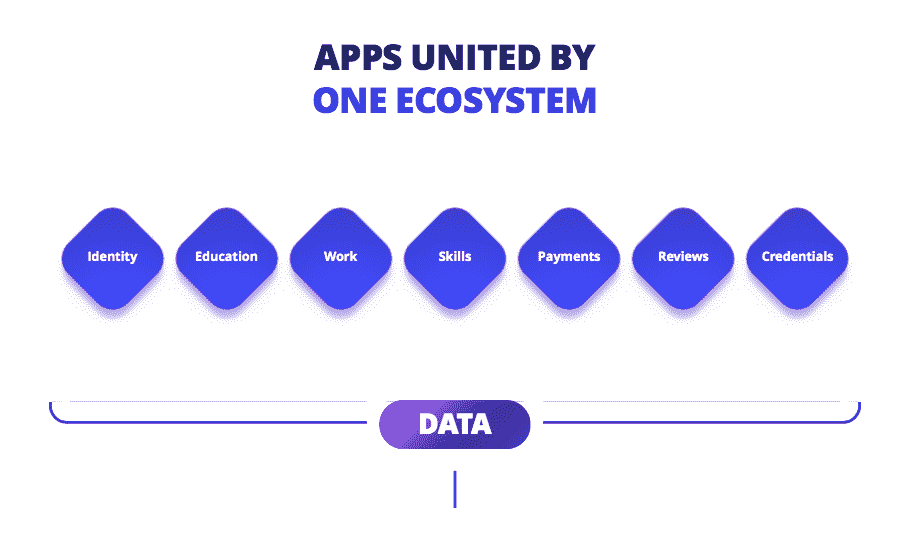
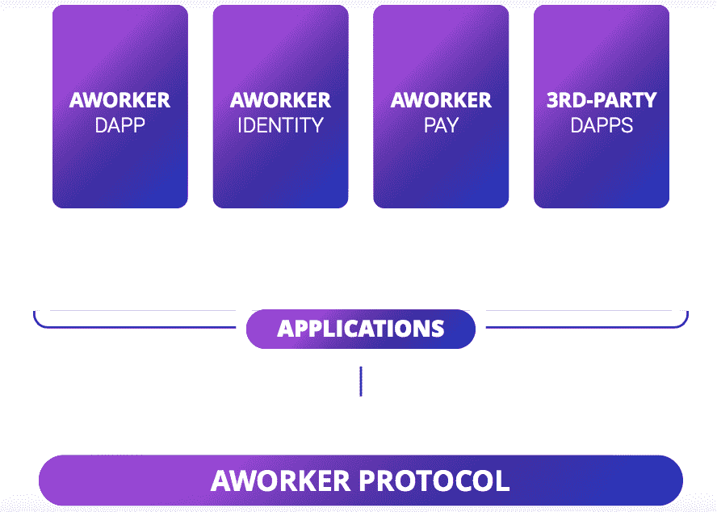
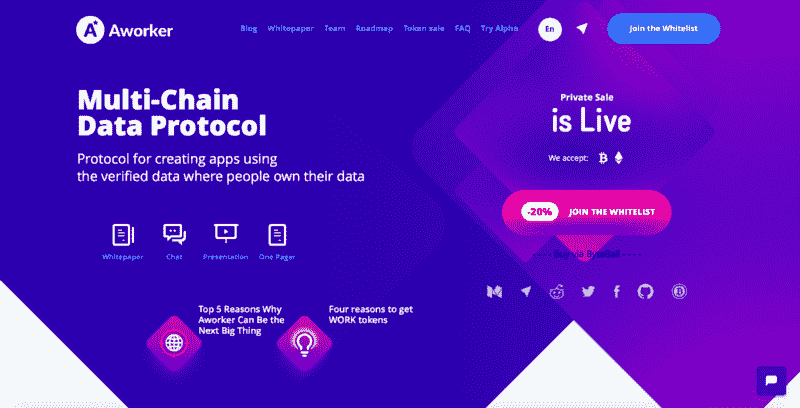

# 多链数据协议

> 原文：<https://medium.com/swlh/multi-chain-data-protocol-966ced014366>

最近报道的侵犯用户隐私的监控和安全漏洞事件的增加，对第三方收集和控制大量个人数据的现有模式提出了质疑。流行的加密货币已经在金融领域证明，使用一个配有公共账本的分散式对等网络，可信、可审计的计算是可能的。

到目前为止，社交网络的用户被期望阅读成千上万的文字来了解他们的数据是如何被使用的。老实说，我们并不总是这样做。保持登录社交网络意味着它可以看到你访问的几乎所有其他网站，这些信息有时被用来提供你可能感兴趣的广告。一些公司还会汇总你的数据，这样广告商就可以接触到非常具体的人群，比如一名居住在东京的 40 多岁的男性，他养狗，喜欢炸鸡。

大公司比任何人都重视个人数据，因为从你的在线习惯中收集的数据可以用来吸引广告商。

通过使用分散的系统，人们有可能决定谁可以获得他们的信息，以及信息的价值。例如，如果你是一名在招聘市场注册的雄心勃勃的专业人士，这家公司可能会让其他用户付费访问你的联系方式和你的完整资料。因此，该公司打开一个站点或应用程序，检查分布式分类帐中存储的所有信息。

# 我该怎么做呢？

该领域的先驱之一是 [Aworker](https://aworker.io/) ，这是一个多链解决方案，由应用程序的数据协议、人员识别系统和数据交换组成。总之，这些功能形成了一个多功能的基础设施，为应用程序创建一个统一的声誉系统。

[工作人员](https://app.aworker.io/)DApp——一个分散的招聘平台，在这里你可以为自己或你的朋友、配偶、熟人等找到一份理想的工作。这里的问题是，你必须通过附上证书或其他证明文件来证明你所写的数据。人们无需冗长的检查和信息收集就能证明自己的能力。在这种情况下，申请人将能够管理他们的数据，并在必要时将其货币化。

与此同时，Aworker 协议将在雇用员工时向公司提供完整的信息。缺乏可核实的申请人信息是当今人力资源领域的一个重大问题。一个具有集中式服务器的应用程序几乎不可能解决这个问题。该协议将联合应用程序开发人员的努力，并收集关于申请人的完整信息。

你是开发者，想了解更多？给我写信，地址是 [anton@aworker.io](http://anton@aworker.io/)

# 当我们在这里的时候

我也提醒你一个工人私人销售#4 现在正在直播！欲了解更多详情，请访问

## 这个故事发表在[的创业](https://medium.com/swlh)上，这是 Medium 最大的创业刊物，有+365，103 人关注。

## 在这里订阅接收[我们的头条新闻](http://growthsupply.com/the-startup-newsletter/)。

