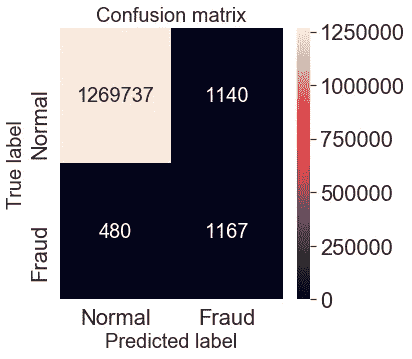

# 不平衡数据集的聚焦损失多类分类

> 原文：<https://medium.com/swlh/multi-class-classification-with-focal-loss-for-imbalanced-datasets-c478700e65f5>

Focus on hard examples

焦损失是今年年初提出的密集物体探测任务。它能够以 **1:1000** 的比例训练前景和背景类别之间不平衡的高度精确的密集物体检测器。本教程将向您展示如何应用焦点损失来训练给定高度不平衡数据集的多类分类器模型。

# 背景

让我们先来看看不平衡数据集的其他处理方法，以及聚焦损失是如何解决这个问题的。

在多类分类中，平衡数据集具有均匀分布的目标标注。如果一个类比另一个类有更多的样本，那么它可以被看作是一个不平衡的数据集。这种不平衡导致两个问题:

*   训练是低效的，因为大多数样本是简单的例子，没有贡献有用的学习信号；
*   简单的例子会淹没训练并导致退化的模型。

常见的解决方案是执行某种形式的硬负挖掘，在训练或更复杂的采样/重新加权方案中对硬样本进行采样。

对于特定的图像分类，数据扩充技术也是可变的，以便为代表性不足的类别创建合成数据。

焦点损失旨在通过降低内联体(简单的例子)的权重来解决类别不平衡，这样即使它们的数量很大，它们对总损失的贡献也很小。它侧重于训练一组稀疏的硬例子。

# 将焦点损失应用于欺诈检测任务

为了进行演示，我们将在 Kaggle 上为[欺诈检测数据集构建一个分类器，该数据集具有极端的类别不平衡，共有 6354407 个正常案例和 8213 个欺诈案例，即 733:1。对于这种高度不平衡的数据集，该模型可以采取简单的方法，通过猜测所有输入的“正常”来实现 733/(733+1) = **99.86%** 的准确性。但是，我们希望该模型能够检测出罕见的欺诈案例。](https://www.kaggle.com/ntnu-testimon/paysim1)

为了证明焦点损失比通常应用的技术更有效，让我们建立一个用 **class_weight** 训练的基线模型，它告诉模型“更多地关注”来自代表性不足的欺诈类别的样本。

Baseline model

基线模型实现了 **99.87%** 的准确率，仅仅比通过猜测所有正常的“简单路线”略好。

我们还绘制了混淆矩阵来描述给定保留测试集的分类器的性能。您可以看到总共有 **1140+480=1620** 个未分类的案例。

Confusing matrix — baseline model

现在让我们将焦点损失应用于同一模型。您可以在下面看到如何将焦点损失定义为 Keras 的自定义损失函数。

focal loss model

焦点损失有两个可调参数。

*   聚焦参数γ(gamma)平滑地调整简单示例向下加权的速率。当γ = 0 时，焦损失相当于分类交叉熵，并且随着γ的增加，调制因子的影响同样增加(γ = 2 在实验中效果最好)。
*   α(alpha):平衡焦点损失，比非α平衡形式的精确度稍有提高。

现在，让我们将性能与之前的分类器进行比较。

焦点损失模型:

*   准确率:99.94%
*   总误分类测试集样本: **766+23=789** ，将错误减少一半。

Confusing matrix — focal loss model

# 结论和进一步阅读。

在这个快速教程中，我们介绍了一个新的工具来处理高度不平衡的数据集——焦点损失。一个具体的例子向您展示如何在 Keras API 中将焦点损失应用到您的分类模型中。

你可以在我的 GitHub 上找到这篇文章[的完整源代码。](https://github.com/Tony607/Focal_Loss_Keras)

关于焦损的详细描述，可以看 https://arxiv.org/abs/1708.02002[的论文。](https://arxiv.org/abs/1708.02002)

 [## Tony607/Focal_Loss_Keras

### 不平衡数据集的焦点损失多类分类- Tony607/Focal_Loss_Keras

github.com](https://github.com/Tony607/Focal_Loss_Keras) 

[在 Twitter 上分享](https://twitter.com/intent/tweet?url=https%3A//www.dlology.com/blog/multi-class-classification-with-focal-loss-for-imbalanced-datasets/&text=Multi-class%20classification%20with%20focal%20loss%20for%20imbalanced%20datasets) [在脸书分享](https://www.facebook.com/sharer/sharer.php?u=https://www.dlology.com/blog/multi-class-classification-with-focal-loss-for-imbalanced-datasets/)

*原载于*[*www.dlology.com*](https://www.dlology.com/blog/multi-class-classification-with-focal-loss-for-imbalanced-datasets/)*。*

## 这篇文章发表在 [The Startup](https://medium.com/swlh) 上，这是 Medium 最大的创业刊物，拥有+399，714 名读者。

## 在这里订阅接收[我们的头条新闻](http://growthsupply.com/the-startup-newsletter/)。

