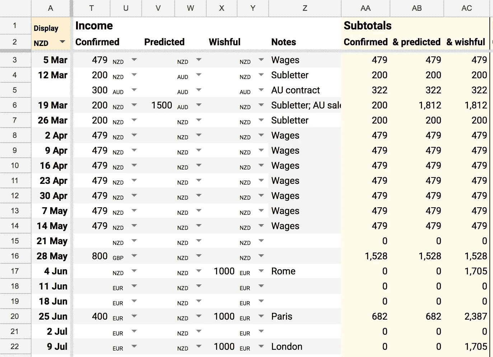

# 面向数字游牧民的多币种预算

> 原文：<https://medium.com/swlh/multi-currency-budgeting-for-digital-nomads-68da7687e3d1>

## 聪明地使用 Google Sheets 来追踪所有货币的收入和支出


去年，我和我的搭档 Nati 带我们去了 13 个国家。在旅途中谋生，和我的爱人在许多充满异国情调的地方旅行和工作，这是一种令人惊讶的特权……但金钱方面可能是焦虑和我们关系紧张的持续来源。

当我们准备今年的另一次大型旅行时，我决定在预算上投入更多的精力。*(顺便说一句，你可以* [*加入我们的时事通讯*](http://eepurl.com/de1yEn) *来了解我们的旅行。)*

没有预算，我不得不在脑子里装着非常大概的数字(*他们将付给我们 1000 美元，另一份工作可能是€1500……*)。这些数字越来越接近，因为它们包含了更多的货币(*美元基本上就是欧元，对吗？*)。当我心情好的时候，我的近似值趋于乐观。但是如果我醒来时精力不足，那么我的心理数学会变得更加悲观，让我陷入焦虑(*我们会被困在希腊*)和抑郁(*我破产了，因为我毫无价值*)。当我处于*一切都会好起来的*模式，而娜蒂处于*我们到底要怎么回家的*模式，这肯定会让我们的关系变得紧张和沮丧。

花精力争论蹩脚的数学似乎很愚蠢；我宁愿把我的感情精力放在亲密、乐趣和相互关心上。所以这周我做了一个我梦想的电子表格，去掉了猜测。它是这样工作的:

## 1.期初余额

当我坐下来写预算时，第一步是把我们账户上的实际余额拿来。


## 2.记录货币

注意，PayPal 是澳元，而其他余额是新西兰元。每个总数旁边是一个下拉菜单，我可以在我关心的货币之间进行选择，这些货币列在*列和*列。

您可以在 Google Sheets 中创建这些下拉列表，方法是高亮显示您希望它们出现的单元格，然后从*数据*菜单中选择*数据验证…* 。


在*标准*部分中，我从一个范围中选择了*列表，然后在*列和*中选择了一长串单元格。这意味着我可以不断地在列表中添加新的货币，所有的下拉列表都会立即更新。*

## 3.显示的货币

在工作表的左上方，我添加了另一个货币下拉列表——当我更改它时，工作表中所有的黄色单元格都会被转换成所选的货币。目前我在新西兰，所以我在新西兰展示。下周我们将在澳大利亚，所以我可以转换成澳元，我的余额将立即转换。


下面是进行货币转换的公式:

```
= AJ3 * if( 
    A2 = AK3, 
    1, 
    GoogleFinance(“CURRENCY:” & AK3 & A2, “average”) )
```

我将切换出每个变量的描述性名称的单元格引用:

```
= Amount * if(
    DisplayCurrency = RecordedCurrency, 
    1, 
    GoogleFinance(
      “CURRENCY:” & RecordedCurrency & DisplayCurrency, “average”) 
    )
```

英文:如果该工作表的*显示货币*与该单元格的*记录货币*相同，则将*金额*乘以 1。也就是说，如果您在新西兰元中输入了一个余额，并且您正在用新西兰元查看该表，请不要进行转换。

否则，如果货币不同，将记录的金额乘以货币汇率，这可以通过 [GoogleFinance](https://support.google.com/docs/answer/3093281?hl=en) 函数访问，如`GoogleFinance("CURRENCY:NZDAUD", "average")`

## 4.预测费用账户

该表的其余部分是一个非常标准的预算，加上数百个这样的小货币下拉列表:


每周都有一排。我添加了可能的分类费用(*在这个截图中，我隐藏了一些列以节省空间*)。对于每个条目，我使用下拉菜单来选择记录的货币。然后当我想把东西加起来的时候，我重复转换公式。例如， *S3* 中的小计计算如下:

```
= (B3 * if(A$2=C3, 1, GoogleFinance(“CURRENCY:” & C3 & A$2, “average”)))
+ (D3 * if(A$2=E3, 1, GoogleFinance(“CURRENCY:” & E3 & A$2, “average”)))
+ (F3 * if(A$2=G3, 1, GoogleFinance(“CURRENCY:” & G3 & A$2, “average”)))
+ (H3 * if(A$2=I3, 1, GoogleFinance(“CURRENCY:” & I3 & A$2, “average”)))
```

## 5.考虑不同的收入情况

然后在收入方面，我记录了三个类别中的一个:



确认意味着我们有一份合同，我们可以指望这笔钱会支付给我们。为了更加保守，我假设每个人都迟付我们钱，所以我输入所有的大额付款都有一个月的延迟。

在*预测*栏中是很有可能但不确定的收入。例如，当我们出售我们车间的门票时，我可以*预测*我们会得到 1500 澳元，但指望它是不明智的。

*一厢情愿*一栏提醒我，这里的一切都是“一厢情愿”。我希望我未来的自己会变得有条理，并在六月预订一些演出，这样我就可以在八月度过一个愉快的假期。

同样，我以任何货币记录条目，然后小计被转换成我设置的工作表显示货币。

## 6.跟踪不同情况下的余额

最后，我可以每周计算我们预测的银行余额:


有了这 3 列，就不需要猜测和近似了。从这个预算中，我可以看到我们在六月之前肯定是很好的，如果我们预测的收入到达，我们可能会坚持到七月。然后我可以浏览并向*如意*栏添加更多条目，例如，如果我们希望我们的*确认*余额永远不低于 1000 美元，我可以看到我需要在 4 月份预订更多的工作。

## 7.冲洗并重复

一个月左右，我会坐下来重复这个过程。我将复制该表，更新余额，然后通过更好的预测检查和更新所有即将到来的周。几个月后，我应该能够计算出一个合理的误差范围(*)我的猜测到底有多乐观？*)。

这是所有的一切:


就是这样！我已经感觉不那么焦虑了。

我已经做了一份样张，你可以复印一下。如果不清楚的话，我很乐意回答任何问题。我很想听听这个技巧是否有帮助，或者你们中的任何一个旅行者是否有其他的解决方案可以分享。

*附:说到钱！如果你想鼓励我继续写作，你可以给我钱。鼓掌/分享/推文也不错*😍

[](https://medium.com/swlh)

## 这个故事发表在 [The Startup](https://medium.com/swlh) 上，这是 Medium 最大的创业刊物，拥有 303，461+人关注。

## 在这里订阅接收[我们的头条新闻](http://growthsupply.com/the-startup-newsletter/)。

[](https://medium.com/swlh)