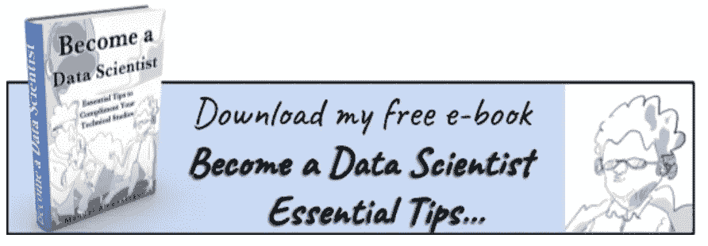
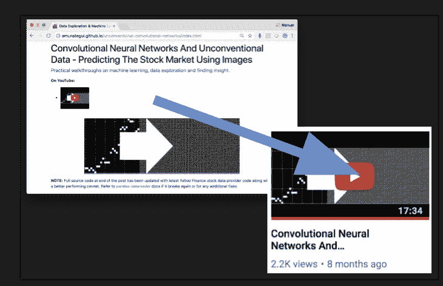
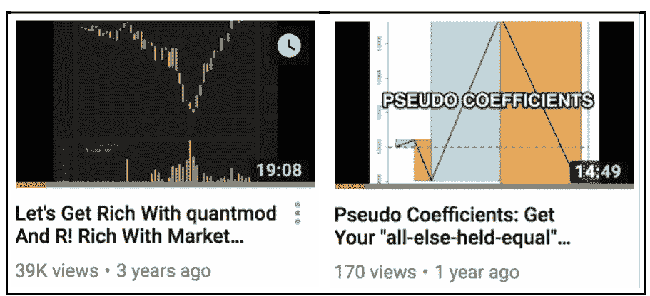
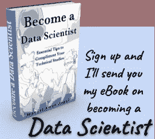

# 多任务？能自己相乘为什么还要分？多用途工作的艺术

> 原文：<https://medium.com/swlh/multitask-why-divide-when-you-can-multiply-yourself-the-art-of-multi-purposing-your-work-f2f932c4e265>

> 在显而易见的一次性任务上少花点时间，如果有必要就自动化，但是如果任务丰富有趣，就充分利用它吧！

Source: Lucas Amunategui

我不擅长多任务处理。不幸的是，我们有时都不得不这样做。例如，如果我花一个上午做三四件不同的事情，它们往往是不需要动脑筋的琐事。这种方法在整理零碎的东西或完成一份清单时很有效。如果它需要思考、专注或进入状态，那么我的早晨将只专注于一个项目。我把手机放在看不见的地方，从浏览器上移除让人分心的标签，如果是高度脑力劳动，我甚至会关掉音乐。是保护我的空间和戴上眼罩的时候了！

# 多用途化您的工作

但是这并不意味着当你在做一件事情的时候，你的产出就会减少。事实上恰恰相反。如果你正在做一件大事，一件需要你全神贯注的有趣的事，它可能有多种用途。例如，如果你正在为一个新项目收集想法，记录你的进展并在重大里程碑周围插入时间戳，突然你就有了一个“幕后”或“如何指导”。是的，只要再努力一点点，你的产量就翻倍了！让我们看一些例子。

My first free e-book ([http://amunategui.github.io/](http://amunategui.github.io/))

# 电子书，一次一章

这是我在创作电子书时使用的一种方法。首先，我为我想写的一本书创建一个粗略的索引，然后开始着手处理，一次一章。一旦我写完一章，我会把它发布在 Medium、LinkedIn、博客等网站上。这不仅会在你阅读整本书的过程中产生一种满足感，还会在阅读过程中提供重要的反馈和批评。它可能不适用于所有类型的书，但是如果你的章节倾向于独立存在，它可能也适用于你。

# 博客转视频，视频转博客

事情并没有就此结束——长久以来，我一直在创作[视频](https://www.youtube.com/user/mamunate/videos)，最终成为[博客条目](http://amunategui.github.io/)(或者反过来)。这需要做更多的工作，因为你需要把你的博客想象成你的视频的脚本，或者把你的视频想象成你博客的采访，但是这可以让你的影响力翻倍。

Blog to YouTube, doubling the size of your audience

查看博客的示例:

[http://amunategui . github . io/非常规卷积网络/index.html](http://amunategui.github.io/unconventional-convolutional-networks/index.html)

以及相应的 YouTube:

[https://www.youtube.com/watch?v=IscG_bAeEic&list = uuq 4 pm1 I _ vzqxkvvoz 5 qrbia](https://www.youtube.com/watch?v=IscG_bAeEic&list=UUq4pm1i_VZqxKVVOz5qRBIA)

# 博客条目和视频作为焦点小组

等等，还有更多。我的关于数据科学的 [YouTube](https://www.youtube.com/user/mamunate/videos) 和[博客帖子](http://amunategui.github.io/)通过统计浏览量、点击量和评论数，成为自由焦点小组。每当数字真的很大时，我知道那里有很多人感兴趣。这种兴趣量表指导我在 Udemy 上创建什么类型的课程。开设一门课程需要时间，而你最不希望发现的是，那里没有人感兴趣，或者竞争非常激烈。通过就某个话题发表免费的博客文章或视频，你会得到所有你需要的答案，帮助你确定市场的大小。

“[让我们通过 quantmod 和 R](https://www.youtube.com/watch?v=lDgvaJFpybU&list=UUq4pm1i_VZqxKVVOz5qRBIA) 发财吧”是我最受欢迎的视频，有近 40000 的浏览量，然而“[伪系数:让你的其他一切保持平等](https://www.youtube.com/watch?v=StkiGgnuiEA&index=1&list=UUq4pm1i_VZqxKVVOz5qRBIA)”花了我 3 个多月的时间制作，几乎没有记录任何流量——如果你比较流量数字， [80/20 法则/帕累托法则](https://en.wikipedia.org/wiki/Pareto_principle)应该会跃入你的眼帘。

One got traffic, the other didn’t…

当以前的工作被重新用于新的东西时，是如此的匆忙。当首先选择正确的工作类型时，这可以更系统地完成。在显而易见的一次性任务上少花点时间，如果有必要就自动化，但是如果任务丰富有趣，就充分利用它吧！

如果你觉得这有帮助，请分享并鼓掌——感谢阅读！

曼努埃尔·阿穆纳特吉

在[**amunategui . github . io**](http://amunategui.github.io/)和[**ViralML.com**](http://www.viralml.com/)**获取更多。**

好的——注册我下面的电子邮件群，我会给你免费寄一本关于成为(更好的)数据科学家的建议的电子书(即使你对电子书不感兴趣，也要注册)。感谢阅读！！

## 这个故事发表在 [The Startup](https://medium.com/swlh) 上，这是 Medium 最大的企业家出版物，拥有 355，974+人。

## 在这里订阅接收[我们的头条新闻](http://growthsupply.com/the-startup-newsletter/)。

