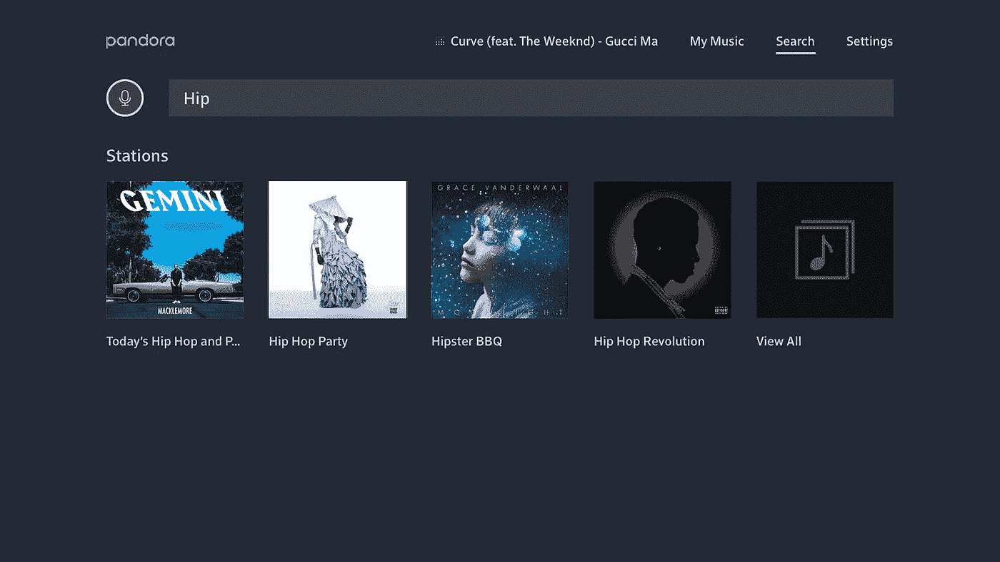
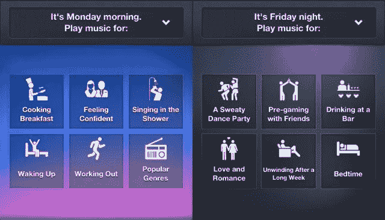
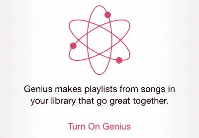
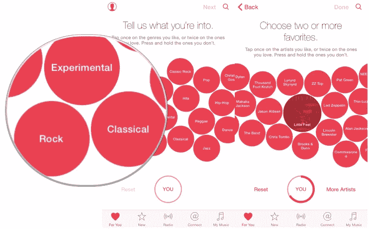
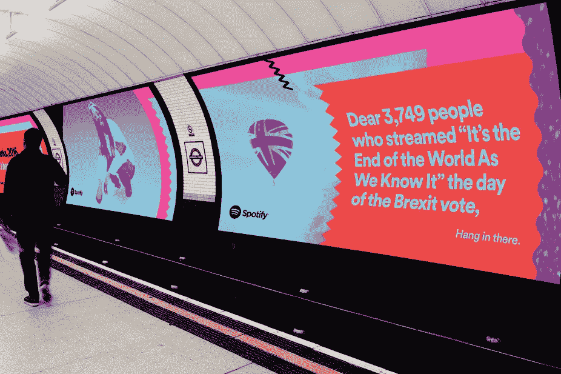
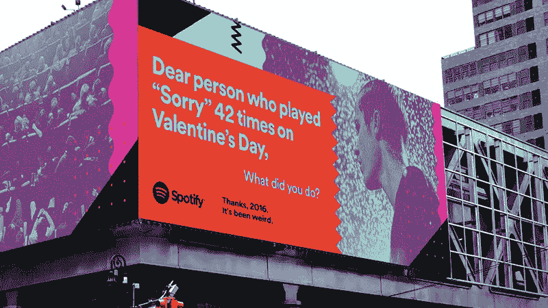
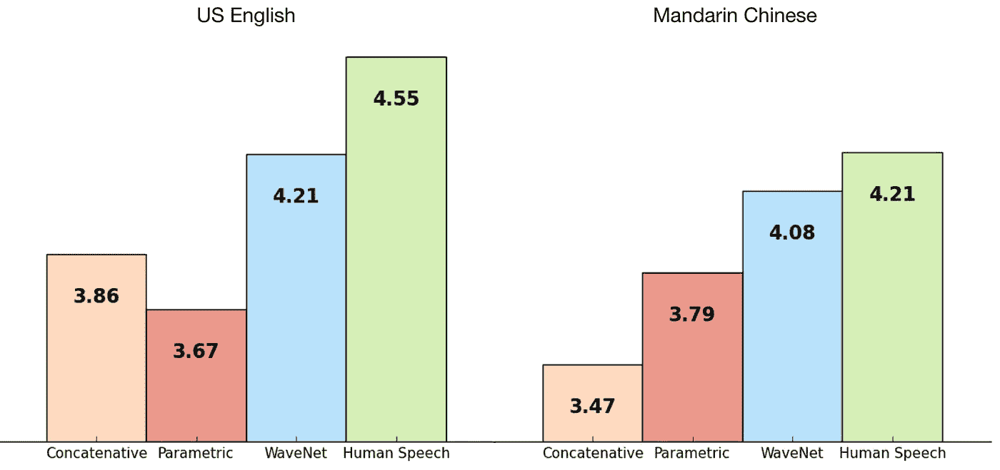
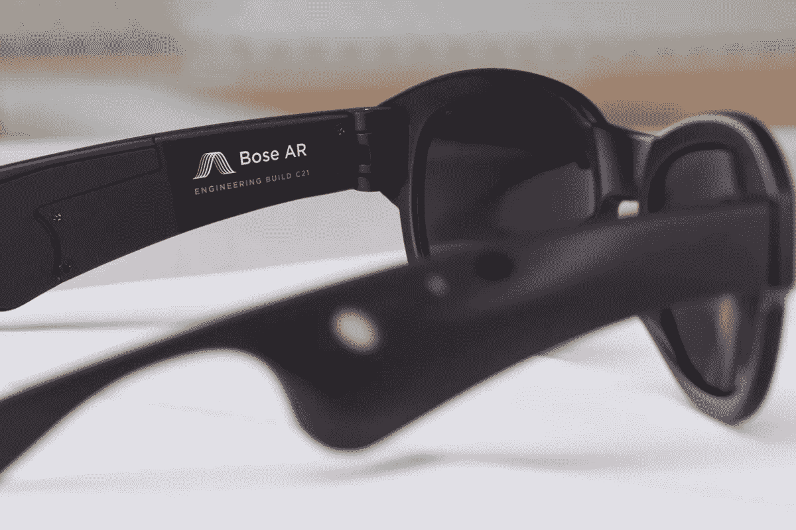

# 作为体验的音乐

> 原文：<https://medium.com/swlh/music-as-experience-e1c18030c40a>

Illustration by [Anna Buckley](https://www.instagram.com/annabucksdraws/).

## 维基百科称，机器学习是计算机科学的一个领域，它赋予计算机系统用数据学习的能力，而无需显式编程。这对音乐产业意味着什么？

当消费者只买唱片的时候，没有办法知道谁买了每张唱片，每个听众最喜欢的乐队是什么，或者他们的个性如何。没有人知道哪些歌曲被跳过，或者每个消费者花了多少时间听音乐。更不用说买唱片和发现新乐队有多困难了。你依赖于当地唱片商店的库存，没有 Shazam 帮助用户知道他们喜欢的电影中播放的是哪首歌。

[High Fidelity.](https://www.youtube.com/watch?v=6P4dXJ_Tvns)

音乐流媒体服务改变了这一点，不仅通过每月付费向世界各地的数百万用户提供数百万首歌曲，还通过融入机器学习技术，帮助他们理解每天收集的所有数据。

# 机器学习+音乐的第一个案例

## [Last.fm](https://www.last.fm/es/)

这项服务于 2002 年推出，当时是一个在线音乐数据库、推荐服务和专注于音乐的社交网络。他们使用社交标签作为向听众推荐音乐的基础。这意味着，他们允许音乐听众将自由文本标签应用于歌曲、专辑或艺术家。当许多用户的标签聚集在一起时，标签系统的真正优势就显现出来了。只有在那时，对某首歌曲或某个艺术家的丰富而复杂的看法才出现。

## [潘多拉](https://www.pandora.com/restricted)

潘多拉也是 2000 年成立的首批自动音乐推荐网络电台之一。它作为一个平台出现，旨在为每个用户创建一个单独的、个性化的电台。他们手动标记歌曲的属性。这意味着，一组人听音乐，并根据他们的音乐特点用描述性的词语标记这些曲目。然后，潘多拉的代码过滤了某些标签，以制作由发音相似的音乐组成的播放列表。用户可以提供正面或负面的反馈，在随后选择播放其他歌曲时会考虑这些反馈。

Pandora.

## [宋杂](https://songza.uptodown.com/android)

2007 年，Songza，一个为美国和加拿大的互联网用户提供免费音乐流和推荐服务的公司，开始了在线音乐管理，使用人工管理为用户创建播放列表。一组“音乐专家”将他们认为好听的播放列表放在一起，并根据一天中的时间、心情或活动向用户推荐。

Songza.

## [回声巢](http://the.echonest.com/)

麻省理工学院媒体实验室成立于 2005 年，该研究旨在了解录制音乐的音频和文本内容，并为消费者和开发者进行音乐识别、推荐、播放列表创建、音频指纹识别和分析。这显然是一种更先进的个性化音乐方法，使用算法来分析音乐的音频和文本内容，允许它执行音乐识别、个性化推荐、播放列表创建和数据分析。

# 2018 年机器学习+音乐

## [苹果音乐](https://www.apple.com/la/music/)

苹果在音乐流媒体行业占据第二的位置，仅次于 Spotify。他们很久以前就推出了 Genius 播放列表，用户可以选择一首他们喜欢的歌曲，然后自动生成一个播放列表，其中包含与该歌曲相匹配的歌曲。这个系统分析以前的播放列表，拇指向上，拇指向下和跳过。

Genius Playlists.

苹果公司一直为人类音乐监管辩护，但随着机器学习的发展，他们正在加快步伐。他们有大量的音乐编辑编辑播放列表，但他们正在融入越来越多的人工智能，正在改变他们经典的人机结合。事实上，2015 年创建的“For You”部分是 Apple Music 的核心内容之一，它已经将人类管理和算法结合起来，帮助用户发现符合他们个人品味的新音乐。

For You section in Apple Music.

## [亚马逊音乐](https://music.amazon.com/)

亚马逊在人工智能和物联网服务方面处于领先地位，Alexa 希望它能够超越其现有的竞争对手:Apple Music 和 Spotify。听音乐已经成为智能音箱最受欢迎的用途之一。起初，亚马逊只有 200 万首歌曲的数据库。然后它扩大了目录，将自然语言处理纳入了 Alexa 的服务。这让亚马逊音乐变得更有趣，因为语音识别软件可以浏览数百万首歌曲，从一首你不记得名字的歌曲中找到某个短语。

# Spotify 更进一步

2011 年，只有一个小团队在 [Spotify](http://spotify.com/) 从事音乐个性化工作。如今，个性化涉及纽约、波士顿&斯德哥尔摩的多个团队，他们生产数据集、特征工程并向用户提供产品。

自 Spotify 在 2014 年收购 Echo Nest 以来，多个团队一直在研究定制功能，他们开始推出更丰富、更好的个性化套装。听音乐变成了一种情感体验。像发现每周播放列表和发布雷达这样的功能只是巨大的定制冰山的一角。

在每个每周发现播放列表的背后都有机器学习。Spotify 比任何人都了解用户的音乐品味。机器学习可以模拟智力任务。自 2015 年 6 月推出该服务以来，它一直保持良好状态。

《发现周刊》的主要成分是其他人。Spotify 从查看用户创建的数十亿个播放列表开始。这些人类选择是《发现周刊》推荐的核心。Spotify 考虑了一切，从[粗略交易播放列表](https://open.spotify.com/user/roughtraderecordsuk/playlist/4C2r4kaIZcRrBAZms9LbSr?si=YyuyL4hgTeyjoaVQHcl7cA)到你的周日烧烤播放列表。

Spotify 还创建了每个用户的个性化音乐品味档案，按艺术家和微流派分组。然后，算法将所有这些整合在一起。他们的方法包括分析你和他人行为的协同过滤模型，自然语言处理和分析原始音轨的音频模型。

2017 年，Spotify 从索尼挖走了人工智能音乐专家 Francois Pachet。他现在是 Spotify Creator 技术研究实验室的主任，正在为音乐人设计基于人工智能的工具。他的发明包括[反射回路](http://www.flow-machines.com/ai-musical/)，一个实时学习音乐家风格并自动生成伴奏的系统。他还发行了第一张由艾作曲的音乐专辑《Hello World》。

Ballad of the Shadow by SKYGGE.

通过在他们的团队中加入这些专业人士，我们只能期待 Spotify 继续改善他们的服务和人性化的数据。也许是以有趣的方式，就像他们在这次全球广告活动中所做的那样:

Spotify’s 2016 campaign.

Spotify’s 2016 campaign.

# 机器学习+音乐作曲

## [NSynth Super](https://nsynthsuper.withgoogle.com/)

这个项目是 [Magenta](https://magenta.tensorflow.org/) 正在进行的实验的一部分:谷歌的开源深度学习项目，探索机器学习工具如何帮助艺术家以新的方式创作艺术和音乐。NSynth Super 是一种机器学习算法，它使用深度神经网络来学习声音的特征，然后根据这些特征创建一种全新的声音。NSynth 不是组合或混合声音，而是利用原始声音的音质合成一种全新的声音。

NSynth Super by Google.

## [DeepJazz](https://deepjazz.io/)

金智星 36 小时黑客马拉松的成果。它使用两个深度学习库来生成爵士音乐。具体来说，它从给定的 MIDI 文件中学习，构建了一个两层 LSTM。它导致了 SoundCloud 上最受欢迎的“人工智能”艺术家，拥有 172，000+次收听。

## BachBot

这是一个关于计算创造力的研究项目。它的目标是建立人工智能，能够以一种与巴赫自己的作品没有区别的方式产生和协调合唱。

## [流量机器](http://www.flow-machines.com/)

他们的目标是研究和开发能够自主或与人类艺术家合作创作音乐的人工智能系统。他们把某种音乐风格变成了计算对象。这种风格可以来自像披头士这样的个人作曲家，一组不同的艺术家或使用该系统的音乐家。

## [WaveNet](https://deepmind.com/blog/wavenet-generative-model-raw-audio/)

WaveNet 是原始音频波形的深度生成模型。它能够生成模仿任何人类声音的语音，听起来比现有的文本到语音系统更自然。

The [figure shows WaveNets](https://deepmind.com/blog/wavenet-generative-model-raw-audio/) on a scale from 1 to 5, compared with Google’s current best TTS systems ([**parametric**](http://research.google.com/pubs/pub45379.html) and [**concatenative**](http://research.google.com/pubs/pub45564.html)) and with human speech using.

将人工智能和机器学习技术融入音乐流媒体算法正迅速成为新的规范。如果音乐服务提供商不知道我的音乐品味，那么没有人会有兴趣使用它。我们已经习惯了人工智能，也许甚至不知道它就在那里。

但是，音乐创作呢？那些音轨上仍然有粗糙的声音，让你注意到它们不是人类的。还有很长的路要走，有许多可能性在等待着我们。我个人觉得这种音乐转型很迷人，但人工智能会取代现实生活中的音乐家和音乐专家吗？我不这么认为。

## 即将推出:AR+音乐

**潜行峰—** [**Bose AR**](https://developer.bose.com/bose-ar)

Bose AR 是全球首个眼镜听音乐的音频增强现实平台。它将音频放在你的周围，这样你就可以专注于你周围的世界，而不是一个小小的屏幕。它们与通话麦克风、Siri 或谷歌助手蓝牙兼容。他们推出了一项新的专有技术，可以保护音频隐私。每只手臂上都谨慎地嵌入了一个超薄、超轻、超小型化的声学组件，它们可以像标准眼镜一样佩戴、使用和外观。

Bose AR.

**Elevate 是由** [**侧视图**](http://lateralview.co) **组成的出版物。**

## 这篇文章发表在 [The Startup](https://medium.com/swlh) 上，这是 Medium 最大的创业刊物，拥有 315，028 多名读者。

## 在这里订阅接收[我们的头条新闻](http://growthsupply.com/the-startup-newsletter/)。

