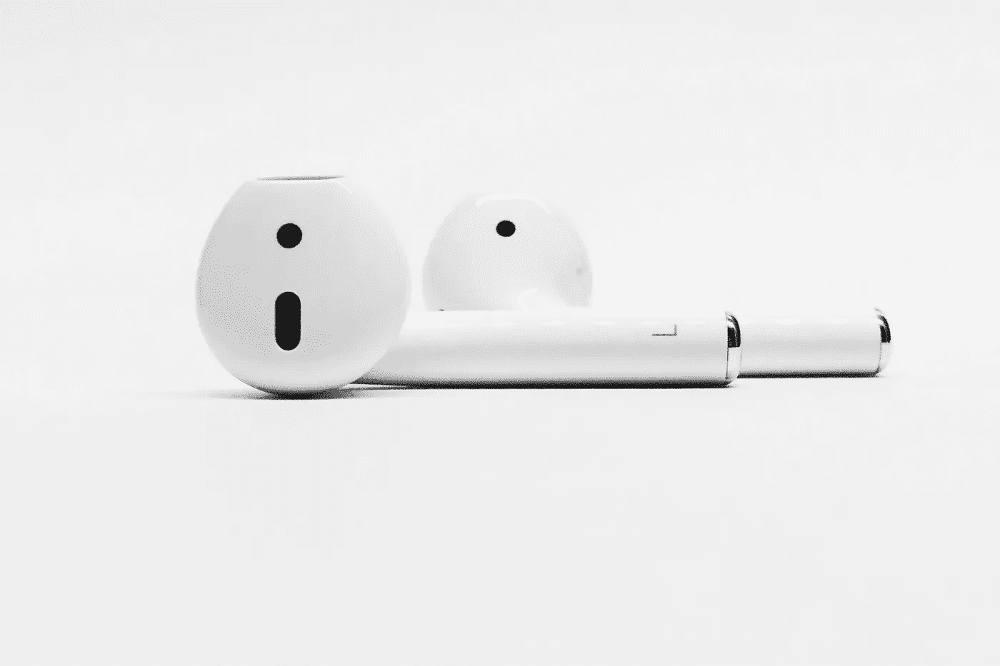
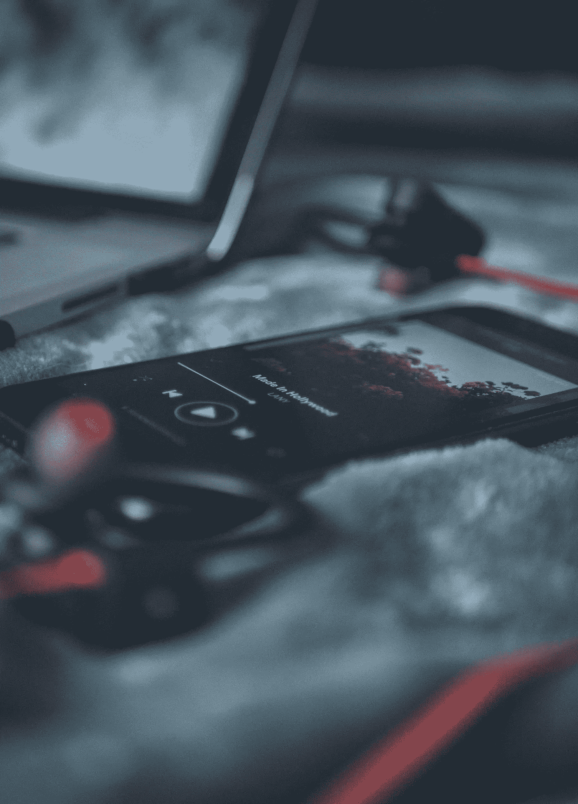
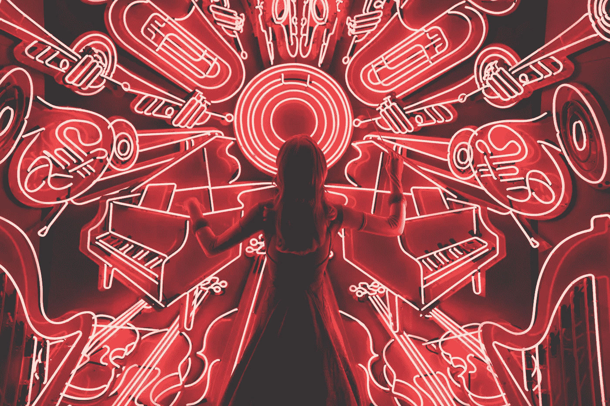

# 工作中的音乐:如何提高工作效率和专注度

> 原文：<https://medium.com/swlh/music-at-work-how-it-can-benefit-productivity-focus-7da72a080ff6>

我工作中最大的盟友之一是音乐。作为一个不变的伴侣，音乐一直陪伴着我，并为我的工作做出了无尽的贡献。

每当我需要集中注意力时，我就戴上耳机，转到我最喜欢的播放列表。它立即帮助我专注于我正在做的事情。其他时候，有些事情我不想去做，因为它们很乏味或者很复杂，我宁愿把它们放在一边，去做别的事情。我通过戴上耳机来抵制逃避或拖延的冲动，音乐给了我完成这些挑战性任务所需的能量。

更重要的是，音乐让我的一天更加愉快。我经常发现自己暂停我的项目，只是享受当前播放的音乐。我发现音乐让时间和工作更加流畅。现在听任何东西都很容易，音乐可以成为你工作工具箱中的一个额外工具。

Unsplash

# 为什么我喜欢在工作时听音乐

毫无疑问，当我需要集中注意力时，我的大脑会决定这是在其他事情上变得活跃并劫持我的生产过程的最佳时刻。一百万个想法会闪过我的脑海，关于我需要检查的“紧急”事情，比如我的 Instagram feed 或新闻。我很容易分心，我发现音乐有助于我将注意力集中在我需要完成的任务上。

很多时候，有些任务我会拖延，仅仅是因为它们需要很大的努力。然而，这些项目需要完成，而且通常是立即完成。我会选择乐观的音乐，它给我提供了我一直渴望的能量和动力。仍然很难保持专注，但是音乐帮助我克服了惰性，开始工作。

音乐甚至让我的工作更加愉快。时间过得越来越快，我通常感觉自己已经完成了很多，所以这已经成为我日常生活的一部分。对我来说，我每周或每月都会做一些与音乐密不可分的事情。这已经成为我的公式的一部分，我期待着这样做。

Unsplash

# 我如何将音乐和工作结合起来

我用来听音乐的应用程序是 Spotify，它彻底改变了我的职业道德。我不再需要(糟糕地)整理我的列表，这个平台允许我听任何我能想象的东西。我探索我可能喜欢的和我以前从未听过的音乐类型。更重要的是，我发现音乐可以帮助我完成工作。

我听不同类型的音乐，这取决于我的心情或我需要达到的目标。一些例子是:

1.  **建立我的博客:**当我上传我的博客文章并确保文本和布局完美时，我会听古典音乐。我发现，如果音乐是纯器乐，我不会分心，而且它也可以非常令人振奋。
2.  写作:我总是一大早就写博客。这时我最能集中注意力，听优美的钢琴曲有助于我流畅地写作。这些作品也没有歌词，这可能会让我在写作时分心。尽管我学会了在没有音乐的情况下提高写作水平，但自从我在早上加了钢琴之后，我的写作过程就顺畅多了。
3.  **困难任务:**当我需要完成我不想做的事情时，我需要打击乐来帮助我前进。我寻找任何乐观的东西——流行音乐、拉丁音乐或任何能推动我克服障碍的东西。帮助我前进的音乐总是有歌词，在这里不会让我分心。通常，当我在工作中安顿下来后，我会转而做一些有助于我保持注意力的事情。
4.  **常规任务:**当我在处理我的待办事项时，我会听我喜欢的音乐，它会随着我的心情而变化。这个组合帮助我更快更满意地完成我的待办事项。

通过反复试验，我已经知道了什么对我最有效。例如，我试着用一个乐器播放列表和一个环境音乐播放列表来写作，但都没用。我最终选定了钢琴播放列表，到目前为止效果很好。

当工作变得复杂或单调乏味时，音乐会是一个很好的朋友。它也能给单调的任务增添乐趣。我强烈建议把它放在你的工作工具箱里。

Unsplash

# 你最喜欢的播放列表是什么？你喜欢将哪些类型的任务与音乐结合起来？

## 这篇文章发表在 [The Startup](https://medium.com/swlh) 上，这是 Medium 最大的创业刊物，拥有+ 373，446 名读者。

## 订阅接收[我们的头条新闻](http://growthsupply.com/the-startup-newsletter/)。

